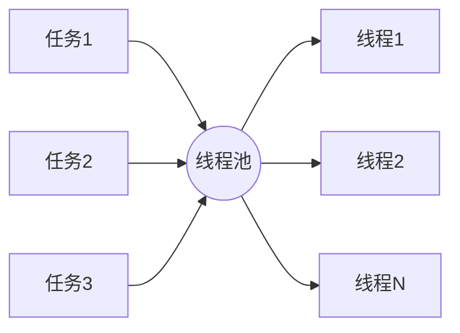
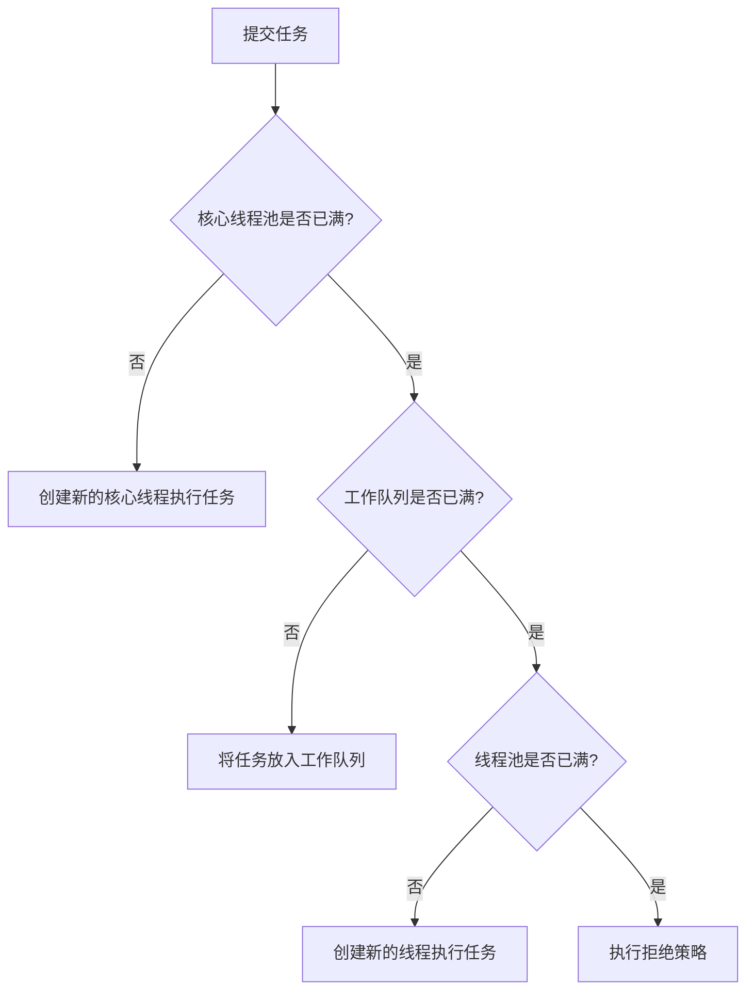

# Java 线程池

## 什么是线程池？

线程池是一种多线程处理形式，处理过程中将任务提交到线程池，由线程池中的线程来处理这些任务。线程池中有预先创建好的多个线程，当有任务需要处理时，直接从池中获取线程来执行，处理完后线程并不会销毁，而是返回线程池等待下次使用。



## 为什么需要线程池？

线程池主要解决了两个问题：

1. **性能提升**：创建和销毁线程是消耗系统资源的操作。线程池通过重用线程，减少了这些操作带来的开销。

2. **资源管理**：线程是稀缺资源，如果无限制地创建线程，会导致系统资源耗尽。线程池可以限制线程的最大并发数。

:::note
在Java中，创建一个线程的代价是比较大的，包括时间成本和空间成本。当有大量小任务需要频繁执行时，线程池的优势尤为明显。
:::

## Java 中的线程池框架

Java通过`java.util.concurrent`包提供了完善的线程池机制。其中`Executor`框架是核心，主要包括以下几个部分：

- `Executor`：一个接口，只有一个`execute`方法，用于执行提交的任务
- `ExecutorService`：扩展了`Executor`接口，提供了更丰富的功能，如关闭线程池、提交有返回值的任务等
- `ThreadPoolExecutor`：`ExecutorService`的具体实现类，是线程池的核心实现
- `Executors`：工厂类，提供了创建各种线程池的静态方法

## 线程池的核心参数

`ThreadPoolExecutor`类是Java线程池的核心实现，创建时需要指定以下几个重要参数：

1. **corePoolSize**：核心线程数
2. **maximumPoolSize**：最大线程数
3. **keepAliveTime**：线程空闲时间
4. **unit**：空闲时间的单位
5. **workQueue**：工作队列，用于存放任务
6. **threadFactory**：线程工厂，用于创建线程
7. **handler**：拒绝策略，当任务太多时如何处理

## 常见的线程池类型

Java通过`Executors`工厂类提供了几种常见的线程池：

### 1. FixedThreadPool

固定大小的线程池，核心线程数和最大线程数相等。

```java
ExecutorService fixedThreadPool = Executors.newFixedThreadPool(5);
```

特点：
- 核心线程数等于最大线程数，即线程数量固定
- 使用无界队列LinkedBlockingQueue
- 适合需要控制并发线程数的场景

### 2. CachedThreadPool

可缓存的线程池，线程数量不固定，可以根据需要创建新线程。

```java
ExecutorService cachedThreadPool = Executors.newCachedThreadPool();
```

特点：
- 核心线程数为0，最大线程数为Integer.MAX_VALUE
- 使用SynchronousQueue作为工作队列
- 线程空闲60秒后会被回收
- 适合执行大量短期异步任务的场景

### 3. SingleThreadExecutor

单线程的线程池，只有一个工作线程。

```java
ExecutorService singleThreadExecutor = Executors.newSingleThreadExecutor();
```

特点：
- 核心线程数和最大线程数都为1
- 使用无界队列LinkedBlockingQueue
- 保证所有任务按照指定顺序执行（FIFO, LIFO, 优先级）

### 4. ScheduledThreadPool

支持定时及周期性任务执行的线程池。

```java
ScheduledExecutorService scheduledThreadPool = Executors.newScheduledThreadPool(5);
```

特点：
- 核心线程数固定，最大线程数为Integer.MAX_VALUE
- 使用DelayedWorkQueue作为工作队列
- 适合执行定时任务和周期性任务

:::caution
上述预定义的线程池可能会导致OOM（内存溢出）问题，尤其是使用无界队列的FixedThreadPool和SingleThreadExecutor，以及最大线程数无限的CachedThreadPool。在生产环境中，建议使用`ThreadPoolExecutor`自定义线程池参数。
:::

## 线程池的工作流程

当一个任务提交到线程池时，线程池会按照以下流程处理：



## 线程池的使用示例

### 基本使用

```java
import java.util.concurrent.ExecutorService;
import java.util.concurrent.Executors;

public class ThreadPoolExample {
    public static void main(String[] args) {
        // 创建一个固定大小的线程池
        ExecutorService executor = Executors.newFixedThreadPool(5);
        
        // 提交任务到线程池
        for (int i = 0; i < 10; i++) {
            final int taskId = i;
            executor.execute(() -> {
                System.out.println("Task " + taskId + " is running on thread " + Thread.currentThread().getName());
                try {
                    // 模拟任务执行
                    Thread.sleep(1000);
                } catch (InterruptedException e) {
                    e.printStackTrace();
                }
                System.out.println("Task " + taskId + " is completed");
            });
        }
        
        // 关闭线程池
        executor.shutdown();
        
        // 等待所有任务完成
        while (!executor.isTerminated()) {
            // 等待
        }
        
        System.out.println("All tasks completed");
    }
}
```

输出示例：
```
Task 0 is running on thread pool-1-thread-1
Task 1 is running on thread pool-1-thread-2
Task 2 is running on thread pool-1-thread-3
Task 3 is running on thread pool-1-thread-4
Task 4 is running on thread pool-1-thread-5
Task 0 is completed
Task 5 is running on thread pool-1-thread-1
Task 1 is completed
Task 6 is running on thread pool-1-thread-2
...
Task 9 is completed
All tasks completed
```

### 自定义线程池

```java
import java.util.concurrent.*;

public class CustomThreadPoolExample {
    public static void main(String[] args) {
        // 创建自定义线程池
        ThreadPoolExecutor executor = new ThreadPoolExecutor(
            2,                           // 核心线程数
            4,                           // 最大线程数
            60L,                         // 空闲线程存活时间
            TimeUnit.SECONDS,            // 时间单位
            new ArrayBlockingQueue<>(2), // 工作队列
            Executors.defaultThreadFactory(), // 线程工厂
            new ThreadPoolExecutor.CallerRunsPolicy() // 拒绝策略
        );
        
        // 提交10个任务
        for (int i = 0; i < 10; i++) {
            final int taskId = i;
            try {
                executor.execute(() -> {
                    System.out.println("Task " + taskId + " is running on thread " + Thread.currentThread().getName());
                    try {
                        Thread.sleep(1000);
                    } catch (InterruptedException e) {
                        e.printStackTrace();
                    }
                    System.out.println("Task " + taskId + " is completed");
                });
            } catch (RejectedExecutionException e) {
                System.out.println("Task " + taskId + " is rejected");
            }
        }
        
        // 关闭线程池
        executor.shutdown();
    }
}
```

## 线程池的常见问题与最佳实践

### 1. 合理配置线程池大小

线程池大小的配置取决于任务的特性：

- **CPU密集型任务**：线程数 = CPU核心数 + 1
- **IO密集型任务**：线程数 = CPU核心数 * (1 + IO耗时/CPU耗时)

```java
// 获取CPU核心数
int cpuCores = Runtime.getRuntime().availableProcessors();
// CPU密集型任务的线程池大小
int poolSize = cpuCores + 1;
```

### 2. 选择合适的工作队列

- **ArrayBlockingQueue**：有界队列，需要预先指定队列大小
- **LinkedBlockingQueue**：可以是有界的，也可以是无界的（默认），当使用无界队列时要小心内存溢出
- **SynchronousQueue**：不存储元素的队列，每个插入操作必须等待另一个线程的移除操作
- **PriorityBlockingQueue**：支持优先级的无界阻塞队列

### 3. 拒绝策略

当线程池和工作队列都满了，新提交的任务会触发拒绝策略：

- **AbortPolicy**：默认策略，抛出RejectedExecutionException
- **CallerRunsPolicy**：由调用线程执行任务
- **DiscardPolicy**：直接丢弃任务，不做任何处理
- **DiscardOldestPolicy**：丢弃队列中最早的任务，然后尝试执行新任务

### 4. 正确关闭线程池

线程池使用完毕后，应该正确关闭以释放资源：

```java
// 温和地关闭线程池
executor.shutdown();

// 等待线程池关闭，最多等待5秒
try {
    if (!executor.awaitTermination(5, TimeUnit.SECONDS)) {
        // 强制关闭
        executor.shutdownNow();
    }
} catch (InterruptedException e) {
    executor.shutdownNow();
}
```

## 实际应用场景

### 场景一：Web服务器处理请求

Web服务器通常使用线程池处理并发请求，每个HTTP请求分配给线程池中的一个线程处理：

```java
public class WebServer {
    private final ExecutorService threadPool;
    
    public WebServer() {
        // 创建线程池，核心线程数50，最大线程数200
        threadPool = new ThreadPoolExecutor(
            50, 200, 60L, TimeUnit.SECONDS,
            new LinkedBlockingQueue<>(1000),
            new ThreadPoolExecutor.CallerRunsPolicy());
    }
    
    public void handleRequest(Request request, Response response) {
        threadPool.execute(() -> {
            try {
                // 处理HTTP请求
                processRequest(request, response);
            } catch (Exception e) {
                // 异常处理
                response.setStatus(500);
            }
        });
    }
    
    private void processRequest(Request request, Response response) {
        // 请求处理逻辑
        // ...
    }
    
    public void shutdown() {
        threadPool.shutdown();
    }
}
```

### 场景二：批量数据处理

使用线程池并行处理大量数据：

```java
public class DataProcessor {
    public static void processBatchData(List<Data> dataList) {
        int cores = Runtime.getRuntime().availableProcessors();
        ExecutorService executor = Executors.newFixedThreadPool(cores);
        
        // 将数据划分成多个批次
        int batchSize = dataList.size() / cores;
        if (batchSize == 0) batchSize = 1;
        
        List<Future<?>> futures = new ArrayList<>();
        
        for (int i = 0; i < dataList.size(); i += batchSize) {
            int endIndex = Math.min(i + batchSize, dataList.size());
            List<Data> batch = dataList.subList(i, endIndex);
            
            // 提交批处理任务
            Future<?> future = executor.submit(() -> {
                for (Data data : batch) {
                    processData(data);
                }
                return null;
            });
            futures.add(future);
        }
        
        // 等待所有任务完成
        for (Future<?> future : futures) {
            try {
                future.get();
            } catch (Exception e) {
                e.printStackTrace();
            }
        }
        
        executor.shutdown();
    }
    
    private static void processData(Data data) {
        // 数据处理逻辑
        // ...
    }
}
```

### 场景三：定时任务调度

使用ScheduledThreadPool执行定时任务：

```java
public class ScheduledTaskManager {
    private final ScheduledExecutorService scheduler;
    
    public ScheduledTaskManager() {
        scheduler = Executors.newScheduledThreadPool(5);
    }
    
    public void startDailyBackup() {
        // 每天凌晨2点执行备份
        scheduler.scheduleAtFixedRate(
            this::performBackup,
            getInitialDelay(), // 计算到凌晨2点的延迟
            24 * 60 * 60, // 24小时
            TimeUnit.SECONDS
        );
    }
    
    public void scheduleHealthCheck() {
        // 每5分钟执行一次健康检查
        scheduler.scheduleAtFixedRate(
            this::checkHealth,
            0, // 立即开始
            5 * 60, // 5分钟
            TimeUnit.SECONDS
        );
    }
    
    private void performBackup() {
        // 执行备份逻辑
        // ...
    }
    
    private void checkHealth() {
        // 健康检查逻辑
        // ...
    }
    
    private long getInitialDelay() {
        // 计算到凌晨2点的延迟逻辑
        // ...
        return 0; // 示例返回值
    }
    
    public void shutdown() {
        scheduler.shutdown();
    }
}
```

## 总结

线程池是Java并发编程中非常重要的工具，通过合理使用线程池，可以显著提高应用程序的性能和资源利用率。本文介绍了Java线程池的基本概念、工作原理、常用类型及其应用场景，以及使用线程池时需要注意的事项。

主要要点回顾：

1. 线程池通过重用线程，减少了线程创建和销毁的开销
2. Java提供了几种预定义的线程池，包括FixedThreadPool、CachedThreadPool、SingleThreadExecutor和ScheduledThreadPool
3. 在生产环境中，建议使用ThreadPoolExecutor自定义线程池参数
4. 线程池大小应该根据任务类型（CPU密集型或IO密集型）来合理配置
5. 正确选择工作队列和拒绝策略对线程池的性能和稳定性至关重要
6. 使用完线程池后应该正确关闭，释放资源

## 练习与作业

1. 创建一个自定义线程池，并提交10个计算密集型任务，观察线程的执行情况。
2. 分别使用FixedThreadPool和CachedThreadPool处理大量短期任务，比较它们的性能差异。
3. 实现一个文件处理程序，使用线程池并行处理多个文件的读写操作。
4. 尝试模拟线程池拒绝任务的情况，并分别测试四种不同的拒绝策略。
5. 使用ScheduledThreadPool实现一个简单的定时任务调度器，每隔一定时间执行特定任务。

## 进阶学习资源

- Java官方文档：[java.util.concurrent](https://docs.oracle.com/javase/8/docs/api/java/util/concurrent/package-summary.html)
- 《Java并发编程实战》(Java Concurrency in Practice) - Brian Goetz
- 《Effective Java》- Joshua Bloch

祝你在Java多线程编程的道路上越走越远！