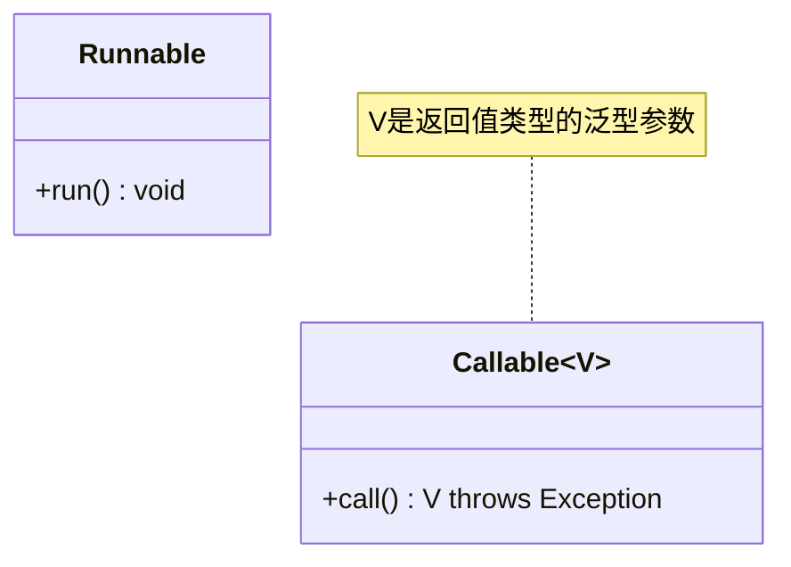

# Java Callable接口

在Java多线程编程中，我们经常需要执行任务并获取执行结果。虽然`Runnable`接口可以用来创建线程任务，但它不能返回结果。这时，`Callable`接口就派上用场了。本文将全面介绍`Callable`接口的使用方法和应用场景。

## Callable接口简介

`Callable`接口是Java 5在`java.util.concurrent`包中引入的，它提供了一种在线程执行完成后可以返回结果的方式。

### Callable与Runnable的区别

下面是`Callable`和`Runnable`接口的主要区别：

1. **返回值**：`Callable`可以返回执行结果，而`Runnable`没有返回值
2. **异常处理**：`Callable`可以抛出已检查异常，而`Runnable`不能
3. **方法名**：`Callable`接口定义了`call()`方法，而`Runnable`定义了`run()`方法



## Callable接口的基本使用

### 1. Callable接口的定义

`Callable`是一个泛型接口，其定义如下：

```java
public interface Callable<V> {
    V call() throws Exception;
}
```

其中`V`是返回值的类型。

### 2. 创建Callable任务

下面是创建`Callable`任务的一个简单例子：

```java
import java.util.concurrent.Callable;

public class MyCallable implements Callable<Integer> {
    @Override
    public Integer call() throws Exception {
        // 执行一些计算
        Thread.sleep(2000); // 模拟耗时操作
        return 123; // 返回计算结果
    }
}
```

### 3. 使用Future获取结果

要执行`Callable`任务并获取其结果，我们需要使用`Future`接口：

```java
import java.util.concurrent.*;

public class CallableDemo {
    public static void main(String[] args) {
        // 创建线程池
        ExecutorService executor = Executors.newSingleThreadExecutor();
        
        // 提交Callable任务
        Future<Integer> future = executor.submit(new MyCallable());
        
        try {
            // 获取任务执行结果（如果任务还未完成，这里会阻塞等待）
            Integer result = future.get();
            System.out.println("任务执行结果: " + result);
        } catch (InterruptedException | ExecutionException e) {
            e.printStackTrace();
        } finally {
            // 关闭线程池
            executor.shutdown();
        }
    }
}
```

**输出**:
```
任务执行结果: 123
```

## Future接口详解

`Future`接口代表了一个异步计算的结果。它提供了检查计算是否完成、等待计算完成以及获取计算结果的方法。

### Future接口的主要方法

- `boolean cancel(boolean mayInterruptIfRunning)`: 尝试取消任务执行
- `boolean isCancelled()`: 检查任务是否被取消
- `boolean isDone()`: 检查任务是否已完成
- `V get()`: 获取任务结果（阻塞直到任务完成）
- `V get(long timeout, TimeUnit unit)`: 获取任务结果，但最多等待指定的时间

### 使用Future设置超时

```java
try {
    // 等待结果，但最多等待5秒
    Integer result = future.get(5, TimeUnit.SECONDS);
    System.out.println("任务执行结果: " + result);
} catch (TimeoutException e) {
    System.out.println("任务执行超时！");
    future.cancel(true); // 取消任务
} catch (InterruptedException | ExecutionException e) {
    e.printStackTrace();
}
```

## 使用Lambda表达式简化Callable

Java 8引入的Lambda表达式可以让`Callable`的创建更加简洁：

```java
ExecutorService executor = Executors.newSingleThreadExecutor();

// 使用Lambda表达式创建Callable任务
Future<Integer> future = executor.submit(() -> {
    Thread.sleep(2000);
    return 123;
});

try {
    Integer result = future.get();
    System.out.println("任务执行结果: " + result);
} finally {
    executor.shutdown();
}
```

## 实际应用场景

### 1. 并行计算

当需要执行多个独立的计算任务并获取它们的结果时，`Callable`非常有用：

```java
import java.util.ArrayList;
import java.util.List;
import java.util.concurrent.*;

public class ParallelCalculation {
    public static void main(String[] args) {
        // 创建线程池
        ExecutorService executor = Executors.newFixedThreadPool(4);
        
        // 创建多个计算任务
        List<Future<Integer>> resultList = new ArrayList<>();
        
        // 提交10个计算任务
        for (int i = 0; i < 10; i++) {
            final int taskId = i;
            Future<Integer> result = executor.submit(() -> {
                Thread.sleep(1000); // 模拟耗时计算
                return taskId * 100; // 返回计算结果
            });
            resultList.add(result);
        }
        
        // 获取所有任务的结果
        int sum = 0;
        try {
            for (Future<Integer> future : resultList) {
                sum += future.get();
            }
            System.out.println("所有任务结果之和: " + sum);
        } catch (Exception e) {
            e.printStackTrace();
        } finally {
            // 关闭线程池
            executor.shutdown();
        }
    }
}
```

**输出**:
```
所有任务结果之和: 4500
```

### 2. 网络请求

在进行网络请求时，使用`Callable`可以让我们异步获取请求结果：

```java
ExecutorService executor = Executors.newCachedThreadPool();

// 模拟网络请求
Callable<String> networkTask = () -> {
    System.out.println("开始执行网络请求...");
    Thread.sleep(3000); // 模拟网络延迟
    return "网络请求返回的数据";
};

Future<String> future = executor.submit(networkTask);

// 主线程可以继续执行其他操作
System.out.println("主线程继续执行其他任务...");

// 需要结果时再获取
try {
    String response = future.get();
    System.out.println("收到网络响应: " + response);
} catch (Exception e) {
    e.printStackTrace();
} finally {
    executor.shutdown();
}
```

**输出**:
```
开始执行网络请求...
主线程继续执行其他任务...
收到网络响应: 网络请求返回的数据
```

### 3. 多任务竞争执行

有时我们需要同时执行多个任务，但只需要最快完成的那个结果：

```java
import java.util.Arrays;
import java.util.List;
import java.util.concurrent.*;

public class TaskCompetition {
    public static void main(String[] args) {
        ExecutorService executor = Executors.newFixedThreadPool(3);
        
        // 创建三个任务，模拟从不同服务器获取相同数据
        Callable<String> task1 = () -> {
            Thread.sleep(1000);
            return "来自服务器1的结果";
        };
        
        Callable<String> task2 = () -> {
            Thread.sleep(2000);
            return "来自服务器2的结果";
        };
        
        Callable<String> task3 = () -> {
            Thread.sleep(500);
            return "来自服务器3的结果";
        };
        
        List<Callable<String>> tasks = Arrays.asList(task1, task2, task3);
        
        try {
            // 执行任务，返回最先完成的任务结果
            String fastestResult = executor.invokeAny(tasks);
            System.out.println("最快返回的结果: " + fastestResult);
        } catch (Exception e) {
            e.printStackTrace();
        } finally {
            executor.shutdown();
        }
    }
}
```

**输出**:
```
最快返回的结果: 来自服务器3的结果
```

## 高级用法：CompletableFuture

Java 8引入了`CompletableFuture`类，它扩展了`Future`接口，提供了更多操作异步计算结果的方法，如链式调用、组合多个Future等。

```java
import java.util.concurrent.CompletableFuture;

public class CompletableFutureDemo {
    public static void main(String[] args) {
        CompletableFuture<Integer> future = CompletableFuture.supplyAsync(() -> {
            try {
                Thread.sleep(1000);
                return 42;
            } catch (Exception e) {
                return -1;
            }
        });
        
        // 链式处理结果
        CompletableFuture<String> result = future
            .thenApply(n -> n * 2)
            .thenApply(n -> "结果: " + n);
            
        // 获取最终结果
        result.thenAccept(System.out::println);
        
        // 等待执行完毕
        try {
            Thread.sleep(2000);
        } catch (InterruptedException e) {
            e.printStackTrace();
        }
    }
}
```

**输出**:
```
结果: 84
```

:::tip
`CompletableFuture`是Java 8引入的更强大的异步编程工具，它基于`Callable`和`Future`的概念，但提供了更丰富的功能。如果你使用的是Java 8或更高版本，建议学习和使用`CompletableFuture`。
:::

## 总结

`Callable`接口是Java多线程编程中的重要工具，它解决了`Runnable`接口无法返回结果的局限性：

1. `Callable`可以返回执行结果，且能抛出已检查异常
2. 通过`Future`接口可以获取任务执行结果、检查任务是否完成或取消任务
3. 可以结合`ExecutorService`线程池使用，提高应用性能
4. Lambda表达式可以简化`Callable`任务的创建
5. 在并行计算、异步网络请求等场景中非常实用

当你需要执行有返回值的异步任务时，`Callable`接口是一个理想的选择。

## 练习

1. 创建一个`Callable`任务，计算斐波那契数列的第n项（n由用户输入）
2. 创建多个`Callable`任务，分别计算不同数组的平均值，然后获取所有计算结果
3. 使用`invokeAll`方法同时执行多个`Callable`任务，并获取所有结果
4. 实现一个简单的并行文件搜索程序，使用`Callable`在不同目录中搜索文件

## 进一步阅读

- Java API文档: [Callable接口](https://docs.oracle.com/javase/8/docs/api/java/util/concurrent/Callable.html)
- Java API文档: [Future接口](https://docs.oracle.com/javase/8/docs/api/java/util/concurrent/Future.html)
- Java API文档: [ExecutorService接口](https://docs.oracle.com/javase/8/docs/api/java/util/concurrent/ExecutorService.html)
- Java API文档: [CompletableFuture类](https://docs.oracle.com/javase/8/docs/api/java/util/concurrent/CompletableFuture.html)