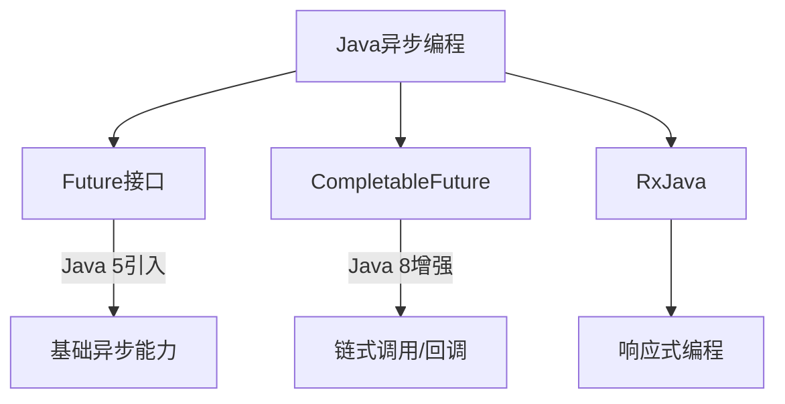

# Java Future接口

在多线程编程中，我们经常需要在某个线程中执行耗时操作，同时不阻塞主线程的执行。Java提供的Future接口就是一种异步计算的解决方案，它代表了一个可能还没有完成的异步任务的结果。通过Future，我们可以启动一个耗时操作，并在需要结果时再去获取，这期间可以执行其他任务，提高程序的效率。

## Future接口是什么

Future接口是Java 5中引入的，位于`java.util.concurrent`包下，它表示一个异步计算的结果。简单来说，Future提供了三种功能：

1. 判断任务是否完成
2. 等待任务完成
3. 获取任务的执行结果

Future接口的定义如下：

```java
public interface Future<V> {
    // 取消任务的执行
    boolean cancel(boolean mayInterruptIfRunning);
    
    // 判断任务是否已被取消
    boolean isCancelled();
    
    // 判断任务是否已完成
    boolean isDone();
    
    // 获取任务的执行结果，会阻塞直到任务完成
    V get() throws InterruptedException, ExecutionException;
    
    // 在指定的时间内获取任务的执行结果，超时则抛出异常
    V get(long timeout, TimeUnit unit)
        throws InterruptedException, ExecutionException, TimeoutException;
}
```

## 基本使用方法

要使用Future，我们通常需要结合ExecutorService来提交任务。以下是一个基本的使用示例：

```java
import java.util.concurrent.*;

public class FutureExample {
    public static void main(String[] args) {
        // 创建线程池
        ExecutorService executor = Executors.newSingleThreadExecutor();
        
        // 提交任务并获取Future对象
        Future<Integer> future = executor.submit(() -> {
            // 模拟耗时计算
            Thread.sleep(2000);
            return 123;
        });
        
        try {
            // 执行其他任务
            System.out.println("正在执行其他任务...");
            
            // 获取异步计算结果（如果尚未完成，将阻塞等待）
            Integer result = future.get();
            System.out.println("计算结果: " + result);
        } catch (InterruptedException | ExecutionException e) {
            e.printStackTrace();
        } finally {
            // 关闭线程池
            executor.shutdown();
        }
    }
}
```

**输出结果：**
```
正在执行其他任务...
（等待约2秒）
计算结果: 123
```

## Future的主要方法详解

让我们详细了解Future接口的主要方法：

### 1. `get()`方法

`get()`方法用于获取异步任务的执行结果。如果任务尚未完成，此方法会阻塞调用线程直到任务完成。

```java
Future<String> future = executor.submit(() -> {
    Thread.sleep(3000); // 模拟耗时操作
    return "任务完成";
});

String result = future.get(); // 此处会阻塞，直到任务完成
```

:::caution
如果在任务执行过程中发生异常，`get()`方法会将异常包装在`ExecutionException`中抛出，因此使用时需要进行异常处理。
:::

### 2. `get(long timeout, TimeUnit unit)`方法

这个重载方法允许我们设置一个等待超时时间，避免无限期等待。

```java
try {
    String result = future.get(2, TimeUnit.SECONDS);
    System.out.println("结果: " + result);
} catch (TimeoutException e) {
    System.out.println("获取结果超时");
}
```

### 3. `isDone()`方法

`isDone()`方法用于检查任务是否已经完成，不会阻塞线程。

```java
if (future.isDone()) {
    System.out.println("任务已完成");
} else {
    System.out.println("任务尚未完成");
}
```

### 4. `cancel(boolean mayInterruptIfRunning)`方法

`cancel()`方法用于取消任务的执行。参数`mayInterruptIfRunning`表示是否允许中断正在执行的任务。

```java
boolean canceled = future.cancel(true);
if (canceled) {
    System.out.println("任务已被取消");
} else {
    System.out.println("任务无法取消，可能已经完成或已取消");
}
```

### 5. `isCancelled()`方法

`isCancelled()`方法用于检查任务是否已被取消。

```java
if (future.isCancelled()) {
    System.out.println("任务已被取消");
} else {
    System.out.println("任务未被取消");
}
```

## Future的局限性与挑战

虽然Future提供了异步编程的能力，但它也存在一些局限性：

1. **不支持回调**：无法在任务完成后自动执行特定操作，需要手动检查
2. **无法组合多个Future**：不能将多个异步任务串联起来
3. **获取结果只能通过阻塞或轮询**：缺乏非阻塞获取结果的机制

这些局限性在Java 8中通过`CompletableFuture`得到了解决，但作为理解异步编程的基础，掌握Future仍然非常重要。

## Future的实际应用场景

### 场景1：并行计算

当我们需要执行多个独立的计算任务，并汇总结果时，Future非常有用：

```java
import java.util.ArrayList;
import java.util.List;
import java.util.concurrent.*;

public class ParallelCalculation {
    public static void main(String[] args) {
        ExecutorService executor = Executors.newFixedThreadPool(4);
        List<Future<Integer>> resultList = new ArrayList<>();
        
        // 提交10个计算任务
        for (int i = 0; i < 10; i++) {
            final int taskId = i;
            Future<Integer> future = executor.submit(() -> {
                // 模拟复杂计算
                Thread.sleep(1000);
                return taskId * 100;
            });
            resultList.add(future);
        }
        
        // 收集所有计算结果
        int sum = 0;
        for (Future<Integer> future : resultList) {
            try {
                sum += future.get();
            } catch (Exception e) {
                e.printStackTrace();
            }
        }
        
        System.out.println("计算结果总和: " + sum);
        executor.shutdown();
    }
}
```

### 场景2：异步文件处理

假设我们需要从多个文件中读取数据并处理，这通常是IO密集型任务，使用Future可以提高效率：

```java
import java.util.concurrent.*;

public class AsyncFileProcessor {
    public static void main(String[] args) {
        ExecutorService executor = Executors.newFixedThreadPool(5);
        String[] files = {"file1.txt", "file2.txt", "file3.txt"};
        
        // 为每个文件创建一个处理任务
        Future<?>[] tasks = new Future[files.length];
        for (int i = 0; i < files.length; i++) {
            final String fileName = files[i];
            tasks[i] = executor.submit(() -> {
                System.out.println("处理文件: " + fileName);
                // 模拟文件处理
                Thread.sleep(2000);
                return "文件 " + fileName + " 处理完成";
            });
        }
        
        // 等待所有任务完成并获取结果
        for (int i = 0; i < tasks.length; i++) {
            try {
                System.out.println(tasks[i].get());
            } catch (Exception e) {
                e.printStackTrace();
            }
        }
        
        executor.shutdown();
    }
}
```

### 场景3：超时控制

在某些场景下，我们需要为操作设置超时限制，防止长时间等待：

```java
import java.util.concurrent.*;

public class TimeoutExample {
    public static void main(String[] args) {
        ExecutorService executor = Executors.newSingleThreadExecutor();
        
        // 提交一个可能需要很长时间的任务
        Future<String> future = executor.submit(() -> {
            // 模拟长时间运行
            Thread.sleep(5000);
            return "操作完成";
        });
        
        try {
            // 设置3秒超时
            String result = future.get(3, TimeUnit.SECONDS);
            System.out.println(result);
        } catch (TimeoutException e) {
            System.out.println("操作超时！");
            // 取消任务
            future.cancel(true);
        } catch (Exception e) {
            e.printStackTrace();
        } finally {
            executor.shutdown();
        }
    }
}
```

## 与其他异步方案的关系



## 总结

Future接口是Java多线程编程中处理异步计算的基础工具：

1. **核心功能**：提供了获取异步计算结果、检查任务状态和取消任务的能力
2. **使用场景**：适用于并行计算、异步IO操作和需要超时控制的场景
3. **优势**：简单易用，是Java并发包的基础组件
4. **局限性**：不支持回调、任务组合和非阻塞获取结果

尽管有这些限制，Future仍然是Java多线程编程的重要基础，也是理解更高级异步编程模式的前提。在实际项目中，可以根据需要选择Future或其增强版CompletableFuture来实现异步编程。

## 练习题

为了巩固对Future接口的理解，尝试完成以下练习：

1. 编写一个程序，使用Future实现三个独立的任务并行执行，然后在所有任务完成后打印总耗时
2. 实现一个带有超时控制的HTTP请求功能，使用Future获取响应结果
3. 尝试使用Future实现一个简单的缓存预热功能，异步加载数据并在需要时获取结果

## 参考资源

- [Java官方文档 - Future接口](https://docs.oracle.com/javase/8/docs/api/java/util/concurrent/Future.html)
- [Java并发编程实践](https://book.douban.com/subject/2148132/)
- [Java 8 CompletableFuture](https://docs.oracle.com/javase/8/docs/api/java/util/concurrent/CompletableFuture.html) - 学习Future的增强版

---

在学习完Future接口后，你可以进一步探索CompletableFuture以及其他更高级的异步编程模式，这将帮助你在实际项目中更灵活地处理并发和异步任务。