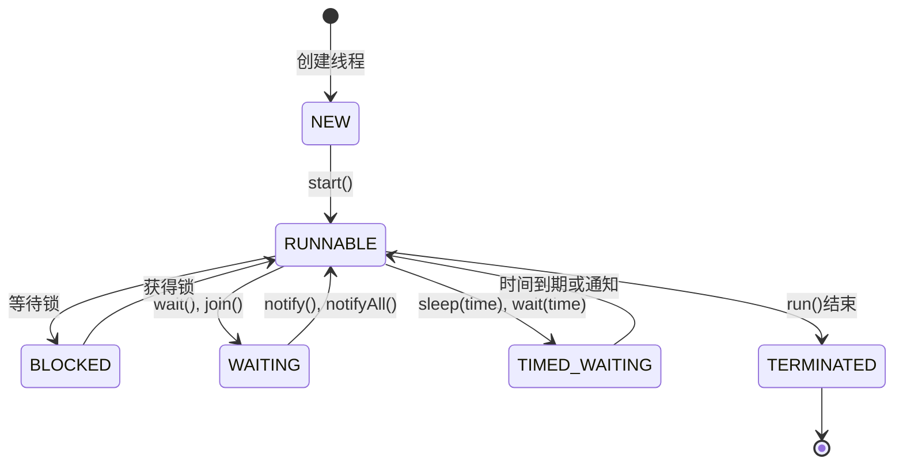

# Java Thread类

## 什么是Thread类

在Java中，`Thread`类是实现多线程编程的基础。它是Java语言提供的用于创建和管理线程的核心类，位于`java.lang`包中，所以使用时无需额外导入。通过Thread类，我们可以在Java程序中创建和控制多个并发执行的线程，从而实现多任务处理。

:::note
**线程与进程的区别**：进程是操作系统分配资源的基本单位，而线程是CPU调度的基本单位。一个进程可以包含多个线程，线程共享进程的资源。
:::

## Thread类的创建方式

在Java中，创建线程主要有两种方法：继承Thread类和实现Runnable接口。

### 方式1：继承Thread类

继承Thread类是创建线程的直接方式，需要重写`run()`方法。

```java
public class MyThread extends Thread {
    @Override
    public void run() {
        // 线程执行的代码
        for (int i = 0; i < 5; i++) {
            System.out.println("Thread " + Thread.currentThread().getName() + ": " + i);
        }
    }

    public static void main(String[] args) {
        // 创建线程实例
        MyThread thread1 = new MyThread();
        MyThread thread2 = new MyThread();
        
        // 设置线程名称
        thread1.setName("Thread-1");
        thread2.setName("Thread-2");
        
        // 启动线程
        thread1.start();
        thread2.start();
    }
}
```

**输出示例：**

```
Thread Thread-1: 0
Thread Thread-2: 0
Thread Thread-1: 1
Thread Thread-2: 1
Thread Thread-1: 2
Thread Thread-2: 2
Thread Thread-1: 3
Thread Thread-2: 3
Thread Thread-1: 4
Thread Thread-2: 4
```

### 方式2：实现Runnable接口

实现Runnable接口是更灵活的创建线程的方式，特别是当类需要继承其他类时。

```java
public class MyRunnable implements Runnable {
    @Override
    public void run() {
        // 线程执行的代码
        for (int i = 0; i < 5; i++) {
            System.out.println("Thread " + Thread.currentThread().getName() + ": " + i);
        }
    }

    public static void main(String[] args) {
        // 创建Runnable实例
        MyRunnable myRunnable = new MyRunnable();
        
        // 创建Thread实例并传入Runnable对象
        Thread thread1 = new Thread(myRunnable, "Thread-1");
        Thread thread2 = new Thread(myRunnable, "Thread-2");
        
        // 启动线程
        thread1.start();
        thread2.start();
    }
}
```

:::tip
推荐使用实现Runnable接口的方式，因为：
1. Java是单继承的，实现接口可以避免继承带来的局限
2. 可以更好地分离线程的任务和线程本身
3. 多个线程可以共享同一个Runnable实例
:::

## Thread类的生命周期

Java线程在其生命周期中会经历多个状态，主要包括：



1. **NEW（新建）**：线程已创建但尚未启动
2. **RUNNABLE（可运行）**：线程正在执行或准备执行
3. **BLOCKED（阻塞）**：线程因等待锁而被阻塞
4. **WAITING（等待）**：线程无限期等待其他线程执行特定操作
5. **TIMED_WAITING（计时等待）**：线程等待指定的时间
6. **TERMINATED（终止）**：线程执行完毕

## Thread类的常用方法

Thread类提供了许多方法用于控制和管理线程，以下是一些最常用的方法：

| 方法 | 说明 |
|------|------|
| `start()` | 启动线程，使线程进入可运行状态 |
| `run()` | 包含线程要执行的代码，通常由JVM调用 |
| `sleep(long millis)` | 使线程休眠指定的毫秒数 |
| `join()` | 等待该线程终止 |
| `yield()` | 暂停当前线程，让其他线程有机会执行 |
| `isAlive()` | 测试线程是否处于活动状态 |
| `setPriority(int newPriority)` | 设置线程的优先级 |
| `getName()` | 获取线程的名称 |
| `setName(String name)` | 设置线程的名称 |
| `currentThread()` | 返回当前执行的线程对象的引用 |

### 实践示例：使用sleep()方法

```java
public class ThreadSleepExample {
    public static void main(String[] args) {
        Thread thread = new Thread(() -> {
            for (int i = 1; i <= 5; i++) {
                try {
                    System.out.println("睡眠前: " + i);
                    // 线程休眠2秒
                    Thread.sleep(2000);
                    System.out.println("睡眠后: " + i);
                } catch (InterruptedException e) {
                    e.printStackTrace();
                }
            }
        });
        
        thread.start();
    }
}
```

**输出示例：**
```
睡眠前: 1
睡眠后: 1
睡眠前: 2
睡眠后: 2
睡眠前: 3
睡眠后: 3
睡眠前: 4
睡眠后: 4
睡眠前: 5
睡眠后: 5
```

### 实践示例：使用join()方法

```java
public class ThreadJoinExample {
    public static void main(String[] args) {
        Thread thread1 = new Thread(() -> {
            for (int i = 1; i <= 5; i++) {
                System.out.println("线程1: " + i);
                try {
                    Thread.sleep(500);
                } catch (InterruptedException e) {
                    e.printStackTrace();
                }
            }
        });
        
        Thread thread2 = new Thread(() -> {
            try {
                // 等待thread1完成
                thread1.join();
                System.out.println("线程1已完成，开始执行线程2");
                for (int i = 1; i <= 5; i++) {
                    System.out.println("线程2: " + i);
                    Thread.sleep(500);
                }
            } catch (InterruptedException e) {
                e.printStackTrace();
            }
        });
        
        thread1.start();
        thread2.start();
    }
}
```

**输出示例：**
```
线程1: 1
线程1: 2
线程1: 3
线程1: 4
线程1: 5
线程1已完成，开始执行线程2
线程2: 1
线程2: 2
线程2: 3
线程2: 4
线程2: 5
```

## Thread类的实际应用场景

### 1. 图形用户界面（GUI）应用程序

在桌面应用程序中，通常会使用单独的线程来处理耗时操作，避免阻塞主UI线程，保持界面响应性。

```java
import javax.swing.*;
import java.awt.*;
import java.awt.event.ActionEvent;
import java.awt.event.ActionListener;

public class SimpleGUIWithThread extends JFrame {
    private JButton button;
    private JLabel statusLabel;
    
    public SimpleGUIWithThread() {
        setTitle("线程示例");
        setSize(300, 200);
        setDefaultCloseOperation(JFrame.EXIT_ON_CLOSE);
        setLayout(new FlowLayout());
        
        button = new JButton("开始耗时任务");
        statusLabel = new JLabel("就绪");
        
        button.addActionListener(new ActionListener() {
            @Override
            public void actionPerformed(ActionEvent e) {
                button.setEnabled(false);
                statusLabel.setText("处理中...");
                
                // 创建新线程处理耗时任务
                new Thread(() -> {
                    try {
                        // 模拟耗时操作
                        Thread.sleep(5000);
                        
                        // 任务完成后，在EDT线程中更新UI
                        SwingUtilities.invokeLater(() -> {
                            statusLabel.setText("完成！");
                            button.setEnabled(true);
                        });
                    } catch (InterruptedException ex) {
                        ex.printStackTrace();
                    }
                }).start();
            }
        });
        
        add(button);
        add(statusLabel);
    }
    
    public static void main(String[] args) {
        SwingUtilities.invokeLater(() -> {
            new SimpleGUIWithThread().setVisible(true);
        });
    }
}
```

### 2. 网络服务器应用

在服务器应用程序中，通常每个客户端连接都会使用一个单独的线程进行处理。

```java
import java.io.*;
import java.net.*;

public class SimpleServer {
    public static void main(String[] args) {
        try {
            ServerSocket serverSocket = new ServerSocket(8080);
            System.out.println("服务器启动，监听端口 8080...");
            
            while (true) {
                // 等待客户端连接
                Socket clientSocket = serverSocket.accept();
                System.out.println("客户端已连接: " + clientSocket.getInetAddress());
                
                // 为每个客户端创建一个新线程
                new Thread(() -> handleClient(clientSocket)).start();
            }
        } catch (IOException e) {
            e.printStackTrace();
        }
    }
    
    private static void handleClient(Socket clientSocket) {
        try {
            BufferedReader in = new BufferedReader(
                new InputStreamReader(clientSocket.getInputStream()));
            PrintWriter out = new PrintWriter(clientSocket.getOutputStream(), true);
            
            String input;
            while ((input = in.readLine()) != null) {
                System.out.println("收到: " + input);
                out.println("回复: " + input);
                
                if (input.equals("exit")) {
                    break;
                }
            }
            
            clientSocket.close();
            System.out.println("客户端断开连接");
        } catch (IOException e) {
            e.printStackTrace();
        }
    }
}
```

### 3. 并行计算

在需要大量计算的场景中，可以使用多线程来分割任务，充分利用多核处理器的性能。

```java
public class ParallelCalculation {
    public static void main(String[] args) throws InterruptedException {
        int[] array = new int[100000000];
        // 初始化数组
        for (int i = 0; i < array.length; i++) {
            array[i] = i;
        }
        
        // 单线程求和
        long startTime = System.currentTimeMillis();
        long sum1 = calculateSum(array, 0, array.length);
        long endTime = System.currentTimeMillis();
        System.out.println("单线程求和结果: " + sum1);
        System.out.println("单线程耗时: " + (endTime - startTime) + "ms");
        
        // 四线程并行求和
        startTime = System.currentTimeMillis();
        long sum2 = parallelSum(array, 4);
        endTime = System.currentTimeMillis();
        System.out.println("多线程求和结果: " + sum2);
        System.out.println("多线程耗时: " + (endTime - startTime) + "ms");
    }
    
    static long calculateSum(int[] array, int start, int end) {
        long sum = 0;
        for (int i = start; i < end; i++) {
            sum += array[i];
        }
        return sum;
    }
    
    static long parallelSum(int[] array, int numThreads) throws InterruptedException {
        int size = array.length / numThreads;
        SumThread[] threads = new SumThread[numThreads];
        
        for (int i = 0; i < numThreads; i++) {
            int start = i * size;
            int end = (i == numThreads - 1) ? array.length : (i + 1) * size;
            threads[i] = new SumThread(array, start, end);
            threads[i].start();
        }
        
        long totalSum = 0;
        for (SumThread thread : threads) {
            thread.join();
            totalSum += thread.getResult();
        }
        
        return totalSum;
    }
    
    static class SumThread extends Thread {
        private int[] array;
        private int start;
        private int end;
        private long result;
        
        SumThread(int[] array, int start, int end) {
            this.array = array;
            this.start = start;
            this.end = end;
        }
        
        @Override
        public void run() {
            result = calculateSum(array, start, end);
        }
        
        public long getResult() {
            return result;
        }
    }
}
```

## 线程的安全问题

当多个线程同时访问和修改共享数据时，可能会导致数据一致性问题。以下是一个简单的线程安全问题演示：

```java
public class UnsafeCounter {
    private int count = 0;
    
    public void increment() {
        count++;  // 非原子操作
    }
    
    public int getCount() {
        return count;
    }
    
    public static void main(String[] args) throws InterruptedException {
        UnsafeCounter counter = new UnsafeCounter();
        
        // 创建两个线程，每个线程递增计数器10000次
        Thread thread1 = new Thread(() -> {
            for (int i = 0; i < 10000; i++) {
                counter.increment();
            }
        });
        
        Thread thread2 = new Thread(() -> {
            for (int i = 0; i < 10000; i++) {
                counter.increment();
            }
        });
        
        thread1.start();
        thread2.start();
        
        // 等待两个线程完成
        thread1.join();
        thread2.join();
        
        // 理想结果应该是20000
        System.out.println("计数器最终值: " + counter.getCount());
    }
}
```

在上面的例子中，由于`increment()`方法不是线程安全的，最终计数器的值可能小于20000。解决这个问题需要使用线程同步机制，如`synchronized`关键字或`java.util.concurrent`包中的工具。

:::caution
多线程编程中需要特别注意线程安全问题。在后续课程中，我们将深入学习线程同步和线程安全的各种机制。
:::

## 总结

本文详细介绍了Java的Thread类，包括：

1. Thread类的基本概念
2. 创建线程的两种主要方式：继承Thread类和实现Runnable接口
3. 线程的生命周期
4. Thread类的常用方法
5. 线程的实际应用场景
6. 线程安全问题的基本概念

通过掌握Thread类，你可以开始编写多线程Java程序，利用多核处理器提高应用程序性能，实现并发任务处理。

## 练习题

为了巩固你对Thread类的理解，尝试完成以下练习：

1. 创建一个Java程序，使用Thread类创建三个线程，每个线程打印不同的消息。
2. 编写一个程序，创建两个线程，一个线程打印1-10的偶数，另一个打印1-10的奇数。
3. 实现一个简单的倒计时程序，使用Thread的sleep方法。
4. 创建一个程序，使用join方法确保三个线程按特定顺序执行。
5. 模拟一个简单的生产者-消费者问题，使用多线程实现。

## 深入学习资源

- [Java官方文档 - Thread类](https://docs.oracle.com/en/java/javase/11/docs/api/java.base/java/lang/Thread.html)
- [《Java并发编程实战》](https://book.douban.com/subject/10484692/) - Brian Goetz等著
- [《Java多线程编程核心技术》](https://book.douban.com/subject/26555197/) - 高洪岩著

在接下来的课程中，我们将深入探讨更复杂的多线程编程话题，如线程同步、线程池、并发集合等。