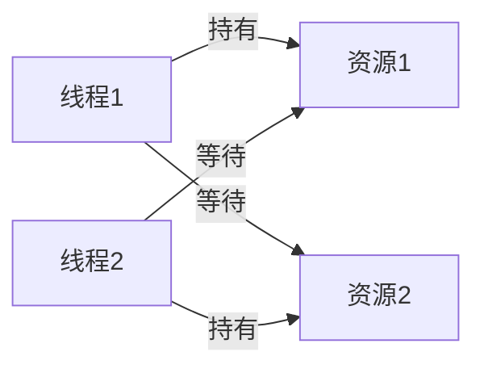

# Java 死锁

## 什么是死锁？

死锁是多线程编程中常见的一个严重问题，它发生在两个或更多线程互相等待对方释放资源，导致所有相关线程永久阻塞，无法继续执行的情况。

想象一下这个场景：小明和小红各自拿着一把勺子和一把叉子准备吃饭，但完成用餐需要同时拥有勺子和叉子。如果小明先拿了勺子，小红先拿了叉子，然后他们都在等对方放下手中的餐具，两人便会一直等待下去——这就是死锁的现实生活类比。

在Java多线程编程中，当不同线程各自持有一些资源（如锁），并且都在等待获取对方持有的资源时，就会发生死锁。

## 死锁产生的必要条件

死锁的产生需要同时满足以下四个条件：

1. **互斥条件**：资源不能被共享，一次只能被一个线程使用
2. **持有并等待条件**：线程持有一些资源，同时等待获取其他资源
3. **不可抢占条件**：资源只能在持有者自愿释放时才能被释放
4. **循环等待条件**：存在一个线程等待链，形成一个环

## 经典的死锁示例

让我们通过一个简单的代码示例来理解死锁：

```java
public class DeadlockExample {
    
    private static Object resource1 = new Object();
    private static Object resource2 = new Object();
    
    public static void main(String[] args) {
        // 创建第一个线程
        Thread thread1 = new Thread(() -> {
            synchronized (resource1) {
                System.out.println("线程1：持有资源1");
                
                try {
                    Thread.sleep(100);
                } catch (InterruptedException e) {
                    e.printStackTrace();
                }
                
                System.out.println("线程1：等待资源2");
                synchronized (resource2) {
                    System.out.println("线程1：同时持有资源1和资源2");
                }
            }
        });
        
        // 创建第二个线程
        Thread thread2 = new Thread(() -> {
            synchronized (resource2) {
                System.out.println("线程2：持有资源2");
                
                try {
                    Thread.sleep(100);
                } catch (InterruptedException e) {
                    e.printStackTrace();
                }
                
                System.out.println("线程2：等待资源1");
                synchronized (resource1) {
                    System.out.println("线程2：同时持有资源1和资源2");
                }
            }
        });
        
        thread1.start();
        thread2.start();
    }
}
```

**输出结果：**
```
线程1：持有资源1
线程2：持有资源2
线程1：等待资源2
线程2：等待资源1
// 程序在此处卡住，不再有任何输出
```

上述代码中，我们创建了两个线程和两个资源对象。线程1先获取资源1的锁，然后尝试获取资源2的锁；线程2先获取资源2的锁，然后尝试获取资源1的锁。由于两个线程都持有对方需要的资源，并且都在等待对方释放资源，因此形成了死锁。

## 死锁的可视化理解

以下是死锁情况的简单图示：



## 如何检测死锁

Java提供了几种方式来检测死锁：

1. **使用jstack命令**：当应用程序卡住时，可以使用`jstack`命令查看线程转储，查找其中的死锁信息。

```bash
jstack <进程ID>
```

2. **使用ThreadMXBean API**：Java管理扩展(JMX)提供了编程方式检测死锁的API。

```java
ThreadMXBean threadMXBean = ManagementFactory.getThreadMXBean();
long[] deadlockedThreads = threadMXBean.findDeadlockedThreads();

if (deadlockedThreads != null) {
    System.out.println("检测到死锁！");
    ThreadInfo[] threadInfos = threadMXBean.getThreadInfo(deadlockedThreads);
    for (ThreadInfo threadInfo : threadInfos) {
        System.out.println(threadInfo.getThreadName());
    }
}
```

## 如何预防死锁

预防死锁通常需要破坏死锁形成的四个必要条件中的至少一个：

### 1. 锁的顺序化（破坏循环等待条件）

确保所有线程按照相同的顺序获取锁：

```java
public class OrderedLocking {
    
    private static Object resource1 = new Object();
    private static Object resource2 = new Object();
    
    public static void main(String[] args) {
        // 两个线程都按照相同的顺序获取锁
        Thread thread1 = new Thread(() -> {
            synchronized (resource1) {
                System.out.println("线程1：持有资源1");
                
                try {
                    Thread.sleep(100);
                } catch (InterruptedException e) {
                    e.printStackTrace();
                }
                
                synchronized (resource2) {
                    System.out.println("线程1：同时持有资源1和资源2");
                }
            }
        });
        
        Thread thread2 = new Thread(() -> {
            synchronized (resource1) {  // 注意这里与死锁例子不同，现在先获取resource1
                System.out.println("线程2：持有资源1");
                
                try {
                    Thread.sleep(100);
                } catch (InterruptedException e) {
                    e.printStackTrace();
                }
                
                synchronized (resource2) {
                    System.out.println("线程2：同时持有资源1和资源2");
                }
            }
        });
        
        thread1.start();
        thread2.start();
    }
}
```

### 2. 使用超时机制（破坏不可抢占条件）

可以使用`tryLock()`方法和超时参数来避免永久等待：

```java
import java.util.concurrent.locks.Lock;
import java.util.concurrent.locks.ReentrantLock;
import java.util.concurrent.TimeUnit;

public class DeadlockPreventionWithTimeout {
    private static Lock lock1 = new ReentrantLock();
    private static Lock lock2 = new ReentrantLock();
    
    public static void main(String[] args) {
        Thread thread1 = new Thread(() -> {
            try {
                // 尝试获取lock1，最多等待1秒
                boolean acquiredLock1 = lock1.tryLock(1000, TimeUnit.MILLISECONDS);
                System.out.println("线程1获取lock1: " + acquiredLock1);
                
                if (acquiredLock1) {
                    try {
                        // 尝试获取lock2，最多等待1秒
                        boolean acquiredLock2 = lock2.tryLock(1000, TimeUnit.MILLISECONDS);
                        System.out.println("线程1获取lock2: " + acquiredLock2);
                        
                        if (acquiredLock2) {
                            try {
                                // 执行需要两个锁的操作
                                System.out.println("线程1：同时持有lock1和lock2");
                            } finally {
                                lock2.unlock(); // 释放lock2
                            }
                        }
                    } finally {
                        lock1.unlock(); // 释放lock1
                    }
                }
                
                // 如果未能获取所有锁，可以稍后重试
                if (!acquiredLock1) {
                    System.out.println("线程1未能获取所有锁，稍后重试");
                }
                
            } catch (InterruptedException e) {
                e.printStackTrace();
            }
        });
        
        // 线程2类似...
        
        thread1.start();
        // thread2.start();
    }
}
```

### 3. 使用显式锁顺序

为资源分配唯一的标识符，并按照标识符的顺序获取锁：

```java
public class LockOrderExample {
    
    private static class Resource implements Comparable<Resource> {
        private final int id;
        
        public Resource(int id) {
            this.id = id;
        }
        
        @Override
        public int compareTo(Resource other) {
            return this.id - other.id;
        }
    }
    
    private void useTwoResources(Resource r1, Resource r2) {
        Resource first, second;
        
        // 始终按照id从小到大的顺序获取锁
        if (r1.compareTo(r2) < 0) {
            first = r1;
            second = r2;
        } else {
            first = r2;
            second = r1;
        }
        
        synchronized (first) {
            System.out.println("获取第一个资源锁");
            
            synchronized (second) {
                System.out.println("获取第二个资源锁");
                // 执行需要两个资源的操作
            }
        }
    }
}
```

## 实际应用场景中的死锁问题

### 场景一：数据库事务死锁

在数据库应用中，当多个事务以不同顺序更新相同的数据行时，可能会导致死锁：

```java
// 事务1
@Transactional
public void transferMoney(Account fromAccount, Account toAccount, BigDecimal amount) {
    // 先锁定付款账户
    accountDao.lockAccount(fromAccount.getId());
    // 再锁定收款账户
    accountDao.lockAccount(toAccount.getId());
    
    // 执行转账操作
    fromAccount.debit(amount);
    toAccount.credit(amount);
    
    accountDao.updateAccount(fromAccount);
    accountDao.updateAccount(toAccount);
}

// 事务2 - 可能与事务1并发执行
@Transactional
public void transferMoney(Account fromAccount, Account toAccount, BigDecimal amount) {
    // 顺序相反！
    accountDao.lockAccount(toAccount.getId());
    accountDao.lockAccount(fromAccount.getId());
    
    // 执行转账操作
    // ...
}
```

**解决方案**：确保所有事务按照相同的顺序锁定账户，例如始终按账户ID升序排列：

```java
@Transactional
public void transferMoney(Account fromAccount, Account toAccount, BigDecimal amount) {
    // 确保按ID升序锁定账户
    if (fromAccount.getId() < toAccount.getId()) {
        accountDao.lockAccount(fromAccount.getId());
        accountDao.lockAccount(toAccount.getId());
    } else {
        accountDao.lockAccount(toAccount.getId());
        accountDao.lockAccount(fromAccount.getId());
    }
    
    // 执行转账操作
    // ...
}
```

### 场景二：微服务互相调用死锁

在微服务架构中，如果服务A调用服务B，而服务B又调用服务A，同时两边都有同步调用和资源锁定，就可能形成死锁：

**解决方案**：
1. 使用异步通信
2. 实施超时机制
3. 避免循环依赖
4. 使用断路器模式（Circuit Breaker）

```java
// 使用Hystrix断路器防止死锁
@HystrixCommand(fallbackMethod = "fallbackMethod", 
               commandProperties = {
                   @HystrixProperty(name = "execution.isolation.thread.timeoutInMilliseconds", value = "1000")
               })
public String callServiceB() {
    return serviceB.getData();
}

public String fallbackMethod() {
    return "服务B调用超时或失败，返回降级结果";
}
```

## 死锁的调试与分析

当你怀疑应用程序中存在死锁时，可以通过以下步骤进行调试：

1. 使用`jstack`命令生成线程转储
2. 分析线程状态和持有的锁
3. 寻找"waiting for monitor entry"状态的线程
4. 检查是否有相互等待的情况

:::tip
在开发阶段，可以定期执行死锁检测代码，以帮助及早发现潜在的死锁问题：
```java
new Thread(() -> {
    while (true) {
        ThreadMXBean threadMXBean = ManagementFactory.getThreadMXBean();
        long[] deadlockedThreads = threadMXBean.findDeadlockedThreads();
        if (deadlockedThreads != null) {
            System.err.println("检测到死锁！");
            // 打印死锁信息
        }
        try {
            Thread.sleep(5000);
        } catch (InterruptedException e) {
            e.printStackTrace();
        }
    }
}).start();
```
:::

## 总结

死锁是Java多线程编程中的一个严重问题，它会导致程序停止响应。要避免死锁，你需要了解其形成原因，并采取适当的策略：

1. **理解死锁的四个必要条件**：互斥、持有并等待、不可抢占和循环等待
2. **遵循一致的锁定顺序**：确保所有线程按照相同的顺序获取锁
3. **使用超时机制**：不要无限期等待获取锁
4. **避免嵌套锁**：尽量减少同时持有多个锁的场景
5. **使用并发工具类**：优先使用`java.util.concurrent`包中提供的高级并发工具
6. **定期检测死锁**：在开发和测试阶段使用死锁检测工具

通过深入理解死锁的原理和预防策略，你可以编写更加健壮和可靠的多线程Java应用程序。

## 练习与思考

1. 修改本文提供的死锁示例代码，使其不再发生死锁
2. 编写一个使用`java.util.concurrent.locks.ReentrantLock`实现的不会死锁的程序
3. 设计一个简单的银行转账系统，并确保它不会因并发转账操作而发生死锁
4. 思考：为什么在使用多个锁时，固定锁的获取顺序能有效避免死锁？

## 延伸阅读

- Java并发编程实战（Java Concurrency in Practice） - Brian Goetz
- 《Effective Java》第10章 - Joshua Bloch
- Java API文档中关于`java.util.concurrent`包的说明

通过掌握死锁的原理和预防措施，你将能够开发出更稳定、可靠的多线程Java应用程序。