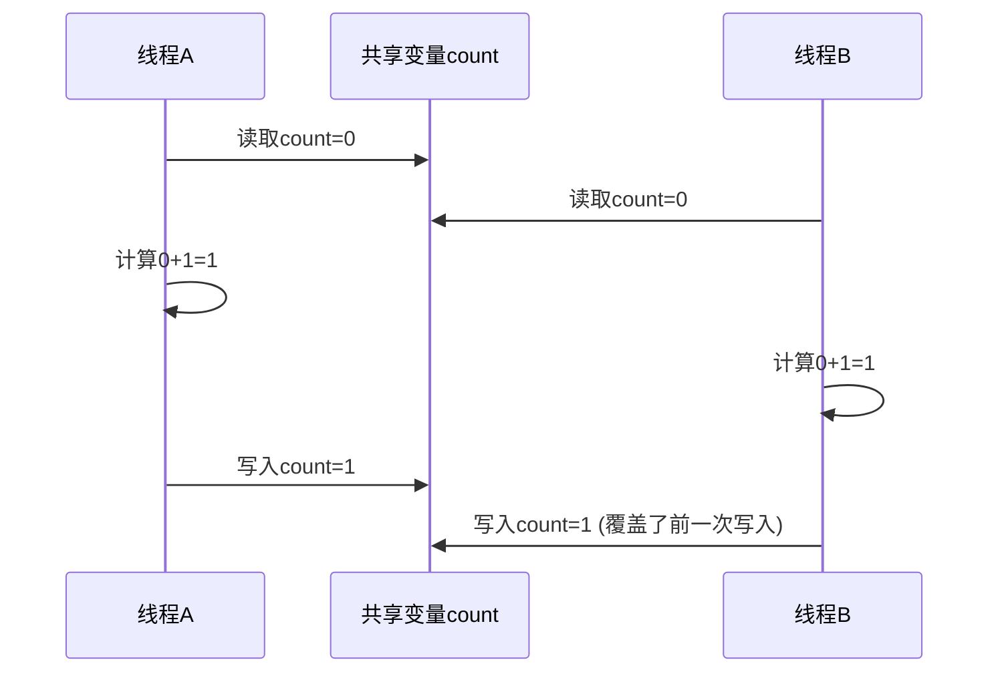

# Java 线程安全

在多线程编程中，"线程安全"是一个至关重要的概念。当多个线程同时访问和修改共享资源时，如果结果总是符合预期，我们就说这段代码是线程安全的。本文将全面介绍Java线程安全的相关概念、问题及解决方案。

## 什么是线程安全？

线程安全指的是在多线程环境下，代码能够正确地处理共享资源，不会因为多线程的交替执行而产生不可预期的结果。

:::note 定义
当多个线程并发访问共享数据时，如果不会产生数据不一致或数据污染的情况，那么我们就称这段代码是线程安全的。
:::

## 为什么需要关注线程安全？

以一个简单的计数器示例说明为什么线程安全很重要：

```java
public class UnsafeCounter {
    private int count = 0;
    
    public void increment() {
        count++; // 非原子操作
    }
    
    public int getCount() {
        return count;
    }
    
    public static void main(String[] args) throws InterruptedException {
        UnsafeCounter counter = new UnsafeCounter();
        Thread t1 = new Thread(() -> {
            for (int i = 0; i < 10000; i++) {
                counter.increment();
            }
        });
        
        Thread t2 = new Thread(() -> {
            for (int i = 0; i < 10000; i++) {
                counter.increment();
            }
        });
        
        t1.start();
        t2.start();
        
        t1.join();
        t2.join();
        
        System.out.println("Expected: 20000, Actual: " + counter.getCount());
    }
}
```

**输出:**
```
Expected: 20000, Actual: 16254  // 实际输出可能有所不同
```

可以看到，虽然两个线程各自执行了10000次增量操作，但最终结果却小于预期的20000，这就是线程不安全的表现。

## 线程不安全的根本原因

### 1. 原子性问题

Java中看似是单一操作的语句，在底层可能是多个操作组合而成。例如 `count++` 实际上包含三个步骤：
1. 读取count的值
2. 将值加1
3. 将结果写回count

当多线程交替执行这些步骤时，就会出现问题。



### 2. 可见性问题

在多核CPU中，每个线程可能操作的是自己CPU缓存中的数据副本，而不是主内存中的数据。一个线程对变量的修改可能不会立即被其他线程看到。

### 3. 有序性问题

为了提高性能，JVM和CPU可能会对指令进行重排序，这在单线程环境下不会有问题，但在多线程环境下可能导致意想不到的结果。

## 如何实现线程安全

### 1. 使用synchronized关键字

`synchronized`关键字可以确保在同一时刻只有一个线程能够执行特定的代码块或方法。

```java
public class SafeCounter {
    private int count = 0;
    
    public synchronized void increment() {
        count++;
    }
    
    public synchronized int getCount() {
        return count;
    }
    
    public static void main(String[] args) throws InterruptedException {
        SafeCounter counter = new SafeCounter();
        Thread t1 = new Thread(() -> {
            for (int i = 0; i < 10000; i++) {
                counter.increment();
            }
        });
        
        Thread t2 = new Thread(() -> {
            for (int i = 0; i < 10000; i++) {
                counter.increment();
            }
        });
        
        t1.start();
        t2.start();
        
        t1.join();
        t2.join();
        
        System.out.println("Expected: 20000, Actual: " + counter.getCount());
    }
}
```

**输出:**
```
Expected: 20000, Actual: 20000
```

### 2. 使用Lock接口

Java 5引入了`java.util.concurrent.locks`包，提供了比`synchronized`更灵活的锁机制。

```java
import java.util.concurrent.locks.Lock;
import java.util.concurrent.locks.ReentrantLock;

public class LockCounter {
    private int count = 0;
    private final Lock lock = new ReentrantLock();
    
    public void increment() {
        lock.lock();
        try {
            count++;
        } finally {
            lock.unlock(); // 确保锁一定会被释放
        }
    }
    
    public int getCount() {
        lock.lock();
        try {
            return count;
        } finally {
            lock.unlock();
        }
    }
    
    public static void main(String[] args) throws InterruptedException {
        LockCounter counter = new LockCounter();
        // 测试代码与前面相同...
    }
}
```

### 3. 使用原子类

`java.util.concurrent.atomic`包提供了一系列原子类，如`AtomicInteger`、`AtomicLong`等，它们提供的操作都是原子性的。

```java
import java.util.concurrent.atomic.AtomicInteger;

public class AtomicCounter {
    private AtomicInteger count = new AtomicInteger(0);
    
    public void increment() {
        count.incrementAndGet(); // 原子操作
    }
    
    public int getCount() {
        return count.get();
    }
    
    public static void main(String[] args) throws InterruptedException {
        AtomicCounter counter = new AtomicCounter();
        // 测试代码与前面相同...
    }
}
```

### 4. 使用volatile关键字

`volatile`关键字可以解决变量的可见性问题，但不能解决原子性问题。

```java
public class VolatileExample {
    private volatile boolean flag = false;
    
    public void setFlag() {
        flag = true; // 对volatile变量的修改对所有线程立即可见
    }
    
    public boolean isFlag() {
        return flag;
    }
}
```

:::caution 注意
`volatile`不能保证复合操作的原子性，例如`count++`这样的操作仍然不是线程安全的！
:::

### 5. 使用ThreadLocal

当数据不需要在线程间共享，但需要在同一线程的不同方法中共享时，可以使用`ThreadLocal`。

```java
public class ThreadLocalExample {
    private ThreadLocal<Integer> threadLocalValue = ThreadLocal.withInitial(() -> 0);
    
    public void increment() {
        threadLocalValue.set(threadLocalValue.get() + 1);
    }
    
    public int get() {
        return threadLocalValue.get();
    }
    
    public static void main(String[] args) {
        ThreadLocalExample example = new ThreadLocalExample();
        
        Thread t1 = new Thread(() -> {
            for (int i = 0; i < 10; i++) {
                example.increment();
                System.out.println("Thread 1: " + example.get());
            }
        });
        
        Thread t2 = new Thread(() -> {
            for (int i = 0; i < 10; i++) {
                example.increment();
                System.out.println("Thread 2: " + example.get());
            }
        });
        
        t1.start();
        t2.start();
    }
}
```

**输出:**
```
Thread 1: 1
Thread 2: 1
Thread 1: 2
Thread 2: 2
...
Thread 1: 10
Thread 2: 10
```

可以看到，虽然两个线程都在操作同一个`ThreadLocalExample`对象，但由于使用了`ThreadLocal`，每个线程都有自己独立的计数器，互不影响。

## 线程安全的集合类

Java提供了多种线程安全的集合类，位于`java.util.concurrent`包中：

1. **ConcurrentHashMap**: 线程安全的HashMap
2. **CopyOnWriteArrayList**: 线程安全的ArrayList
3. **CopyOnWriteArraySet**: 线程安全的Set
4. **BlockingQueue的实现类**: 如ArrayBlockingQueue, LinkedBlockingQueue等

示例：使用ConcurrentHashMap

```java
import java.util.concurrent.ConcurrentHashMap;
import java.util.Map;

public class ConcurrentMapExample {
    public static void main(String[] args) throws InterruptedException {
        Map<String, Integer> map = new ConcurrentHashMap<>();
        
        Thread t1 = new Thread(() -> {
            for (int i = 0; i < 1000; i++) {
                map.put("Key" + i, i);
            }
        });
        
        Thread t2 = new Thread(() -> {
            for (int i = 1000; i < 2000; i++) {
                map.put("Key" + i, i);
            }
        });
        
        t1.start();
        t2.start();
        
        t1.join();
        t2.join();
        
        System.out.println("Map size: " + map.size());
    }
}
```

**输出:**
```
Map size: 2000
```

## 实际应用案例

### 案例1: 银行转账系统

在一个银行系统中，多个用户可能同时对一个账户进行操作。如果不考虑线程安全，可能会导致账户余额不一致。

```java
public class BankAccount {
    private double balance;
    private final Object lock = new Object();
    
    public BankAccount(double initialBalance) {
        this.balance = initialBalance;
    }
    
    public void deposit(double amount) {
        synchronized (lock) {
            balance += amount;
        }
    }
    
    public boolean withdraw(double amount) {
        synchronized (lock) {
            if (balance >= amount) {
                balance -= amount;
                return true;
            }
            return false;
        }
    }
    
    public double getBalance() {
        synchronized (lock) {
            return balance;
        }
    }
    
    public static void main(String[] args) throws InterruptedException {
        BankAccount account = new BankAccount(1000);
        
        Thread depositThread = new Thread(() -> {
            for (int i = 0; i < 5; i++) {
                account.deposit(100);
                System.out.println("Deposited 100, new balance: " + account.getBalance());
                try {
                    Thread.sleep(100);
                } catch (InterruptedException e) {
                    e.printStackTrace();
                }
            }
        });
        
        Thread withdrawThread = new Thread(() -> {
            for (int i = 0; i < 5; i++) {
                boolean success = account.withdraw(150);
                System.out.println(success ? "Withdrew 150, new balance: " + account.getBalance() : 
                                           "Failed to withdraw, balance: " + account.getBalance());
                try {
                    Thread.sleep(100);
                } catch (InterruptedException e) {
                    e.printStackTrace();
                }
            }
        });
        
        depositThread.start();
        withdrawThread.start();
        
        depositThread.join();
        withdrawThread.join();
        
        System.out.println("Final balance: " + account.getBalance());
    }
}
```

### 案例2: 高并发计数器

例如一个访问量统计系统，需要在高并发环境下准确记录网站的访问次数：

```java
import java.util.concurrent.atomic.LongAdder;

public class WebsiteCounter {
    private final LongAdder pageViews = new LongAdder();
    
    public void incrementPageViews() {
        pageViews.increment();
    }
    
    public long getPageViews() {
        return pageViews.sum();
    }
    
    public static void main(String[] args) throws InterruptedException {
        WebsiteCounter counter = new WebsiteCounter();
        
        int numThreads = 100;
        Thread[] threads = new Thread[numThreads];
        
        for (int i = 0; i < numThreads; i++) {
            threads[i] = new Thread(() -> {
                for (int j = 0; j < 10000; j++) {
                    counter.incrementPageViews();
                }
            });
            threads[i].start();
        }
        
        for (Thread thread : threads) {
            thread.join();
        }
        
        System.out.println("Total page views: " + counter.getPageViews());
    }
}
```

**输出:**
```
Total page views: 1000000
```

## 总结

线程安全是Java多线程编程中的核心问题。要实现线程安全，需要理解以下几点：

1. **线程安全的本质**：解决多线程环境下的原子性、可见性和有序性问题。
2. **常用解决方案**：
   - 使用`synchronized`关键字
   - 使用`Lock`接口
   - 使用原子类
   - 适当使用`volatile`关键字
   - 使用`ThreadLocal`
   - 使用线程安全的集合类
3. **选择策略**：
   - 对于简单的同步需求，可以使用`synchronized`
   - 需要更灵活的锁操作时，使用`Lock`接口
   - 针对单一变量的原子操作，使用原子类
   - 只有可见性问题时，使用`volatile`
   - 线程独立的数据，使用`ThreadLocal`

随着对线程安全理解的加深，你将能够编写更可靠、更高效的多线程程序，适应各种高并发场景的需求。

## 练习与附加资源

### 练习

1. 尝试编写一个线程安全的单例模式。
2. 使用不同的线程安全手段实现一个计数器，比较它们在高并发环境下的性能差异。
3. 实现一个简单的线程池，确保其内部状态的线程安全。

### 推荐阅读

1. Java官方文档中关于并发编程的部分
2. 《Java Concurrency in Practice》by Brian Goetz
3. 《Effective Java》by Joshua Bloch中关于并发的章节

通过深入学习线程安全知识并不断实践，你将能够应对Java多线程编程中的各种挑战，编写出稳定高效的代码。