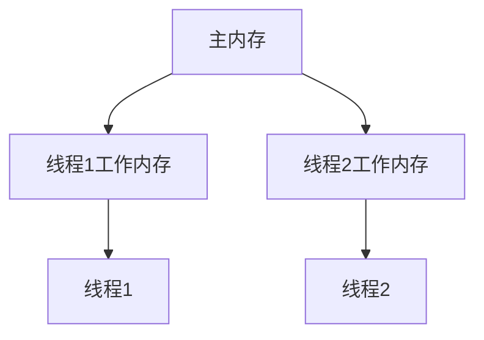

# Java Volatile关键字

在Java多线程编程中，`volatile`关键字是一个非常重要但经常被误解的概念。作为初学者，了解这个关键字的作用和应用场景对于编写正确的并发程序至关重要。本文将全面介绍`volatile`关键字，帮助你掌握这一重要的多线程编程工具。

## 什么是Volatile关键字？

`volatile`是Java中的一个关键字，用于修饰变量。当一个变量被声明为`volatile`时，它向编译器和JVM表明这个变量可能会被多个线程同时访问，需要特殊处理。

`volatile`关键字主要解决了两个问题：

1. **可见性问题**：保证一个线程修改了变量的值，其他线程能够立即看到这个修改
2. **有序性问题**：防止指令重排序优化

:::note 提示
`volatile`不能保证原子性，这是它与`synchronized`关键字的主要区别之一。
:::

## Volatile的工作原理

### 内存可见性

在Java内存模型(JMM)中，每个线程都有自己的工作内存（类似于CPU的缓存），线程对变量的所有操作都必须在工作内存中进行，而不能直接操作主内存中的变量。



这种设计可能导致一个问题：当线程1修改了共享变量的值，但还未将修改后的值刷新到主内存时，线程2读取的仍是旧值，造成数据不一致。

使用`volatile`修饰变量后：

1. 当写入一个`volatile`变量时，会强制将工作内存中的值刷新到主内存
2. 当读取一个`volatile`变量时，会强制从主内存中读取最新值到工作内存

### 禁止指令重排

为了提高性能，JVM和CPU会对指令进行重排序执行。但在多线程环境下，这可能导致程序运行结果与预期不符。`volatile`关键字通过添加内存屏障(Memory Barrier)来防止指令重排，保证代码执行的顺序性。

## Volatile的使用场景

### 1. 状态标志

使用`volatile`修饰的布尔变量作为状态标志是最常见的应用场景之一。

```java
public class TaskRunner {
    private volatile boolean running = false;
    
    public void start() {
        running = true;
        new Thread(() -> {
            while (running) {
                // 执行任务
                System.out.println("Task is running...");
                try {
                    Thread.sleep(500);
                } catch (InterruptedException e) {
                    Thread.currentThread().interrupt();
                }
            }
            System.out.println("Task stopped!");
        }).start();
    }
    
    public void stop() {
        running = false;
        System.out.println("Stop signal sent!");
    }
    
    public static void main(String[] args) throws InterruptedException {
        TaskRunner runner = new TaskRunner();
        runner.start();
        Thread.sleep(2000);  // 让任务运行2秒
        runner.stop();
    }
}
```

运行结果：
```
Task is running...
Task is running...
Task is running...
Task is running...
Stop signal sent!
Task stopped!
```

如果不使用`volatile`修饰`running`变量，那么工作线程可能无法立即看到主线程将`running`设置为`false`的变化，导致任务无法停止。

### 2. 双重检查锁定实现单例模式

```java
public class Singleton {
    private static volatile Singleton instance;
    
    private Singleton() {}
    
    public static Singleton getInstance() {
        if (instance == null) {
            synchronized (Singleton.class) {
                if (instance == null) {
                    instance = new Singleton();
                }
            }
        }
        return instance;
    }
}
```

这里使用`volatile`防止指令重排序。因为`instance = new Singleton()`实际上可以分解为三个步骤：
1. 分配内存空间
2. 初始化对象
3. 将对象引用指向分配的内存

如果不使用`volatile`，JVM可能会对这些步骤进行重排序，比如先执行步骤1和3，再执行步骤2。这样在多线程环境下可能导致其他线程获取到一个未完全初始化的对象。

## Volatile的限制

虽然`volatile`关键字很有用，但它也有一些限制：

### 不保证原子性

`volatile`只能保证对单个变量读写操作的原子性，不能保证复合操作的原子性。

```java
public class VolatileLimitation {
    private volatile int count = 0;
    
    public void increment() {
        count++; // 非原子操作！实际是：读取count，加1，写回count
    }
    
    public int getCount() {
        return count;
    }
    
    public static void main(String[] args) throws InterruptedException {
        VolatileLimitation vl = new VolatileLimitation();
        
        // 创建10个线程，每个线程将count增加1000次
        Thread[] threads = new Thread[10];
        for (int i = 0; i < threads.length; i++) {
            threads[i] = new Thread(() -> {
                for (int j = 0; j < 1000; j++) {
                    vl.increment();
                }
            });
            threads[i].start();
        }
        
        // 等待所有线程完成
        for (Thread t : threads) {
            t.join();
        }
        
        System.out.println("Expected count: 10000");
        System.out.println("Actual count: " + vl.getCount());
    }
}
```

运行结果：
```
Expected count: 10000
Actual count: 8734  // 这个值可能每次运行都不同，但几乎总是小于10000
```

解决方法：使用`AtomicInteger`或`synchronized`关键字确保操作的原子性。

## 实际应用案例

### 案例：使用volatile实现异步停止机制

以下是一个使用`volatile`实现的可以安全停止的定时任务执行器：

```java
public class PeriodicTaskExecutor {
    private final long interval;
    private volatile boolean running = false;
    private Thread worker;
    
    public PeriodicTaskExecutor(long intervalMillis) {
        this.interval = intervalMillis;
    }
    
    public void start(Runnable task) {
        if (running) {
            return;
        }
        
        running = true;
        worker = new Thread(() -> {
            System.out.println("Task executor started");
            while (running) {
                try {
                    task.run();
                    Thread.sleep(interval);
                } catch (InterruptedException e) {
                    Thread.currentThread().interrupt();
                    System.out.println("Task executor interrupted");
                    break;
                }
            }
            System.out.println("Task executor stopped");
        });
        worker.start();
    }
    
    public void stop() {
        running = false;
        if (worker != null) {
            worker.interrupt();
        }
    }
    
    public static void main(String[] args) throws InterruptedException {
        PeriodicTaskExecutor executor = new PeriodicTaskExecutor(1000);
        executor.start(() -> System.out.println("Executing periodic task at " + System.currentTimeMillis()));
        
        Thread.sleep(5500);  // 让任务执行约5.5秒
        
        executor.stop();
        System.out.println("Main thread exiting");
    }
}
```

运行结果：
```
Task executor started
Executing periodic task at 1623456789012
Executing periodic task at 1623456790018
Executing periodic task at 1623456791020
Executing periodic task at 1623456792021
Executing periodic task at 1623456793023
Executing periodic task at 1623456794025
Task executor interrupted
Task executor stopped
Main thread exiting
```

这个例子展示了`volatile`在实际应用中的价值：它确保了一个线程对`running`变量的修改对执行任务的工作线程立即可见，使任务能够及时响应停止信号。

### 案例：使用volatile实现简单的生产者-消费者模式

```java
public class SimpleProducerConsumer {
    private volatile boolean dataProduced = false;
    private volatile Object data = null;
    
    public void produce(Object producedData) {
        // 生产数据
        data = producedData;
        
        // 标记数据已生产
        dataProduced = true;
    }
    
    public Object consume() {
        // 等待数据生产
        while (!dataProduced) {
            Thread.yield();  // 让出CPU时间片
        }
        
        // 消费数据
        Object result = data;
        
        // 重置状态
        dataProduced = false;
        
        return result;
    }
    
    public static void main(String[] args) {
        SimpleProducerConsumer spc = new SimpleProducerConsumer();
        
        // 消费者线程
        new Thread(() -> {
            for (int i = 0; i < 5; i++) {
                Object data = spc.consume();
                System.out.println("Consumed: " + data);
            }
        }).start();
        
        // 生产者线程
        new Thread(() -> {
            for (int i = 1; i <= 5; i++) {
                String data = "Data-" + i;
                spc.produce(data);
                System.out.println("Produced: " + data);
                
                try {
                    Thread.sleep(1000);  // 模拟生产过程
                } catch (InterruptedException e) {
                    Thread.currentThread().interrupt();
                }
            }
        }).start();
    }
}
```

:::caution 注意
上面这个简单的生产者-消费者示例仅用于演示`volatile`的可见性，实际应用中应该使用`BlockingQueue`或其他线程安全的集合类。此示例中存在忙等待(busy-waiting)问题，在生产环境中应避免。
:::

## Volatile的性能考虑

虽然`volatile`提供了可见性保证，但它也带来了一定的性能开销：

1. 禁止了某些编译器优化
2. 插入内存屏障会导致缓存失效
3. 增加了内存总线的通信量

因此，不要过度使用`volatile`关键字。只有在确实需要保证变量的可见性且不需要原子操作时才使用它。

## 总结

`volatile`是Java多线程编程中的一个重要工具，主要用于解决变量的可见性问题和防止指令重排序。

主要特点：
- 保证可见性：一个线程修改了`volatile`变量，其他线程能立即看到
- 防止指令重排：保证程序按照代码的顺序执行
- 不保证原子性：对于复合操作，仍需要使用`synchronized`或`java.util.concurrent`包中的工具

适用场景：
1. 状态标志变量
2. 双重检查锁定单例模式
3. 独立于其他变量的操作

不适用场景：
1. 需要原子复合操作的场景
2. 存在依赖关系的操作

## 练习与思考

1. 编写一个程序，使用`volatile`变量实现一个可以暂停和恢复的计数器。
2. 分析为什么在双重检查锁定的单例模式中需要使用`volatile`修饰实例变量？
3. 在什么情况下`volatile`无法替代`synchronized`？
4. 比较`volatile`和`atomic`类（如`AtomicInteger`）的异同点。

## 进一步学习资源

要深入理解`volatile`关键字和Java内存模型，可以参考以下资源：

1. Java语言规范中关于`volatile`关键字的章节
2. 《Java并发编程实战》(Java Concurrency in Practice) - Brian Goetz等著
3. 《Effective Java》- Joshua Bloch著，特别是关于并发的章节
4. Oracle官方文档中的并发编程部分

通过系统学习和实践，你将能够正确理解和使用`volatile`关键字，编写更加安全、高效的多线程程序。