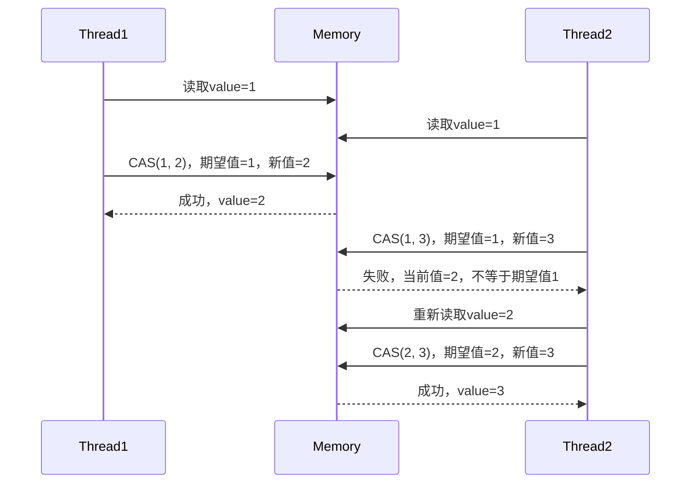

# Java 原子类

## 什么是原子类？

在Java多线程编程中，当多个线程同时访问和修改共享变量时，可能会发生数据不一致的问题。Java的原子类（Atomic Classes）专门用来解决这类问题，它们提供了一种无锁（lock-free）的线程安全操作机制，确保在多线程环境中对变量的操作是原子性的。

:::note 什么是原子操作？
原子操作指的是一个操作过程不会被中断，要么完全执行，要么完全不执行，没有中间状态。在多线程环境中，原子操作可以确保数据的一致性。
:::

Java的原子类位于`java.util.concurrent.atomic`包下，是JDK 5引入的一部分，目的是提供高效的原子操作工具。

## 为什么需要原子类？

考虑以下场景：多个线程同时对一个整数进行递增操作。

```java
public class CounterWithoutAtomic {
    private int count = 0;
    
    public void increment() {
        count++;  // 非原子操作
    }
    
    public int getCount() {
        return count;
    }
}
```

上述代码在多线程环境中是不安全的，因为`count++`实际上是三个操作的组合：读取值、增加值、写回值。如果多个线程同时执行这个操作，可能会导致最终结果不正确。

为解决这个问题，我们可以使用原子类：

```java
import java.util.concurrent.atomic.AtomicInteger;

public class CounterWithAtomic {
    private AtomicInteger count = new AtomicInteger(0);
    
    public void increment() {
        count.incrementAndGet();  // 原子操作
    }
    
    public int getCount() {
        return count.get();
    }
}
```

## 主要原子类介绍

Java提供了多种原子类，主要可以分为以下几类：

### 1. 原子更新基本类型

- **AtomicBoolean**: 原子更新布尔类型
- **AtomicInteger**: 原子更新整型
- **AtomicLong**: 原子更新长整型

### 2. 原子更新数组

- **AtomicIntegerArray**: 原子更新整型数组里的元素
- **AtomicLongArray**: 原子更新长整型数组里的元素
- **AtomicReferenceArray**: 原子更新引用类型数组里的元素

### 3. 原子更新引用类型

- **AtomicReference**: 原子更新引用类型
- **AtomicStampedReference**: 原子更新带有版本号的引用类型
- **AtomicMarkableReference**: 原子更新带有标记位的引用类型

### 4. 原子更新字段类

- **AtomicIntegerFieldUpdater**: 原子更新整型字段
- **AtomicLongFieldUpdater**: 原子更新长整型字段
- **AtomicReferenceFieldUpdater**: 原子更新引用类型字段

## 常用的原子类操作

### AtomicInteger的基本使用

```java
import java.util.concurrent.atomic.AtomicInteger;

public class AtomicIntegerExample {
    public static void main(String[] args) {
        AtomicInteger atomicInt = new AtomicInteger(0);
        
        // 获取当前值
        System.out.println("Current value: " + atomicInt.get());
        
        // 设置新值
        atomicInt.set(10);
        System.out.println("After set(10): " + atomicInt.get());
        
        // 获取旧值并设置新值
        int oldValue = atomicInt.getAndSet(20);
        System.out.println("Old value: " + oldValue + ", New value: " + atomicInt.get());
        
        // 获取当前值并自增
        int previous = atomicInt.getAndIncrement();
        System.out.println("Previous: " + previous + ", Current: " + atomicInt.get());
        
        // 自增并获取新值
        int next = atomicInt.incrementAndGet();
        System.out.println("Next: " + next);
        
        // 自减
        atomicInt.decrementAndGet();
        System.out.println("After decrement: " + atomicInt.get());
        
        // 增加指定的值并返回新值
        int result = atomicInt.addAndGet(5);
        System.out.println("After adding 5: " + result);
    }
}
```

输出结果：
```
Current value: 0
After set(10): 10
Old value: 10, New value: 20
Previous: 20, Current: 21
Next: 22
After decrement: 21
After adding 5: 26
```

### 使用AtomicReference更新引用类型

```java
import java.util.concurrent.atomic.AtomicReference;

public class AtomicReferenceExample {
    static class User {
        private String name;
        private int age;
        
        public User(String name, int age) {
            this.name = name;
            this.age = age;
        }
        
        @Override
        public String toString() {
            return "User{name='" + name + "', age=" + age + "}";
        }
    }
    
    public static void main(String[] args) {
        // 创建原子引用
        AtomicReference<User> atomicReference = new AtomicReference<>();
        
        User user1 = new User("张三", 25);
        atomicReference.set(user1);
        System.out.println("Initial: " + atomicReference.get());
        
        User user2 = new User("李四", 30);
        // 比较并设置新值
        boolean success = atomicReference.compareAndSet(user1, user2);
        System.out.println("CAS result: " + success);
        System.out.println("After CAS: " + atomicReference.get());
        
        // 尝试用错误的期望值进行CAS操作
        User user3 = new User("王五", 35);
        success = atomicReference.compareAndSet(user1, user3);
        System.out.println("Second CAS result: " + success);
        System.out.println("Final: " + atomicReference.get());
    }
}
```

输出结果：
```
Initial: User{name='张三', age=25}
CAS result: true
After CAS: User{name='李四', age=30}
Second CAS result: false
Final: User{name='李四', age=30}
```

## 原子类的实现原理

Java原子类基于CPU的CAS（Compare-And-Swap）指令实现，这是一种硬件级别的原子操作，通过比较内存位置上的值来确保线程安全。



CAS操作包含三个参数：内存地址V，旧的预期值A，新值B。执行CAS操作时，只有当V的值等于A时，才会将V的值更新为B，否则不做任何操作。这个过程是原子性的。

## 原子类与锁的比较

原子类与传统的锁机制相比，有以下优势：

1. **性能更好**：避免了锁的上下文切换开销
2. **更细粒度**：只针对单个变量进行操作，而不是整个代码块
3. **不会死锁**：无锁操作避免了死锁问题

但原子类也有局限性：
1. 只适用于对单个变量的操作
2. 复杂操作需要组合多个原子操作，可能仍需要使用锁

## 实际应用案例

### 案例一：计数器实现

实现一个高并发环境下的计数器：

```java
import java.util.concurrent.atomic.AtomicLong;
import java.util.concurrent.ExecutorService;
import java.util.concurrent.Executors;
import java.util.concurrent.TimeUnit;

public class AtomicCounterExample {
    private static AtomicLong counter = new AtomicLong(0);
    
    public static void main(String[] args) throws InterruptedException {
        ExecutorService executorService = Executors.newFixedThreadPool(100);
        
        for (int i = 0; i < 1000; i++) {
            executorService.submit(() -> counter.incrementAndGet());
        }
        
        executorService.shutdown();
        executorService.awaitTermination(10, TimeUnit.SECONDS);
        
        System.out.println("Final count: " + counter.get());
    }
}
```

输出结果：
```
Final count: 1000
```

### 案例二：原子更新对象属性

使用`AtomicReferenceFieldUpdater`更新对象的某个字段：

```java
import java.util.concurrent.atomic.AtomicReferenceFieldUpdater;

public class UserBalanceExample {
    static class UserAccount {
        public volatile Double balance;
        
        public UserAccount(Double initialBalance) {
            this.balance = initialBalance;
        }
    }
    
    private static final AtomicReferenceFieldUpdater<UserAccount, Double> BALANCE_UPDATER =
            AtomicReferenceFieldUpdater.newUpdater(UserAccount.class, Double.class, "balance");
    
    public static void main(String[] args) {
        UserAccount account = new UserAccount(100.0);
        
        // 尝试扣款50元
        double oldBalance = account.balance;
        boolean success = BALANCE_UPDATER.compareAndSet(account, oldBalance, oldBalance - 50);
        
        System.out.println("扣款" + (success ? "成功" : "失败") + "！当前余额: " + account.balance);
        
        // 再次尝试扣款60元（余额不足）
        oldBalance = account.balance;
        if (oldBalance >= 60) {
            success = BALANCE_UPDATER.compareAndSet(account, oldBalance, oldBalance - 60);
            System.out.println("扣款" + (success ? "成功" : "失败") + "！当前余额: " + account.balance);
        } else {
            System.out.println("余额不足，扣款失败！当前余额: " + account.balance);
        }
    }
}
```

输出结果：
```
扣款成功！当前余额: 50.0
余额不足，扣款失败！当前余额: 50.0
```

## 总结

Java的原子类提供了一种高效、线程安全的方式来操作单个变量，利用底层的CAS操作实现无锁并发，在许多场景下比传统锁机制性能更好。

主要优点包括：
- 线程安全，保证了原子操作
- 性能高，避免了锁的竞争和上下文切换
- API简单易用，适合处理简单的并发场景

学习和掌握原子类的使用是Java并发编程的重要一环，可以帮助你编写更高效、更健壮的多线程程序。

## 练习与思考

1. 尝试使用`AtomicInteger`实现一个简单的计数器类，该类应该是线程安全的。
2. 比较使用`synchronized`关键字和原子类实现计数器的性能差异。
3. 使用`AtomicReferenceArray`实现一个简单的线程安全的缓存系统。
4. 思考：为什么CAS操作有时会出现ABA问题，如何使用`AtomicStampedReference`解决这个问题？

## 扩展阅读

- Java官方文档中关于原子类的说明： [java.util.concurrent.atomic](https://docs.oracle.com/en/java/javase/11/docs/api/java.base/java/util/concurrent/atomic/package-summary.html)
- 深入理解Java中的CAS操作
- Java内存模型与原子操作的关系
- 无锁算法设计模式与应用

通过学习原子类，你已经掌握了Java并发编程中一个强大的工具，这将有助于你开发高性能、线程安全的应用程序。