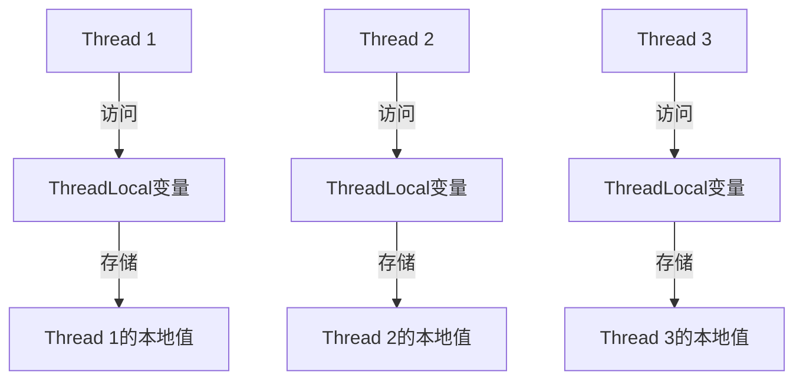
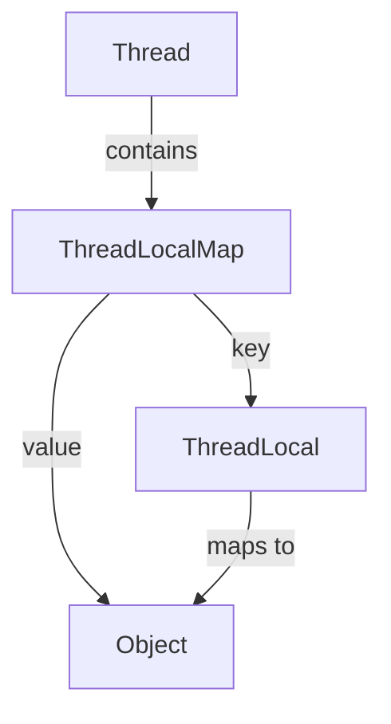

# Java ThreadLocal

## 什么是ThreadLocal？

ThreadLocal是Java提供的一个类，它允许我们创建只能被同一个线程读写的变量。也就是说，ThreadLocal提供了线程本地变量，每个线程都可以通过ThreadLocal独立地改变自己的副本，而不会影响其他线程所对应的副本。

ThreadLocal实例通常是类中的私有静态字段，它们希望将状态与线程（例如，用户ID或事务ID）相关联。



## ThreadLocal的基本用法

ThreadLocal类提供了以下主要方法：

1. `set(T value)`：设置当前线程的线程局部变量的值
2. `get()`：获取当前线程的线程局部变量的值
3. `remove()`：删除当前线程的线程局部变量值
4. `withInitial(Supplier<? extends S> supplier)`：创建线程局部变量时设置初始值

让我们通过一个简单的例子来理解ThreadLocal的用法：

```java
public class ThreadLocalExample {
    // 创建ThreadLocal变量
    private static ThreadLocal<String> threadLocal = new ThreadLocal<>();

    public static void main(String[] args) {
        // 创建第一个线程
        Thread thread1 = new Thread(() -> {
            threadLocal.set("Thread 1 Value");
            System.out.println("Thread 1: " + threadLocal.get());
        });

        // 创建第二个线程
        Thread thread2 = new Thread(() -> {
            threadLocal.set("Thread 2 Value");
            System.out.println("Thread 2: " + threadLocal.get());
        });

        // 启动线程
        thread1.start();
        thread2.start();
    }
}
```

**输出结果:**
```
Thread 1: Thread 1 Value
Thread 2: Thread 2 Value
```

在上面的例子中，我们创建了一个ThreadLocal变量，然后在两个不同的线程中设置并获取它的值。每个线程都有自己的ThreadLocal值的副本，互不影响。

## 初始值设定

有时我们希望ThreadLocal变量有一个初始值，而不是默认的null。可以通过重写`initialValue()`方法或使用`withInitial()`静态方法来实现：

```java
// 方法1：继承ThreadLocal并重写initialValue()方法
ThreadLocal<Integer> threadLocalWithInitialValue = new ThreadLocal<Integer>() {
    @Override
    protected Integer initialValue() {
        return 100; // 初始值为100
    }
};

// 方法2：使用withInitial()静态方法（Java 8及更高版本）
ThreadLocal<Integer> threadLocalWithLambda = ThreadLocal.withInitial(() -> 100);
```

## ThreadLocal的内存泄漏问题

:::warning
使用ThreadLocal时需要注意内存泄漏问题。ThreadLocal变量存储在Thread对象的ThreadLocalMap中，如果不及时清理，可能导致内存泄漏。
:::

当一个线程执行完任务后，如果线程不终止（例如线程池中的线程），而ThreadLocal对象又没有被清理，那么这部分内存就会一直占用，造成内存泄漏。

因此，在使用完ThreadLocal之后，特别是在线程池环境下，应当调用`remove()`方法来清理并避免可能的内存泄漏：

```java
try {
    threadLocal.set(value);
    // 业务逻辑处理
} finally {
    threadLocal.remove(); // 清理ThreadLocal变量
}
```

## ThreadLocal的应用场景

ThreadLocal在多线程编程中有许多应用场景，以下是几个常见例子：

### 1. 用户身份信息传递

在Web应用程序中，可以使用ThreadLocal来存储用户的登录信息，这样就不用在各个方法之间传递用户信息了。

```java
public class UserContext {
    private static final ThreadLocal<User> userThreadLocal = new ThreadLocal<>();

    public static void setUser(User user) {
        userThreadLocal.set(user);
    }

    public static User getUser() {
        return userThreadLocal.get();
    }

    public static void clear() {
        userThreadLocal.remove();
    }
}
```

在web请求的入口处设置用户信息，在请求处理完成后清除：

```java
@WebFilter("/*")
public class UserFilter implements Filter {
    @Override
    public void doFilter(ServletRequest request, ServletResponse response, FilterChain chain) 
            throws IOException, ServletException {
        try {
            // 从请求中获取用户信息并设置到ThreadLocal
            HttpServletRequest req = (HttpServletRequest) request;
            User user = getUserFromSession(req);
            UserContext.setUser(user);
            
            // 继续处理请求
            chain.doFilter(request, response);
        } finally {
            // 请求处理完成后，清理ThreadLocal
            UserContext.clear();
        }
    }
    
    private User getUserFromSession(HttpServletRequest request) {
        // 实现从会话中获取用户的逻辑
        // ...
    }
}
```

### 2. 数据库连接管理

在不使用数据库连接池的情况下，可以使用ThreadLocal管理连接，确保同一线程中的所有数据库操作使用同一个连接：

```java
public class ConnectionManager {
    private static final ThreadLocal<Connection> connectionHolder = ThreadLocal.withInitial(() -> {
        try {
            return DriverManager.getConnection("jdbc:mysql://localhost:3306/mydb", "user", "password");
        } catch (SQLException e) {
            throw new RuntimeException(e);
        }
    });

    public static Connection getConnection() {
        return connectionHolder.get();
    }

    public static void closeConnection() {
        Connection conn = connectionHolder.get();
        if (conn != null) {
            try {
                conn.close();
            } catch (SQLException e) {
                // 处理异常
            }
        }
        connectionHolder.remove();
    }
}
```

### 3. 简化方法参数传递

当某个对象需要在调用链中的多个方法之间传递，但不想作为参数显式传递时，可以使用ThreadLocal：

```java
public class RequestContext {
    private static final ThreadLocal<RequestData> requestDataThreadLocal = new ThreadLocal<>();

    public static void setRequestData(RequestData requestData) {
        requestDataThreadLocal.set(requestData);
    }

    public static RequestData getRequestData() {
        return requestDataThreadLocal.get();
    }

    public static void clear() {
        requestDataThreadLocal.remove();
    }
}
```

这样，调用链中的任何方法都可以通过`RequestContext.getRequestData()`获取请求数据，而无需将其作为参数传递。

## ThreadLocal的实现原理

ThreadLocal的实现主要依靠Thread类中的一个名为`threadLocals`的实例变量，该变量是一个ThreadLocalMap类型的哈希表，存储了当前线程的所有ThreadLocal变量。



当我们调用`set()`时，ThreadLocal会获取当前线程的ThreadLocalMap，然后以ThreadLocal对象自身作为key，将值存储到map中。

同样，当调用`get()`时，ThreadLocal会使用自身作为key，从当前线程的ThreadLocalMap中检索对应的值。

这种设计使得每个线程都有自己独立的变量副本，从而实现了线程隔离。

## InheritableThreadLocal：父子线程间的值传递

如果希望子线程能够继承父线程的ThreadLocal变量，可以使用InheritableThreadLocal。它是ThreadLocal的子类，提供了一种让子线程访问父线程的ThreadLocal变量值的机制。

```java
public class InheritableThreadLocalExample {
    // 创建InheritableThreadLocal变量
    private static InheritableThreadLocal<String> threadLocal = new InheritableThreadLocal<>();

    public static void main(String[] args) {
        // 在主线程中设置值
        threadLocal.set("Hello from parent thread");

        // 创建子线程
        Thread childThread = new Thread(() -> {
            // 子线程获取值
            System.out.println("Child thread value: " + threadLocal.get());
        });

        // 启动子线程
        childThread.start();
        
        // 主线程获取值
        System.out.println("Parent thread value: " + threadLocal.get());
    }
}
```

**输出结果:**
```
Parent thread value: Hello from parent thread
Child thread value: Hello from parent thread
```

这个例子展示了子线程能够继承父线程的ThreadLocal值。需要注意的是，这只是值的复制，之后子线程对变量的修改不会影响父线程，反之亦然。

## 总结

ThreadLocal是Java多线程编程中一个非常有用的工具，它提供了一种简单的方式来维护线程封闭性，即确保特定数据只能被特定线程访问。主要特点包括：

1. 每个线程都有ThreadLocal变量的独立副本
2. 可以避免共享变量的同步问题
3. 适合存储线程上下文信息，如用户ID、事务ID等
4. 使用后需要及时清理，防止内存泄漏
5. 通过InheritableThreadLocal可以实现父子线程间的值传递

虽然ThreadLocal很强大，但也不是万能的。在使用ThreadLocal时，应当考虑以下几点：

- 是否真的需要线程隔离
- 有没有更简单的解决方案
- 是否会导致内存泄漏问题
- 代码是否足够清晰和可维护

## 练习

1. 创建一个程序，使用ThreadLocal来跟踪每个线程的操作次数
2. 实现一个简单的上下文管理器，使用ThreadLocal存储和获取事务ID
3. 编写一个示例，演示ThreadLocal的内存泄漏问题，并说明如何避免
4. 比较ThreadLocal和synchronized关键字在解决线程安全问题上的异同

## 延伸阅读

- [Java ThreadLocal API文档](https://docs.oracle.com/en/java/javase/11/docs/api/java.base/java/lang/ThreadLocal.html)
- [《Java并发编程实践》](http://jcip.net/)
- [《Effective Java》](https://www.oreilly.com/library/view/effective-java/9780134686097/) - 第三版第83条：谨慎使用延迟初始化

通过深入理解ThreadLocal，你可以更有效地处理多线程程序中的状态管理，避免共享变量带来的同步问题，从而编写出更加高效和健壮的Java多线程应用。