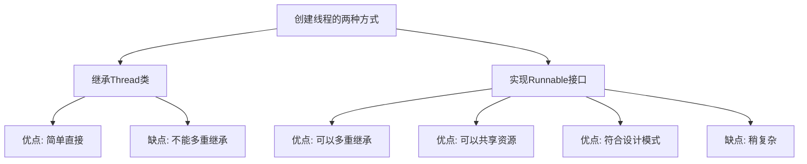

# Java Runnable接口

## 引言

在Java多线程编程中，创建线程的方式主要有两种：一是继承`Thread`类，二是实现`Runnable`接口。本文将重点介绍实现`Runnable`接口的方式，这是Java中创建线程的一种更为灵活的方法。

`Runnable`接口是Java多线程编程的核心接口之一，它为那些希望在单独线程中执行代码但不需要继承`Thread`类的对象提供了一种机制。理解`Runnable`接口对于掌握Java多线程编程至关重要。

## Runnable接口概述

### 什么是Runnable接口？

`Runnable`是Java中定义在`java.lang`包中的一个函数式接口，它只包含一个需要实现的方法：`run()`。当一个类实现了`Runnable`接口，意味着该类的实例可以作为一个任务提交给线程执行。

```java
public interface Runnable {
    public abstract void run();
}
```

### 为什么使用Runnable而不是Thread？

虽然通过继承`Thread`类也可以创建线程，但使用`Runnable`接口有以下优势：

1. **避免单继承限制**：Java不支持多重继承，如果你的类已经继承了其他类，那么它就不能再继承`Thread`类，但仍可以实现`Runnable`接口。
2. **更好的面向对象设计**：`Runnable`将任务（要执行的代码）与执行机制（线程）分离，符合"组合优于继承"的设计原则。
3. **提高资源共享效率**：多个线程可以共享同一个`Runnable`实例，而不需要为每个任务创建一个新的线程对象，减少了系统资源的开销。
4. **更适合线程池使用**：在线程池中，通常使用`Runnable`对象来表示任务，而不是直接使用`Thread`对象。

## 使用Runnable接口创建线程

### 基本步骤

1. 创建一个实现`Runnable`接口的类，并实现`run()`方法
2. 创建该类的实例
3. 创建`Thread`类的实例，将`Runnable`对象作为构造参数传入
4. 调用线程的`start()`方法启动线程

### 代码示例

下面是一个简单的例子，展示如何使用`Runnable`接口创建线程：

```java
public class MyRunnable implements Runnable {
    @Override
    public void run() {
        for (int i = 1; i <= 5; i++) {
            System.out.println(Thread.currentThread().getName() + ": " + i);
            try {
                Thread.sleep(500);  // 线程休眠500毫秒
            } catch (InterruptedException e) {
                e.printStackTrace();
            }
        }
    }
    
    public static void main(String[] args) {
        System.out.println("主线程开始运行");
        
        // 创建Runnable实现类的实例
        MyRunnable myRunnable = new MyRunnable();
        
        // 创建线程对象，并将Runnable实例作为构造参数
        Thread thread1 = new Thread(myRunnable, "线程1");
        Thread thread2 = new Thread(myRunnable, "线程2");
        
        // 启动线程
        thread1.start();
        thread2.start();
        
        System.out.println("主线程结束");
    }
}
```

**输出结果可能如下（由于线程调度的不确定性，每次运行结果可能不同）：**

```
主线程开始运行
主线程结束
线程1: 1
线程2: 1
线程1: 2
线程2: 2
线程1: 3
线程2: 3
线程1: 4
线程2: 4
线程1: 5
线程2: 5
```

### 使用匿名内部类

你也可以使用匿名内部类的方式来创建`Runnable`对象，使代码更加简洁：

```java
public class AnonymousRunnableExample {
    public static void main(String[] args) {
        Thread thread = new Thread(new Runnable() {
            @Override
            public void run() {
                System.out.println("线程正在运行...");
            }
        });
        
        thread.start();
    }
}
```

### 使用Lambda表达式（Java 8及以上）

由于`Runnable`是一个函数式接口（只有一个抽象方法的接口），在Java 8及以上版本中，我们可以使用Lambda表达式来进一步简化代码：

```java
public class LambdaRunnableExample {
    public static void main(String[] args) {
        Thread thread = new Thread(() -> {
            System.out.println("使用Lambda表达式创建的线程正在运行...");
        });
        
        thread.start();
    }
}
```

## Runnable vs Thread

下面是`Runnable`接口和`Thread`类两种创建线程方式的比较：



### 详细比较

| 特性 | Thread | Runnable |
|------|--------|----------|
| 继承 | 继承了Thread类，不能再继承其他类 | 实现接口，仍可继承其他类 |
| 资源共享 | 不同线程使用不同的Thread实例，共享数据需要额外处理 | 多个Thread可以共享同一个Runnable实例及其数据 |
| 面向对象设计 | 任务和执行机制混合在一起 | 任务和执行机制分离，符合单一职责原则 |
| 适用场景 | 简单任务，不需要共享数据 | 复杂应用，需要共享数据或已有继承关系 |
| 线程池兼容性 | 不适合用于线程池 | 很适合用于线程池 |

## 实际应用场景

### 场景一：文件下载器

假设我们要开发一个文件下载器，允许同时下载多个文件，每个下载任务可以使用一个实现`Runnable`接口的类来表示：

```java
public class FileDownloader implements Runnable {
    private String url;
    private String savePath;
    
    public FileDownloader(String url, String savePath) {
        this.url = url;
        this.savePath = savePath;
    }
    
    @Override
    public void run() {
        System.out.println("开始下载文件：" + url);
        // 模拟下载过程
        try {
            for (int i = 1; i <= 10; i++) {
                System.out.println("文件 " + url + " 已下载 " + (i * 10) + "%");
                Thread.sleep(500);
            }
            System.out.println("文件 " + url + " 已保存到 " + savePath);
        } catch (InterruptedException e) {
            System.out.println("文件 " + url + " 下载被中断");
        }
    }
    
    public static void main(String[] args) {
        // 创建多个下载任务
        FileDownloader downloader1 = new FileDownloader("http://example.com/file1.zip", "/downloads/file1.zip");
        FileDownloader downloader2 = new FileDownloader("http://example.com/file2.zip", "/downloads/file2.zip");
        
        // 创建并启动线程
        new Thread(downloader1, "下载线程1").start();
        new Thread(downloader2, "下载线程2").start();
    }
}
```

### 场景二：使用Runnable实现数据共享

下面的例子展示了如何使用`Runnable`接口实现多线程共享数据：

```java
public class TicketSeller implements Runnable {
    private int tickets = 100; // 共享的票数
    
    @Override
    public void run() {
        while (true) {
            synchronized (this) { // 使用同步块保证线程安全
                if (tickets > 0) {
                    // 模拟售票过程
                    try {
                        Thread.sleep(100);
                    } catch (InterruptedException e) {
                        e.printStackTrace();
                    }
                    
                    System.out.println(Thread.currentThread().getName() + " 售出票号: " + tickets);
                    tickets--;
                } else {
                    System.out.println("票已售完!");
                    break;
                }
            }
        }
    }
    
    public static void main(String[] args) {
        TicketSeller seller = new TicketSeller();
        
        // 创建多个窗口（线程）销售同一批票
        Thread window1 = new Thread(seller, "窗口1");
        Thread window2 = new Thread(seller, "窗口2");
        Thread window3 = new Thread(seller, "窗口3");
        
        window1.start();
        window2.start();
        window3.start();
    }
}
```

:::note
上面的例子中使用了`synchronized`关键字来保证线程安全，这是多线程编程中的重要概念，将在后续章节详细讲解。
:::

## 高级应用

### 使用ExecutorService与Runnable

Java并发包（`java.util.concurrent`）提供了`ExecutorService`等高级工具，可以与`Runnable`接口配合使用，简化多线程程序的开发：

```java
import java.util.concurrent.ExecutorService;
import java.util.concurrent.Executors;

public class ExecutorServiceExample {
    public static void main(String[] args) {
        // 创建一个固定大小的线程池
        ExecutorService executorService = Executors.newFixedThreadPool(3);
        
        // 提交多个任务给线程池
        for (int i = 1; i <= 5; i++) {
            final int taskId = i;
            executorService.submit(() -> {
                System.out.println(Thread.currentThread().getName() + " 执行任务 " + taskId);
                try {
                    Thread.sleep(1000);
                } catch (InterruptedException e) {
                    e.printStackTrace();
                }
                System.out.println("任务 " + taskId + " 执行完毕");
            });
        }
        
        // 关闭线程池
        executorService.shutdown();
    }
}
```

### Runnable与Callable

如果你需要线程执行完毕后返回一个结果，`Runnable`接口可能不太适合，因为它的`run()`方法没有返回值。这时可以使用`Callable`接口，它与`Runnable`类似，但可以返回结果：

```java
import java.util.concurrent.*;

public class CallableExample {
    public static void main(String[] args) throws Exception {
        // 创建线程池
        ExecutorService executor = Executors.newSingleThreadExecutor();
        
        // 提交Callable任务
        Future<Integer> future = executor.submit(new Callable<Integer>() {
            @Override
            public Integer call() throws Exception {
                System.out.println("计算中...");
                Thread.sleep(2000); // 模拟耗时计算
                return 123; // 返回计算结果
            }
        });
        
        System.out.println("等待结果...");
        Integer result = future.get(); // 获取计算结果，如果计算还未完成，会阻塞等待
        System.out.println("计算结果: " + result);
        
        // 关闭线程池
        executor.shutdown();
    }
}
```

## 最佳实践与注意事项

1. **优先选择Runnable**：除非有特殊需求，一般情况下应优先使用`Runnable`接口而非继承`Thread`类。

2. **避免线程安全问题**：当多个线程共享同一个`Runnable`对象时，需要注意线程安全问题，必要时使用`synchronized`、`Lock`等同步机制。

3. **资源释放**：在`run()`方法中打开的资源（如文件、数据库连接等）应当在方法结束前关闭。

4. **异常处理**：`run()`方法不能抛出受检异常，需要在方法内处理所有异常，或者将其转换为运行时异常。

5. **不要直接调用run()方法**：启动线程应调用`start()`方法而非`run()`方法，直接调用`run()`会在当前线程中执行，而非新线程。

:::warning
线程的`start()`方法会创建新的线程并调用`run()`方法，而直接调用`run()`方法只是普通方法调用，不会创建新线程。
:::

## 总结

`Runnable`接口是Java多线程编程的核心组件之一，提供了一种将任务与执行机制分离的灵活方式。相比于继承`Thread`类，实现`Runnable`接口通常是创建线程的更好选择，特别是在以下情况：

- 你的类已经继承了其他类，不能再继承`Thread`类
- 多个线程需要共享相同的资源
- 你希望将任务提交给线程池执行
- 你追求更好的面向对象设计

本文介绍了`Runnable`接口的基本概念、使用方法、实际应用场景以及与`Thread`类的比较。通过实现`Runnable`接口，你可以更加灵活地创建和管理多线程程序，这是掌握Java并发编程的重要一步。

## 练习

1. 创建一个实现`Runnable`接口的类，模拟一个计数器，每秒输出一个递增的数字，直到达到指定的最大值。

2. 修改上面的票务系统例子，添加更多的线程安全措施和异常处理。

3. 实现一个简单的生产者-消费者模型，使用`Runnable`接口创建生产者线程和消费者线程。

4. 比较使用`Thread`类和`Runnable`接口实现多线程的代码，分析它们在资源共享方面的差异。

5. 使用`ExecutorService`和`Runnable`任务实现一个简单的任务调度系统，可以提交、执行和取消任务。

## 参考资源

- [Java官方文档 - Runnable接口](https://docs.oracle.com/javase/8/docs/api/java/lang/Runnable.html)
- [Oracle Java Tutorials - 并发](https://docs.oracle.com/javase/tutorial/essential/concurrency/)
- 《Java并发编程实战》 - Brian Goetz

通过本文的学习，你应该已经掌握了Java中`Runnable`接口的基础知识和使用方法。在接下来的章节中，我们将继续深入探讨更复杂的多线程编程概念和技术。