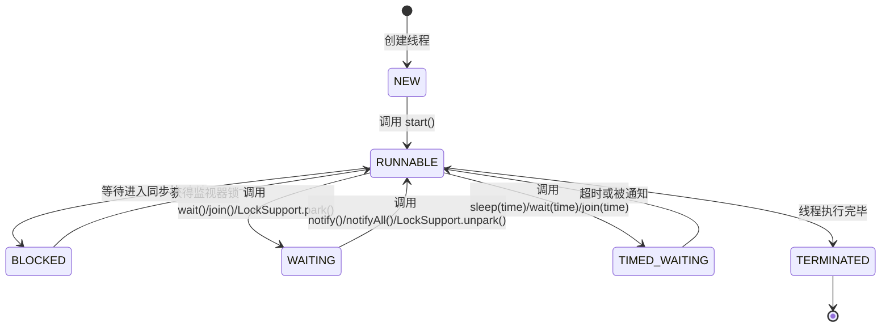

# Java 线程状态

在 Java 多线程编程中，了解线程的各种状态及其转换是非常重要的基础知识。本文将详细介绍 Java 线程的生命周期、各种状态及其转换，以及如何通过 Java API 来管理线程状态。

## 线程状态概述

Java 中的线程在其生命周期中会经历多种状态。JDK 1.5 之后，Java 在 `java.lang.Thread.State` 枚举类中定义了 6 种线程状态：

1. **NEW**：新创建，尚未启动的线程
2. **RUNNABLE**：可运行状态，包括正在运行和等待 CPU 资源的线程
3. **BLOCKED**：阻塞状态，等待获取监视器锁
4. **WAITING**：等待状态，无限期等待另一个线程执行特定操作
5. **TIMED_WAITING**：超时等待状态，在指定的等待时间内等待
6. **TERMINATED**：终止状态，线程已执行完毕

## 线程状态转换图

以下是 Java 线程状态转换的流程图：



## 详细解析各个线程状态

### NEW 状态

当我们创建了一个线程对象，但还没有调用 `start()` 方法时，线程处于 NEW 状态。

```java
Thread thread = new Thread(() -> {
    System.out.println("这是一个线程");
});
System.out.println("线程状态：" + thread.getState()); // 输出: NEW
```

### RUNNABLE 状态

线程调用 `start()` 方法后会进入 RUNNABLE 状态。在 Java 中，RUNNABLE 状态包含两个概念：
- **Ready**：线程已经做好准备，等待 CPU 分配时间片
- **Running**：线程正在执行

```java
Thread thread = new Thread(() -> {
    System.out.println("线程正在运行");
});
thread.start();
System.out.println("线程状态：" + thread.getState()); // 很可能输出: RUNNABLE
```

### BLOCKED 状态

当线程试图获取一个由其他线程持有的对象的监视器锁（比如进入一个 synchronized 块或方法）时，会进入 BLOCKED 状态。

```java
public class BlockedStateDemo {
    private static final Object lock = new Object();
    
    public static void main(String[] args) throws InterruptedException {
        Thread thread1 = new Thread(() -> {
            synchronized(lock) {
                try {
                    // 持有锁不释放
                    Thread.sleep(5000);
                } catch (InterruptedException e) {
                    e.printStackTrace();
                }
            }
        });
        
        thread1.start();
        Thread.sleep(100); // 确保 thread1 先获得锁
        
        Thread thread2 = new Thread(() -> {
            synchronized(lock) {
                System.out.println("线程2获取到锁");
            }
        });
        
        thread2.start();
        Thread.sleep(100); // 给 thread2 一些时间去尝试获取锁
        
        System.out.println("线程2状态：" + thread2.getState()); // 输出: BLOCKED
    }
}
```

### WAITING 状态

线程进入无限期等待状态，需要其他线程执行特定操作才能返回。主要通过以下方法进入该状态：
- `Object.wait()`：在调用该方法的线程持有的对象锁上等待
- `Thread.join()`：等待指定的线程终止
- `LockSupport.park()`：使当前线程阻塞

```java
public class WaitingStateDemo {
    public static void main(String[] args) throws InterruptedException {
        Object lock = new Object();
        
        Thread thread = new Thread(() -> {
            synchronized(lock) {
                try {
                    lock.wait(); // 线程会进入 WAITING 状态
                } catch (InterruptedException e) {
                    e.printStackTrace();
                }
            }
        });
        
        thread.start();
        Thread.sleep(100); // 确保线程有时间进入等待状态
        
        System.out.println("线程状态：" + thread.getState()); // 输出: WAITING
    }
}
```

### TIMED_WAITING 状态

线程进入计时等待状态，在指定时间后自动返回。主要通过以下方法进入该状态：
- `Thread.sleep(long millis)`：线程休眠指定时间
- `Object.wait(long timeout)`：在对象锁上等待指定时间
- `Thread.join(long millis)`：等待指定线程终止，最多等待指定时间
- `LockSupport.parkNanos()`：使当前线程阻塞指定时间
- `LockSupport.parkUntil()`：使当前线程阻塞到指定时间

```java
public class TimedWaitingStateDemo {
    public static void main(String[] args) throws InterruptedException {
        Thread thread = new Thread(() -> {
            try {
                Thread.sleep(5000); // 线程休眠 5 秒
            } catch (InterruptedException e) {
                e.printStackTrace();
            }
        });
        
        thread.start();
        Thread.sleep(100); // 确保线程有时间进入休眠状态
        
        System.out.println("线程状态：" + thread.getState()); // 输出: TIMED_WAITING
    }
}
```

### TERMINATED 状态

线程执行完毕后进入终止状态。

```java
public class TerminatedStateDemo {
    public static void main(String[] args) throws InterruptedException {
        Thread thread = new Thread(() -> {
            System.out.println("线程执行完毕");
        });
        
        thread.start();
        Thread.sleep(1000); // 确保线程执行完毕
        
        System.out.println("线程状态：" + thread.getState()); // 输出: TERMINATED
    }
}
```

## 如何获取和监控线程状态

Java 提供了获取线程状态的 API：

```java
Thread thread = new Thread(() -> {
    // 线程任务
});
// 获取线程状态
Thread.State state = thread.getState();
```

我们可以通过定期检查线程状态来监控线程：

```java
public class ThreadMonitor implements Runnable {
    private Thread target;
    private boolean monitoring = true;
    
    public ThreadMonitor(Thread target) {
        this.target = target;
    }
    
    public void stop() {
        this.monitoring = false;
    }
    
    @Override
    public void run() {
        try {
            while (monitoring) {
                Thread.State state = target.getState();
                System.out.println(target.getName() + " 状态: " + state);
                
                if (state == Thread.State.TERMINATED) {
                    monitoring = false;
                }
                
                Thread.sleep(500); // 每半秒检查一次
            }
        } catch (InterruptedException e) {
            e.printStackTrace();
        }
    }
    
    public static void main(String[] args) {
        Thread worker = new Thread(() -> {
            try {
                System.out.println("工作线程开始执行");
                Thread.sleep(5000); // 模拟工作
                System.out.println("工作线程执行完毕");
            } catch (InterruptedException e) {
                e.printStackTrace();
            }
        }, "WorkerThread");
        
        ThreadMonitor monitor = new ThreadMonitor(worker);
        Thread monitorThread = new Thread(monitor, "MonitorThread");
        
        worker.start();
        monitorThread.start();
    }
}
```

## 实际应用案例

### 案例一：线程池中的线程状态管理

线程池需要管理多个线程的状态，以便有效地分配任务：

```java
import java.util.concurrent.*;

public class ThreadPoolDemo {
    public static void main(String[] args) throws InterruptedException {
        // 创建固定大小的线程池
        ThreadPoolExecutor executor = new ThreadPoolExecutor(
            2, // 核心线程数
            5, // 最大线程数
            60L, // 空闲线程等待时间
            TimeUnit.SECONDS, // 时间单位
            new LinkedBlockingQueue<>(10), // 工作队列
            new ThreadPoolExecutor.CallerRunsPolicy() // 拒绝策略
        );
        
        // 提交多个任务
        for (int i = 1; i <= 10; i++) {
            final int taskId = i;
            executor.submit(() -> {
                try {
                    System.out.println("任务 " + taskId + " 开始执行，线程：" + 
                                    Thread.currentThread().getName());
                    Thread.sleep(1000); // 模拟处理时间
                    System.out.println("任务 " + taskId + " 执行完毕");
                } catch (InterruptedException e) {
                    Thread.currentThread().interrupt();
                }
            });
        }
        
        // 打印线程池状态
        System.out.println("活跃线程数: " + executor.getActiveCount());
        System.out.println("线程池大小: " + executor.getPoolSize());
        System.out.println("队列任务数: " + executor.getQueue().size());
        
        // 不再接受新任务，等待已提交任务完成
        executor.shutdown();
        
        // 等待所有任务完成
        boolean terminated = executor.awaitTermination(30, TimeUnit.SECONDS);
        System.out.println("所有任务已完成: " + terminated);
    }
}
```

### 案例二：处理死锁问题

我们可以通过监控线程状态来检测死锁：

```java
public class DeadlockDetection {
    private static final Object resource1 = new Object();
    private static final Object resource2 = new Object();
    
    public static void main(String[] args) {
        // 创建可能导致死锁的线程
        Thread thread1 = new Thread(() -> {
            synchronized(resource1) {
                System.out.println("线程1: 持有资源1，等待资源2");
                try {
                    Thread.sleep(100);
                } catch (InterruptedException e) {
                    e.printStackTrace();
                }
                synchronized(resource2) {
                    System.out.println("线程1: 同时持有资源1和资源2");
                }
            }
        }, "DeadlockThread-1");
        
        Thread thread2 = new Thread(() -> {
            synchronized(resource2) {
                System.out.println("线程2: 持有资源2，等待资源1");
                try {
                    Thread.sleep(100);
                } catch (InterruptedException e) {
                    e.printStackTrace();
                }
                synchronized(resource1) {
                    System.out.println("线程2: 同时持有资源2和资源1");
                }
            }
        }, "DeadlockThread-2");
        
        thread1.start();
        thread2.start();
        
        // 等待一段时间，确保死锁已发生
        try {
            Thread.sleep(500);
        } catch (InterruptedException e) {
            e.printStackTrace();
        }
        
        // 检测死锁
        detectDeadlock(thread1, thread2);
    }
    
    private static void detectDeadlock(Thread t1, Thread t2) {
        System.out.println("检测可能的死锁情况：");
        System.out.println(t1.getName() + " 状态: " + t1.getState());
        System.out.println(t2.getName() + " 状态: " + t2.getState());
        
        // 如果两个线程都处于 BLOCKED 状态，可能存在死锁
        if (t1.getState() == Thread.State.BLOCKED && t2.getState() == Thread.State.BLOCKED) {
            System.out.println("警告：检测到可能的死锁！");
            
            // 在实际应用中，可以在这里添加死锁处理逻辑
            // 比如中断线程、重启应用或记录日志等
        }
    }
}
```

:::warning
上述死锁检测方法比较简单。在实际应用中，应该使用 JMX 和 ThreadMXBean 提供的 `findDeadlockedThreads()` 方法来检测死锁。
:::

## 线程状态与性能优化

了解线程状态对于性能优化非常重要：

1. **过多的 BLOCKED 状态**：可能表明存在锁竞争问题，考虑使用更细粒度的锁或无锁数据结构。
2. **过多的 WAITING 或 TIMED_WAITING 状态**：可能表明程序中存在不必要的等待，考虑优化等待逻辑。
3. **过多线程创建**：大量处于 NEW 或很快变为 TERMINATED 的线程可能表明线程创建过于频繁，考虑使用线程池。

:::tip
使用 Java VisualVM 或 JConsole 等工具可以直观地监控线程状态，帮助诊断性能问题。
:::

## 总结

1. Java 线程有 6 种状态：NEW、RUNNABLE、BLOCKED、WAITING、TIMED_WAITING 和 TERMINATED。
2. 了解这些状态及其转换对于编写高效的多线程程序至关重要。
3. 线程状态可以通过 `thread.getState()` 方法获取。
4. 线程状态的监控对于检测死锁和性能问题非常有帮助。

## 练习题

1. 编写一个程序，创建一个线程并让它经历所有可能的状态，在每次状态变化时打印当前状态。
2. 实现一个简单的线程监控工具，定期检查应用中所有线程的状态并生成报告。
3. 编写一个程序，模拟并解决生产者-消费者问题，特别关注线程的 WAITING 和 BLOCKED 状态。

## 进一步学习资源

- Java官方文档中的 [Thread.State](https://docs.oracle.com/en/java/javase/17/docs/api/java.base/java/lang/Thread.State.html) 枚举
- 《Java Concurrency in Practice》 - Brian Goetz
- 研究 JDK 中的 `java.util.concurrent` 包中的并发工具类，了解它们如何处理线程状态

通过深入理解 Java 线程状态，你将能够编写更加高效、稳定的多线程应用程序，并且能够更好地诊断和解决线程相关的问题。