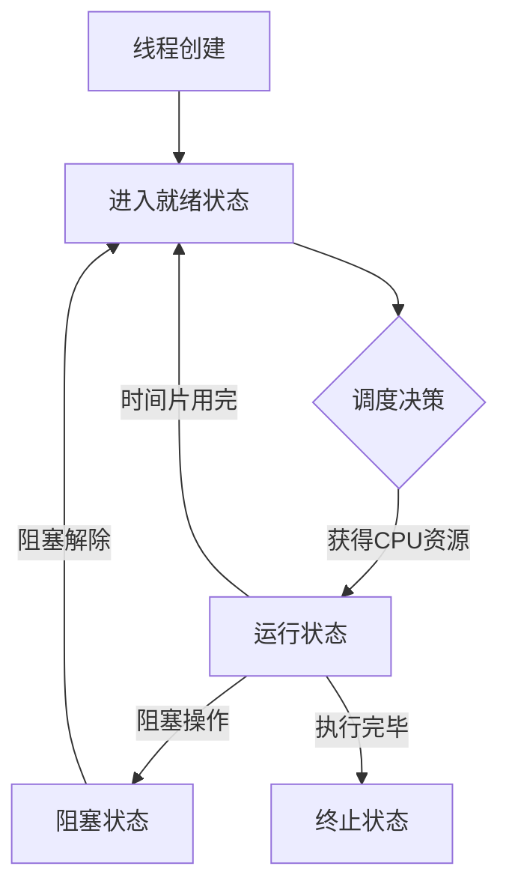

# Java 线程调度

## 什么是线程调度

线程调度是指操作系统如何分配处理器资源给各个线程的过程。在Java多线程编程中，了解线程调度机制对于开发高效的多线程应用至关重要。

线程调度主要回答的问题是：在任何给定时刻，哪个线程应该被执行？如何在多个线程之间切换执行权？

:::note
Java的线程调度由底层操作系统和JVM共同实现，Java程序员可以通过一些API间接影响调度行为。
:::

## Java 线程调度模型

Java线程调度使用的是抢占式调度模型（Preemptive Scheduling），具有以下特点：

1. 线程执行时间由操作系统分配
2. 高优先级线程优先获得CPU资源
3. 即使一个线程没有执行完，也可能被其他线程抢占



## 线程优先级

Java提供了线程优先级机制，允许程序员暗示线程调度器某些线程相对于其他线程的重要性。

Java线程优先级范围从1（最低）到10（最高），默认优先级为5。

```java
// 设置线程优先级
Thread thread = new Thread(runnable);
thread.setPriority(Thread.MAX_PRIORITY); // 设置为最高优先级10
thread.setPriority(Thread.MIN_PRIORITY); // 设置为最低优先级1
thread.setPriority(Thread.NORM_PRIORITY); // 设置为默认优先级5

// 也可以直接设置数值
thread.setPriority(7); // 设置为优先级7
```

:::caution
线程优先级仅仅是给调度器的一个提示，不保证高优先级的线程一定先于低优先级的线程执行。具体行为取决于操作系统的实现。
:::

## 影响线程调度的方法

### yield方法

`Thread.yield()`方法提示调度器当前线程愿意让出CPU使用权，但调度器可以忽略这个提示。

```java
public class YieldExample {
    public static void main(String[] args) {
        Thread thread1 = new Thread(() -> {
            for (int i = 0; i < 5; i++) {
                System.out.println("线程1: " + i);
                if (i == 2) {
                    System.out.println("线程1让出CPU执行权");
                    Thread.yield();
                }
            }
        });
        
        Thread thread2 = new Thread(() -> {
            for (int i = 0; i < 5; i++) {
                System.out.println("线程2: " + i);
            }
        });
        
        thread1.start();
        thread2.start();
    }
}
```

可能的输出：
```
线程1: 0
线程1: 1
线程1: 2
线程1让出CPU执行权
线程2: 0
线程2: 1
线程2: 2
线程2: 3
线程2: 4
线程1: 3
线程1: 4
```

### sleep方法

`Thread.sleep()`方法会使当前线程进入阻塞状态指定的毫秒数，让其他线程有机会执行。

```java
public class SleepExample {
    public static void main(String[] args) {
        Thread thread = new Thread(() -> {
            for (int i = 0; i < 5; i++) {
                System.out.println(i);
                try {
                    Thread.sleep(1000); // 休眠1秒
                } catch (InterruptedException e) {
                    e.printStackTrace();
                }
            }
        });
        
        thread.start();
    }
}
```

输出（每行间隔约1秒）：
```
0
1
2
3
4
```

### join方法

`thread.join()`方法会使调用线程等待被调用线程结束后才继续执行。

```java
public class JoinExample {
    public static void main(String[] args) {
        Thread thread1 = new Thread(() -> {
            for (int i = 0; i < 5; i++) {
                System.out.println("线程1: " + i);
                try {
                    Thread.sleep(500);
                } catch (InterruptedException e) {
                    e.printStackTrace();
                }
            }
        });
        
        Thread thread2 = new Thread(() -> {
            try {
                thread1.join(); // 等待线程1执行完毕
                System.out.println("线程1已结束，线程2开始执行");
                for (int i = 0; i < 3; i++) {
                    System.out.println("线程2: " + i);
                }
            } catch (InterruptedException e) {
                e.printStackTrace();
            }
        });
        
        thread1.start();
        thread2.start();
    }
}
```

输出：
```
线程1: 0
线程1: 1
线程1: 2
线程1: 3
线程1: 4
线程1已结束，线程2开始执行
线程2: 0
线程2: 1
线程2: 2
```

## 时间片轮转调度

在多核处理器环境中，Java线程通常采用时间片轮转的方式进行调度。每个线程被分配一个时间片，当时间片用完或线程主动放弃执行权时，CPU切换到另一个线程。

:::tip
较小的时间片可以提高系统响应性，但会增加线程切换开销；较大的时间片则相反。
:::

## 实际案例：基于优先级的任务调度器

以下是一个简单的基于优先级的任务调度器实现：

```java
import java.util.concurrent.PriorityBlockingQueue;
import java.util.concurrent.atomic.AtomicInteger;

public class PriorityTaskScheduler {
    
    private static class Task implements Comparable<Task>, Runnable {
        private final String name;
        private final int priority;
        private final Runnable runnable;
        private static final AtomicInteger sequencer = new AtomicInteger(0);
        private final int sequence;
        
        public Task(String name, int priority, Runnable runnable) {
            this.name = name;
            this.priority = priority;
            this.runnable = runnable;
            this.sequence = sequencer.getAndIncrement();
        }
        
        @Override
        public int compareTo(Task other) {
            // 优先级高的排在前面
            int result = Integer.compare(other.priority, this.priority);
            if (result == 0) {
                // 优先级相同时，按提交顺序执行
                return Integer.compare(this.sequence, other.sequence);
            }
            return result;
        }
        
        @Override
        public void run() {
            System.out.println("执行任务: " + name + ", 优先级: " + priority);
            runnable.run();
        }
    }
    
    private final PriorityBlockingQueue<Task> taskQueue = new PriorityBlockingQueue<>();
    private final Thread workerThread;
    private volatile boolean running = true;
    
    public PriorityTaskScheduler() {
        workerThread = new Thread(() -> {
            while (running) {
                try {
                    Task task = taskQueue.take();
                    task.run();
                } catch (InterruptedException e) {
                    Thread.currentThread().interrupt();
                    break;
                }
            }
        });
        workerThread.start();
    }
    
    public void submit(String name, int priority, Runnable task) {
        taskQueue.put(new Task(name, priority, task));
    }
    
    public void shutdown() {
        running = false;
        workerThread.interrupt();
    }
    
    public static void main(String[] args) throws InterruptedException {
        PriorityTaskScheduler scheduler = new PriorityTaskScheduler();
        
        // 提交不同优先级的任务
        scheduler.submit("低优先级任务", 1, () -> {
            System.out.println("低优先级任务执行中...");
            try { Thread.sleep(100); } catch (InterruptedException e) {}
        });
        
        scheduler.submit("高优先级任务", 10, () -> {
            System.out.println("高优先级任务执行中...");
            try { Thread.sleep(100); } catch (InterruptedException e) {}
        });
        
        scheduler.submit("中优先级任务", 5, () -> {
            System.out.println("中优先级任务执行中...");
            try { Thread.sleep(100); } catch (InterruptedException e) {}
        });
        
        Thread.sleep(1000);
        scheduler.shutdown();
    }
}
```

输出：
```
执行任务: 高优先级任务, 优先级: 10
高优先级任务执行中...
执行任务: 中优先级任务, 优先级: 5
中优先级任务执行中...
执行任务: 低优先级任务, 优先级: 1
低优先级任务执行中...
```

## 线程调度中的常见问题

1. **饥饿（Starvation）**：低优先级线程因为高优先级线程一直占用资源而得不到执行的机会。

2. **过度让步（Over-yielding）**：过多使用`yield()`可能导致线程切换过于频繁，降低程序性能。

3. **优先级反转（Priority Inversion）**：当低优先级线程持有高优先级线程需要的资源时，可能导致高优先级线程被阻塞。

## 最佳实践

1. **谨慎使用优先级**：不要过度依赖线程优先级，它在不同操作系统上的效果可能不同。

2. **避免频繁调用调度相关方法**：过多调用`yield()`、`sleep()`等可能导致性能问题。

3. **使用线程池**：使用`java.util.concurrent`包中的线程池可以更好地管理线程的创建和调度。

4. **避免长时间阻塞**：线程不应该长时间占用CPU或阻塞，这会影响其他线程的调度。

## 总结

Java线程调度是由JVM和操作系统协作完成的，采用抢占式调度模型。程序员可以通过优先级设置、`yield()`、`sleep()`和`join()`等方法影响线程调度，但不能完全控制线程执行顺序。理解线程调度机制有助于编写高效、可靠的多线程程序。

## 练习

1. 创建两个线程，分别设置为最高和最低优先级，让它们执行相同数量的计算密集型任务，观察实际执行结果。

2. 实现一个简单的周期性任务调度器，能够按指定间隔执行任务。

3. 编写一个程序，演示线程饥饿现象，并尝试解决这个问题。

## 进一步学习资源

- Java官方文档中的Thread类说明
- 《Java并发编程实践》一书
- Java Concurrency in Practice (书籍)
- Java Concurrency Utilities文档