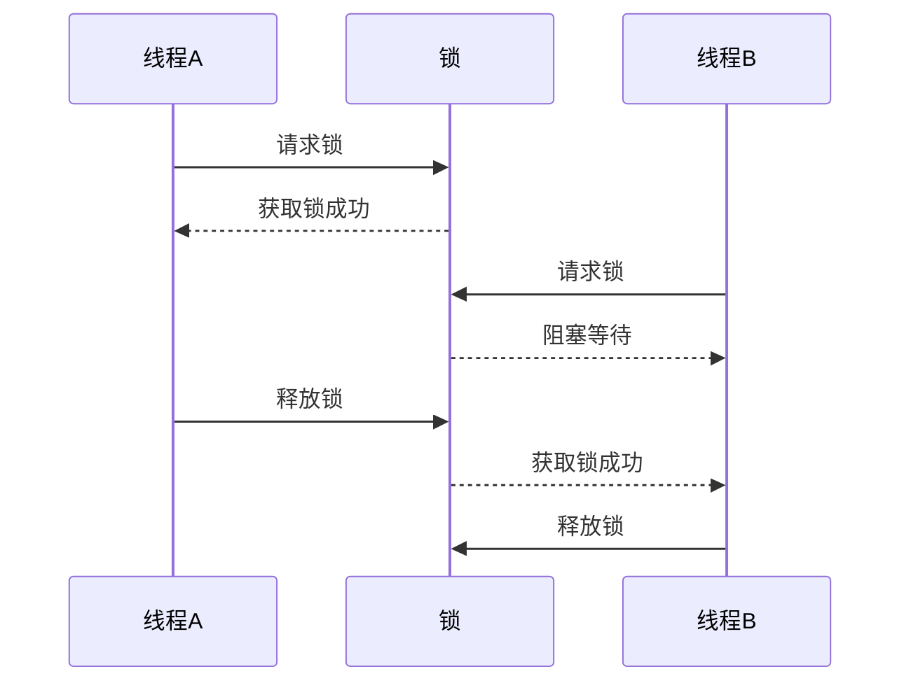

# Java 线程同步

## 什么是线程同步？

在多线程编程中，当多个线程同时访问共享资源（如变量、对象等）时，可能会导致数据不一致或不正确的问题，这称为**线程安全问题**。**线程同步**是一种机制，用于确保在同一时刻只有一个线程能够访问共享资源，从而避免线程安全问题。

:::note
想象一下银行账户的场景：如果多人同时尝试操作同一个账户（取款、存款），没有同步机制可能会导致余额计算错误。线程同步就像是给账户上了一把锁，确保每次只有一个操作可以完成。
:::

## 为什么需要线程同步？

考虑以下没有同步的代码：

```java
public class Counter {
    private int count = 0;
    
    public void increment() {
        count++;  // 这不是一个原子操作
    }
    
    public int getCount() {
        return count;
    }
}
```

如果多个线程同时调用`increment()`方法，由于`count++`不是原子操作（它包含读取、增加和写入三个步骤），可能会导致计数不准确。

例如：
- 线程A和线程B同时读取count值为0
- 线程A将count增加到1并写入
- 线程B也将count增加到1并写入
- 最终结果是1，而不是预期的2

## Java 中的同步机制

### 1. synchronized关键字

`synchronized`是Java中提供的一种内置锁机制，可以应用于方法或代码块。

#### synchronized方法

```java
public class Counter {
    private int count = 0;
    
    public synchronized void increment() {
        count++;
    }
    
    public synchronized int getCount() {
        return count;
    }
}
```

#### synchronized代码块

```java
public class Counter {
    private int count = 0;
    private Object lock = new Object(); // 锁对象
    
    public void increment() {
        synchronized(lock) {
            count++;
        }
    }
    
    public int getCount() {
        synchronized(lock) {
            return count;
        }
    }
}
```

### 2. Lock接口

Java 5引入了`java.util.concurrent.locks`包，提供了更灵活的锁机制。

```java
import java.util.concurrent.locks.Lock;
import java.util.concurrent.locks.ReentrantLock;

public class Counter {
    private int count = 0;
    private final Lock lock = new ReentrantLock();
    
    public void increment() {
        lock.lock();
        try {
            count++;
        } finally {
            lock.unlock();  // 确保锁被释放
        }
    }
    
    public int getCount() {
        lock.lock();
        try {
            return count;
        } finally {
            lock.unlock();
        }
    }
}
```

:::caution
使用Lock接口时，必须在finally块中释放锁，以确保即使发生异常，锁也能正确释放。
:::

## 线程同步的工作原理

线程同步的核心是锁机制。当一个线程获取到锁时，其他尝试获取同一把锁的线程会被阻塞，直到持有锁的线程释放锁。



## 实际案例：银行账户转账

下面是一个演示线程安全问题和同步解决方案的实际案例：

```java
public class BankAccount {
    private double balance;
    private final Object lock = new Object();
    
    public BankAccount(double initialBalance) {
        this.balance = initialBalance;
    }
    
    // 不安全的转账方法
    public void transferUnsafe(BankAccount target, double amount) {
        if (this.balance >= amount) {
            this.balance -= amount;
            target.balance += amount;
            System.out.println("转账成功: " + amount);
        } else {
            System.out.println("余额不足");
        }
    }
    
    // 使用synchronized实现安全转账
    public void transferSafe(BankAccount target, double amount) {
        synchronized(lock) {
            if (this.balance >= amount) {
                // 模拟网络延迟
                try {
                    Thread.sleep(100);
                } catch (InterruptedException e) {
                    e.printStackTrace();
                }
                
                this.balance -= amount;
                target.balance += amount;
                System.out.println("转账成功: " + amount);
            } else {
                System.out.println("余额不足");
            }
        }
    }
    
    public double getBalance() {
        return balance;
    }
}
```

测试代码：

```java
public class BankTransferTest {
    public static void main(String[] args) throws InterruptedException {
        // 测试不安全转账
        testUnsafeTransfer();
        
        // 测试安全转账
        testSafeTransfer();
    }
    
    private static void testUnsafeTransfer() throws InterruptedException {
        final BankAccount account1 = new BankAccount(1000);
        final BankAccount account2 = new BankAccount(1000);
        
        System.out.println("===不安全转账测试===");
        System.out.println("初始余额 - 账户1: " + account1.getBalance() + ", 账户2: " + account2.getBalance());
        
        Thread t1 = new Thread(() -> {
            for (int i = 0; i < 5; i++) {
                account1.transferUnsafe(account2, 100);
            }
        });
        
        Thread t2 = new Thread(() -> {
            for (int i = 0; i < 5; i++) {
                account1.transferUnsafe(account2, 100);
            }
        });
        
        t1.start();
        t2.start();
        
        t1.join();
        t2.join();
        
        System.out.println("最终余额 - 账户1: " + account1.getBalance() + ", 账户2: " + account2.getBalance());
    }
    
    private static void testSafeTransfer() throws InterruptedException {
        final BankAccount account1 = new BankAccount(1000);
        final BankAccount account2 = new BankAccount(1000);
        
        System.out.println("\n===安全转账测试===");
        System.out.println("初始余额 - 账户1: " + account1.getBalance() + ", 账户2: " + account2.getBalance());
        
        Thread t1 = new Thread(() -> {
            for (int i = 0; i < 5; i++) {
                account1.transferSafe(account2, 100);
            }
        });
        
        Thread t2 = new Thread(() -> {
            for (int i = 0; i < 5; i++) {
                account1.transferSafe(account2, 100);
            }
        });
        
        t1.start();
        t2.start();
        
        t1.join();
        t2.join();
        
        System.out.println("最终余额 - 账户1: " + account1.getBalance() + ", 账户2: " + account2.getBalance());
    }
}
```

**可能的输出：**

```
===不安全转账测试===
初始余额 - 账户1: 1000.0, 账户2: 1000.0
转账成功: 100.0
转账成功: 100.0
转账成功: 100.0
转账成功: 100.0
余额不足
转账成功: 100.0
转账成功: 100.0
转账成功: 100.0
余额不足
余额不足
最终余额 - 账户1: 300.0, 账户2: 1700.0

===安全转账测试===
初始余额 - 账户1: 1000.0, 账户2: 1000.0
转账成功: 100.0
转账成功: 100.0
转账成功: 100.0
转账成功: 100.0
转账成功: 100.0
转账成功: 100.0
转账成功: 100.0
转账成功: 100.0
转账成功: 100.0
转账成功: 100.0
最终余额 - 账户1: 0.0, 账户2: 2000.0
```

:::warning
在不安全转账测试中，可能会出现最终转账总额不正确或其他异常情况，这就是线程安全问题的表现。
:::

## 同步的注意事项

1. **性能开销**：同步会导致线程阻塞，过度使用可能导致性能下降。
2. **死锁风险**：当两个或多个线程互相等待对方持有的锁时，会发生死锁。
3. **范围控制**：同步范围应尽可能小，只包含必要的代码。
4. **可重入性**：Java的锁是可重入的，意味着一个线程可以多次获取同一把锁。

## Java 线程同步的其他机制

除了基本的`synchronized`和`Lock`，Java还提供了其他线程同步机制：

### volatile关键字

用于确保变量在多线程环境中的可见性，但不保证操作的原子性。

```java
public class SharedFlag {
    private volatile boolean flag = false;
    
    public void setFlag(boolean value) {
        flag = value;
    }
    
    public boolean isFlag() {
        return flag;
    }
}
```

### 原子类

`java.util.concurrent.atomic`包提供了原子变量类，如`AtomicInteger`、`AtomicLong`等，它们提供原子操作而无需显式同步。

```java
import java.util.concurrent.atomic.AtomicInteger;

public class AtomicCounter {
    private AtomicInteger count = new AtomicInteger(0);
    
    public void increment() {
        count.incrementAndGet();  // 原子操作
    }
    
    public int getCount() {
        return count.get();
    }
}
```

### ThreadLocal

允许每个线程拥有变量的独立副本，避免共享变量带来的同步问题。

```java
public class UserContext {
    private static ThreadLocal<String> userIdContext = new ThreadLocal<>();
    
    public static void setUserId(String userId) {
        userIdContext.set(userId);
    }
    
    public static String getUserId() {
        return userIdContext.get();
    }
    
    public static void clear() {
        userIdContext.remove();  // 防止内存泄漏
    }
}
```

## 总结

线程同步是Java多线程编程中的重要概念，它确保共享资源的安全访问。在本文中，我们介绍了：

1. 线程同步的基本概念和重要性
2. Java中的同步机制：synchronized和Lock
3. 线程同步的工作原理
4. 实际应用案例（银行账户转账）
5. 同步的注意事项
6. 其他线程同步机制：volatile、原子类和ThreadLocal

掌握这些概念和技术对于编写安全、高效的多线程程序至关重要。

## 练习

1. 实现一个简单的线程安全计数器，使用不同的同步机制（synchronized、Lock、AtomicInteger）并比较它们的性能。
2. 编写一个模拟售票系统的程序，多个窗口（线程）同时售票，确保不会售出重复的票或超售。
3. 解决生产者-消费者问题，使用同步机制确保生产者在队列满时等待，消费者在队列空时等待。

## 进一步阅读资源

- 《Java Concurrency in Practice》- Brian Goetz
- Oracle官方文档：[Java并发](https://docs.oracle.com/javase/tutorial/essential/concurrency/)
- Java并发编程实战课程

:::tip
记住，线程同步是一个平衡艺术 - 太少的同步会导致数据不一致，而太多的同步则会导致性能问题和潜在的死锁。始终寻找适合你应用场景的最佳方案。
:::