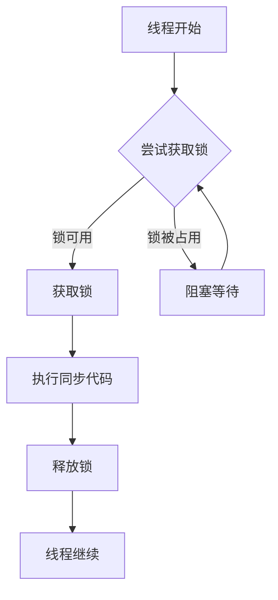

# Java synchronized关键字

在Java多线程编程中，多个线程同时访问和修改共享资源时可能会导致数据不一致的问题。`synchronized`关键字是Java提供的一种内置锁机制，用于控制多线程对共享资源的访问，保证数据的一致性和完整性。

## 什么是线程安全问题？

在多线程环境下，当多个线程同时访问和修改同一个变量时，就可能出现数据不一致的问题，这就是所谓的线程安全问题。

让我们通过一个简单的例子来理解这个问题：

```java
public class Counter {
    private int count = 0;
    
    public void increment() {
        count++;
    }
    
    public int getCount() {
        return count;
    }
    
    public static void main(String[] args) throws InterruptedException {
        Counter counter = new Counter();
        
        // 创建两个线程，每个线程将counter增加10000次
        Thread thread1 = new Thread(() -> {
            for (int i = 0; i < 10000; i++) {
                counter.increment();
            }
        });
        
        Thread thread2 = new Thread(() -> {
            for (int i = 0; i < 10000; i++) {
                counter.increment();
            }
        });
        
        thread1.start();
        thread2.start();
        
        thread1.join();
        thread2.join();
        
        System.out.println("最终计数: " + counter.getCount());
    }
}
```

理论上，最终的计数应该是20000，但实际运行多次后，你会发现结果往往小于20000。这是因为`count++`操作实际上包含三个步骤：
1. 读取当前count值
2. 将count值加1
3. 将新值写回count

当两个线程同时执行这些步骤时，可能会相互干扰，导致某些增量操作丢失。

## synchronized关键字的作用

`synchronized`关键字的主要作用是确保在同一时刻，只有一个线程能够执行被`synchronized`修饰的代码块或方法，从而避免多线程干扰。

:::note
`synchronized`使用的是Java对象的内置锁（或监视器锁），每个Java对象都有一个与之关联的锁。
:::

## synchronized的使用方式

### 1. 同步方法

通过将整个方法声明为`synchronized`，可以确保同一时刻只有一个线程能执行该方法。

```java
public class Counter {
    private int count = 0;
    
    // 同步方法
    public synchronized void increment() {
        count++;
    }
    
    public synchronized int getCount() {
        return count;
    }
    
    public static void main(String[] args) throws InterruptedException {
        Counter counter = new Counter();
        
        Thread thread1 = new Thread(() -> {
            for (int i = 0; i < 10000; i++) {
                counter.increment();
            }
        });
        
        Thread thread2 = new Thread(() -> {
            for (int i = 0; i < 10000; i++) {
                counter.increment();
            }
        });
        
        thread1.start();
        thread2.start();
        
        thread1.join();
        thread2.join();
        
        System.out.println("最终计数: " + counter.getCount()); // 输出: 20000
    }
}
```

### 2. 同步代码块

有时我们不需要同步整个方法，只需要同步关键部分的代码。这时可以使用同步代码块：

```java
public class Counter {
    private int count = 0;
    
    public void increment() {
        // 只同步关键代码块
        synchronized(this) {
            count++;
        }
    }
    
    public int getCount() {
        synchronized(this) {
            return count;
        }
    }
}
```

同步代码块需要指定一个对象作为锁。上面的例子中，我们使用了`this`，即当前对象作为锁。

### 3. 静态同步方法

静态方法属于类而非实例，因此静态同步方法使用的是类锁，而非对象锁：

```java
public class Counter {
    private static int count = 0;
    
    // 静态同步方法使用类锁
    public static synchronized void increment() {
        count++;
    }
    
    public static synchronized int getCount() {
        return count;
    }
}
```

### 4. 使用不同的对象作为锁

有时，我们可能希望使用不同的对象作为锁，以实现更细粒度的同步控制：

```java
public class BankAccount {
    private double balance;
    private final Object balanceLock = new Object(); // 专用于balance的锁
    private String owner;
    private final Object ownerLock = new Object(); // 专用于owner的锁
    
    public void deposit(double amount) {
        synchronized(balanceLock) {
            balance += amount;
        }
    }
    
    public void setOwner(String newOwner) {
        synchronized(ownerLock) {
            owner = newOwner;
        }
    }
    
    // 当需要同时操作两个属性时，可以获取两个锁
    public void transferAccount(String newOwner, double additionalAmount) {
        synchronized(balanceLock) {
            synchronized(ownerLock) {
                owner = newOwner;
                balance += additionalAmount;
            }
        }
    }
}
```

## synchronized的内部原理

当线程进入synchronized代码块或方法时，它会尝试获取锁。如果锁已被其他线程占用，那么该线程将被阻塞，直到锁被释放。



## synchronized的优缺点

### 优点
- 简单易用，是Java内置的同步机制
- 自动释放锁（在同步块结束或抛出异常时）
- 可重入性（同一线程可以多次获取同一把锁）

### 缺点
- 无法中断一个正在等待获取锁的线程
- 无法设置超时时间
- 同步块中的所有操作都是原子的，粒度可能太粗
- 无法知道是否有线程在等待获取锁

:::caution
过度使用`synchronized`可能导致性能问题，特别是在高并发环境下。在Java 5及以后的版本中，可以考虑使用`java.util.concurrent`包中的锁和原子变量，它们提供了更灵活的同步控制。
:::

## 实际应用场景

### 场景一：线程安全的单例模式

```java
public class Singleton {
    private static Singleton instance;
    
    private Singleton() {}
    
    // 使用synchronized确保只创建一个实例
    public static synchronized Singleton getInstance() {
        if (instance == null) {
            instance = new Singleton();
        }
        return instance;
    }
}
```

### 场景二：线程安全的银行账户转账

```java
public class BankAccount {
    private double balance;
    private String accountNumber;
    
    public BankAccount(String accountNumber, double initialBalance) {
        this.accountNumber = accountNumber;
        this.balance = initialBalance;
    }
    
    public synchronized void deposit(double amount) {
        if (amount > 0) {
            balance += amount;
            System.out.println("存款: " + amount + ", 新余额: " + balance);
        }
    }
    
    public synchronized void withdraw(double amount) {
        if (amount > 0 && balance >= amount) {
            balance -= amount;
            System.out.println("取款: " + amount + ", 新余额: " + balance);
        } else {
            System.out.println("余额不足，无法取款");
        }
    }
    
    public synchronized double getBalance() {
        return balance;
    }
    
    // 静态方法用于账户间转账
    public static void transfer(BankAccount from, BankAccount to, double amount) {
        synchronized (from) {
            synchronized (to) {
                if (from.getBalance() >= amount) {
                    from.withdraw(amount);
                    to.deposit(amount);
                    System.out.println("转账成功: 从" + from.accountNumber + "到" + to.accountNumber + ", 金额: " + amount);
                } else {
                    System.out.println("转账失败: 余额不足");
                }
            }
        }
    }
}
```

:::tip
在`transfer`方法中，我们首先获取源账户的锁，然后获取目标账户的锁，这样可以防止死锁的发生。但要注意，如果不同的线程以不同的顺序请求这些锁，仍然可能发生死锁。为了避免这种情况，可以使用一种确定的顺序来请求锁，例如按照账户编号的顺序。
:::

## 总结

`synchronized`关键字是Java中用于线程同步的基本工具，它通过对象锁或类锁来确保同一时刻只有一个线程可以执行同步块或方法，从而保证共享数据的一致性。

主要要点总结：
1. `synchronized`可以用于方法声明或代码块
2. 同步实例方法使用对象锁，静态同步方法使用类锁
3. 可以使用不同的对象作为锁来实现更细粒度的控制
4. `synchronized`是可重入的，同一线程可以多次获取同一把锁
5. 在同步代码块结束或抛出异常时，锁会自动释放

尽管`synchronized`简单易用，但在复杂的并发场景下，可能需要考虑使用`java.util.concurrent`包中提供的更高级的并发工具。

## 练习任务

1. 创建一个线程安全的计数器类，使用`synchronized`关键字确保多线程环境下计数准确。

2. 实现一个简单的银行系统，允许多个线程同时对多个账户进行存款和取款操作，确保账户余额始终正确。

3. 修改单例模式的实现，使用"双重检查锁定"模式来提高性能。

## 进一步学习资源

- Java并发编程实战（Brian Goetz著）
- Java官方文档关于synchronized的说明
- Java内存模型与线程安全相关的博客和文章
- 尝试学习Java并发包中的`Lock`接口和`ReentrantLock`类，了解它们与`synchronized`的区别

随着你对Java多线程编程的深入学习，你将能够更加灵活地应用`synchronized`关键字和其他并发工具，编写高效、安全的多线程程序。