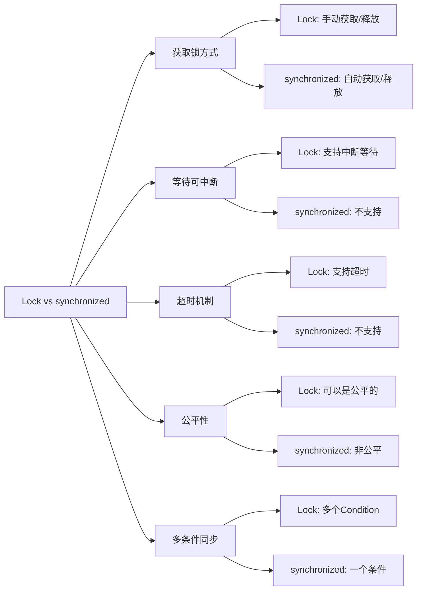

# Java Lock接口

## 引言

在Java多线程编程中，资源的并发访问控制是一个核心问题。Java 5.0之前，我们主要依赖`synchronized`关键字来实现线程同步。而随着Java 5.0引入的`java.util.concurrent.locks`包，提供了更加灵活和强大的锁机制，其核心就是`Lock`接口。

Lock接口提供了比`synchronized`关键字更广泛的锁操作，允许更灵活的结构，可能具有不同的性能特征，并且支持多个相关联的条件对象。

## Lock接口基础

### 什么是Lock接口

`Lock`接口是Java并发包中定义的一个接口，位于`java.util.concurrent.locks`包中。它提供了独占式获取锁与共享式获取锁两种方式，对比`synchronized`关键字，`Lock`接口具有以下特点：

1. 尝试非阻塞地获取锁
2. 能被中断地获取锁
3. 超时获取锁
4. 提供多个条件变量（Condition）

### Lock接口的主要方法

```java
public interface Lock {
    void lock();
    void lockInterruptibly() throws InterruptedException;
    boolean tryLock();
    boolean tryLock(long time, TimeUnit unit) throws InterruptedException;
    void unlock();
    Condition newCondition();
}
```

这些方法各自的功能如下：

- `lock()`: 获取锁，如果锁不可用，则当前线程将被禁用以进行线程调度，并处于休眠状态，直到获取锁。
- `lockInterruptibly()`: 如果当前线程未被中断，则获取锁，可以响应中断。
- `tryLock()`: 仅在调用时锁为空闲状态才获取该锁，立即返回结果。
- `tryLock(long time, TimeUnit unit)`: 如果在给定的等待时间内获得了锁，则返回true。
- `unlock()`: 释放锁。
- `newCondition()`: 返回一个新的Condition实例，用于与此Lock实例一起使用。

## Lock接口的实现类

### ReentrantLock

`ReentrantLock`是`Lock`接口最常用的实现类，它提供了与`synchronized`关键字相同的并发性和内存语义，但具有更高的灵活性。

```java
Lock lock = new ReentrantLock();
```

`ReentrantLock`支持重入，意味着一个线程可以多次获取已经由自己持有的锁。

#### 公平锁与非公平锁

`ReentrantLock`支持公平锁和非公平锁两种模式：

- 公平锁：线程按照请求的顺序获取锁
- 非公平锁：线程可以"插队"获取锁

```java
// 创建一个公平锁
Lock fairLock = new ReentrantLock(true);

// 创建一个非公平锁（默认）
Lock unfairLock = new ReentrantLock(false);
```

### ReadWriteLock

`ReadWriteLock`接口维护了一对锁：读锁和写锁。读锁可以同时被多个线程持有，而写锁是独占的。

```java
ReadWriteLock rwLock = new ReentrantReadWriteLock();
// 获取读锁
Lock readLock = rwLock.readLock();
// 获取写锁
Lock writeLock = rwLock.writeLock();
```

这种机制适用于读多写少的场景，能提高并发性能。

## Lock接口的正确使用

使用`Lock`接口时，必须遵循特定的模式，确保锁在所有情况下都能被释放。

### 基本使用模式

```java
Lock lock = new ReentrantLock();
lock.lock();  // 获取锁
try {
    // 访问共享资源的代码
} finally {
    lock.unlock();  // 确保释放锁
}
```

:::caution
务必在finally块中释放锁，以避免因异常导致锁无法释放的情况，这会导致死锁。
:::

### 使用tryLock避免死锁

```java
Lock lock1 = new ReentrantLock();
Lock lock2 = new ReentrantLock();

boolean getLock1 = false;
boolean getLock2 = false;
try {
    getLock1 = lock1.tryLock();
    if (getLock1) {
        getLock2 = lock2.tryLock();
        if (getLock2) {
            // 使用两个锁的代码
        }
    }
} finally {
    if (getLock2) {
        lock2.unlock();
    }
    if (getLock1) {
        lock1.unlock();
    }
}
```

## Lock与Condition

`Condition`接口提供了类似于`Object`的`wait`、`notify`和`notifyAll`方法，但与特定的`Lock`实现绑定。

### Condition的基本使用

```java
Lock lock = new ReentrantLock();
Condition condition = lock.newCondition();

// 线程1
lock.lock();
try {
    while (!conditionMet) {
        condition.await(); // 释放锁并等待
    }
    // 条件满足，继续执行
} finally {
    lock.unlock();
}

// 线程2
lock.lock();
try {
    changeState(); // 改变状态
    condition.signalAll(); // 通知所有等待的线程
} finally {
    lock.unlock();
}
```

`Condition`还提供了带超时的等待方法，增强了灵活性：

```java
boolean await(long time, TimeUnit unit)
```

## 实际应用场景

### 场景一：自定义线程安全的缓存

下面是一个使用`ReadWriteLock`实现的简单缓存：

```java
public class SimpleCache<K, V> {
    private final Map<K, V> cache = new HashMap<>();
    private final ReadWriteLock rwLock = new ReentrantReadWriteLock();
    private final Lock readLock = rwLock.readLock();
    private final Lock writeLock = rwLock.writeLock();
    
    public V get(K key) {
        readLock.lock();
        try {
            return cache.get(key);
        } finally {
            readLock.unlock();
        }
    }
    
    public void put(K key, V value) {
        writeLock.lock();
        try {
            cache.put(key, value);
        } finally {
            writeLock.unlock();
        }
    }
    
    public V remove(K key) {
        writeLock.lock();
        try {
            return cache.remove(key);
        } finally {
            writeLock.unlock();
        }
    }
    
    public boolean containsKey(K key) {
        readLock.lock();
        try {
            return cache.containsKey(key);
        } finally {
            readLock.unlock();
        }
    }
    
    public int size() {
        readLock.lock();
        try {
            return cache.size();
        } finally {
            readLock.unlock();
        }
    }
}
```

### 场景二：有界缓冲区

使用`Lock`和`Condition`实现一个生产者-消费者模式的有界缓冲区：

```java
public class BoundedBuffer<E> {
    private final E[] items;
    private int putIndex, takeIndex, count;
    
    private final Lock lock = new ReentrantLock();
    private final Condition notFull = lock.newCondition();
    private final Condition notEmpty = lock.newCondition();
    
    @SuppressWarnings("unchecked")
    public BoundedBuffer(int capacity) {
        items = (E[]) new Object[capacity];
    }
    
    public void put(E item) throws InterruptedException {
        lock.lock();
        try {
            while (count == items.length) {
                notFull.await();  // 缓冲区已满，等待
            }
            items[putIndex] = item;
            if (++putIndex == items.length) {
                putIndex = 0;
            }
            count++;
            notEmpty.signal();  // 通知消费者
        } finally {
            lock.unlock();
        }
    }
    
    public E take() throws InterruptedException {
        lock.lock();
        try {
            while (count == 0) {
                notEmpty.await();  // 缓冲区为空，等待
            }
            E item = items[takeIndex];
            items[takeIndex] = null;  // 帮助GC
            if (++takeIndex == items.length) {
                takeIndex = 0;
            }
            count--;
            notFull.signal();  // 通知生产者
            return item;
        } finally {
            lock.unlock();
        }
    }
}
```

### 场景三：显示锁的实战应用

一个转账示例，使用`tryLock`防止死锁：

```java
public class Account {
    private final Lock lock = new ReentrantLock();
    private double balance;
    private final int id;
    
    public Account(int id, double initialBalance) {
        this.id = id;
        this.balance = initialBalance;
    }
    
    public boolean transfer(Account target, double amount) {
        if (this.id < target.id) {
            // 按ID顺序获取锁，避免死锁
            return transferHelper(this, target, amount);
        } else {
            return transferHelper(target, this, -amount);
        }
    }
    
    private static boolean transferHelper(Account first, Account second, double amount) {
        if (first.lock.tryLock()) {
            try {
                if (second.lock.tryLock()) {
                    try {
                        if (amount > 0 && first.balance < amount) {
                            return false; // 余额不足
                        }
                        first.balance -= amount;
                        second.balance += amount;
                        System.out.println("转账成功: " + amount);
                        return true;
                    } finally {
                        second.lock.unlock();
                    }
                }
            } finally {
                first.lock.unlock();
            }
        }
        // 如果无法获取两个锁，则放弃尝试
        return false;
    }
    
    public double getBalance() {
        lock.lock();
        try {
            return balance;
        } finally {
            lock.unlock();
        }
    }
}
```

## Lock与synchronized比较

下面是`Lock`接口与`synchronized`关键字的主要区别：



## 性能考虑

在Java 6之前，`Lock`接口的实现通常比`synchronized`关键字具有更好的性能。但在Java 6及以后的版本中，`synchronized`的性能得到了极大的优化，在很多情况下两者的性能差异已经不是很明显。

选择使用`Lock`还是`synchronized`，应该根据具体需求：
- 如果需要更多的灵活性（如尝试获取锁、可中断获取锁等），选择`Lock`接口
- 如果代码简单，没有特殊需求，则可以使用`synchronized`关键字

## 总结

`Lock`接口提供了Java多线程编程中更加灵活和强大的同步机制：

1. 它允许非阻塞式地获取锁，提高了程序的灵活性
2. 支持可中断的锁获取过程，可以响应中断
3. 支持超时获取锁，避免线程长时间阻塞
4. 提供了条件变量（Condition）机制，实现更精细的线程控制
5. 可以实现公平锁，按照线程请求的顺序分配锁

在实际应用中，`Lock`接口的灵活性使其成为处理复杂并发场景的理想选择。但使用时需要记住手动释放锁，通常应将释放锁的代码放在`finally`块中，确保锁总能被释放。

## 练习

1. 实现一个使用`ReentrantLock`的简单计数器，要求线程安全。
2. 修改上面的计数器，使其支持递增和递减操作，使用两个条件变量确保计数器的值始终在0到指定最大值之间。
3. 实现一个使用`ReadWriteLock`的简单缓存，能够缓存网页内容（URL为键，内容为值）。

## 进一步阅读

1. Java官方文档：[Lock接口](https://docs.oracle.com/javase/8/docs/api/java/util/concurrent/locks/Lock.html)
2. 《Java并发编程实践》- Brian Goetz等
3. 《Java并发编程的艺术》- 方腾飞等

通过本节的学习，你应该已经了解了Java Lock接口的基本概念、使用方式以及与`synchronized`的区别。在实际开发中，根据具体的需求选择合适的同步机制，可以大幅提高程序的性能和可靠性。