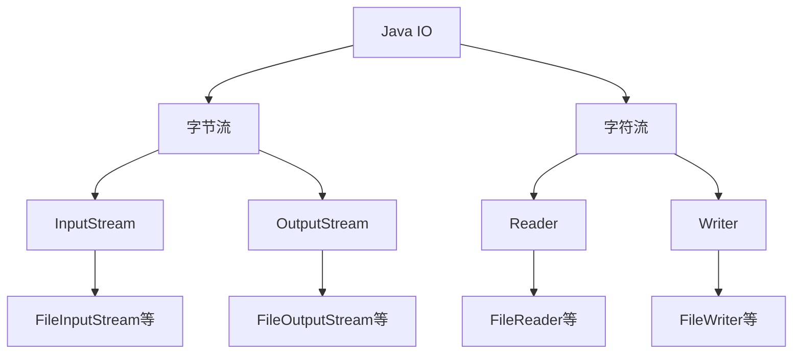
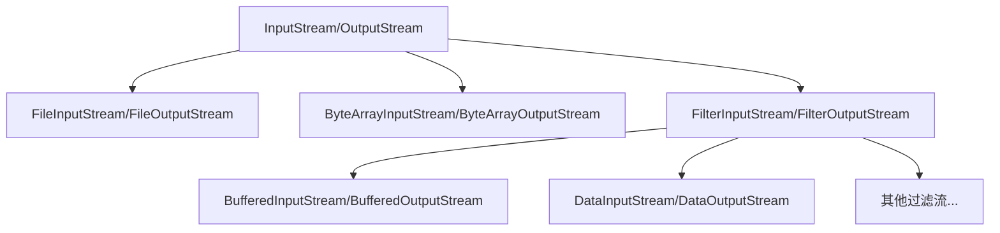

# Java IO概述

在Java编程中，IO（输入/输出）操作是与外部世界交互的基础。无论是读取文件、接收网络数据，还是向用户显示信息，这些都依赖于Java的IO系统。本文将全面介绍Java IO的核心概念，帮助初学者建立坚实的基础。

## 什么是Java IO？

IO（Input/Output）即输入/输出，是指程序与外部世界之间的数据交换。在Java中，IO操作主要通过`java.io`包中的类和接口实现，用于处理各种数据来源和目标之间的数据流动。

:::note
Java IO主要关注的是从程序角度出发的数据流向：
- 输入(Input)：从外部读取数据到程序中
- 输出(Output)：从程序写出数据到外部
:::

## Java IO的基本架构

Java IO系统采用了基于流(Stream)的架构设计：



### 1. 流的概念

在Java IO中，"流"是一个核心概念，代表着数据的序列。就像水流一样，数据从源头流向目的地。

- **字节流**：以字节为单位传输数据，适合处理所有类型的数据（文本、图片、音频等）
- **字符流**：专门用于处理文本数据，内部进行了字符编码转换

## 核心组件

### 1. 字节流基础类

Java IO中有两个抽象基类用于字节处理：

- `InputStream`: 所有输入字节流的父类
- `OutputStream`: 所有输出字节流的父类

### 2. 字符流基础类

为了更好地处理文本数据，Java提供了专门的字符流类：

- `Reader`: 所有输入字符流的父类
- `Writer`: 所有输出字符流的父类

### 3. IO类的层次结构

Java IO使用了装饰器设计模式，允许通过组合不同的流来增强功能：



## 实际使用示例

### 示例1：使用字节流读取文件

下面是使用`FileInputStream`读取文件内容的简单示例：

```java
import java.io.FileInputStream;
import java.io.IOException;

public class FileReadExample {
    public static void main(String[] args) {
        // 声明输入流对象
        FileInputStream fis = null;
        
        try {
            // 创建输入流
            fis = new FileInputStream("example.txt");
            
            // 读取数据
            int data;
            System.out.println("文件内容：");
            while ((data = fis.read()) != -1) {
                // 将字节转为字符输出
                System.out.print((char) data);
            }
        } catch (IOException e) {
            System.out.println("发生IO错误: " + e.getMessage());
        } finally {
            // 确保关闭资源
            if (fis != null) {
                try {
                    fis.close();
                } catch (IOException e) {
                    e.printStackTrace();
                }
            }
        }
    }
}
```

当`example.txt`包含文本"Hello, Java IO!"时，输出将是：

```
文件内容：
Hello, Java IO!
```

### 示例2：使用字符流写入文件

下面是使用`FileWriter`写入文件的示例：

```java
import java.io.FileWriter;
import java.io.IOException;

public class FileWriteExample {
    public static void main(String[] args) {
        // 声明写入流对象
        FileWriter writer = null;
        
        try {
            // 创建写入流，true表示追加模式
            writer = new FileWriter("output.txt", true);
            
            // 写入数据
            writer.write("使用FileWriter写入的文本\n");
            writer.write("Java IO很强大！");
            
            System.out.println("文件写入成功！");
        } catch (IOException e) {
            System.out.println("写入文件时发生错误: " + e.getMessage());
        } finally {
            // 确保关闭资源
            if (writer != null) {
                try {
                    writer.close();
                } catch (IOException e) {
                    e.printStackTrace();
                }
            }
        }
    }
}
```

运行后，`output.txt`文件将包含以下内容：

```
使用FileWriter写入的文本
Java IO很强大！
```

### 示例3：使用缓冲流提高效率

缓冲流可以显著提高IO操作的效率：

```java
import java.io.*;

public class BufferedIOExample {
    public static void main(String[] args) {
        try (
            // 使用try-with-resources自动关闭资源
            BufferedReader reader = new BufferedReader(new FileReader("input.txt"));
            BufferedWriter writer = new BufferedWriter(new FileWriter("buffered_output.txt"))
        ) {
            String line;
            while ((line = reader.readLine()) != null) {
                // readLine()读取一整行文本
                writer.write(line);
                writer.newLine(); // 添加换行符
            }
            System.out.println("文件复制完成！");
        } catch (IOException e) {
            System.out.println("IO操作发生错误: " + e.getMessage());
        }
    }
}
```

:::tip
使用缓冲流可以减少实际的物理读写次数，提高IO性能。在处理大文件时尤为明显。
:::

## 实际应用场景

Java IO在实际开发中有广泛的应用：

### 1. 配置文件处理

许多Java应用需要读取配置文件：

```java
Properties properties = new Properties();
try (FileInputStream fis = new FileInputStream("config.properties")) {
    properties.load(fis);
    String dbUrl = properties.getProperty("database.url");
    String username = properties.getProperty("database.username");
    System.out.println("数据库URL: " + dbUrl);
    System.out.println("用户名: " + username);
} catch (IOException e) {
    e.printStackTrace();
}
```

### 2. 日志记录

应用程序通常需要记录运行日志：

```java
try (FileWriter logWriter = new FileWriter("application.log", true);
     BufferedWriter bufferedWriter = new BufferedWriter(logWriter)) {
    
    bufferedWriter.write(new java.util.Date() + " - 程序启动");
    bufferedWriter.newLine();
    // 执行其他操作...
    bufferedWriter.write(new java.util.Date() + " - 操作完成");
    bufferedWriter.newLine();
    
} catch (IOException e) {
    e.printStackTrace();
}
```

### 3. 文件复制

实现文件复制功能：

```java
public static void copyFile(String sourcePath, String destPath) throws IOException {
    try (
        FileInputStream fis = new FileInputStream(sourcePath);
        BufferedInputStream bis = new BufferedInputStream(fis);
        FileOutputStream fos = new FileOutputStream(destPath);
        BufferedOutputStream bos = new BufferedOutputStream(fos)
    ) {
        byte[] buffer = new byte[4096];
        int bytesRead;
        while ((bytesRead = bis.read(buffer)) != -1) {
            bos.write(buffer, 0, bytesRead);
        }
    }
}
```

## Java 7改进：try-with-resources

Java 7引入了`try-with-resources`语法，简化了资源管理：

```java
// 旧方式
FileInputStream fis = null;
try {
    fis = new FileInputStream("file.txt");
    // 使用fis
} catch (IOException e) {
    e.printStackTrace();
} finally {
    if (fis != null) {
        try {
            fis.close();
        } catch (IOException e) {
            e.printStackTrace();
        }
    }
}

// Java 7及以后的方式
try (FileInputStream fis = new FileInputStream("file.txt")) {
    // 使用fis
    // 代码块结束时自动关闭资源
} catch (IOException e) {
    e.printStackTrace();
}
```

:::caution
使用Java IO时，始终记得关闭已打开的资源，以避免资源泄漏。最好使用try-with-resources语法。
:::

## 总结

Java IO系统提供了强大而灵活的方式来处理数据输入和输出：

1. **基于流的架构**：Java IO采用流模型，数据像水流一样从源头流向目的地
2. **两大类流**：字节流适用于所有类型数据，字符流专门处理文本数据
3. **装饰器模式**：可通过组合不同流来增强功能
4. **资源管理**：正确关闭资源对避免内存泄漏至关重要

掌握Java IO是成为一名熟练Java开发者的基础技能。随着你的学习深入，还可以探索Java NIO（New IO）和Java NIO.2，它们提供了更现代化的IO处理方式。

## 练习建议

1. 创建一个程序，读取文本文件并计算其中的字符数、单词数和行数
2. 实现一个简单的文件复制工具，支持复制不同类型的文件
3. 编写一个程序，将用户输入保存到文本文件中
4. 尝试使用字符流和字节流分别读取同一个文本文件，对比它们的区别

## 进一步学习资源

- Java官方文档中的IO部分
- 《Thinking in Java》书中关于IO的章节
- Java NIO和文件操作的进阶知识
- Java序列化和对象流

通过持续练习和应用，你将能够熟练掌握Java IO，为更复杂的Java应用开发打下坚实基础。