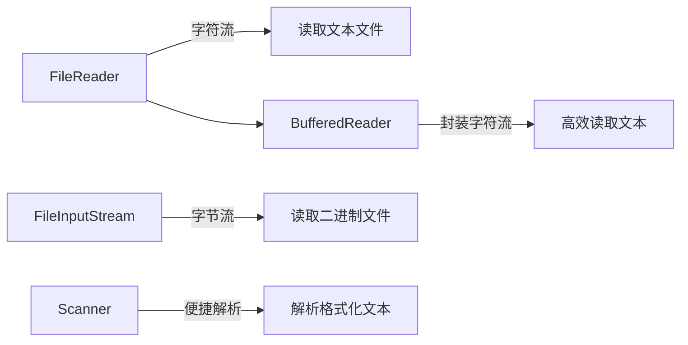

# Java FileReader

## 什么是FileReader？

FileReader是Java IO包中的一个字符输入流类，专门用于读取字符文件。它是InputStreamReader的子类，是以字符为单位读取文件内容的便捷类。与以字节为单位读取的FileInputStream不同，FileReader能够正确处理字符编码，特别适合处理文本文件。

:::tip 核心要点
FileReader是面向字符的输入流，主要用于读取文本文件，自动处理字符编码转换。
:::

## FileReader的基本特性

1. **字符流** - FileReader是Reader抽象类的子类，以字符而非字节为单位处理数据
2. **默认编码** - 使用平台默认的字符编码
3. **文本文件** - 专为读取文本文件而设计，不适合处理二进制文件
4. **缓冲区处理** - 通常与BufferedReader配合使用以提高读取效率

## 如何使用FileReader

### 创建FileReader对象

创建FileReader对象有几种不同的方式，可以通过文件路径字符串、File对象或FileDescriptor对象来初始化：

```java
// 使用文件路径创建
FileReader reader1 = new FileReader("data.txt");

// 使用File对象创建
File file = new File("data.txt");
FileReader reader2 = new FileReader(file);

// 使用FileDescriptor创建
FileDescriptor fd = new FileInputStream("data.txt").getFD();
FileReader reader3 = new FileReader(fd);
```

### FileReader的主要方法

FileReader继承自InputStreamReader和Reader类，主要提供以下方法：

| 方法 | 描述 |
|------|------|
| `int read()` | 读取单个字符，返回字符的ASCII值，到达文件末尾返回-1 |
| `int read(char[] cbuf)` | 将字符读入数组，返回读取的字符数 |
| `int read(char[] cbuf, int offset, int length)` | 将字符读入数组的指定部分 |
| `void close()` | 关闭流并释放资源 |

## 基本使用示例

### 读取单个字符

下面是一个读取文本文件中所有字符的简单示例：

```java
import java.io.FileReader;
import java.io.IOException;

public class FileReaderDemo {
    public static void main(String[] args) {
        try (FileReader reader = new FileReader("sample.txt")) {
            int character;
            System.out.println("文件内容:");
            // 逐个读取字符，直到文件末尾
            while ((character = reader.read()) != -1) {
                System.out.print((char) character);
            }
        } catch (IOException e) {
            System.err.println("读取文件时发生错误: " + e.getMessage());
        }
    }
}
```

假设sample.txt文件内容为：
```
Hello,
This is a sample text file.
Welcome to Java IO!
```

输出结果：
```
文件内容:
Hello,
This is a sample text file.
Welcome to Java IO!
```

### 使用字符数组读取

使用字符数组可以提高读取效率：

```java
import java.io.FileReader;
import java.io.IOException;

public class FileReaderArrayDemo {
    public static void main(String[] args) {
        try (FileReader reader = new FileReader("sample.txt")) {
            char[] buffer = new char[1024]; // 创建1024个字符的缓冲区
            int charsRead;
            
            System.out.println("文件内容:");
            // 批量读取字符到缓冲区
            while ((charsRead = reader.read(buffer)) != -1) {
                // 输出实际读取的字符
                System.out.print(new String(buffer, 0, charsRead));
            }
        } catch (IOException e) {
            System.err.println("读取文件时发生错误: " + e.getMessage());
        }
    }
}
```

## 与BufferedReader结合使用

在实际应用中，通常将FileReader与BufferedReader结合使用，以提高性能并简化按行读取的操作：

```java
import java.io.BufferedReader;
import java.io.FileReader;
import java.io.IOException;

public class BufferedFileReaderDemo {
    public static void main(String[] args) {
        try (BufferedReader reader = new BufferedReader(new FileReader("sample.txt"))) {
            String line;
            int lineNumber = 1;
            
            System.out.println("文件内容 (按行):");
            // 逐行读取文件内容
            while ((line = reader.readLine()) != null) {
                System.out.println("第" + lineNumber + "行: " + line);
                lineNumber++;
            }
        } catch (IOException e) {
            System.err.println("读取文件时发生错误: " + e.getMessage());
        }
    }
}
```

输出结果：
```
文件内容 (按行):
第1行: Hello,
第2行: This is a sample text file.
第3行: Welcome to Java IO!
```

## 异常处理

使用FileReader时可能会遇到以下异常：

1. **FileNotFoundException** - 当指定的文件不存在时抛出
2. **IOException** - 读取操作失败时抛出

建议使用try-with-resources语句自动关闭资源：

```java
try (FileReader reader = new FileReader("sample.txt")) {
    // 使用reader进行读取操作
} catch (FileNotFoundException e) {
    System.err.println("找不到指定的文件: " + e.getMessage());
} catch (IOException e) {
    System.err.println("读取文件时发生错误: " + e.getMessage());
}
```

## 性能考虑

虽然FileReader使用起来很方便，但它有一些性能限制：

1. **默认编码限制** - FileReader使用平台默认的字符编码，不能指定特定的编码格式
2. **读取效率** - 单字符读取效率较低，建议使用字符数组或与BufferedReader结合
3. **大文件处理** - 处理大型文件时可能效率不高

:::note 编码问题
如果需要指定特定的字符编码（如UTF-8），应该使用InputStreamReader代替：
```java
Reader reader = new InputStreamReader(new FileInputStream("file.txt"), "UTF-8");
```
:::

## 实际应用场景

### 场景1：配置文件读取

```java
import java.io.BufferedReader;
import java.io.FileReader;
import java.io.IOException;
import java.util.HashMap;
import java.util.Map;

public class ConfigReader {
    public static Map<String, String> readConfig(String filePath) {
        Map<String, String> config = new HashMap<>();
        
        try (BufferedReader reader = new BufferedReader(new FileReader(filePath))) {
            String line;
            while ((line = reader.readLine()) != null) {
                // 跳过注释行和空行
                if (line.trim().isEmpty() || line.trim().startsWith("#")) {
                    continue;
                }
                
                // 解析key=value格式
                int separatorPos = line.indexOf('=');
                if (separatorPos > 0) {
                    String key = line.substring(0, separatorPos).trim();
                    String value = line.substring(separatorPos + 1).trim();
                    config.put(key, value);
                }
            }
        } catch (IOException e) {
            System.err.println("读取配置文件失败: " + e.getMessage());
        }
        
        return config;
    }
    
    public static void main(String[] args) {
        Map<String, String> appConfig = readConfig("app.properties");
        System.out.println("应用配置:");
        for (Map.Entry<String, String> entry : appConfig.entrySet()) {
            System.out.println(entry.getKey() + " = " + entry.getValue());
        }
    }
}
```

### 场景2：日志文件分析

```java
import java.io.BufferedReader;
import java.io.FileReader;
import java.io.IOException;
import java.util.ArrayList;
import java.util.List;
import java.util.regex.Matcher;
import java.util.regex.Pattern;

public class LogAnalyzer {
    public static List<String> findErrors(String logFile) {
        List<String> errors = new ArrayList<>();
        Pattern errorPattern = Pattern.compile(".*ERROR.*");
        
        try (BufferedReader reader = new BufferedReader(new FileReader(logFile))) {
            String line;
            while ((line = reader.readLine()) != null) {
                Matcher matcher = errorPattern.matcher(line);
                if (matcher.matches()) {
                    errors.add(line);
                }
            }
        } catch (IOException e) {
            System.err.println("分析日志文件失败: " + e.getMessage());
        }
        
        return errors;
    }
    
    public static void main(String[] args) {
        List<String> errorLogs = findErrors("application.log");
        System.out.println("发现 " + errorLogs.size() + " 条错误:");
        for (String error : errorLogs) {
            System.out.println(error);
        }
    }
}
```

## FileReader与其他读取类的比较

让我们来比较几种常见的文件读取方式：



| 类名 | 类型 | 适用场景 | 编码处理 | 性能 |
|------|------|----------|----------|------|
| FileReader | 字符流 | 简单文本文件读取 | 平台默认编码 | 中等 |
| FileInputStream | 字节流 | 二进制文件读取 | 不处理编码 | 较高 |
| BufferedReader | 包装字符流 | 高效文本文件读取 | 依赖底层流 | 高 |
| InputStreamReader | 转换流 | 指定编码的文本读取 | 自定义编码 | 中等 |

## 总结

FileReader是Java中处理文本文件输入的基础类，它具有以下特点：

1. 专门用于读取字符型文件内容
2. 以字符为单位读取，而非字节
3. 使用平台默认的字符编码处理文本
4. 通常与BufferedReader结合使用以提高性能

虽然FileReader操作简单直观，但在处理编码问题和大文件时存在局限性。在实际开发中，当需要指定编码格式时，应考虑使用InputStreamReader；当处理大量文本或按行处理时，应配合BufferedReader使用。

## 练习任务

1. 创建一个程序，使用FileReader读取一个文本文件并计算其中的字符数、单词数和行数。
2. 编写一个方法，使用FileReader读取一个CSV文件并将其解析为对象列表。
3. 实现一个简单的文本文件搜索工具，能够在文件中查找指定的关键词并显示包含该关键词的行。
4. 比较使用FileReader直接读取和使用BufferedReader读取的性能差异。

## 扩展阅读

- Java官方文档: [FileReader](https://docs.oracle.com/en/java/javase/11/docs/api/java.base/java/io/FileReader.html)
- Reader类层次结构及其他字符输入流类
- Java中的编码处理与国际化支持
- 高效文件IO处理技巧

通过掌握FileReader，你已经具备了处理文本文件的基本能力，这是Java IO操作的重要基础。随着学习的深入，你将能够处理更复杂的文件操作和数据流处理任务。