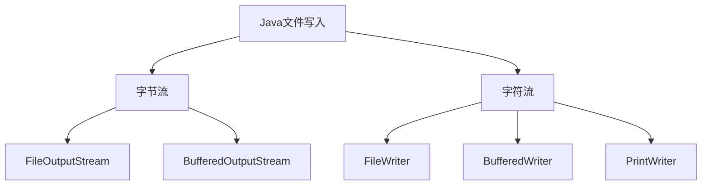

# Java FileWriter

## 简介

`FileWriter` 是 Java IO 包中的一个类，用于将字符数据写入文件。它是 `OutputStreamWriter` 的子类，专门设计用于文件操作。`FileWriter` 是字符流，这意味着它主要用于写入文本数据而非二进制数据。

相比于字节流（如 `FileOutputStream`），`FileWriter` 在处理文本时更为方便，因为它可以直接写入字符，而不需要手动进行字节转换。

## FileWriter 的基本使用

### 创建 FileWriter 对象

在 Java 中，创建 `FileWriter` 对象有几种常见方式：

```java
// 方式1：创建新文件或覆盖已有文件
FileWriter writer = new FileWriter("example.txt");

// 方式2：追加模式（不覆盖原有内容）
FileWriter writer = new FileWriter("example.txt", true);

// 方式3：使用 File 对象
File file = new File("example.txt");
FileWriter writer = new FileWriter(file);

// 方式4：使用 File 对象并指定追加模式
File file = new File("example.txt");
FileWriter writer = new FileWriter(file, true);
```

:::note
创建 `FileWriter` 时，如果指定的文件不存在，则会自动创建新文件。如果文件已存在，默认会覆盖原有内容，除非指定追加模式（通过第二个参数传入 `true`）。
:::

### 写入数据

`FileWriter` 提供了多种将数据写入文件的方法：

```java
public class FileWriterDemo {
    public static void main(String[] args) {
        try (FileWriter writer = new FileWriter("output.txt")) {
            // 写入单个字符
            writer.write('J');
            
            // 写入字符串
            writer.write("ava FileWriter 示例");
            
            // 写入字符串的一部分（起始索引2，长度3）
            writer.write("Hello", 2, 3);
            
            // 写入字符数组
            char[] chars = {'A', 'B', 'C'};
            writer.write(chars);
            
            // 写入字符数组的一部分
            writer.write(chars, 1, 2);
            
            // 添加换行符（视操作系统而定）
            writer.write(System.lineSeparator());
            writer.write("写入完成！");
            
        } catch (IOException e) {
            e.printStackTrace();
        }
    }
}
```

文件 `output.txt` 内容将为：
```
Java FileWriter 示例lloABCBC
写入完成！
```

### 关闭 FileWriter

使用完 `FileWriter` 后必须关闭它，以释放系统资源并确保数据被完全写入文件。有两种方式可以关闭：

1. 手动关闭：

```java
FileWriter writer = null;
try {
    writer = new FileWriter("test.txt");
    writer.write("测试内容");
} catch (IOException e) {
    e.printStackTrace();
} finally {
    try {
        if (writer != null) {
            writer.close();
        }
    } catch (IOException e) {
        e.printStackTrace();
    }
}
```

2. 使用 try-with-resources 语句（Java 7 及以上）：

```java
try (FileWriter writer = new FileWriter("test.txt")) {
    writer.write("测试内容");
} catch (IOException e) {
    e.printStackTrace();
}
```

:::tip
推荐使用 try-with-resources 语句，它会自动关闭资源，代码更简洁，且更不容易出错。
:::

## 缓冲区与刷新

`FileWriter` 内部使用缓冲区来提高写入效率。写入操作首先将数据放入缓冲区，当缓冲区满时，才会实际写入文件。这意味着，如果缓冲区未满，数据可能不会立即写入文件。

为了确保数据及时写入文件，可以使用 `flush()` 方法手动刷新缓冲区：

```java
try (FileWriter writer = new FileWriter("log.txt")) {
    writer.write("重要日志信息");
    writer.flush();  // 立即将缓冲区内容写入文件
    
    // 执行其他操作...
    
    writer.write("更多日志信息");
} catch (IOException e) {
    e.printStackTrace();
}
```

:::caution
调用 `close()` 方法会自动刷新缓冲区，但在某些情况下（如需要确保数据立即写入文件但又不想关闭流），您可能需要手动调用 `flush()`。
:::

## FileWriter 的实际应用

### 案例1：创建简单的日志记录器

```java
public class SimpleLogger {
    private FileWriter logWriter;
    
    public SimpleLogger(String logFilePath) throws IOException {
        // 使用追加模式，确保日志不会被覆盖
        this.logWriter = new FileWriter(logFilePath, true);
    }
    
    public void log(String message) throws IOException {
        // 添加时间戳
        String timestamp = new java.util.Date().toString();
        logWriter.write("[" + timestamp + "] " + message + System.lineSeparator());
        // 立即刷新，确保日志即时写入
        logWriter.flush();
    }
    
    public void close() throws IOException {
        if (logWriter != null) {
            logWriter.close();
        }
    }
    
    public static void main(String[] args) {
        try (SimpleLogger logger = new SimpleLogger("application.log")) {
            logger.log("应用程序启动");
            // 模拟一些操作
            Thread.sleep(2000);
            logger.log("用户登录成功");
            Thread.sleep(1500);
            logger.log("数据保存完成");
            logger.log("应用程序退出");
        } catch (IOException | InterruptedException e) {
            e.printStackTrace();
        }
    }
}
```

### 案例2：将数据导出为 CSV 文件

```java
public class CsvExporter {
    
    public static void exportToCSV(List<String[]> data, String filePath) throws IOException {
        try (FileWriter writer = new FileWriter(filePath)) {
            for (String[] row : data) {
                StringBuilder line = new StringBuilder();
                
                for (int i = 0; i < row.length; i++) {
                    // 处理CSV特殊字符：如果内容包含逗号或引号，需要用引号包围
                    String cell = row[i];
                    if (cell.contains(",") || cell.contains("\"") || cell.contains("\n")) {
                        cell = "\"" + cell.replace("\"", "\"\"") + "\"";
                    }
                    
                    line.append(cell);
                    
                    // 如果不是最后一个单元格，添加逗号
                    if (i < row.length - 1) {
                        line.append(",");
                    }
                }
                
                // 添加换行符
                writer.write(line.toString() + System.lineSeparator());
            }
        }
    }
    
    public static void main(String[] args) {
        List<String[]> employees = new ArrayList<>();
        employees.add(new String[]{"姓名", "年龄", "职位"});
        employees.add(new String[]{"张三", "28", "软件工程师"});
        employees.add(new String[]{"李四", "35", "项目经理"});
        employees.add(new String[]{"王五", "24", "UI设计师"});
        
        try {
            exportToCSV(employees, "employees.csv");
            System.out.println("CSV文件导出成功！");
        } catch (IOException e) {
            e.printStackTrace();
        }
    }
}
```

## FileWriter 与其他写入类的比较

为了帮助初学者选择合适的文件写入方式，下面比较一些常用的 Java 文件写入类：



| 类名 | 类型 | 特点 | 适用场景 |
|------|------|------|----------|
| FileWriter | 字符流 | 直接写入字符，简单易用 | 简单的文本文件写入 |
| BufferedWriter | 字符流 | 带缓冲区，提供readLine()方法 | 高效的文本处理，需要按行写入 |
| PrintWriter | 字符流 | 提供print/println等便捷方法 | 格式化输出，异常处理更灵活 |
| FileOutputStream | 字节流 | 按字节写入，可处理任何类型文件 | 二进制文件，非文本数据 |
| BufferedOutputStream | 字节流 | 带缓冲区的字节流，提高效率 | 大量二进制数据写入 |

## FileWriter 的常见问题与解决方案

### 问题1：字符编码问题

`FileWriter` 使用平台默认的字符编码，这可能导致在不同系统间出现乱码问题。解决方法是使用 `OutputStreamWriter` 和 `FileOutputStream` 组合，并指定编码：

```java
try (Writer writer = new OutputStreamWriter(
        new FileOutputStream("text.txt"), StandardCharsets.UTF_8)) {
    writer.write("使用UTF-8编码写入中文内容");
}
```

### 问题2：性能问题

对于需要频繁写入的场景，`FileWriter` 的性能可能不够理想。解决方法是使用 `BufferedWriter` 包装 `FileWriter`：

```java
try (BufferedWriter writer = new BufferedWriter(new FileWriter("output.txt"))) {
    for (int i = 0; i < 10000; i++) {
        writer.write("这是第 " + i + " 行内容");
        writer.newLine();  // 添加换行符
    }
}
```

### 问题3：异常处理

当文件写入失败时（例如磁盘已满或权限问题），`FileWriter` 会抛出 `IOException`。确保在 catch 块中妥善处理这些异常：

```java
try (FileWriter writer = new FileWriter("config.txt")) {
    writer.write("配置数据");
} catch (IOException e) {
    System.err.println("文件写入失败：" + e.getMessage());
    // 根据应用需求决定如何处理错误，如重试、使用备用存储或通知用户
}
```

## 总结

`FileWriter` 是 Java 中用于文件文本写入的基础类，它提供了一种简单直接的方式来将字符数据写入文件。主要特点包括：

1. 专为文本（字符）数据设计，不适合处理二进制文件
2. 可以创建新文件或追加到现有文件
3. 使用缓冲区提高写入效率，并可通过 `flush()` 强制写入
4. 需要正确关闭以释放资源
5. 默认使用系统编码，可能导致跨平台问题

对于更高级的需求，可以考虑使用 `BufferedWriter` 提高性能，或使用 `OutputStreamWriter` 指定特定的字符编码。

## 练习题

1. 编写一个程序，创建一个文本文件并写入当前日期和时间。
2. 编写一个方法，接受一个 `List<String>` 参数并将其内容一行一行地写入文件。
3. 创建一个简单的文本编辑器，允许用户输入文本并保存到文件中。
4. 扩展上面的日志记录器示例，添加不同的日志级别（如 INFO、WARNING、ERROR）。
5. 编写一个程序，将一个对象数组序列化为 JSON 格式并写入文件（可以使用 JSON 库或手动构造 JSON 字符串）。

## 进一步学习资源

- Oracle 官方文档：[FileWriter](https://docs.oracle.com/en/java/javase/17/docs/api/java.base/java/io/FileWriter.html)
- Java IO 流的其他类，如 `BufferedWriter`、`PrintWriter` 等
- 字符编码概念和 `Charset` 类
- Java NIO 包中的文件处理类，如 `Files` 和 `Path`

通过掌握 `FileWriter` 的使用，您已经迈出了学习 Java 文件 IO 操作的重要一步。随着经验的积累，您将能够处理更复杂的文件操作需求。