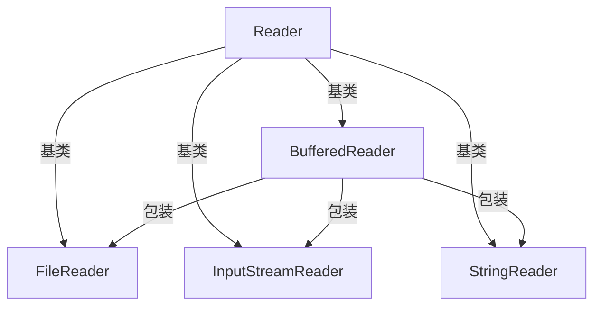

# Java BufferedReader

## 什么是 BufferedReader？

BufferedReader 是 Java IO 包中的一个重要类，它为字符输入流添加了缓冲功能，显著提高了读取操作的效率。当我们需要从文件或其他输入源读取文本数据时，BufferedReader 是一个理想的选择。

:::tip
BufferedReader 通过减少对底层系统的调用次数来提高效率，它在内部维护一个字符缓冲区，一次性读取多个字符，而不是每次请求都进行系统调用。
:::

## BufferedReader 的基本特性

- 提供了高效的字符读取功能
- 支持按行读取文本
- 内部维护缓冲区以减少 I/O 操作
- 可以包装任何 Reader 对象以增强其性能
- 支持标记和重置操作

## BufferedReader 的创建

要使用 BufferedReader，我们首先需要创建一个实例。通常，我们会将其他 Reader 对象包装在 BufferedReader 中，如下所示：

```java
// 从文件创建 BufferedReader
BufferedReader reader = new BufferedReader(new FileReader("example.txt"));

// 从字符串创建 BufferedReader
String data = "Hello, BufferedReader!";
BufferedReader stringReader = new BufferedReader(new StringReader(data));

// 从控制台输入创建 BufferedReader
BufferedReader consoleReader = new BufferedReader(new InputStreamReader(System.in));
```

## BufferedReader 的核心方法

### 读取单个字符

```java
public int read() throws IOException
```

此方法从输入流中读取单个字符，并返回其 ASCII 值。如果到达流的末尾，则返回 -1。

```java
BufferedReader reader = new BufferedReader(new StringReader("ABC"));
int character;
while ((character = reader.read()) != -1) {
    System.out.println("读取的字符: " + (char)character);
}
reader.close();
```

输出结果：
```
读取的字符: A
读取的字符: B
读取的字符: C
```

### 读取字符数组

```java
public int read(char[] cbuf, int off, int len) throws IOException
```

此方法将字符读入数组的指定部分。参数 `cbuf` 是目标数组，`off` 是数组中开始存储字符的偏移量，`len` 是要读取的最大字符数。

```java
BufferedReader reader = new BufferedReader(new StringReader("Java BufferedReader Example"));
char[] buffer = new char[10];
int charsRead = reader.read(buffer, 0, 10);
System.out.println("读取的字符数: " + charsRead);
System.out.println("读取的内容: " + new String(buffer));
reader.close();
```

输出结果：
```
读取的字符数: 10
读取的内容: Java Buffe
```

### 按行读取文本

```java
public String readLine() throws IOException
```

此方法读取一行文本。读取到行结束符（`\n`、`\r` 或 `\r\n`）时，结束读取，并返回该行文本（不包括行结束符）。如果到达流的末尾，则返回 `null`。

```java
BufferedReader reader = new BufferedReader(new StringReader("第一行\n第二行\n第三行"));
String line;
while ((line = reader.readLine()) != null) {
    System.out.println("读取的行: " + line);
}
reader.close();
```

输出结果：
```
读取的行: 第一行
读取的行: 第二行
读取的行: 第三行
```

### 跳过字符

```java
public long skip(long n) throws IOException
```

此方法跳过输入流中的 `n` 个字符，并返回实际跳过的字符数。

```java
BufferedReader reader = new BufferedReader(new StringReader("ABCDEFGHIJ"));
reader.skip(3); // 跳过前3个字符
int character = reader.read();
System.out.println("跳过3个字符后读取的字符: " + (char)character);
reader.close();
```

输出结果：
```
跳过3个字符后读取的字符: D
```

### 关闭流

```java
public void close() throws IOException
```

此方法关闭输入流并释放与之关联的系统资源。

```java
BufferedReader reader = null;
try {
    reader = new BufferedReader(new FileReader("example.txt"));
    // 执行读取操作
} catch (IOException e) {
    e.printStackTrace();
} finally {
    if (reader != null) {
        try {
            reader.close();
        } catch (IOException e) {
            e.printStackTrace();
        }
    }
}
```

## 使用 try-with-resources 简化资源管理

在 Java 7 及更高版本中，我们可以使用 try-with-resources 语句自动管理资源，确保资源在使用后被正确关闭：

```java
try (BufferedReader reader = new BufferedReader(new FileReader("example.txt"))) {
    String line;
    while ((line = reader.readLine()) != null) {
        System.out.println(line);
    }
} catch (IOException e) {
    e.printStackTrace();
}
```

:::caution
使用 BufferedReader 时，始终记得关闭它，以释放系统资源。最好使用 try-with-resources 语句，让 Java 自动处理资源的关闭。
:::

## 缓冲区大小

BufferedReader 的构造函数允许我们指定缓冲区大小：

```java
public BufferedReader(Reader in, int sz)
```

其中 `in` 是要包装的 Reader 对象，`sz` 是缓冲区的大小（以字符为单位）。如果不指定缓冲区大小，默认为 8192 字符。

```java
// 创建一个具有自定义缓冲区大小的 BufferedReader
BufferedReader reader = new BufferedReader(new FileReader("example.txt"), 16384);
```

## 实际应用场景

### 场景一：读取配置文件

```java
public class ConfigReader {
    public static Properties loadConfig(String filePath) {
        Properties properties = new Properties();
        
        try (BufferedReader reader = new BufferedReader(new FileReader(filePath))) {
            properties.load(reader);
        } catch (IOException e) {
            System.err.println("读取配置文件失败: " + e.getMessage());
        }
        
        return properties;
    }
    
    public static void main(String[] args) {
        Properties config = loadConfig("config.properties");
        System.out.println("数据库URL: " + config.getProperty("db.url"));
        System.out.println("数据库用户名: " + config.getProperty("db.username"));
    }
}
```

### 场景二：处理CSV文件

```java
public class CSVParser {
    public static List<String[]> parseCSV(String filePath) throws IOException {
        List<String[]> data = new ArrayList<>();
        
        try (BufferedReader reader = new BufferedReader(new FileReader(filePath))) {
            String line;
            while ((line = reader.readLine()) != null) {
                String[] values = line.split(",");
                data.add(values);
            }
        }
        
        return data;
    }
    
    public static void main(String[] args) {
        try {
            List<String[]> csvData = parseCSV("data.csv");
            for (String[] row : csvData) {
                System.out.println(Arrays.toString(row));
            }
        } catch (IOException e) {
            e.printStackTrace();
        }
    }
}
```

### 场景三：读取网络响应

```java
public class WebPageReader {
    public static String readWebPage(String urlString) throws IOException {
        StringBuilder content = new StringBuilder();
        URL url = new URL(urlString);
        URLConnection connection = url.openConnection();
        
        try (BufferedReader reader = new BufferedReader(new InputStreamReader(connection.getInputStream()))) {
            String line;
            while ((line = reader.readLine()) != null) {
                content.append(line).append("\n");
            }
        }
        
        return content.toString();
    }
    
    public static void main(String[] args) {
        try {
            String webContent = readWebPage("https://www.example.com");
            System.out.println("网页内容: " + webContent.substring(0, 200) + "...");
        } catch (IOException e) {
            e.printStackTrace();
        }
    }
}
```

## BufferedReader 与其他读取类的比较

下面是 BufferedReader 与其他常用读取类的比较：



| 类名 | 特点 | 使用场景 |
|------|------|----------|
| BufferedReader | 带缓冲、可按行读取 | 高效读取文本文件、处理大文件 |
| FileReader | 直接从文件读取字符 | 简单小文件读取 |
| InputStreamReader | 字节流转字符流 | 处理不同编码的输入 |
| Scanner | 解析格式化输入 | 处理格式化文本和用户输入 |

## 性能考虑

使用 BufferedReader 可以显著提高读取操作的性能，特别是当处理大文件时。下面是一个简单的性能比较：

```java
public class PerformanceTest {
    public static void main(String[] args) throws IOException {
        // 创建测试文件
        createTestFile("test.txt", 1000000);
        
        // 使用 FileReader
        long startTime = System.currentTimeMillis();
        int charCount = readWithFileReader("test.txt");
        long endTime = System.currentTimeMillis();
        System.out.println("FileReader: 读取 " + charCount + " 字符, 耗时 " + 
                          (endTime - startTime) + " 毫秒");
        
        // 使用 BufferedReader
        startTime = System.currentTimeMillis();
        charCount = readWithBufferedReader("test.txt");
        endTime = System.currentTimeMillis();
        System.out.println("BufferedReader: 读取 " + charCount + " 字符, 耗时 " + 
                          (endTime - startTime) + " 毫秒");
    }
    
    private static void createTestFile(String fileName, int lines) throws IOException {
        try (PrintWriter writer = new PrintWriter(new FileWriter(fileName))) {
            for (int i = 0; i < lines; i++) {
                writer.println("Line " + i + ": This is a test line for performance comparison.");
            }
        }
    }
    
    private static int readWithFileReader(String fileName) throws IOException {
        int charCount = 0;
        try (FileReader reader = new FileReader(fileName)) {
            int c;
            while ((c = reader.read()) != -1) {
                charCount++;
            }
        }
        return charCount;
    }
    
    private static int readWithBufferedReader(String fileName) throws IOException {
        int charCount = 0;
        try (BufferedReader reader = new BufferedReader(new FileReader(fileName))) {
            int c;
            while ((c = reader.read()) != -1) {
                charCount++;
            }
        }
        return charCount;
    }
}
```

## 总结

BufferedReader 是 Java IO 包中的一个强大工具，它通过缓冲功能显著提高了读取操作的效率。它最常用于：

1. 高效读取文本文件
2. 按行处理文本数据
3. 提高 I/O 操作的性能
4. 简化从各种输入源读取文本的过程

使用 BufferedReader 的最佳实践：
- 始终使用 try-with-resources 语句自动管理资源
- 对于大文件操作，考虑调整缓冲区大小
- 处理文本文件时，优先选择 BufferedReader 的 `readLine()` 方法
- 在处理完成后务必关闭 BufferedReader

## 练习

为了巩固所学知识，尝试完成以下练习：

1. 编写一个程序，使用 BufferedReader 读取文本文件，统计文件中的单词数量。
2. 创建一个简单的日志分析器，从日志文件中读取并分析特定格式的日志条目。
3. 实现一个程序，可以合并多个文本文件的内容到一个新文件中。
4. 编写代码，使用 BufferedReader 从控制台读取用户输入，并实现一个简单的命令行应用程序。

## 进一步学习资源

- Java官方文档: [BufferedReader](https://docs.oracle.com/en/java/javase/17/docs/api/java.base/java/io/BufferedReader.html)
- 《Effective Java》书籍中关于 I/O 操作的章节
- 《Java 核心技术》中的 I/O 流部分

通过这些资源和实践，你将能够熟练掌握 BufferedReader 类，并在实际项目中有效地使用它来处理各种文本数据。