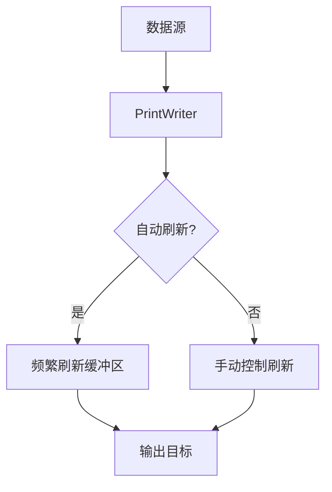

# Java PrintWriter

## 简介

`PrintWriter` 是 Java IO 包中的一个重要类，用于将格式化的表示形式打印到文本输出流中。它提供了许多方便的打印方法，可以轻松地将各种数据类型转换为文本格式并输出。与其他输出流相比，`PrintWriter` 更加易于使用，特别是在处理字符输出时。

`PrintWriter` 的主要特点包括：

- 提供了格式化输出的方法，如 `print()`、`println()` 和 `printf()`
- 可以自动处理行分隔符的问题
- 能够处理任何字符输出流
- 具有自动刷新功能
- 提供了错误处理机制

## PrintWriter 基础

### 创建 PrintWriter 对象

创建 `PrintWriter` 对象的方式有多种：

```java
// 从文件创建
PrintWriter writer1 = new PrintWriter("output.txt");

// 从现有的输出流创建
FileOutputStream fos = new FileOutputStream("output.txt");
PrintWriter writer2 = new PrintWriter(fos);

// 从Writer对象创建
FileWriter fileWriter = new FileWriter("output.txt");
PrintWriter writer3 = new PrintWriter(fileWriter);

// 创建具有自动刷新功能的PrintWriter
PrintWriter writer4 = new PrintWriter(new FileWriter("output.txt"), true);
```

### 基本输出方法

`PrintWriter` 提供了多种输出方法：

```java
PrintWriter writer = new PrintWriter("example.txt");

// 输出不同数据类型
writer.print("Hello");          // 输出字符串
writer.print(123);              // 输出整数
writer.print(45.67);            // 输出浮点数
writer.print(true);             // 输出布尔值

// 输出并换行
writer.println("Hello World");   // 输出后换行
writer.println(123);            // 输出后换行

// 关闭PrintWriter
writer.close();                 // 必须关闭才能保存数据
```

### 格式化输出

`PrintWriter` 提供了 `printf()` 方法，可以像 C 语言那样进行格式化输出：

```java
PrintWriter writer = new PrintWriter("format_example.txt");

// 格式化输出
writer.printf("Name: %s, Age: %d, Score: %.2f%n", "John", 25, 92.5);
writer.printf("Date: %tF%n", new java.util.Date());

writer.close();
```

输出结果：
```
Name: John, Age: 25, Score: 92.50
Date: 2023-10-15
```

## PrintWriter 的特性

### 自动刷新

`PrintWriter` 可以设置自动刷新模式，当调用 `println()`、`printf()` 或 `format()` 方法时，会自动刷新输出缓冲区：

```java
// 创建具有自动刷新功能的PrintWriter
PrintWriter writer = new PrintWriter(new FileWriter("autoflush.txt"), true);

writer.println("This line will be flushed automatically.");
// 不需要手动调用flush()
```

:::tip
自动刷新功能在处理日志记录或需要实时查看输出的场景中特别有用。
:::

### 错误处理

`PrintWriter` 不会抛出 IO 异常，而是通过 `checkError()` 方法来检查是否发生了错误：

```java
PrintWriter writer = new PrintWriter("error_check.txt");
writer.println("Testing error handling");

// 检查是否有错误发生
if (writer.checkError()) {
    System.out.println("An error occurred while writing");
} else {
    System.out.println("No errors detected");
}

writer.close();
```

## 实际应用示例

### 示例1：创建简单的日志文件

```java
import java.io.PrintWriter;
import java.util.Date;

public class SimpleLogger {
    public static void main(String[] args) {
        try {
            // 创建带自动刷新的PrintWriter
            PrintWriter logger = new PrintWriter("application.log", "UTF-8");
            
            // 写入日志条目
            logger.println("=== Application Log ===");
            logger.printf("[%tF %tT] Application started%n", new Date(), new Date());
            
            // 模拟一些操作
            logger.printf("[%tF %tT] User authentication successful%n", new Date(), new Date());
            logger.printf("[%tF %tT] Database connection established%n", new Date(), new Date());
            logger.printf("[%tF %tT] Processing data...%n", new Date(), new Date());
            
            // 记录错误
            logger.printf("[%tF %tT] ERROR: Failed to process record #5432%n", new Date(), new Date());
            
            // 记录应用程序关闭
            logger.printf("[%tF %tT] Application shutdown%n", new Date(), new Date());
            
            // 关闭日志
            logger.close();
            System.out.println("Log file created successfully.");
        } catch (Exception e) {
            System.err.println("Error creating log file: " + e.getMessage());
        }
    }
}
```

输出结果（application.log）：
```
=== Application Log ===
[2023-10-15 14:32:45] Application started
[2023-10-15 14:32:45] User authentication successful
[2023-10-15 14:32:45] Database connection established
[2023-10-15 14:32:45] Processing data...
[2023-10-15 14:32:45] ERROR: Failed to process record #5432
[2023-10-15 14:32:45] Application shutdown
```

### 示例2：生成CSV文件

```java
import java.io.PrintWriter;

public class CSVGenerator {
    public static void main(String[] args) {
        try {
            PrintWriter csvWriter = new PrintWriter("students.csv");
            
            // 写入CSV标题
            csvWriter.println("ID,Name,Age,Grade");
            
            // 写入学生数据
            csvWriter.println("1,John Smith,18,A");
            csvWriter.println("2,Emma Johnson,17,B+");
            csvWriter.println("3,Michael Brown,18,A-");
            csvWriter.println("4,Sophia Davis,17,B");
            csvWriter.println("5,William Wilson,18,A+");
            
            csvWriter.close();
            System.out.println("CSV file created successfully.");
        } catch (Exception e) {
            System.err.println("Error creating CSV file: " + e.getMessage());
        }
    }
}
```

输出结果（students.csv）：
```
ID,Name,Age,Grade
1,John Smith,18,A
2,Emma Johnson,17,B+
3,Michael Brown,18,A-
4,Sophia Davis,17,B
5,William Wilson,18,A+
```

### 示例3：结合BufferedReader进行文件转换

以下是一个从文本文件读取内容，处理后写入新文件的示例：

```java
import java.io.BufferedReader;
import java.io.FileReader;
import java.io.PrintWriter;

public class FileConverter {
    public static void main(String[] args) {
        try {
            // 输入和输出文件
            BufferedReader reader = new BufferedReader(new FileReader("input.txt"));
            PrintWriter writer = new PrintWriter("output.txt");
            
            String line;
            int lineNumber = 1;
            
            // 逐行读取并处理
            while ((line = reader.readLine()) != null) {
                // 添加行号并转换为大写
                writer.printf("%d: %s%n", lineNumber++, line.toUpperCase());
            }
            
            reader.close();
            writer.close();
            System.out.println("File conversion completed!");
        } catch (Exception e) {
            System.err.println("Error during file conversion: " + e.getMessage());
        }
    }
}
```

假设 input.txt 包含以下内容：
```
hello world
this is a test
java io is powerful
print writer makes output easy
```

输出结果（output.txt）：
```
1: HELLO WORLD
2: THIS IS A TEST
3: JAVA IO IS POWERFUL
4: PRINT WRITER MAKES OUTPUT EASY
```

## 性能考虑

虽然 `PrintWriter` 很方便，但它也有一些性能开销。在处理大量数据或对性能要求严格的应用中，需要注意以下几点：

1. `PrintWriter` 会将数据封装在内部缓冲区中，可能导致额外的内存使用
2. 格式化输出比直接输出原始数据需要更多的处理时间
3. 使用自动刷新功能可能会降低性能，因为每次调用特定方法都会触发刷新操作



在需要高性能的场景中，可以考虑使用 `BufferedWriter` 与 `FileWriter` 的组合，并手动控制刷新操作的时机。

## 总结

`PrintWriter` 是 Java 中进行文本输出的强大工具，它提供了：

- 简单易用的 API，适合初学者
- 丰富的格式化输出功能
- 自动处理行分隔符
- 错误处理机制
- 广泛的应用场景，从简单的文件输出到复杂的数据格式化

通过 `PrintWriter`，Java 开发者可以轻松地将各种数据类型格式化为文本并输出到文件或其他输出流中。掌握 `PrintWriter` 是成为优秀 Java 开发者的基本技能之一。

## 练习

1. 创建一个程序，使用 `PrintWriter` 生成一个 HTML 文件，包含一个简单的表格。
2. 编写一个程序，读取一个CSV文件，处理其中的数据，然后使用 `PrintWriter` 将处理结果输出到新文件中。
3. 实现一个简单的日志系统，使用 `PrintWriter` 的自动刷新功能，记录应用程序的各种事件。
4. 创建一个程序，比较使用 `PrintWriter`、`BufferedWriter` 和直接使用 `FileWriter` 在写入大量数据时的性能差异。

## 扩展阅读

- [Java官方文档 - PrintWriter类](https://docs.oracle.com/javase/8/docs/api/java/io/PrintWriter.html)
- 学习 Java 格式化输出的更多选项和格式说明符
- 探索 Java NIO 包中的文件处理方式，了解现代 Java IO 的更多功能