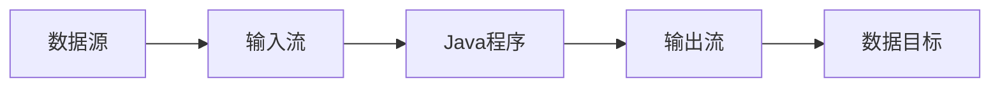

# Java 数据流

在Java编程中，数据流(Stream)是一个核心概念，它使我们能够有效地处理输入和输出操作。数据流提供了一种从源读取数据和向目标写入数据的方式，这是几乎所有Java应用程序的基础部分。

## 什么是Java数据流？

Java数据流是一个抽象概念，代表着数据的流动通道。通过数据流，我们可以读取和写入各种数据源，如文件、网络连接、内存缓冲区等。

Java的I/O包(`java.io`)提供了丰富的类来处理数据流操作，使得数据的输入输出变得简单且高效。



## 数据流的基本分类

Java中的数据流主要分为两大类：

1. **字节流(Byte Stream)** - 以字节为单位处理数据
2. **字符流(Character Stream)** - 以字符为单位处理数据

### 字节流与字符流的区别

| 特性 | 字节流 | 字符流 |
|------|-------|-------|
| 处理单位 | 字节(8位) | 字符(16位Unicode) |
| 适用场景 | 二进制文件(图片、音频等) | 文本文件 |
| 基类 | InputStream/OutputStream | Reader/Writer |

## 字节流

字节流是Java I/O中最基础的流类型，用于处理二进制数据。

### InputStream

`InputStream`是所有字节输入流的抽象基类，定义了读取字节的基本方法。

常用子类包括：
- `FileInputStream` - 从文件读取字节
- `ByteArrayInputStream` - 从字节数组读取字节
- `BufferedInputStream` - 提供缓冲功能的输入流

#### 基本用法示例

```java
try (FileInputStream fis = new FileInputStream("example.dat")) {
    int data;
    while ((data = fis.read()) != -1) {
        // 处理每个字节
        System.out.print(data + " ");
    }
} catch (IOException e) {
    e.printStackTrace();
}
```

### OutputStream

`OutputStream`是所有字节输出流的抽象基类，定义了写入字节的基本方法。

常用子类包括：
- `FileOutputStream` - 向文件写入字节
- `ByteArrayOutputStream` - 向字节数组写入字节
- `BufferedOutputStream` - 提供缓冲功能的输出流

#### 基本用法示例

```java
try (FileOutputStream fos = new FileOutputStream("output.dat")) {
    // 写入单个字节
    fos.write(65); // 写入字符'A'的ASCII值
    
    // 写入字节数组
    byte[] data = {66, 67, 68, 69}; // 'B', 'C', 'D', 'E'
    fos.write(data);
} catch (IOException e) {
    e.printStackTrace();
}
```

## 字符流

字符流专门用于处理文本数据，可以更有效地处理Unicode字符。

### Reader

`Reader`是所有字符输入流的抽象基类。

常用子类包括：
- `FileReader` - 从文件读取字符
- `InputStreamReader` - 将字节流转换为字符流
- `BufferedReader` - 提供缓冲功能的字符输入流

#### 基本用法示例

```java
try (BufferedReader br = new BufferedReader(new FileReader("example.txt"))) {
    String line;
    while ((line = br.readLine()) != null) {
        System.out.println(line);
    }
} catch (IOException e) {
    e.printStackTrace();
}
```

### Writer

`Writer`是所有字符输出流的抽象基类。

常用子类包括：
- `FileWriter` - 向文件写入字符
- `OutputStreamWriter` - 将字符流转换为字节流
- `BufferedWriter` - 提供缓冲功能的字符输出流

#### 基本用法示例

```java
try (BufferedWriter bw = new BufferedWriter(new FileWriter("output.txt"))) {
    bw.write("Hello, Java IO!");
    bw.newLine(); // 写入一个换行符
    bw.write("Welcome to learn data streams.");
} catch (IOException e) {
    e.printStackTrace();
}
```

## 缓冲流

缓冲流通过在内存中保留一定量的数据来减少I/O操作的次数，从而提高效率。

:::tip
使用缓冲流可以显著提升I/O性能，特别是在处理大量数据时。
:::

### 缓冲流示例

```java
// 不使用缓冲
try (FileInputStream fis = new FileInputStream("large_file.dat");
     FileOutputStream fos = new FileOutputStream("copy_without_buffer.dat")) {
    
    int data;
    while ((data = fis.read()) != -1) {
        fos.write(data);
    }
} catch (IOException e) {
    e.printStackTrace();
}

// 使用缓冲
try (BufferedInputStream bis = new BufferedInputStream(new FileInputStream("large_file.dat"));
     BufferedOutputStream bos = new BufferedOutputStream(new FileOutputStream("copy_with_buffer.dat"))) {
    
    int data;
    while ((data = bis.read()) != -1) {
        bos.write(data);
    }
} catch (IOException e) {
    e.printStackTrace();
}
```

## 数据流

数据流允许您以可移植方式读写Java基本数据类型。

### DataInputStream 和 DataOutputStream

```java
// 写入基本数据类型
try (DataOutputStream dos = new DataOutputStream(new FileOutputStream("data.bin"))) {
    dos.writeInt(100);
    dos.writeDouble(3.14);
    dos.writeBoolean(true);
    dos.writeUTF("Hello DataStream");
} catch (IOException e) {
    e.printStackTrace();
}

// 读取基本数据类型
try (DataInputStream dis = new DataInputStream(new FileInputStream("data.bin"))) {
    int i = dis.readInt();
    double d = dis.readDouble();
    boolean b = dis.readBoolean();
    String s = dis.readUTF();
    
    System.out.println("读取的整数: " + i);
    System.out.println("读取的双精度: " + d);
    System.out.println("读取的布尔值: " + b);
    System.out.println("读取的字符串: " + s);
} catch (IOException e) {
    e.printStackTrace();
}
```

输出结果：
```
读取的整数: 100
读取的双精度: 3.14
读取的布尔值: true
读取的字符串: Hello DataStream
```

## 对象流

对象流支持对象的序列化和反序列化，使我们能够将整个对象写入流或从流中读取对象。

:::caution
要使一个类可序列化，该类必须实现`Serializable`接口。
:::

### ObjectInputStream 和 ObjectOutputStream

```java
import java.io.*;

// 定义一个可序列化的类
class Person implements Serializable {
    private static final long serialVersionUID = 1L;
    private String name;
    private int age;
    
    public Person(String name, int age) {
        this.name = name;
        this.age = age;
    }
    
    @Override
    public String toString() {
        return "Person [name=" + name + ", age=" + age + "]";
    }
}

// 使用对象流
public class ObjectStreamExample {
    public static void main(String[] args) {
        // 序列化对象
        try (ObjectOutputStream oos = new ObjectOutputStream(
                new FileOutputStream("person.obj"))) {
            
            Person person = new Person("张三", 25);
            oos.writeObject(person);
            System.out.println("对象已序列化");
            
        } catch (IOException e) {
            e.printStackTrace();
        }
        
        // 反序列化对象
        try (ObjectInputStream ois = new ObjectInputStream(
                new FileInputStream("person.obj"))) {
            
            Person person = (Person) ois.readObject();
            System.out.println("反序列化对象: " + person);
            
        } catch (IOException | ClassNotFoundException e) {
            e.printStackTrace();
        }
    }
}
```

输出结果：
```
对象已序列化
反序列化对象: Person [name=张三, age=25]
```

## 实际应用案例

### 案例1: 文件复制工具

创建一个可以复制大文件的工具，同时显示进度信息。

```java
import java.io.*;

public class FileCopyTool {
    public static void main(String[] args) {
        if (args.length != 2) {
            System.out.println("用法: java FileCopyTool 源文件 目标文件");
            return;
        }
        
        String sourceFile = args[0];
        String targetFile = args[1];
        
        try {
            copyFileWithProgress(sourceFile, targetFile);
        } catch (IOException e) {
            System.err.println("复制文件时发生错误: " + e.getMessage());
        }
    }
    
    public static void copyFileWithProgress(String sourceFile, String targetFile) throws IOException {
        try (BufferedInputStream bis = new BufferedInputStream(new FileInputStream(sourceFile));
             BufferedOutputStream bos = new BufferedOutputStream(new FileOutputStream(targetFile))) {
            
            // 获取源文件大小
            File source = new File(sourceFile);
            long fileSize = source.length();
            long bytesRead = 0;
            int lastProgress = 0;
            
            byte[] buffer = new byte[8192]; // 8KB缓冲区
            int bytesReadThisTime;
            
            while ((bytesReadThisTime = bis.read(buffer)) != -1) {
                bos.write(buffer, 0, bytesReadThisTime);
                bytesRead += bytesReadThisTime;
                
                // 计算并显示进度
                int progress = (int)((bytesRead * 100) / fileSize);
                if (progress > lastProgress) {
                    System.out.print("\r复制进度: " + progress + "%");
                    lastProgress = progress;
                }
            }
            
            System.out.println("\n文件复制完成!");
        }
    }
}
```

### 案例2: 简易文本编辑器

创建一个可以读取、修改和保存文本文件的简易编辑器。

```java
import java.io.*;
import java.util.ArrayList;
import java.util.List;
import java.util.Scanner;

public class SimpleTextEditor {
    private List<String> lines = new ArrayList<>();
    private String fileName;
    private boolean modified = false;
    
    public SimpleTextEditor(String fileName) {
        this.fileName = fileName;
    }
    
    public void load() throws IOException {
        lines.clear();
        try (BufferedReader br = new BufferedReader(new FileReader(fileName))) {
            String line;
            while ((line = br.readLine()) != null) {
                lines.add(line);
            }
        }
        System.out.println("文件已加载: " + fileName);
    }
    
    public void save() throws IOException {
        try (BufferedWriter bw = new BufferedWriter(new FileWriter(fileName))) {
            for (String line : lines) {
                bw.write(line);
                bw.newLine();
            }
        }
        modified = false;
        System.out.println("文件已保存: " + fileName);
    }
    
    public void display() {
        System.out.println("--- 文件内容 ---");
        for (int i = 0; i < lines.size(); i++) {
            System.out.println((i + 1) + ": " + lines.get(i));
        }
        System.out.println("---------------");
    }
    
    public void editLine(int lineNumber, String newContent) {
        if (lineNumber >= 1 && lineNumber <= lines.size()) {
            lines.set(lineNumber - 1, newContent);
            modified = true;
            System.out.println("行 " + lineNumber + " 已修改");
        } else {
            System.out.println("无效的行号");
        }
    }
    
    public static void main(String[] args) {
        Scanner scanner = new Scanner(System.in);
        System.out.print("请输入文件名: ");
        String fileName = scanner.nextLine();
        
        SimpleTextEditor editor = new SimpleTextEditor(fileName);
        
        try {
            File file = new File(fileName);
            if (file.exists()) {
                editor.load();
            } else {
                System.out.println("创建了新文件: " + fileName);
            }
            
            boolean running = true;
            while (running) {
                System.out.println("\n-- 简易文本编辑器 --");
                System.out.println("1. 显示文件内容");
                System.out.println("2. 编辑一行");
                System.out.println("3. 保存文件");
                System.out.println("4. 退出");
                System.out.print("请选择: ");
                
                int choice = Integer.parseInt(scanner.nextLine());
                
                switch (choice) {
                    case 1:
                        editor.display();
                        break;
                    case 2:
                        System.out.print("请输入行号: ");
                        int lineNumber = Integer.parseInt(scanner.nextLine());
                        System.out.print("请输入新内容: ");
                        String newContent = scanner.nextLine();
                        editor.editLine(lineNumber, newContent);
                        break;
                    case 3:
                        editor.save();
                        break;
                    case 4:
                        if (editor.modified) {
                            System.out.print("文件已修改，是否保存？(y/n): ");
                            String answer = scanner.nextLine();
                            if (answer.equalsIgnoreCase("y")) {
                                editor.save();
                            }
                        }
                        running = false;
                        break;
                    default:
                        System.out.println("无效选择，请重试");
                }
            }
            
        } catch (IOException e) {
            System.err.println("发生I/O错误: " + e.getMessage());
        } finally {
            scanner.close();
        }
    }
}
```

## 总结

Java数据流是进行输入输出操作的基础，可分为字节流和字符流两大类。

**主要知识点回顾**：
- 字节流处理二进制数据，基类是`InputStream`和`OutputStream`
- 字符流处理文本数据，基类是`Reader`和`Writer`
- 缓冲流可以提高I/O操作效率
- 数据流可以处理基本数据类型
- 对象流支持对象的序列化和反序列化

**最佳实践**：
1. 始终使用`try-with-resources`语句来确保流被正确关闭
2. 处理文本时优先使用字符流
3. 处理二进制数据时使用字节流
4. 为了提高性能，尽可能使用带缓冲的流
5. 进行文件操作时务必处理可能出现的异常

## 练习

1. 创建一个程序，统计文本文件中特定单词的出现次数。
2. 编写一个图片复制程序，将一个图像文件复制到另一个位置。
3. 创建一个简单的日志系统，能将日志信息追加到文件末尾。
4. 实现一个基于对象流的简易通讯录程序，可以保存和加载联系人信息。
5. 开发一个文件加密/解密工具，使用简单的异或加密算法。

## 延伸阅读

1. Java NIO (New I/O) - Java更现代的I/O API
2. 字符集和编码 - 深入理解字符编码如何影响文本I/O
3. 随机访问文件 - 使用`RandomAccessFile`进行非顺序I/O操作
4. Java I/O与网络编程的结合