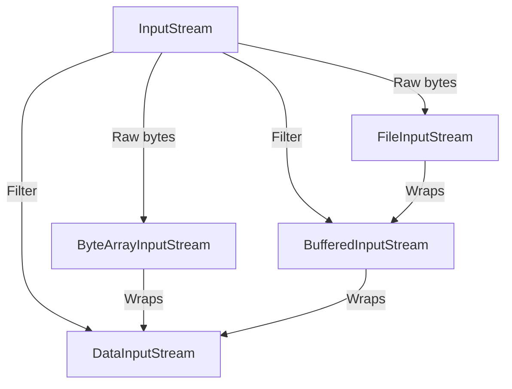

# Java DataInputStream

DataInputStream 是 Java IO 包中的一个重要类，它允许应用程序以与机器无关的方式从输入流中读取基本 Java 数据类型。无论你是在处理文件、网络通信，还是其他数据流，DataInputStream 都提供了一种便捷的方式来读取二进制数据。

## DataInputStream 简介

DataInputStream 是 Java 中的一个过滤流（Filter Stream），它包装在其他输入流上，为其添加了读取基本数据类型的功能。这个类实现了 DataInput 接口，可以按照特定格式读取 boolean、byte、char、short、int、long、float、double 以及 UTF 编码的字符串。

### DataInputStream 的主要特点

- 可以按照特定的格式读取所有的 Java 基本数据类型
- 以二进制格式而非文本格式处理数据
- 通常与 DataOutputStream 配对使用，实现对数据的二进制读写
- 使数据在不同计算机架构之间交换时保持一致性

## DataInputStream 的基本用法

### 创建 DataInputStream

要使用 DataInputStream，首先需要创建一个基础输入流，然后将其包装在 DataInputStream 中：

```java
import java.io.*;

// 从文件创建
FileInputStream fileIn = new FileInputStream("data.bin");
DataInputStream dataIn = new DataInputStream(fileIn);

// 从字节数组创建
byte[] data = {1, 2, 3, 4};
ByteArrayInputStream byteIn = new ByteArrayInputStream(data);
DataInputStream dataIn2 = new DataInputStream(byteIn);
```

### 基本数据类型的读取操作

DataInputStream 提供了多种方法来读取不同的数据类型：

```java
import java.io.*;

public class DataInputStreamDemo {
    public static void main(String[] args) {
        try {
            // 假设我们有一个使用DataOutputStream写入的文件
            FileInputStream fis = new FileInputStream("data.bin");
            DataInputStream dis = new DataInputStream(fis);
            
            // 读取基本数据类型
            boolean boolValue = dis.readBoolean();
            byte byteValue = dis.readByte();
            short shortValue = dis.readShort();
            int intValue = dis.readInt();
            long longValue = dis.readLong();
            float floatValue = dis.readFloat();
            double doubleValue = dis.readDouble();
            char charValue = dis.readChar();
            String stringValue = dis.readUTF();
            
            System.out.println("Boolean: " + boolValue);
            System.out.println("Byte: " + byteValue);
            System.out.println("Short: " + shortValue);
            System.out.println("Int: " + intValue);
            System.out.println("Long: " + longValue);
            System.out.println("Float: " + floatValue);
            System.out.println("Double: " + doubleValue);
            System.out.println("Char: " + charValue);
            System.out.println("String: " + stringValue);
            
            dis.close();
        } catch (IOException e) {
            e.printStackTrace();
        }
    }
}
```

:::note
读取的顺序必须与使用 DataOutputStream 写入的顺序完全一致，否则会得到错误的数据。
:::

## 完整例子：DataOutputStream 和 DataInputStream 配对使用

下面是一个完整的例子，展示了如何使用 DataOutputStream 写入数据，然后使用 DataInputStream 读取数据：

```java
import java.io.*;

public class DataStreamExample {
    public static void main(String[] args) {
        // 写入数据
        try (DataOutputStream dos = new DataOutputStream(new FileOutputStream("data.bin"))) {
            dos.writeInt(100);
            dos.writeDouble(123.456);
            dos.writeBoolean(true);
            dos.writeUTF("Hello, DataInputStream!");
            System.out.println("数据已写入文件!");
        } catch (IOException e) {
            e.printStackTrace();
        }
        
        // 读取数据
        try (DataInputStream dis = new DataInputStream(new FileInputStream("data.bin"))) {
            int intValue = dis.readInt();
            double doubleValue = dis.readDouble();
            boolean boolValue = dis.readBoolean();
            String message = dis.readUTF();
            
            System.out.println("读取的整数: " + intValue);
            System.out.println("读取的浮点数: " + doubleValue);
            System.out.println("读取的布尔值: " + boolValue);
            System.out.println("读取的字符串: " + message);
        } catch (IOException e) {
            e.printStackTrace();
        }
    }
}
```

**输出结果：**
```
数据已写入文件!
读取的整数: 100
读取的浮点数: 123.456
读取的布尔值: true
读取的字符串: Hello, DataInputStream!
```

## DataInputStream 的实际应用场景

### 文件格式处理

DataInputStream 常用于处理自定义的二进制文件格式，例如游戏存档文件、图像文件等。

```java
public class GameSaveLoader {
    public void loadGameState(String filename) {
        try (DataInputStream dis = new DataInputStream(new FileInputStream(filename))) {
            // 读取游戏版本号
            int version = dis.readInt();
            
            // 读取玩家信息
            String playerName = dis.readUTF();
            int level = dis.readInt();
            double health = dis.readDouble();
            boolean hasMagicPowers = dis.readBoolean();
            
            // 读取游戏世界数据
            int worldWidth = dis.readInt();
            int worldHeight = dis.readInt();
            
            // ... 处理读取到的数据
            System.out.println("加载游戏: " + playerName + " (等级 " + level + ")");
            
        } catch (IOException e) {
            System.err.println("无法加载游戏存档: " + e.getMessage());
        }
    }
}
```

### 网络通信

DataInputStream 与 Socket 结合使用，用于网络通信中的二进制数据传输：

```java
import java.io.*;
import java.net.*;

public class SimpleClient {
    public void connectToServer() {
        try {
            Socket socket = new Socket("localhost", 8080);
            
            // 创建输入流读取服务器响应
            DataInputStream in = new DataInputStream(socket.getInputStream());
            
            // 读取服务器发送的数据
            int messageId = in.readInt();
            String message = in.readUTF();
            long timestamp = in.readLong();
            
            System.out.println("接收到消息 #" + messageId + ": " + message);
            System.out.println("时间戳: " + new java.util.Date(timestamp));
            
            socket.close();
        } catch (IOException e) {
            e.printStackTrace();
        }
    }
}
```

### 序列化替代

在某些简单场景下，DataInputStream 可以作为 Java 对象序列化的轻量级替代方案：

```java
public class User {
    private int id;
    private String username;
    private boolean active;
    
    // 构造函数、getter 和 setter 省略
    
    // 将用户数据写入流
    public void saveTo(DataOutputStream out) throws IOException {
        out.writeInt(id);
        out.writeUTF(username);
        out.writeBoolean(active);
    }
    
    // 从流中读取用户数据
    public static User loadFrom(DataInputStream in) throws IOException {
        User user = new User();
        user.id = in.readInt();
        user.username = in.readUTF();
        user.active = in.readBoolean();
        return user;
    }
}
```

## DataInputStream 的高级特性

### 读取无符号值

DataInputStream 提供了方法来读取无符号的字节和短整型：

```java
// 读取无符号字节（返回 0-255，而不是 -128 到 127）
int unsignedByte = dis.readUnsignedByte();

// 读取无符号短整型（返回 0-65535，而不是 -32768 到 32767）
int unsignedShort = dis.readUnsignedShort();
```

### 跳过字节

可以跳过流中的一定数量的字节：

```java
// 跳过100个字节
dis.skipBytes(100);
```

### 可用字节检查

检查当前有多少字节可供读取：

```java
// 返回可以不受阻塞地读取的字节数
int available = dis.available();
```

## 最佳实践

1. **始终使用 try-with-resources 语句**：确保流在使用后正确关闭

```java
try (DataInputStream dis = new DataInputStream(new FileInputStream("file.dat"))) {
    // 使用 dis 读取数据
} catch (IOException e) {
    e.printStackTrace();
}
```

2. **保持读写顺序一致**：确保使用 DataInputStream 读取数据的顺序与使用 DataOutputStream 写入的顺序完全相同

3. **异常处理**：正确处理可能发生的 IOException 或 EOFException

4. **考虑字节序**：DataInputStream 使用大端字节序（big-endian），如果需要处理小端字节序的数据，需要手动转换或使用 ByteBuffer 类

## 注意事项

:::caution
- DataInputStream 不支持字符编码转换（除了 readUTF() 方法）
- 读取时必须严格按照写入顺序操作，否则会导致数据错误
- 读取到流末尾时会抛出 EOFException
:::

## 与其他流的比较

下面是不同输入流的简单比较：



## 总结

DataInputStream 是 Java IO 中处理二进制数据的关键类，它可以：

- 以机器无关的方式读取 Java 基本数据类型
- 与 DataOutputStream 配合使用实现数据的二进制存储和传输
- 适用于文件操作、网络通信等多种场景

掌握 DataInputStream 的使用对于需要处理二进制数据的 Java 应用程序开发非常重要。随着编程经验的积累，你会发现这个类在很多场景下都能发挥重要作用。

## 练习

1. 创建一个程序，使用 DataOutputStream 写入包含学生信息（ID、姓名、分数）的文件，然后用 DataInputStream 读取并显示这些信息。

2. 实现一个简单的图像文件格式，使用 DataOutputStream 保存图像的宽度、高度和 RGB 像素数据，然后用 DataInputStream 读取并重建图像。

3. 编写一个程序，使用 DataInputStream 从网络套接字读取服务器发送的自定义协议消息。

## 进一步阅读

- [Java官方文档 - DataInputStream](https://docs.oracle.com/en/java/javase/17/docs/api/java.base/java/io/DataInputStream.html)
- Java IO 流架构
- 二进制文件格式设计
- 网络编程中的数据交换

通过这些资源和练习，你将能够熟练掌握 DataInputStream 并在各种情境中有效地应用它。