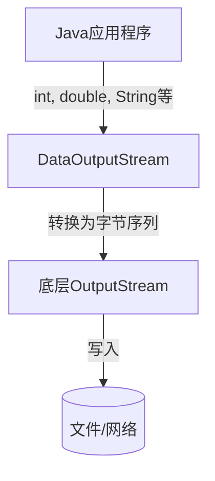

# Java DataOutputStream

## 什么是DataOutputStream？

DataOutputStream是Java IO包中的一个重要类，它允许应用程序以机器无关的方式将Java基本数据类型写入输出流。简单来说，它可以将Java的基本数据类型（如int、double、boolean等）转换成字节序列并输出到文件或网络中。

DataOutputStream实现了DataOutput接口，并继承自FilterOutputStream类，是一种装饰器模式的应用。

:::note
DataOutputStream的主要作用是将各种Java数据类型转换为字节序列，使得数据可以被保存或传输。
:::

## DataOutputStream的基本用法

### 创建DataOutputStream对象

要使用DataOutputStream，首先需要创建一个OutputStream对象（如FileOutputStream），然后将其包装在DataOutputStream中：

```java
import java.io.DataOutputStream;
import java.io.FileOutputStream;
import java.io.IOException;

public class DataOutputStreamExample {
    public static void main(String[] args) {
        try (FileOutputStream fos = new FileOutputStream("data.bin");
             DataOutputStream dos = new DataOutputStream(fos)) {
            
            // 使用DataOutputStream写入数据...
            
        } catch (IOException e) {
            e.printStackTrace();
        }
    }
}
```

### 写入基本数据类型

DataOutputStream提供了多种方法来写入不同的数据类型：

```java
try (FileOutputStream fos = new FileOutputStream("data.bin");
     DataOutputStream dos = new DataOutputStream(fos)) {
    
    // 写入基本数据类型
    dos.writeInt(100);        // 写入整数
    dos.writeDouble(3.14159); // 写入双精度浮点数
    dos.writeBoolean(true);   // 写入布尔值
    dos.writeChar('A');       // 写入字符
    dos.writeUTF("Hello");    // 写入UTF-8编码的字符串
    
} catch (IOException e) {
    e.printStackTrace();
}
```

## DataOutputStream的重要方法

DataOutputStream提供了多种写入数据的方法：

| 方法 | 描述 |
|------|------|
| `write(int b)` | 将指定的字节写入输出流 |
| `writeBoolean(boolean v)` | 以单字节值写入布尔值 |
| `writeByte(int v)` | 将一个字节写入输出流 |
| `writeShort(int v)` | 将短整数写入输出流（2字节） |
| `writeChar(int v)` | 将字符写入输出流（2字节） |
| `writeInt(int v)` | 将整数写入输出流（4字节） |
| `writeLong(long v)` | 将长整数写入输出流（8字节） |
| `writeFloat(float v)` | 将浮点数写入输出流（4字节） |
| `writeDouble(double v)` | 将双精度浮点数写入输出流（8字节） |
| `writeBytes(String s)` | 将字符串作为字节序列写入 |
| `writeChars(String s)` | 将字符串中的每个字符以2字节形式写入 |
| `writeUTF(String s)` | 使用UTF-8编码写入字符串 |
| `flush()` | 刷新输出流 |
| `size()` | 返回已写入的总字节数 |

:::tip
`writeUTF()`方法特别适合用于存储需要跨平台或跨语言共享的文本数据，因为UTF-8编码是一种广泛支持的字符编码方式。
:::

## 完整示例：写入和读取数据

以下是一个完整的示例，演示如何使用DataOutputStream写入数据，然后使用DataInputStream读取数据：

```java
import java.io.*;

public class DataStreamDemo {
    public static void main(String[] args) {
        // 写入示例数据
        writeData();
        
        // 读取并显示数据
        readData();
    }
    
    private static void writeData() {
        try (DataOutputStream dos = new DataOutputStream(
                new FileOutputStream("student.dat"))) {
            
            // 写入学生信息
            dos.writeInt(1001);           // 学号
            dos.writeUTF("张三");         // 姓名
            dos.writeBoolean(true);       // 性别（true表示男性）
            dos.writeDouble(85.5);        // 平均成绩
            
            dos.writeInt(1002);
            dos.writeUTF("李四");
            dos.writeBoolean(false);
            dos.writeDouble(90.5);
            
            System.out.println("数据已成功写入文件！");
            
        } catch (IOException e) {
            e.printStackTrace();
        }
    }
    
    private static void readData() {
        try (DataInputStream dis = new DataInputStream(
                new FileInputStream("student.dat"))) {
            
            // 读取并显示学生信息
            while (dis.available() > 0) {
                int id = dis.readInt();
                String name = dis.readUTF();
                boolean gender = dis.readBoolean();
                double avgScore = dis.readDouble();
                
                System.out.println("学号: " + id);
                System.out.println("姓名: " + name);
                System.out.println("性别: " + (gender ? "男" : "女"));
                System.out.println("平均成绩: " + avgScore);
                System.out.println("------------------");
            }
            
        } catch (EOFException e) {
            System.out.println("已读取所有数据");
        } catch (IOException e) {
            e.printStackTrace();
        }
    }
}
```

**输出结果：**
```
数据已成功写入文件！
学号: 1001
姓名: 张三
性别: 男
平均成绩: 85.5
------------------
学号: 1002
姓名: 李四
性别: 女
平均成绩: 90.5
------------------
```

## DataOutputStream的工作原理



DataOutputStream在内部会按照特定的格式将Java基本数据类型转换为字节序列。例如：

- `writeInt()`方法会将一个int值（4字节）按照大端字节序写入
- `writeUTF()`方法会先写入字符串的字节长度（2字节），然后写入UTF-8编码的字符串内容

这种转换是平台无关的，意味着在一个平台上写入的数据可以在另一个平台上正确读取。

## 实际应用场景

### 1. 保存游戏数据

游戏开发中常常需要保存玩家数据，如等级、分数、道具等信息：

```java
public void saveGameProgress(String fileName, Player player) {
    try (DataOutputStream dos = new DataOutputStream(
            new FileOutputStream(fileName))) {
        
        dos.writeUTF(player.getName());
        dos.writeInt(player.getLevel());
        dos.writeInt(player.getScore());
        dos.writeDouble(player.getHealth());
        
        // 保存道具列表
        dos.writeInt(player.getItems().size());
        for (Item item : player.getItems()) {
            dos.writeInt(item.getId());
            dos.writeUTF(item.getName());
        }
        
        System.out.println("游戏进度已保存");
        
    } catch (IOException e) {
        System.err.println("保存游戏进度失败: " + e.getMessage());
    }
}
```

### 2. 网络通信

在网络编程中，可以使用DataOutputStream将数据发送给服务器或客户端：

```java
public void sendMessage(Socket socket, Message message) {
    try (DataOutputStream dos = new DataOutputStream(
            socket.getOutputStream())) {
        
        dos.writeByte(message.getType());
        dos.writeUTF(message.getContent());
        dos.writeLong(message.getTimestamp());
        
    } catch (IOException e) {
        System.err.println("发送消息失败: " + e.getMessage());
    }
}
```

### 3. 数据导出

将数据库或应用程序中的数据导出到二进制文件：

```java
public void exportEmployees(List<Employee> employees, String fileName) {
    try (DataOutputStream dos = new DataOutputStream(
            new BufferedOutputStream(
                new FileOutputStream(fileName)))) {
        
        dos.writeInt(employees.size());
        
        for (Employee emp : employees) {
            dos.writeInt(emp.getId());
            dos.writeUTF(emp.getName());
            dos.writeDouble(emp.getSalary());
            dos.writeUTF(emp.getDepartment());
            dos.writeLong(emp.getHireDate().getTime());
        }
        
        System.out.println("成功导出" + employees.size() + "名员工数据");
        
    } catch (IOException e) {
        e.printStackTrace();
    }
}
```

## 注意事项和最佳实践

### 1. 始终关闭数据流

使用try-with-resources语句确保数据流正确关闭：

```java
try (DataOutputStream dos = new DataOutputStream(new FileOutputStream("file.dat"))) {
    // 使用dos写入数据
} catch (IOException e) {
    e.printStackTrace();
}
```

### 2. 使用BufferedOutputStream提高性能

对于大量数据写入，可以使用BufferedOutputStream提高性能：

```java
try (DataOutputStream dos = new DataOutputStream(
        new BufferedOutputStream(
            new FileOutputStream("file.dat")))) {
    // 使用dos写入大量数据
} catch (IOException e) {
    e.printStackTrace();
}
```

### 3. 记录数据结构

由于二进制数据没有自描述性，建议记录数据的结构，以便正确读取：

```java
// 写入数据头或版本信息
dos.writeInt(1); // 版本号
dos.writeInt(recordCount); // 记录数量
```

### 4. 处理异常

正确处理可能出现的IOException：

```java
try {
    // 使用DataOutputStream
} catch (EOFException e) {
    // 文件结束异常处理
} catch (IOException e) {
    // 其他IO异常处理
}
```

:::caution
使用DataOutputStream写入的数据只能由DataInputStream正确读取，不应该直接用其他方式打开这类二进制文件。
:::

## 总结

DataOutputStream是Java IO体系中非常重要的一个类，它允许我们以平台无关的方式将Java基本数据类型写入输出流。通过使用DataOutputStream，我们可以：

1. 以二进制形式存储各种Java数据类型
2. 保证数据在不同平台之间的一致性
3. 实现数据的高效存储和传输
4. 开发各种需要持久化数据的应用程序

理解和掌握DataOutputStream的使用对于开发需要数据存储和交换功能的Java应用程序至关重要。

## 练习题

1. 创建一个程序，使用DataOutputStream保存一个学生列表，包含学号、姓名、年龄和成绩四项信息。然后使用DataInputStream读取并显示这些信息。

2. 修改上述程序，增加一个功能，可以根据学号查找特定学生的信息。

3. 编写一个简单的记事本程序，使用DataOutputStream保存笔记内容及其创建日期，并能够使用DataInputStream读取显示。

4. 实现一个简单的聊天程序，使用DataOutputStream通过Socket发送消息，包含消息类型、内容和时间戳。

## 扩展阅读

- [Java官方文档 - DataOutputStream](https://docs.oracle.com/javase/8/docs/api/java/io/DataOutputStream.html)
- [Java IO系列 - DataInputStream与DataOutputStream](https://docs.oracle.com/javase/tutorial/essential/io/datastreams.html)

通过本文的学习，你应该已经掌握了DataOutputStream的基本用法和应用场景。在实际开发中，它是处理二进制数据的强大工具，特别适合需要平台无关性的数据交换场景。