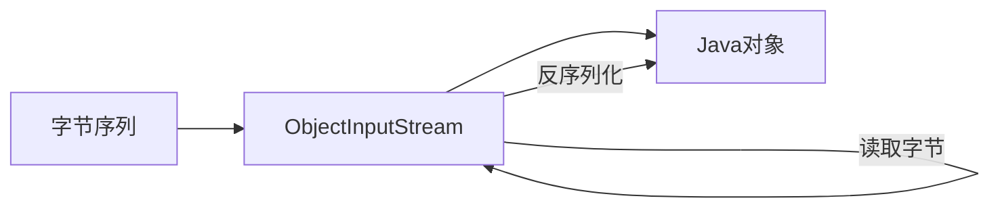

# Java ObjectInputStream

## 简介

`ObjectInputStream`是Java IO包中的一个重要类，它允许程序从输入流中读取Java对象。这个过程称为"反序列化"(deserialization)，即将字节序列转换回Java对象的过程。它是`ObjectOutputStream`类的配对类，后者用于将对象序列化为字节序列。

反序列化在网络传输、数据存储和恢复等场景中非常有用，它使我们能够在不同的JVM之间传递复杂对象，或者将对象状态保存到文件中以便后续恢复。

## 基本原理

`ObjectInputStream`基于以下原理工作：

1. 它从底层输入流读取字节序列（通常由`ObjectOutputStream`创建）
2. 将这些字节序列转换回Java对象
3. 恢复对象的状态（成员变量值）
4. 返回完全重建的对象供程序使用



## 如何使用ObjectInputStream

### 基本使用步骤

使用`ObjectInputStream`的基本步骤如下：

1. 创建一个`ObjectInputStream`对象，它通常包装另一个输入流（如`FileInputStream`）
2. 使用`readObject()`方法读取对象
3. 将返回的对象转换为适当的类型
4. 使用完毕后关闭流

### 代码示例

首先，我们需要一个可序列化的类：

```java
import java.io.Serializable;

public class Student implements Serializable {
    // 序列化版本ID
    private static final long serialVersionUID = 1L;
    
    private String name;
    private int age;
    private String major;
    
    public Student(String name, int age, String major) {
        this.name = name;
        this.age = age;
        this.major = major;
    }
    
    @Override
    public String toString() {
        return "Student{name='" + name + "', age=" + age + ", major='" + major + "'}";
    }
    
    // Getters and setters (省略)
}
```

然后，我们可以使用`ObjectOutputStream`序列化对象：

```java
import java.io.*;

public class SerializationDemo {
    public static void main(String[] args) {
        // 创建Student对象
        Student student = new Student("张三", 20, "计算机科学");
        
        // 序列化对象到文件
        try (FileOutputStream fileOut = new FileOutputStream("student.ser");
             ObjectOutputStream objectOut = new ObjectOutputStream(fileOut)) {
            
            objectOut.writeObject(student);
            System.out.println("Student对象已被序列化");
            
        } catch (IOException e) {
            e.printStackTrace();
        }
    }
}
```

最后，使用`ObjectInputStream`反序列化对象：

```java
import java.io.*;

public class DeserializationDemo {
    public static void main(String[] args) {
        // 从文件反序列化对象
        try (FileInputStream fileIn = new FileInputStream("student.ser");
             ObjectInputStream objectIn = new ObjectInputStream(fileIn)) {
            
            // 读取对象并转换为Student类型
            Student student = (Student) objectIn.readObject();
            System.out.println("Student对象已被反序列化");
            System.out.println(student);
            
        } catch (IOException | ClassNotFoundException e) {
            e.printStackTrace();
        }
    }
}
```

**输出:**
```
Student对象已被反序列化
Student{name='张三', age=20, major='计算机科学'}
```

## 关键方法

`ObjectInputStream`类提供了许多重要的方法：

| 方法 | 描述 |
| --- | --- |
| `readObject()` | 从输入流读取一个对象 |
| `readInt()` | 读取一个32位的int |
| `readLong()` | 读取一个64位的long |
| `readFloat()` | 读取一个32位的float |
| `readDouble()` | 读取一个64位的double |
| `readBoolean()` | 读取一个布尔值 |
| `readChar()` | 读取一个字符 |
| `readUTF()` | 读取一个UTF-8编码的字符串 |
| `close()` | 关闭输入流 |

## 注意事项

使用`ObjectInputStream`时，您需要注意以下事项：

:::warning
被反序列化的类必须实现`Serializable`接口，否则会抛出`NotSerializableException`。
:::

### 版本控制

类的序列化版本ID（`serialVersionUID`）对于版本控制非常重要：

```java
private static final long serialVersionUID = 1L;
```

如果不显式定义此字段，Java会根据类的结构自动生成一个。但如果您修改了类的结构（添加或删除字段），自动生成的ID会改变，导致反序列化失败。

### 安全问题

:::caution
反序列化可能引入安全漏洞，尤其是当接收未知来源的序列化数据时。恶意构造的序列化数据可能导致远程代码执行。
:::

为增强安全性，您可以：
- 实现自定义`readObject()`方法验证对象状态
- 使用`ObjectInputFilter`过滤不受信任的类
- 考虑使用JSON等替代序列化格式

### transient关键字

如果不希望某个字段被序列化，可以使用`transient`关键字标记它：

```java
private transient String sensitiveData;
```

反序列化后，`transient`字段将被设置为默认值（对象为`null`，数值为`0`，布尔值为`false`）。

## 实际应用场景

### 1. 保存应用程序状态

应用程序可以使用序列化和反序列化来保存和恢复状态：

```java
// 保存游戏状态
public void saveGameState(GameState state, String fileName) {
    try (FileOutputStream fileOut = new FileOutputStream(fileName);
         ObjectOutputStream out = new ObjectOutputStream(fileOut)) {
        out.writeObject(state);
    } catch (IOException e) {
        e.printStackTrace();
    }
}

// 加载游戏状态
public GameState loadGameState(String fileName) {
    try (FileInputStream fileIn = new FileInputStream(fileName);
         ObjectInputStream in = new ObjectInputStream(fileIn)) {
        return (GameState) in.readObject();
    } catch (IOException | ClassNotFoundException e) {
        e.printStackTrace();
        return null;
    }
}
```

### 2. 网络通信

序列化和反序列化常用于网络通信中传输复杂对象：

```java
// 服务器端
try (ServerSocket serverSocket = new ServerSocket(8080);
     Socket clientSocket = serverSocket.accept();
     ObjectInputStream in = new ObjectInputStream(clientSocket.getInputStream())) {
    
    // 接收客户端发送的对象
    Message message = (Message) in.readObject();
    System.out.println("收到消息: " + message);
    
} catch (IOException | ClassNotFoundException e) {
    e.printStackTrace();
}
```

### 3. 深度复制对象

序列化可用于实现对象的深度复制：

```java
public static <T extends Serializable> T deepCopy(T object) {
    try {
        ByteArrayOutputStream baos = new ByteArrayOutputStream();
        ObjectOutputStream oos = new ObjectOutputStream(baos);
        oos.writeObject(object);
        
        ByteArrayInputStream bais = new ByteArrayInputStream(baos.toByteArray());
        ObjectInputStream ois = new ObjectInputStream(bais);
        return (T) ois.readObject();
    } catch (Exception e) {
        e.printStackTrace();
        return null;
    }
}
```

## 扩展功能

### 自定义反序列化逻辑

您可以通过重写`readObject`方法来自定义反序列化过程：

```java
private void readObject(ObjectInputStream in) throws IOException, ClassNotFoundException {
    // 调用默认的反序列化实现
    in.defaultReadObject();
    
    // 自定义反序列化逻辑
    if (age < 0) {
        age = 0; // 修正无效年龄
    }
    
    // 初始化transient字段
    this.calculatedField = calculateValue();
}
```

### 处理类演化

如果类结构发生变化（添加或删除字段），您可能需要处理类演化问题：

```java
private void readObject(ObjectInputStream in) throws IOException, ClassNotFoundException {
    ObjectInputStream.GetField fields = in.readFields();
    
    // 读取现有字段
    this.name = (String) fields.get("name", "Unknown");
    this.age = fields.get("age", 0);
    
    // 处理新添加的字段
    if (fields.defaulted("major")) {
        this.major = "General";  // 为旧版本设置默认值
    } else {
        this.major = (String) fields.get("major", "General");
    }
}
```

## 总结

`ObjectInputStream`是Java中用于反序列化对象的关键类，它与`ObjectOutputStream`一起工作，允许我们将Java对象转换为字节流并在需要时恢复它们。这对于对象持久化、网络通信和状态保存非常有用。

使用`ObjectInputStream`时，需要注意：
- 确保类实现了`Serializable`接口
- 管理好`serialVersionUID`以处理类演化
- 注意安全问题，特别是处理外部数据时
- 合理使用`transient`关键字保护敏感数据

通过掌握`ObjectInputStream`，您可以在您的Java应用程序中有效地处理对象序列化和反序列化问题，实现更灵活、功能更强大的数据处理机制。

## 练习

1. 创建一个`Person`类，包含姓名、年龄和地址等字段，将其序列化到文件，然后反序列化回来。
2. 修改`Person`类，添加一个新字段，然后尝试反序列化之前序列化的文件，观察会发生什么。
3. 实现一个简单的笔记应用，可以保存和加载笔记对象。
4. 使用`transient`关键字，创建一个带有敏感信息的类，并验证敏感信息不会被序列化。
5. 实现一个使用序列化进行深度复制的工具方法，测试它是否正确复制复杂对象。

## 更多资源

- [Java官方文档 - ObjectInputStream](https://docs.oracle.com/en/java/javase/11/docs/api/java.base/java/io/ObjectInputStream.html)
- [Oracle教程 - 对象序列化](https://docs.oracle.com/javase/tutorial/jndi/objects/serial.html)
- [序列化安全最佳实践](https://www.oracle.com/java/technologies/javase/seccodeguide.html#8)

继续探索Java IO的其他方面，如网络流和缓冲流，以构建强大的Java应用程序！