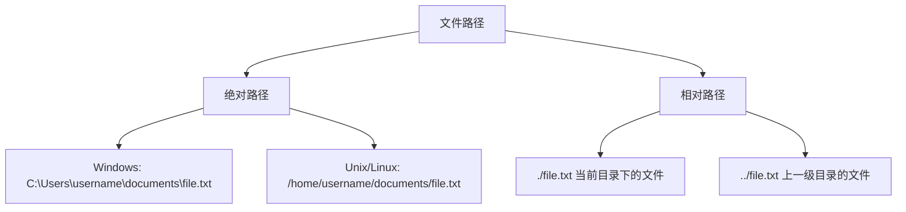

# Java 文件路径

在Java程序中，正确地处理文件路径是文件操作的基础。无论是读取配置文件、保存数据，还是处理图像和媒体，都需要通过文件路径来定位资源。本文将详细介绍Java中文件路径的概念、表示方法以及相关API的使用。

## 什么是文件路径？

文件路径是用来唯一标识文件或目录位置的字符串。在Java中，文件路径可分为两种基本类型：

1. **绝对路径**：从根目录开始的完整路径
2. **相对路径**：相对于当前工作目录的路径



## 路径分隔符

不同操作系统使用不同的路径分隔符：

- Windows: 反斜杠 `\`
- Unix/Linux/Mac OS: 正斜杠 `/`

:::caution 注意
在Java字符串中，反斜杠`\`是转义字符，所以在Windows路径中需要使用双反斜杠`\\`。
:::

为了编写跨平台代码，Java提供了`File.separator`常量，可以自动适应当前操作系统的分隔符。

```java
String filePath = "documents" + File.separator + "data" + File.separator + "input.txt";
```

## Java 中处理文件路径的类

### 1. File类

`java.io.File`是Java早期提供的处理文件和目录路径的类。

```java
// 创建File对象
File file = new File("data/config.properties");

// 检查文件是否存在
boolean exists = file.exists();

// 获取绝对路径
String absolutePath = file.getAbsolutePath();

// 获取规范路径（解析.和..符号）
String canonicalPath = file.getCanonicalPath();

// 创建目录
boolean dirCreated = new File("data/output").mkdir();

// 创建多级目录
boolean dirsCreated = new File("data/output/logs").mkdirs();

// 列出目录内容
File directory = new File("data");
String[] fileList = directory.list();
File[] files = directory.listFiles();
```

### 2. Path接口和Paths工具类

从Java 7开始，引入了`java.nio.file.Path`接口和`Paths`工具类，提供了更强大和灵活的路径操作。

```java
// 创建Path对象
Path path = Paths.get("data", "config.properties");

// 获取文件名
Path fileName = path.getFileName();

// 获取父目录
Path parent = path.getParent();

// 解析相对路径
Path resolvedPath = path.resolve("logs/app.log");

// 标准化路径（解析.和..）
Path normalizedPath = path.normalize();

// 获取绝对路径
Path absolutePath = path.toAbsolutePath();

// 转换为File对象
File file = path.toFile();
```

### 3. 获取类路径资源

在Java应用中，特别是在打包为JAR文件时，通常需要从类路径加载资源：

```java
// 从类路径获取资源
URL resourceUrl = Main.class.getResource("/config/settings.properties");
URL resourceUrl2 = Main.class.getClassLoader().getResource("config/settings.properties");

// 作为流读取
InputStream inputStream = Main.class.getResourceAsStream("/config/settings.properties");
```

:::tip 提示
使用类路径资源可以确保无论应用是从IDE运行、作为JAR运行还是在Web容器中运行，都能正确找到资源文件。
:::

## 实际应用案例

### 案例1：配置文件读取

```java
import java.io.IOException;
import java.nio.file.Files;
import java.nio.file.Path;
import java.nio.file.Paths;
import java.util.Properties;

public class ConfigReader {
    public static Properties loadConfig(String configFileName) {
        Properties properties = new Properties();
        
        // 首先尝试从类路径加载
        try (InputStream is = ConfigReader.class.getResourceAsStream("/config/" + configFileName)) {
            if (is != null) {
                properties.load(is);
                System.out.println("从类路径加载配置成功");
                return properties;
            }
        } catch (IOException e) {
            System.err.println("从类路径加载配置失败: " + e.getMessage());
        }
        
        // 如果类路径加载失败，尝试从文件系统加载
        Path configPath = Paths.get("config", configFileName);
        try (InputStream is = Files.newInputStream(configPath)) {
            properties.load(is);
            System.out.println("从文件系统加载配置成功: " + configPath.toAbsolutePath());
        } catch (IOException e) {
            System.err.println("从文件系统加载配置失败: " + e.getMessage());
        }
        
        return properties;
    }
    
    public static void main(String[] args) {
        Properties config = loadConfig("application.properties");
        String dbUrl = config.getProperty("database.url", "默认URL");
        System.out.println("数据库URL: " + dbUrl);
    }
}
```

### 案例2：文件管理工具

```java
import java.io.IOException;
import java.nio.file.*;
import java.nio.file.attribute.BasicFileAttributes;

public class FileManager {
    
    // 列出指定目录下的所有文件
    public static void listFiles(Path directory) throws IOException {
        if (!Files.isDirectory(directory)) {
            System.out.println("不是有效目录: " + directory);
            return;
        }
        
        System.out.println("目录内容: " + directory);
        try (DirectoryStream<Path> stream = Files.newDirectoryStream(directory)) {
            for (Path entry: stream) {
                String type = Files.isDirectory(entry) ? "目录" : "文件";
                System.out.printf("%-8s: %s\n", type, entry.getFileName());
            }
        }
    }
    
    // 递归拷贝目录
    public static void copyDirectory(Path source, Path destination) throws IOException {
        Files.walkFileTree(source, new SimpleFileVisitor<Path>() {
            @Override
            public FileVisitResult preVisitDirectory(Path dir, BasicFileAttributes attrs) throws IOException {
                Path targetDir = destination.resolve(source.relativize(dir));
                Files.createDirectories(targetDir);
                return FileVisitResult.CONTINUE;
            }
            
            @Override
            public FileVisitResult visitFile(Path file, BasicFileAttributes attrs) throws IOException {
                Files.copy(file, destination.resolve(source.relativize(file)), 
                           StandardCopyOption.REPLACE_EXISTING);
                return FileVisitResult.CONTINUE;
            }
        });
    }
    
    public static void main(String[] args) {
        try {
            Path sourceDir = Paths.get("src/main/resources");
            Path targetDir = Paths.get("backup/resources");
            
            System.out.println("列出源目录内容:");
            listFiles(sourceDir);
            
            System.out.println("\n复制目录...");
            copyDirectory(sourceDir, targetDir);
            
            System.out.println("\n列出目标目录内容:");
            listFiles(targetDir);
            
        } catch (IOException e) {
            System.err.println("文件操作失败: " + e.getMessage());
        }
    }
}
```

## 常见路径问题和解决方案

### 1. 相对路径和当前工作目录

Java程序的当前工作目录是程序启动的目录，这会影响相对路径的解析。

```java
// 获取当前工作目录
String workingDir = System.getProperty("user.dir");
System.out.println("当前工作目录: " + workingDir);
```

:::warning 警告
当从不同位置启动Java程序时，相对路径可能会导致文件未找到错误。
:::

### 2. 路径中的特殊字符

处理包含空格或特殊字符的路径：

```java
// Windows路径中的空格
Path windowsPath = Paths.get("C:\\Program Files\\Java\\config.ini");

// 特殊字符转义
Path specialPath = Paths.get("data", "reports (2023)", "summary.txt");
```

### 3. 临时文件路径

创建和处理临时文件：

```java
// 创建临时文件
Path tempFile = Files.createTempFile("prefix-", "-suffix.txt");
System.out.println("临时文件: " + tempFile);

// 获取系统临时目录
String tempDir = System.getProperty("java.io.tmpdir");
System.out.println("系统临时目录: " + tempDir);
```

## 总结

正确处理Java中的文件路径对于开发健壮的应用程序至关重要：

1. 了解绝对路径和相对路径的区别
2. 使用`File.separator`或`/`作为跨平台分隔符
3. 现代应用推荐使用`Path`和`Files`类，而不是旧的`File`类
4. 使用类路径资源加载打包在JAR中的文件
5. 注意工作目录对相对路径的影响
6. 处理路径时注意特殊字符和空格

## 练习

1. 编写一个程序，列出指定目录下所有的Java源文件（.java文件）。
2. 创建一个文件备份工具，将指定目录下的所有文本文件复制到备份目录，保持相同的目录结构。
3. 编写一个方法，接收一个相对路径字符串，并返回对应的规范化绝对路径。
4. 实现一个简单的文件搜索功能，在目录树中查找包含特定文本的所有文件。

## 扩展资源

- [Java官方文档 - Path](https://docs.oracle.com/en/java/javase/11/docs/api/java.base/java/nio/file/Path.html)
- [Java官方文档 - Files](https://docs.oracle.com/en/java/javase/11/docs/api/java.base/java/nio/file/Files.html)
- [Java官方文档 - File](https://docs.oracle.com/en/java/javase/11/docs/api/java.base/java/io/File.html)

正确理解和使用文件路径是Java I/O操作的基础，掌握本文内容将帮助你更有效地进行文件操作和资源管理。