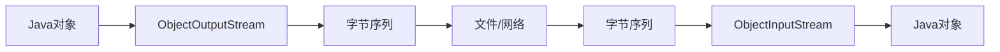

# Java ObjectOutputStream

在Java编程中，将对象保存到文件或通过网络传输是很常见的需求。Java提供了`ObjectOutputStream`类来实现这一功能，它是实现对象序列化的关键类。本文将全面介绍`ObjectOutputStream`的使用方法、特点以及实际应用场景。

## 什么是ObjectOutputStream？

`ObjectOutputStream`是Java IO包中的一个类，它将Java对象转换为字节序列（称为对象序列化），这些字节序列可以保存到文件中或通过网络发送。序列化后的对象可以通过`ObjectInputStream`重新读取并还原为原始对象。



## ObjectOutputStream的基本用法

### 创建ObjectOutputStream

要使用`ObjectOutputStream`，首先需要创建一个实例，并将其关联到一个`OutputStream`：

```java
// 创建文件输出流
FileOutputStream fileOut = new FileOutputStream("data.ser");
// 创建对象输出流
ObjectOutputStream objectOut = new ObjectOutputStream(fileOut);
```

### 序列化对象

一旦创建了`ObjectOutputStream`，就可以使用`writeObject()`方法将对象写入流中：

```java
// 创建一个对象
Person person = new Person("张三", 25);
// 将对象写入流中
objectOut.writeObject(person);
```

### 关闭流

使用完`ObjectOutputStream`后，需要关闭它：

```java
objectOut.close();
fileOut.close();
```

:::caution
在实际应用中，应该使用try-catch-finally或try-with-resources语句来确保流被正确关闭。
:::

## 支持序列化的对象

要使一个对象能够被序列化，该对象的类必须实现`Serializable`接口：

```java
import java.io.Serializable;

public class Person implements Serializable {
    private String name;
    private int age;
    
    public Person(String name, int age) {
        this.name = name;
        this.age = age;
    }
    
    // getter和setter方法
    public String getName() { return name; }
    public void setName(String name) { this.name = name; }
    public int getAge() { return age; }
    public void setAge(int age) { this.age = age; }
    
    @Override
    public String toString() {
        return "Person [name=" + name + ", age=" + age + "]";
    }
}
```

:::tip
`Serializable`是一个标记接口，它没有方法需要实现。它只是告诉JVM该类可以被序列化。
:::

## 完整的序列化与反序列化示例

下面是一个完整的示例，展示了如何序列化对象并从文件中反序列化它：

```java
import java.io.*;

public class SerializationDemo {
    public static void main(String[] args) {
        // 序列化对象
        try (FileOutputStream fileOut = new FileOutputStream("person.ser");
             ObjectOutputStream out = new ObjectOutputStream(fileOut)) {
            
            Person person = new Person("张三", 25);
            out.writeObject(person);
            System.out.println("对象已被序列化并保存到person.ser文件");
            
        } catch (IOException e) {
            e.printStackTrace();
        }
        
        // 反序列化对象
        try (FileInputStream fileIn = new FileInputStream("person.ser");
             ObjectInputStream in = new ObjectInputStream(fileIn)) {
            
            Person person = (Person) in.readObject();
            System.out.println("对象已从person.ser文件中反序列化");
            System.out.println(person);
            
        } catch (IOException | ClassNotFoundException e) {
            e.printStackTrace();
        }
    }
}
```

**输出结果：**

```
对象已被序列化并保存到person.ser文件
对象已从person.ser文件中反序列化
Person [name=张三, age=25]
```

## 高级特性

### 序列化多个对象

`ObjectOutputStream`可以序列化多个对象：

```java
objectOut.writeObject(person1);
objectOut.writeObject(person2);
objectOut.writeObject(person3);
```

反序列化时，必须按照相同的顺序读取对象：

```java
Person person1 = (Person) objectIn.readObject();
Person person2 = (Person) objectIn.readObject();
Person person3 = (Person) objectIn.readObject();
```

### 自定义序列化

有时候，你可能不希望序列化对象的所有字段，或者需要以特定方式序列化某些字段。此时，可以通过实现`writeObject`和`readObject`方法来自定义序列化过程：

```java
public class Person implements Serializable {
    private String name;
    private int age;
    private transient String password; // transient字段不会被序列化
    
    // ... 构造函数和其他方法
    
    private void writeObject(ObjectOutputStream out) throws IOException {
        out.defaultWriteObject(); // 执行默认的序列化
        // 自定义序列化逻辑，例如加密密码
        out.writeObject(encrypt(password));
    }
    
    private void readObject(ObjectInputStream in) throws IOException, ClassNotFoundException {
        in.defaultReadObject(); // 执行默认的反序列化
        // 自定义反序列化逻辑，例如解密密码
        this.password = decrypt((String) in.readObject());
    }
    
    // 加密和解密方法
    private String encrypt(String str) { /* 实现略 */ return str; }
    private String decrypt(String str) { /* 实现略 */ return str; }
}
```

### 序列化版本控制

在实际应用中，类的定义可能会随着时间的推移而变化。为了确保序列化的兼容性，可以为类指定`serialVersionUID`：

```java
public class Person implements Serializable {
    private static final long serialVersionUID = 1L;
    // ... 其他字段和方法
}
```

:::warning
如果不显式定义`serialVersionUID`，JVM会根据类的结构自动生成一个。但是，如果类的结构发生变化，自动生成的ID也会变化，导致反序列化失败。因此，建议显式定义`serialVersionUID`。
:::

## 实际应用场景

### 1. 保存应用程序状态

序列化可以用于保存应用程序的状态，以便在下次启动时恢复：

```java
public class ApplicationState implements Serializable {
    private Map<String, Object> settings;
    private List<User> loggedInUsers;
    // ... 其他状态信息
    
    public static void saveState(ApplicationState state, String filename) {
        try (ObjectOutputStream out = new ObjectOutputStream(new FileOutputStream(filename))) {
            out.writeObject(state);
        } catch (IOException e) {
            e.printStackTrace();
        }
    }
    
    public static ApplicationState loadState(String filename) {
        try (ObjectInputStream in = new ObjectInputStream(new FileInputStream(filename))) {
            return (ApplicationState) in.readObject();
        } catch (IOException | ClassNotFoundException e) {
            e.printStackTrace();
            return new ApplicationState(); // 返回默认状态
        }
    }
}
```

### 2. 网络通信

序列化在网络通信中很有用，特别是在客户端-服务器应用程序中：

```java
// 服务器端代码
public class Server {
    public static void main(String[] args) {
        try (ServerSocket serverSocket = new ServerSocket(8888)) {
            Socket socket = serverSocket.accept();
            ObjectOutputStream out = new ObjectOutputStream(socket.getOutputStream());
            
            // 发送对象到客户端
            Message message = new Message("欢迎连接到服务器！");
            out.writeObject(message);
            
        } catch (IOException e) {
            e.printStackTrace();
        }
    }
}

// 客户端代码
public class Client {
    public static void main(String[] args) {
        try (Socket socket = new Socket("localhost", 8888)) {
            ObjectInputStream in = new ObjectInputStream(socket.getInputStream());
            
            // 接收服务器发送的对象
            Message message = (Message) in.readObject();
            System.out.println("收到消息：" + message.getContent());
            
        } catch (IOException | ClassNotFoundException e) {
            e.printStackTrace();
        }
    }
}
```

### 3. 深度复制对象

序列化可以用于创建对象的深拷贝：

```java
public static <T extends Serializable> T deepCopy(T object) {
    try {
        ByteArrayOutputStream baos = new ByteArrayOutputStream();
        ObjectOutputStream out = new ObjectOutputStream(baos);
        out.writeObject(object);
        out.close();
        
        ByteArrayInputStream bais = new ByteArrayInputStream(baos.toByteArray());
        ObjectInputStream in = new ObjectInputStream(bais);
        @SuppressWarnings("unchecked")
        T copy = (T) in.readObject();
        in.close();
        
        return copy;
    } catch (Exception e) {
        throw new RuntimeException(e);
    }
}
```

## 性能考虑与最佳实践

1. **避免序列化大对象**：序列化大对象可能会导致性能问题。考虑只序列化必要的数据。

2. **使用`transient`关键字**：对于不需要序列化的字段，使用`transient`关键字标记。

3. **考虑替代方案**：对于某些场景，可能有更高效的替代方案，如JSON序列化、Protocol Buffers等。

4. **处理循环引用**：序列化可以正确处理循环引用，但要小心不要创建过于复杂的对象图。

## 总结

`ObjectOutputStream`是Java中进行对象序列化的关键类，它允许将Java对象转换为字节序列，以便保存到文件或通过网络传输。使用`ObjectOutputStream`时，需要确保要序列化的类实现了`Serializable`接口。此外，还可以通过自定义序列化方法和使用`transient`关键字来控制序列化的行为。

序列化在保存应用程序状态、网络通信和对象深拷贝等场景中有广泛的应用。然而，在使用序列化时，还需要考虑性能、安全性和兼容性等因素。

## 练习

1. 创建一个`Student`类，包含名字、年龄和成绩等信息，并实现序列化。编写程序将多个`Student`对象序列化到文件中，然后再读取出来。

2. 修改`Student`类，添加一个不应该被序列化的敏感信息字段（如密码），并使用`transient`关键字标记。验证该字段是否在反序列化后为`null`。

3. 实现一个简单的聊天应用，使用`ObjectOutputStream`和`ObjectInputStream`在客户端和服务器之间传输消息对象。

4. 使用上面提供的深拷贝方法，探索对象深拷贝与浅拷贝的区别。

## 额外资源

- [Java官方文档 - ObjectOutputStream](https://docs.oracle.com/en/java/javase/11/docs/api/java.base/java/io/ObjectOutputStream.html)
- [Java序列化的高级主题](https://www.oracle.com/technical-resources/articles/java/serializationapi.html)
- [Effective Java, Third Edition](https://www.oreilly.com/library/view/effective-java-3rd/9780134686097/) - 第12章：序列化

通过掌握`ObjectOutputStream`和对象序列化，你将能够在Java应用程序中实现数据持久化和对象传输功能，为开发更复杂的应用程序打下基础。