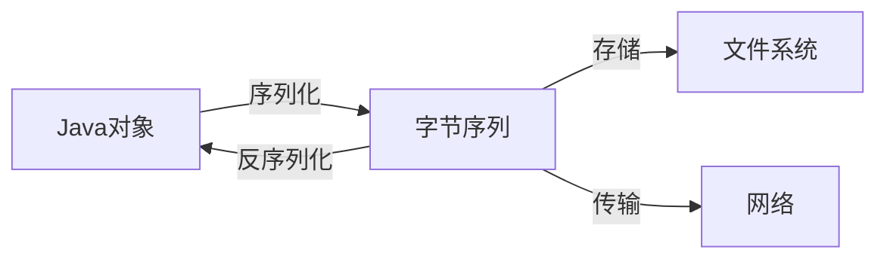

# Java 序列化

## 什么是Java序列化？

Java序列化是将Java对象转换为字节序列的过程，这个字节序列可以保存到文件中或通过网络传输。而反序列化则是将这些字节序列恢复为原始Java对象的过程。

序列化为我们解决了两个主要问题：
1. **对象持久化** - 将对象状态保存到存储介质中
2. **网络传输** - 在网络上传输对象



## 序列化基础

### 实现Serializable接口

要使一个类可序列化，它必须实现`java.io.Serializable`接口。这是一个标记接口，不包含任何方法，但告诉JVM该类可以被序列化。

```java
import java.io.Serializable;

public class Student implements Serializable {
    // 推荐显式定义serialVersionUID
    private static final long serialVersionUID = 1L;
    
    private String name;
    private int age;
    private String studentId;
    
    // 构造函数、getter和setter方法
    public Student(String name, int age, String studentId) {
        this.name = name;
        this.age = age;
        this.studentId = studentId;
    }
    
    public String getName() {
        return name;
    }
    
    public int getAge() {
        return age;
    }
    
    public String getStudentId() {
        return studentId;
    }
    
    @Override
    public String toString() {
        return "Student{name='" + name + "', age=" + age + ", studentId='" + studentId + "'}";
    }
}
```

### serialVersionUID

`serialVersionUID`是序列化版本控制的关键。如果不显式定义，JVM会根据类的结构自动生成一个。但建议显式定义，避免类结构变化导致的不兼容问题。

:::caution 警告
如果不显式定义serialVersionUID，当类结构发生变化后，JVM可能会生成一个不同的ID，导致无法反序列化之前序列化的对象。
:::

## 序列化和反序列化操作

### 序列化对象

使用`ObjectOutputStream`将对象写入文件：

```java
import java.io.*;

public class SerializationDemo {
    public static void main(String[] args) {
        // 创建一个Student对象
        Student student = new Student("张三", 20, "20230001");
        
        try {
            // 创建文件输出流
            FileOutputStream fileOut = new FileOutputStream("student.ser");
            
            // 创建对象输出流
            ObjectOutputStream out = new ObjectOutputStream(fileOut);
            
            // 序列化对象
            out.writeObject(student);
            
            // 关闭流
            out.close();
            fileOut.close();
            
            System.out.println("对象已被序列化到student.ser文件中");
            
        } catch (IOException e) {
            e.printStackTrace();
        }
    }
}
```

### 反序列化对象

使用`ObjectInputStream`从文件读取对象：

```java
import java.io.*;

public class DeserializationDemo {
    public static void main(String[] args) {
        Student student = null;
        
        try {
            // 创建文件输入流
            FileInputStream fileIn = new FileInputStream("student.ser");
            
            // 创建对象输入流
            ObjectInputStream in = new ObjectInputStream(fileIn);
            
            // 反序列化对象
            student = (Student) in.readObject();
            
            // 关闭流
            in.close();
            fileIn.close();
            
        } catch (IOException | ClassNotFoundException e) {
            e.printStackTrace();
            return;
        }
        
        // 输出反序列化的对象信息
        System.out.println("反序列化的Student对象:");
        System.out.println(student);
        
        // 输出：Student{name='张三', age=20, studentId='20230001'}
    }
}
```

## 序列化的进阶特性

### 瞬态字段（transient）

如果某个字段不希望被序列化，可以使用`transient`关键字标记：

```java
public class Student implements Serializable {
    private static final long serialVersionUID = 1L;
    
    private String name;
    private int age;
    // 学生密码不应该被序列化
    private transient String password;
    private String studentId;
    
    // 构造函数和方法...
}
```

标记为`transient`的字段在反序列化后将被设为默认值（对象为null，基本类型为0/false）。

### 自定义序列化行为

通过实现以下特殊方法，可以自定义序列化和反序列化行为：

```java
public class Student implements Serializable {
    // ... 其他代码
    
    private void writeObject(ObjectOutputStream out) throws IOException {
        // 自定义序列化逻辑
        out.defaultWriteObject(); // 执行默认序列化
        // 可以在这里添加额外的序列化逻辑
    }
    
    private void readObject(ObjectInputStream in) throws IOException, ClassNotFoundException {
        // 自定义反序列化逻辑
        in.defaultReadObject(); // 执行默认反序列化
        // 可以在这里添加额外的反序列化逻辑
    }
}
```

## 序列化的实际应用场景

### 1. 会话管理

Java Web应用中，用户会话（HttpSession）通常需要序列化，以便在服务器重启或集群环境中保持会话状态。

### 2. 远程方法调用（RMI）

在Java RMI中，对象需要序列化才能在网络上传输给远程JVM。

```java
public interface HelloService extends Remote {
    String sayHello(String name) throws RemoteException;
}

public class HelloServiceImpl extends UnicastRemoteObject implements HelloService {
    private static final long serialVersionUID = 1L;
    
    public HelloServiceImpl() throws RemoteException {
        super();
    }
    
    @Override
    public String sayHello(String name) throws RemoteException {
        return "Hello, " + name + "!";
    }
}
```

### 3. 数据缓存

需要将对象缓存到磁盘或分布式缓存系统（如Redis）时，常常使用序列化。

```java
// 序列化对象到Redis示例代码
ByteArrayOutputStream baos = new ByteArrayOutputStream();
ObjectOutputStream oos = new ObjectOutputStream(baos);
oos.writeObject(studentObject);
byte[] serializedStudent = baos.toByteArray();

// 存储到Redis
jedis.set("student:20230001".getBytes(), serializedStudent);
```

### 4. 对象深拷贝

可以通过序列化和反序列化实现对象的深拷贝：

```java
public static <T> T deepCopy(T object) {
    try {
        ByteArrayOutputStream baos = new ByteArrayOutputStream();
        ObjectOutputStream oos = new ObjectOutputStream(baos);
        oos.writeObject(object);
        
        ByteArrayInputStream bais = new ByteArrayInputStream(baos.toByteArray());
        ObjectInputStream ois = new ObjectInputStream(bais);
        return (T) ois.readObject();
    } catch (Exception e) {
        e.printStackTrace();
        return null;
    }
}
```

:::tip 提示
虽然这是一种深拷贝方法，但对于复杂对象，可能不是性能最优的选择。
:::

## 序列化的最佳实践

1. **始终定义serialVersionUID**
   ```java
   private static final long serialVersionUID = 1L;
   ```

2. **谨慎使用自定义序列化**
   只有在特殊需求时才实现`writeObject`和`readObject`方法。

3. **敏感数据加密**
   对于需要序列化的敏感数据，考虑加密后再序列化。

4. **考虑使用更现代的序列化框架**
   如JSON序列化库（Jackson, Gson）或Protocol Buffers等。

5. **避免序列化整个对象图**
   使用`transient`关键字排除不需要序列化的字段。

6. **兼容性设计**
   当类结构变化时，小心维护序列化兼容性。

## 序列化的限制和注意事项

1. **性能考虑**
   Java原生序列化效率不高，特别是对于大型对象图。

2. **安全性问题**
   反序列化漏洞是一种严重的安全风险。

3. **维护成本**
   随着类的演变，维护序列化兼容性变得复杂。

4. **跨平台限制**
   Java序列化主要适用于Java平台内部交互。

## 总结

Java序列化是将对象转换为字节流以便存储或传输的过程，而反序列化则是将字节流恢复为对象。实现序列化需要类实现`Serializable`接口，并且应当定义`serialVersionUID`以控制版本。使用`transient`关键字可以排除特定字段不被序列化。

序列化在会话管理、远程调用、对象缓存等场景中有广泛应用，但同时也存在性能和安全性等方面的考虑。在现代应用中，根据具体需求，可能需要考虑使用JSON、XML或Protocol Buffers等更高效的序列化方案。

## 练习

1. 创建一个`Book`类，包含标题、作者、价格和ISBN等字段，实现序列化。
2. 编写程序将多个`Book`对象序列化到文件，然后从文件中读取并恢复这些对象。
3. 探索使用`transient`关键字对不同类型字段的影响。
4. 尝试修改类结构后反序列化之前的对象，观察会发生什么。
5. 使用第三方库如Jackson或Gson，对比它们与Java原生序列化的性能差异。

## 延伸阅读资源

- 《Effective Java》第12章 - 序列化
- Java官方文档：[Object Serialization](https://docs.oracle.com/javase/tutorial/jndi/objects/serial.html)
- OWASP关于Java反序列化漏洞的文章

无论你是构建桌面应用、Web应用还是分布式系统，掌握Java序列化都将帮助你有效地处理对象持久化和数据传输需求。