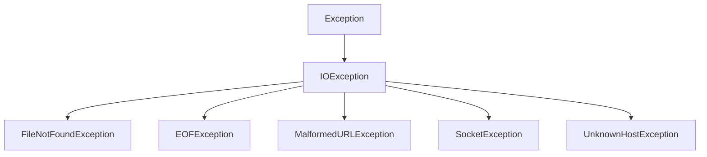

# Java IO异常处理

在Java编程中，输入输出（IO）操作是最常见的可能导致异常的操作之一。因为IO操作涉及外部资源（如文件、网络连接等），这些资源的状态不完全受程序控制，因此异常处理就显得尤为重要。本文将全面介绍Java IO异常处理的相关知识，帮助初学者理解并掌握如何在程序中妥善处理IO异常。

## IO异常概述

Java中的IO异常主要来自于`java.io`包中的各种类，其中最基本的异常类是`IOException`。这是一个检查型异常（Checked Exception），意味着Java编译器会强制要求你处理这类异常。

:::note
**检查型异常（Checked Exception）与非检查型异常（Unchecked Exception）**

- 检查型异常：必须显式处理（try-catch或throws），否则编译不通过
- 非检查型异常：编译器不会强制要求处理，通常是程序逻辑错误造成的
:::

## 常见的IO异常类型

Java IO操作中常见的异常包括：

1. **IOException**: IO操作的基本异常类
2. **FileNotFoundException**: 尝试访问不存在的文件时抛出
3. **EOFException**: 意外到达文件或流末尾时抛出
4. **MalformedURLException**: URL格式错误时抛出
5. **UnknownHostException**: 无法解析主机名时抛出
6. **SocketException**: 网络通信错误时抛出



## IO异常处理的基本方式

### 1. try-catch-finally块

最常见的处理异常的方式是使用try-catch-finally块：

```java
import java.io.FileReader;
import java.io.IOException;

public class FileReadExample {
    public static void main(String[] args) {
        FileReader reader = null;
        try {
            reader = new FileReader("example.txt");
            int character;
            while ((character = reader.read()) != -1) {
                System.out.print((char) character);
            }
        } catch (IOException e) {
            System.err.println("发生IO错误: " + e.getMessage());
            e.printStackTrace();
        } finally {
            try {
                if (reader != null) {
                    reader.close();
                }
            } catch (IOException e) {
                System.err.println("关闭文件时发生错误: " + e.getMessage());
            }
        }
    }
}
```

**输出示例**（如果文件存在）:
```
文件内容将显示在这里
```

**输出示例**（如果文件不存在）:
```
发生IO错误: example.txt (No such file or directory)
java.io.FileNotFoundException: example.txt (No such file or directory)
    at java.base/java.io.FileInputStream.open0(Native Method)
    at java.base/java.io.FileInputStream.open(FileInputStream.java:216)
    ...
```

### 2. try-with-resources语句（Java 7+）

Java 7引入了try-with-resources语句，可以自动管理资源的关闭，简化了异常处理代码：

```java
import java.io.BufferedReader;
import java.io.FileReader;
import java.io.IOException;

public class TryWithResourcesExample {
    public static void main(String[] args) {
        try (BufferedReader reader = new BufferedReader(new FileReader("example.txt"))) {
            String line;
            while ((line = reader.readLine()) != null) {
                System.out.println(line);
            }
        } catch (IOException e) {
            System.err.println("发生IO错误: " + e.getMessage());
        }
        // 不需要finally块，资源会自动关闭
    }
}
```

:::tip
使用try-with-resources可以避免资源泄露，并显著简化代码。所有实现了`AutoCloseable`或`Closeable`接口的类都可以在此语句中使用。
:::

### 3. 声明抛出异常

如果不想在当前方法中处理异常，可以声明方法抛出异常，将异常处理的责任传递给调用者：

```java
import java.io.BufferedReader;
import java.io.FileReader;
import java.io.IOException;

public class ThrowsExample {
    // 方法声明抛出IOException
    public static String readFirstLine(String path) throws IOException {
        try (BufferedReader reader = new BufferedReader(new FileReader(path))) {
            return reader.readLine();
        }
    }
    
    public static void main(String[] args) {
        try {
            String firstLine = readFirstLine("example.txt");
            System.out.println("文件第一行: " + firstLine);
        } catch (IOException e) {
            System.err.println("读取文件失败: " + e.getMessage());
        }
    }
}
```

## 异常处理的最佳实践

### 1. 具体异常先捕获，通用异常后捕获

当有多个catch块时，应该将更具体的异常（子类）放在更通用的异常（父类）之前：

```java
import java.io.FileNotFoundException;
import java.io.IOException;
import java.io.FileReader;

public class MultipleExceptionExample {
    public static void main(String[] args) {
        try {
            FileReader reader = new FileReader("missing.txt");
            // 其他IO操作...
        } catch (FileNotFoundException e) {
            // 特定处理文件未找到的情况
            System.err.println("文件不存在: " + e.getMessage());
        } catch (IOException e) {
            // 处理其他IO异常
            System.err.println("IO错误: " + e.getMessage());
        }
    }
}
```

### 2. 使用多重捕获（Java 7+）

Java 7引入了多重捕获语法，可以用一个catch块处理多种异常：

```java
import java.io.FileNotFoundException;
import java.io.IOException;
import java.sql.SQLException;

public class MultiCatchExample {
    public static void main(String[] args) {
        try {
            // 可能抛出多种异常的代码
            readFromFileAndDatabase();
        } catch (FileNotFoundException | SQLException e) {
            // 同时处理文件不存在或SQL异常
            System.err.println("资源访问错误: " + e.getMessage());
        } catch (IOException e) {
            // 处理其他IO异常
            System.err.println("其他IO错误: " + e.getMessage());
        }
    }
    
    public static void readFromFileAndDatabase() throws IOException, SQLException {
        // 实现省略
    }
}
```

### 3. 不要忽略异常

避免使用空的catch块，这会掩盖问题而不是解决问题：

```java
// 不推荐的做法
try {
    // IO操作
} catch (IOException e) {
    // 什么也不做，完全忽略异常
}

// 推荐的做法
try {
    // IO操作
} catch (IOException e) {
    System.err.println("IO错误: " + e.getMessage());
    // 记录日志、通知用户或采取其他适当措施
    logger.error("IO操作失败", e); // 使用日志框架
}
```

### 4. 合理使用异常链

当捕获异常后重新抛出不同类型的异常时，保留原始异常信息：

```java
public void processFile(String path) throws ServiceException {
    try {
        // 文件处理代码
    } catch (IOException e) {
        // 将IO异常转换为服务异常，但保留原始异常信息
        throw new ServiceException("处理文件时出错", e);
    }
}
```

## 实际案例：文件复制程序

下面是一个实际的文件复制程序，演示了综合的IO异常处理：

```java
import java.io.BufferedInputStream;
import java.io.BufferedOutputStream;
import java.io.File;
import java.io.FileInputStream;
import java.io.FileNotFoundException;
import java.io.FileOutputStream;
import java.io.IOException;

public class FileCopyWithExceptionHandling {
    public static void main(String[] args) {
        // 源文件和目标文件的路径
        String sourcePath = "source.txt";
        String targetPath = "target.txt";

        // 调用复制方法
        try {
            copyFile(sourcePath, targetPath);
            System.out.println("文件复制成功！");
        } catch (FileNotFoundException e) {
            System.err.println("文件不存在: " + e.getMessage());
        } catch (IOException e) {
            System.err.println("复制过程中发生IO错误: " + e.getMessage());
        }
    }

    public static void copyFile(String sourcePath, String targetPath) throws IOException {
        // 验证源文件存在
        File sourceFile = new File(sourcePath);
        if (!sourceFile.exists() || !sourceFile.isFile()) {
            throw new FileNotFoundException("源文件不存在: " + sourcePath);
        }

        // 创建目标文件的目录（如果不存在）
        File targetFile = new File(targetPath);
        File parent = targetFile.getParentFile();
        if (parent != null && !parent.exists()) {
            parent.mkdirs();
        }

        // 使用缓冲流提高效率，并用try-with-resources确保资源正确关闭
        try (BufferedInputStream bis = new BufferedInputStream(new FileInputStream(sourceFile));
             BufferedOutputStream bos = new BufferedOutputStream(new FileOutputStream(targetFile))) {

            byte[] buffer = new byte[4096];
            int bytesRead;

            // 读取源文件并写入目标文件
            while ((bytesRead = bis.read(buffer)) != -1) {
                bos.write(buffer, 0, bytesRead);
            }
            
            // 确保所有数据都写入目标文件
            bos.flush();
        }
    }
}
```

## 总结

本文介绍了Java IO异常处理的基础知识和最佳实践：

1. 了解常见的IO异常类型，如`IOException`、`FileNotFoundException`等
2. 掌握了三种处理IO异常的方式：使用try-catch-finally、try-with-resources以及声明throws
3. 学习了异常处理的最佳实践，包括异常捕获顺序、多重捕获、避免忽略异常和异常链的使用
4. 通过实际的文件复制案例，综合应用了异常处理技术

掌握IO异常处理是Java编程的基本功之一，它可以让你的程序更加健壮，能够优雅地处理意外情况，提供更好的用户体验。

## 练习与思考

1. 编写一个程序，读取一个文本文件，统计其中的行数、单词数和字符数，并确保正确处理所有可能的IO异常。
2. 修改上面的文件复制例子，增加进度反馈（如已复制的字节数和百分比）。
3. 实现一个简单的日志系统，将程序的操作和可能出现的异常记录到日志文件中。

## 额外资源

- [Java官方文档 - 异常处理](https://docs.oracle.com/javase/tutorial/essential/exceptions/index.html)
- [Java IO与NIO](https://docs.oracle.com/javase/8/docs/technotes/guides/io/index.html)
- 《Effective Java》第3版的第10章：异常

记住，良好的异常处理不仅仅是捕获异常，更是提供有意义的错误信息和恰当的恢复机制，让你的程序在面对意外情况时依然能平稳运行。