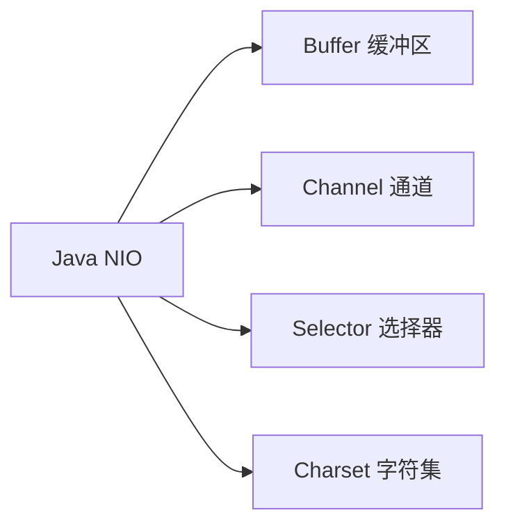
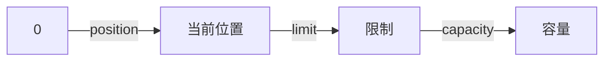

# Java NIO基础

## 什么是Java NIO

Java NIO（New IO或Non-blocking IO）是JDK 1.4中引入的一套全新的IO API，为Java程序员提供了一种替代标准IO的高效IO操作方式。与传统的阻塞IO相比，NIO提供了非阻塞IO、缓冲区以及选择器等新特性，使得IO操作更加灵活高效。

:::note
NIO并不是为了替代传统IO而设计的，而是提供了另一种处理IO的方式。在某些场景下，特别是需要处理大量连接但每个连接的数据量不大的情况，NIO比传统IO更具优势。
:::

## NIO与传统IO的区别

在深入了解NIO之前，先让我们比较一下NIO与传统IO的主要区别：

| 特性     | 传统IO      | NIO                     |
|--------|-----------|-------------------------|
| IO模型   | 阻塞IO      | 非阻塞IO                   |
| 数据处理方式 | 流式数据处理    | 块数据处理                   |
| 核心组件   | 流(Stream) | 通道(Channel)和缓冲区(Buffer) |
| 选择器    | 无         | 有(Selector)             |
| 适用场景   | 连接数少，数据量大 | 连接数多，数据量小               |

## Java NIO的核心组件

Java NIO系统的核心由以下几个部分组成：



让我们详细了解这些组件。

### Buffer（缓冲区）

Buffer是NIO中的核心对象，所有数据都要通过Buffer处理。Buffer本质上是一块可以读写数据的内存区域。这块内存被包装成NIO Buffer对象，提供了一系列方法，用来更简单地操作这块内存。

Buffer的主要实现类包括：

- ByteBuffer：操作字节
- CharBuffer：操作字符
- ShortBuffer：操作短整型
- IntBuffer：操作整型
- LongBuffer：操作长整型
- FloatBuffer：操作浮点型
- DoubleBuffer：操作双精度浮点型

#### Buffer的基本属性

Buffer有三个重要属性：

1. **容量(Capacity)**：Buffer能容纳的数据元素的最大数量
2. **限制(Limit)**：第一个不能被读或写的元素的索引
3. **位置(Position)**：下一个要被读或写的元素的索引

这三个属性满足：`0 <= position <= limit <= capacity`

下面是一个图示，展示了这些属性之间的关系：



#### Buffer的基本操作

使用Buffer通常遵循以下步骤：

1. 将数据写入Buffer
2. 调用`flip()`方法，准备读取数据
3. 从Buffer中读取数据
4. 调用`clear()`或`compact()`方法，清空缓冲区以便下一次写入

下面是一个使用ByteBuffer的简单例子：

```java
// 创建一个容量为48字节的ByteBuffer
ByteBuffer buffer = ByteBuffer.allocate(48);

// 从channel中读取数据到buffer
int bytesRead = channel.read(buffer);

// 准备读取buffer中的数据
buffer.flip();

// 读取buffer中的数据
while(buffer.hasRemaining()) {
    byte b = buffer.get();
    System.out.print((char)b);
}

// 清空buffer，准备下一次写入
buffer.clear();
```

:::tip
除了`allocate()`方法，你还可以使用`ByteBuffer.wrap(byte[] array)`方法将已有的数组包装成Buffer。此外，还可以通过`ByteBuffer.allocateDirect(int capacity)`分配直接缓冲区，这种缓冲区可能在某些情况下提供更好的性能。
:::

### Channel（通道）

Channel是NIO中另一个核心概念，它代表数据传输的通道。与传统IO中的Stream(流)不同，Channel是双向的，可以同时进行读写操作。

主要的Channel实现包括：

- FileChannel：文件通道，用于文件的读写
- DatagramChannel：UDP通道，用于UDP数据包的收发
- SocketChannel：TCP通道，用于TCP数据的收发
- ServerSocketChannel：服务器TCP通道，用于监听客户端连接

下面是一个使用FileChannel读取文件的例子：

```java
RandomAccessFile aFile = new RandomAccessFile("data/nio-data.txt", "rw");
FileChannel inChannel = aFile.getChannel();

// 创建一个ByteBuffer，大小为48字节
ByteBuffer buf = ByteBuffer.allocate(48);

// 从channel中读取数据到buffer
int bytesRead = inChannel.read(buf);
while (bytesRead != -1) {
    System.out.println("Read " + bytesRead);
    
    // 准备读取buffer中的数据
    buf.flip();
    
    while(buf.hasRemaining()) {
        System.out.print((char) buf.get());
    }
    
    // 清空buffer，准备下一次写入
    buf.clear();
    bytesRead = inChannel.read(buf);
}
aFile.close();
```

这段代码创建了一个RandomAccessFile，然后获取其对应的FileChannel。接着创建了一个ByteBuffer，用于从channel中读取数据。读取的过程是循环的：先从channel读取数据到buffer，然后翻转buffer，读取buffer中的数据，最后清空buffer，准备下一次读取。

### Selector（选择器）

Selector是NIO的关键组件，它允许单个线程处理多个Channel，这使得我们可以用更少的线程来处理大量的连接，从而减少系统资源的消耗。

Selector的工作原理如下：

1. 创建一个Selector对象
2. 将Channel注册到Selector上，并指定感兴趣的事件（如连接就绪、读就绪等）
3. 通过调用select()方法，阻塞等待，直到有一个或更多的Channel准备好了你所感兴趣的事件
4. 获取准备好的Channel，进行相应的IO操作

下面是一个使用Selector的简单例子：

```java
// 创建Selector
Selector selector = Selector.open();

// 将channel注册到selector
channel.configureBlocking(false);
SelectionKey key = channel.register(selector, SelectionKey.OP_READ);

while(true) {
    // 等待准备好的事件
    int readyChannels = selector.select();
    if(readyChannels == 0) continue;
    
    // 获取准备好的channel的集合
    Set<SelectionKey> selectedKeys = selector.selectedKeys();
    Iterator<SelectionKey> keyIterator = selectedKeys.iterator();
    
    while(keyIterator.hasNext()) {
        SelectionKey key = keyIterator.next();
        
        if(key.isAcceptable()) {
            // 连接建立事件
            // ...
        } else if (key.isConnectable()) {
            // 连接就绪事件
            // ...
        } else if (key.isReadable()) {
            // 读就绪事件
            // ...
        } else if (key.isWritable()) {
            // 写就绪事件
            // ...
        }
        
        keyIterator.remove();
    }
}
```

:::caution
使用Selector时，必须将Channel配置为非阻塞模式。这意味着不能将FileChannel与Selector一起使用，因为FileChannel不能切换到非阻塞模式。
:::

## 实际案例：使用NIO实现简单的HTTP服务器

下面我们将使用NIO实现一个简单的HTTP服务器，来展示NIO在实际应用中的用法。

```java
import java.io.IOException;
import java.net.InetSocketAddress;
import java.nio.ByteBuffer;
import java.nio.channels.SelectionKey;
import java.nio.channels.Selector;
import java.nio.channels.ServerSocketChannel;
import java.nio.channels.SocketChannel;
import java.util.Iterator;
import java.util.Set;

public class SimpleHttpServer {
    
    public static void main(String[] args) throws IOException {
        // 创建ServerSocketChannel
        ServerSocketChannel serverSocketChannel = ServerSocketChannel.open();
        serverSocketChannel.socket().bind(new InetSocketAddress(8080));
        serverSocketChannel.configureBlocking(false);
        
        // 创建Selector
        Selector selector = Selector.open();
        serverSocketChannel.register(selector, SelectionKey.OP_ACCEPT);
        
        System.out.println("HTTP Server started on port 8080");
        
        while (true) {
            // 等待事件
            selector.select();
            
            // 获取准备好的SelectionKey集合
            Set<SelectionKey> selectedKeys = selector.selectedKeys();
            Iterator<SelectionKey> keyIterator = selectedKeys.iterator();
            
            while(keyIterator.hasNext()) {
                SelectionKey key = keyIterator.next();
                
                // 处理新连接
                if (key.isAcceptable()) {
                    ServerSocketChannel server = (ServerSocketChannel) key.channel();
                    SocketChannel client = server.accept();
                    client.configureBlocking(false);
                    
                    // 将新连接注册到selector，并关注读事件
                    client.register(selector, SelectionKey.OP_READ);
                    System.out.println("Accepted connection from " + client);
                } 
                // 处理读事件
                else if (key.isReadable()) {
                    SocketChannel client = (SocketChannel) key.channel();
                    ByteBuffer buffer = ByteBuffer.allocate(1024);
                    
                    int bytesRead = client.read(buffer);
                    if (bytesRead > 0) {
                        buffer.flip();
                        byte[] data = new byte[buffer.limit()];
                        buffer.get(data);
                        String request = new String(data);
                        System.out.println("Received request: \n" + request);
                        
                        // 构造HTTP响应
                        String response = "HTTP/1.1 200 OK\r\n" +
                                         "Content-Type: text/html\r\n" +
                                         "Content-Length: 22\r\n" +
                                         "\r\n" +
                                         "<h1>Hello, World!</h1>";
                        
                        // 发送响应
                        ByteBuffer responseBuffer = ByteBuffer.wrap(response.getBytes());
                        client.write(responseBuffer);
                        client.close();
                    } else if (bytesRead < 0) {
                        // 连接关闭
                        client.close();
                    }
                }
                
                // 移除已处理的SelectionKey
                keyIterator.remove();
            }
        }
    }
}
```

运行这个服务器后，你可以打开浏览器，访问`http://localhost:8080`，将看到"Hello, World!"的消息。

这个例子展示了如何使用NIO的核心组件创建一个简单的HTTP服务器。服务器使用Selector监听新连接和读事件，当收到HTTP请求时，返回一个简单的HTTP响应。

## 总结

Java NIO提供了一种更加高效的IO操作方式，尤其适用于需要处理大量连接的场景。与传统IO不同，NIO基于通道和缓冲区，支持非阻塞IO操作，并通过选择器实现单线程管理多通道。

本文介绍了NIO的核心组件：

1. **Buffer（缓冲区）**：数据的容器，所有数据的读写都要通过Buffer
2. **Channel（通道）**：数据传输的通道，可以进行读写操作
3. **Selector（选择器）**：允许单线程处理多个Channel

学习NIO需要时间和实践，但掌握后可以帮助你开发出更高效的Java应用程序。

## 学习资源与练习

为了进一步学习Java NIO，你可以尝试以下练习：

1. 使用NIO实现一个文件复制工具，比较其与传统IO的性能差异
2. 扩展本文的HTTP服务器，使其能处理不同的URL请求
3. 实现一个简单的聊天服务器，支持多客户端同时连接

学习资源：
- Java官方文档中的NIO部分
- 《Java NIO》by Ron Hitchens
- 开源项目Netty，其基于NIO实现了高性能的网络应用框架

:::tip
记住，NIO的强大之处在于其非阻塞特性和Selector机制。在处理大量连接时，合理使用这些特性可以显著提高应用程序的性能和可扩展性。
:::