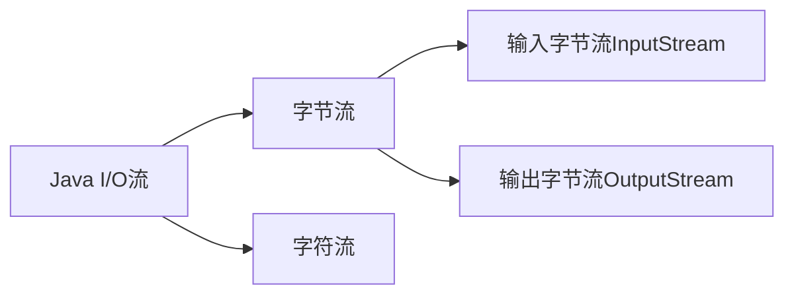

# Java 字节流

## 什么是Java字节流

在Java中，I/O操作是通过"流(Stream)"的概念来实现的。Java中的流分为两大类：**字节流**和**字符流**。今天我们将重点介绍字节流。

字节流以**字节（byte）**为单位进行数据传输，每次操作一个字节（8位）的数据。字节流适用于处理任何类型的数据，包括二进制文件（如图片、音频、视频等）和文本文件。



## 字节流的基础类

Java的字节流以抽象类`InputStream`和`OutputStream`为基础，所有的字节流类都是这两个抽象类的子类。

### InputStream
`InputStream`是所有输入字节流的父类，它是一个抽象类，定义了读取字节数据的基本方法：

- `int read()`: 读取单个字节，返回0-255之间的int值，如果已到达流末尾，则返回-1
- `int read(byte[] b)`: 将数据读入字节数组，返回实际读取的字节数
- `int read(byte[] b, int off, int len)`: 将数据读入字节数组的指定部分
- `void close()`: 关闭输入流并释放相关资源

### OutputStream
`OutputStream`是所有输出字节流的父类，它也是一个抽象类，定义了写出字节数据的基本方法：

- `void write(int b)`: 写出一个字节
- `void write(byte[] b)`: 写出一个字节数组
- `void write(byte[] b, int off, int len)`: 写出字节数组的指定部分
- `void flush()`: 刷新输出流，强制写出所有缓冲的数据
- `void close()`: 关闭输出流并释放相关资源

## 常用字节流类

让我们来看看Java中最常用的一些字节流类：

### 文件字节流

- `FileInputStream`: 从文件中读取字节数据
- `FileOutputStream`: 向文件中写入字节数据

#### 示例：复制文件

```java
try (FileInputStream fis = new FileInputStream("source.jpg");
     FileOutputStream fos = new FileOutputStream("destination.jpg")) {
    
    byte[] buffer = new byte[1024];
    int length;
    
    // 读取数据到buffer数组，然后写入到输出流
    while ((length = fis.read(buffer)) > 0) {
        fos.write(buffer, 0, length);
    }
    
    System.out.println("文件复制完成！");
} catch (IOException e) {
    e.printStackTrace();
}
```

:::tip
使用try-with-resources语句可以自动关闭流，无需在finally块中手动关闭，这是Java 7引入的特性。
:::

### 缓冲字节流

- `BufferedInputStream`: 为输入字节流添加缓冲功能，提高读取效率
- `BufferedOutputStream`: 为输出字节流添加缓冲功能，提高写入效率

#### 示例：使用缓冲流提高复制效率

```java
try (FileInputStream fis = new FileInputStream("source.jpg");
     BufferedInputStream bis = new BufferedInputStream(fis);
     FileOutputStream fos = new FileOutputStream("destination.jpg");
     BufferedOutputStream bos = new BufferedOutputStream(fos)) {
    
    byte[] buffer = new byte[1024];
    int length;
    
    while ((length = bis.read(buffer)) > 0) {
        bos.write(buffer, 0, length);
    }
    
    System.out.println("使用缓冲流复制文件完成！");
} catch (IOException e) {
    e.printStackTrace();
}
```

### 数据字节流

- `DataInputStream`: 允许应用程序以与机器无关的方式从底层输入流中读取基本Java数据类型
- `DataOutputStream`: 允许应用程序以与机器无关的方式将基本Java数据类型写入输出流

#### 示例：写入和读取基本数据类型

```java
// 写入数据
try (FileOutputStream fos = new FileOutputStream("data.bin");
     DataOutputStream dos = new DataOutputStream(fos)) {
    
    dos.writeInt(100);          // 写入整数
    dos.writeDouble(3.14);      // 写入双精度浮点数
    dos.writeBoolean(true);     // 写入布尔值
    dos.writeUTF("Hello Java"); // 写入UTF格式的字符串
    
    System.out.println("数据写入完成！");
} catch (IOException e) {
    e.printStackTrace();
}

// 读取数据
try (FileInputStream fis = new FileInputStream("data.bin");
     DataInputStream dis = new DataInputStream(fis)) {
    
    int i = dis.readInt();           // 读取整数
    double d = dis.readDouble();     // 读取双精度浮点数
    boolean b = dis.readBoolean();   // 读取布尔值
    String s = dis.readUTF();        // 读取UTF格式的字符串
    
    System.out.println("读取的整数：" + i);
    System.out.println("读取的双精度浮点数：" + d);
    System.out.println("读取的布尔值：" + b);
    System.out.println("读取的字符串：" + s);
} catch (IOException e) {
    e.printStackTrace();
}
```

### 对象字节流

- `ObjectInputStream`: 用于从流中读取对象
- `ObjectOutputStream`: 用于将对象写入流

#### 示例：序列化和反序列化对象

首先，我们需要创建一个可序列化的类：

```java
import java.io.Serializable;

public class Person implements Serializable {
    // 添加serialVersionUID有助于版本控制
    private static final long serialVersionUID = 1L;
    
    private String name;
    private int age;
    
    public Person(String name, int age) {
        this.name = name;
        this.age = age;
    }
    
    @Override
    public String toString() {
        return "Person{name='" + name + "', age=" + age + "}";
    }
}
```

然后，我们可以序列化和反序列化Person对象：

```java
// 序列化对象
try (FileOutputStream fos = new FileOutputStream("person.ser");
     ObjectOutputStream oos = new ObjectOutputStream(fos)) {
    
    Person person = new Person("张三", 25);
    oos.writeObject(person);
    System.out.println("对象已序列化到文件");
} catch (IOException e) {
    e.printStackTrace();
}

// 反序列化对象
try (FileInputStream fis = new FileInputStream("person.ser");
     ObjectInputStream ois = new ObjectInputStream(fis)) {
    
    Person person = (Person) ois.readObject();
    System.out.println("从文件反序列化对象：" + person);
} catch (IOException | ClassNotFoundException e) {
    e.printStackTrace();
}
```

:::caution
1. 只有实现了`Serializable`接口的类才能被序列化
2. 被`transient`修饰的字段不会被序列化
3. 序列化机制不保存静态变量
:::

## 字节流的实际应用场景

### 1. 文件复制

前面我们已经展示了如何使用字节流进行文件复制。这是字节流最基本也是最常见的应用场景，特别适合处理二进制文件，如图片、音频、视频等。

### 2. 网络通信

在网络编程中，数据传输通常以字节流的形式进行。

```java
// 服务器端发送数据
try (Socket socket = new Socket("localhost", 8080);
     OutputStream os = socket.getOutputStream()) {
    
    String message = "Hello, Client!";
    os.write(message.getBytes());
} catch (IOException e) {
    e.printStackTrace();
}

// 客户端接收数据
try (ServerSocket serverSocket = new ServerSocket(8080);
     Socket clientSocket = serverSocket.accept();
     InputStream is = clientSocket.getInputStream()) {
    
    byte[] buffer = new byte[1024];
    int bytesRead = is.read(buffer);
    String message = new String(buffer, 0, bytesRead);
    System.out.println("收到消息: " + message);
} catch (IOException e) {
    e.printStackTrace();
}
```

### 3. 处理二进制数据

字节流非常适合处理二进制数据，例如读取图片并进行处理：

```java
try (FileInputStream fis = new FileInputStream("image.jpg")) {
    // 获取文件大小
    int fileSize = fis.available();
    byte[] imageData = new byte[fileSize];
    
    // 读取整个图片到内存
    fis.read(imageData);
    
    // 这里可以对图片数据进行处理
    // 例如，获取图片格式、尺寸等
    System.out.println("图片大小: " + fileSize + " 字节");
    
    // 处理后可以再次保存
    try (FileOutputStream fos = new FileOutputStream("processed_image.jpg")) {
        fos.write(imageData);
    }
} catch (IOException e) {
    e.printStackTrace();
}
```

### 4. 数据持久化

通过对象序列化，可以将Java对象持久化到文件中，或者在网络上传输：

```java
// 将用户列表保存到文件
public void saveUsers(List<User> users, String filename) throws IOException {
    try (FileOutputStream fos = new FileOutputStream(filename);
         ObjectOutputStream oos = new ObjectOutputStream(fos)) {
        
        oos.writeObject(users);
    }
}

// 从文件中加载用户列表
@SuppressWarnings("unchecked")
public List<User> loadUsers(String filename) throws IOException, ClassNotFoundException {
    try (FileInputStream fis = new FileInputStream(filename);
         ObjectInputStream ois = new ObjectInputStream(fis)) {
        
        return (List<User>) ois.readObject();
    }
}
```

## 字节流使用注意事项

1. **始终关闭流**：使用完流后一定要关闭它，以释放系统资源。推荐使用try-with-resources语句。

2. **性能考虑**：对于大量数据的读写，应该使用缓冲流（`BufferedInputStream`和`BufferedOutputStream`）来提高性能。

3. **异常处理**：I/O操作可能会抛出`IOException`，确保妥善处理这些异常。

4. **字符编码**：在处理文本时，需要考虑字符编码问题。如果使用字节流处理文本，需要手动处理编码转换。

5. **不要混用字节流和字符流**：除非你明确知道自己在做什么，否则不要在同一个流上混用字节操作和字符操作。

## 总结

Java字节流是Java I/O体系的重要组成部分，它以字节为单位处理数据，适用于所有类型的数据处理。本文介绍了：

- 字节流的基本概念和主要抽象类（`InputStream`和`OutputStream`）
- 常用的字节流类及其应用，包括文件字节流、缓冲字节流、数据字节流和对象字节流
- 实际应用场景，如文件复制、网络通信、二进制数据处理和对象序列化
- 使用字节流时的注意事项

掌握字节流的使用对于Java开发者来说是非常重要的，它是处理文件、网络通信和数据持久化的基础。

## 练习

1. 编写一个程序，使用字节流复制一个大文件，分别使用带缓冲和不带缓冲的方式，比较两者的性能差异。

2. 创建一个简单的图片浏览器，使用字节流读取图片文件并显示在界面上。

3. 实现一个简单的文件加密/解密程序，使用字节流读取文件内容，对每个字节进行简单的变换（如XOR操作），然后写入新文件。

4. 编写一个程序，使用对象序列化将一组自定义对象保存到文件中，然后再读取出来并验证数据的正确性。

## 拓展资源

- Java官方文档：[Java I/O](https://docs.oracle.com/javase/8/docs/api/java/io/package-summary.html)
- 《Java核心技术》第II卷，有关I/O流的章节
- 《Thinking in Java》第18章：Java I/O系统