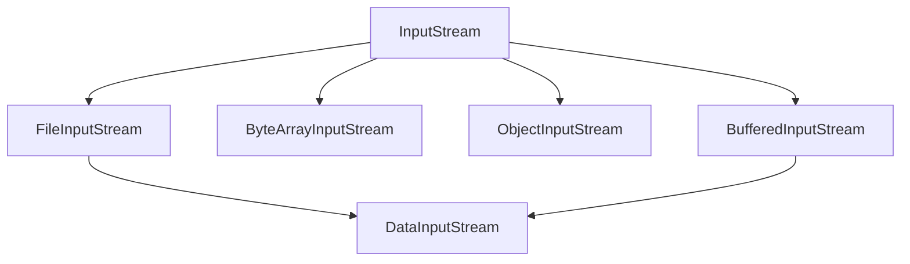

# Java FileInputStream

## 什么是FileInputStream？

FileInputStream是Java IO包中的一个基础类，用于从文件系统中读取字节数据。它是InputStream的子类，专门用来处理文件输入操作。当你需要读取文件内容时，FileInputStream是最常用的类之一。

:::note
FileInputStream只能读取字节数据，如果需要读取字符数据，请考虑使用FileReader或与InputStreamReader结合使用。
:::

## FileInputStream的基本特性

FileInputStream具有以下几个重要特性：

1. **字节流**：它以字节为单位读取数据，适合处理二进制文件。
2. **单向流**：只能从文件读取数据，不能写入数据。
3. **自动资源管理**：在Java 7及以上版本中，可以使用try-with-resources语法自动关闭资源。

## 创建FileInputStream对象

创建FileInputStream对象有多种方式，最常见的是通过文件路径或File对象：

```java
// 方式1：使用文件路径字符串
FileInputStream fis1 = new FileInputStream("example.txt");

// 方式2：使用File对象
File file = new File("example.txt");
FileInputStream fis2 = new FileInputStream(file);

// 方式3：使用try-with-resources语法（推荐）
try (FileInputStream fis3 = new FileInputStream("example.txt")) {
    // 使用fis3进行操作
}
```

## 常用方法

FileInputStream提供了多种方法来读取文件内容：

### 1. 读取单个字节

`read()` 方法读取输入流中的下一个字节，并返回该字节的值（0-255），如果已经到达文件末尾则返回-1。

```java
try (FileInputStream fis = new FileInputStream("example.txt")) {
    int data;
    while ((data = fis.read()) != -1) {
        System.out.print((char) data); // 将字节转换为字符并打印
    }
} catch (IOException e) {
    e.printStackTrace();
}
```

### 2. 读取字节数组

`read(byte[] b)` 方法将数据读入字节数组，返回读取的字节数，如果已到达文件末尾则返回-1。

```java
try (FileInputStream fis = new FileInputStream("example.txt")) {
    byte[] buffer = new byte[1024]; // 创建1KB的缓冲区
    int bytesRead;
    
    while ((bytesRead = fis.read(buffer)) != -1) {
        // 将读取的字节转换为字符串并打印
        System.out.print(new String(buffer, 0, bytesRead));
    }
} catch (IOException e) {
    e.printStackTrace();
}
```

### 3. 跳过字节

`skip(long n)` 方法用于跳过输入流中的n个字节，返回实际跳过的字节数。

```java
try (FileInputStream fis = new FileInputStream("example.txt")) {
    // 跳过前10个字节
    fis.skip(10);
    
    // 读取剩余内容
    int data;
    while ((data = fis.read()) != -1) {
        System.out.print((char) data);
    }
} catch (IOException e) {
    e.printStackTrace();
}
```

### 4. 可用字节数

`available()` 方法返回可以无阻塞地从此输入流读取的字节数估计值。

```java
try (FileInputStream fis = new FileInputStream("example.txt")) {
    System.out.println("可用字节数: " + fis.available());
    
    // 读取一些数据
    byte[] buffer = new byte[100];
    fis.read(buffer);
    
    System.out.println("读取后可用字节数: " + fis.available());
} catch (IOException e) {
    e.printStackTrace();
}
```

## 完整示例：读取文本文件

下面是一个读取文本文件并打印内容的完整示例：

```java
import java.io.FileInputStream;
import java.io.IOException;

public class FileInputStreamExample {
    public static void main(String[] args) {
        // 文件路径
        String filePath = "sample.txt";
        
        try (FileInputStream fis = new FileInputStream(filePath)) {
            // 创建一个缓冲区
            byte[] buffer = new byte[1024];
            int bytesRead;
            StringBuilder content = new StringBuilder();
            
            // 读取文件内容
            while ((bytesRead = fis.read(buffer)) != -1) {
                content.append(new String(buffer, 0, bytesRead));
            }
            
            // 打印文件内容
            System.out.println("文件内容：");
            System.out.println(content.toString());
            
        } catch (IOException e) {
            System.out.println("读取文件时发生错误：" + e.getMessage());
            e.printStackTrace();
        }
    }
}
```

**输出结果（假设sample.txt包含"Hello, Java IO!"）：**

```
文件内容：
Hello, Java IO!
```

## 处理二进制文件

FileInputStream最适合处理二进制文件，如图像、音频和视频文件。以下是读取二进制文件的示例：

```java
import java.io.FileInputStream;
import java.io.FileOutputStream;
import java.io.IOException;

public class BinaryFileCopy {
    public static void main(String[] args) {
        String sourceFile = "source.jpg";
        String destinationFile = "destination.jpg";
        
        try (FileInputStream fis = new FileInputStream(sourceFile);
             FileOutputStream fos = new FileOutputStream(destinationFile)) {
            
            byte[] buffer = new byte[4096]; // 4KB缓冲区
            int bytesRead;
            long totalBytes = 0;
            
            System.out.println("开始复制文件...");
            
            // 读取源文件并写入目标文件
            while ((bytesRead = fis.read(buffer)) != -1) {
                fos.write(buffer, 0, bytesRead);
                totalBytes += bytesRead;
            }
            
            System.out.println("文件复制完成，共复制 " + totalBytes + " 字节");
            
        } catch (IOException e) {
            System.out.println("文件操作失败：" + e.getMessage());
            e.printStackTrace();
        }
    }
}
```

## FileInputStream的性能优化

使用FileInputStream时，有一些技巧可以提高性能：

1. **使用足够大的缓冲区**：通常，使用较大的缓冲区（如8KB或16KB）可以减少I/O操作次数，提高读取效率。

2. **及时关闭资源**：最好使用try-with-resources语句自动关闭FileInputStream，以避免资源泄漏。

3. **结合BufferedInputStream使用**：对于较大的文件，可以结合BufferedInputStream使用以提高性能。

```java
try (FileInputStream fis = new FileInputStream("largeFile.dat");
     BufferedInputStream bis = new BufferedInputStream(fis, 8192)) {
    // 使用BufferedInputStream读取数据
    byte[] buffer = new byte[4096];
    int bytesRead;
    while ((bytesRead = bis.read(buffer)) != -1) {
        // 处理数据
    }
}
```

## 处理异常

使用FileInputStream时，需要处理以下可能出现的异常：

1. **FileNotFoundException**：当指定的文件不存在时抛出
2. **IOException**：在读取过程中发生I/O错误时抛出

```java
try (FileInputStream fis = new FileInputStream("nonexistent.txt")) {
    // 读取操作
} catch (FileNotFoundException e) {
    System.out.println("文件不存在：" + e.getMessage());
} catch (IOException e) {
    System.out.println("I/O错误：" + e.getMessage());
}
```

## 实际应用场景

FileInputStream在实际开发中有多种应用场景：

### 1. 配置文件读取

```java
public static Properties loadConfig(String filePath) {
    Properties properties = new Properties();
    try (FileInputStream fis = new FileInputStream(filePath)) {
        properties.load(fis);
        System.out.println("配置文件加载成功");
    } catch (IOException e) {
        System.out.println("加载配置文件失败：" + e.getMessage());
    }
    return properties;
}

// 使用示例
Properties config = loadConfig("config.properties");
String dbUrl = config.getProperty("database.url");
```

### 2. 图像处理

```java
public static byte[] readImageBytes(String imagePath) throws IOException {
    File imageFile = new File(imagePath);
    byte[] imageBytes = new byte[(int) imageFile.length()];
    
    try (FileInputStream fis = new FileInputStream(imageFile)) {
        // 一次性读取整个图像文件
        fis.read(imageBytes);
    }
    
    return imageBytes;
}
```

### 3. 文件校验和计算

```java
import java.security.MessageDigest;
import java.security.NoSuchAlgorithmException;

public static String calculateMD5(String filePath) throws IOException, NoSuchAlgorithmException {
    MessageDigest md = MessageDigest.getInstance("MD5");
    try (FileInputStream fis = new FileInputStream(filePath)) {
        byte[] buffer = new byte[8192];
        int bytesRead;
        while ((bytesRead = fis.read(buffer)) != -1) {
            md.update(buffer, 0, bytesRead);
        }
    }
    
    // 将MD5转换为十六进制字符串
    byte[] digest = md.digest();
    StringBuilder sb = new StringBuilder();
    for (byte b : digest) {
        sb.append(String.format("%02x", b & 0xff));
    }
    
    return sb.toString();
}
```

## FileInputStream vs. 其他输入流

Java提供了多种输入流，根据不同的需求可以选择适合的类：



- **FileInputStream**: 从文件读取原始字节流
- **ByteArrayInputStream**: 从字节数组读取数据
- **BufferedInputStream**: 添加缓冲功能，提高读取效率
- **DataInputStream**: 读取Java原始数据类型
- **ObjectInputStream**: 反序列化对象

## 总结

FileInputStream是Java IO中用于从文件读取字节数据的基础类，具有以下关键特点：

1. 它是一个字节输入流，适合处理二进制文件
2. 提供了多种方法读取文件内容：单字节读取、字节数组读取等
3. 需要正确处理异常和资源关闭
4. 可以与其他流（如BufferedInputStream）组合使用以提高性能
5. 在处理文本文件时，通常需要结合InputStreamReader使用

掌握FileInputStream的使用是学习Java IO的基础，也是处理文件操作的重要技能。

:::tip 最佳实践
1. 始终使用try-with-resources语句确保流被正确关闭
2. 对于大文件，使用适当大小的缓冲区提高性能
3. 处理二进制文件时直接使用FileInputStream，处理文本文件时考虑使用FileReader
:::

## 练习题

1. 编写一个程序，使用FileInputStream读取一个文本文件，并统计其中的字符数、行数和单词数。
2. 创建一个方法，使用FileInputStream读取一个图像文件并将其转换为Base64编码的字符串。
3. 实现一个文件比较工具，使用FileInputStream比较两个文件的内容是否相同。
4. 编写一个程序，读取一个二进制文件的前10个字节并以十六进制形式显示。

## 进一步阅读

- Java官方文档：[FileInputStream](https://docs.oracle.com/en/java/javase/11/docs/api/java.base/java/io/FileInputStream.html)
- Java IO流的继承体系和设计模式
- Java NIO（New IO）替代方案

通过上述内容，你应该已经掌握了FileInputStream的基本使用和常见应用场景。随着你对Java IO的深入学习，你会发现更多高级用法和组合技巧。