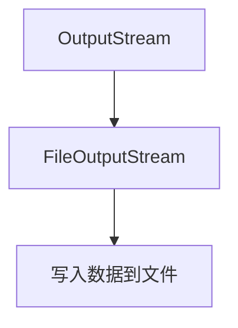

# Java FileOutputStream

在Java编程中，文件操作是一项基础且重要的技能。`FileOutputStream`是Java IO包中的一个核心类，用于将数据写入文件。无论是创建日志文件、生成报告还是保存用户数据，`FileOutputStream`都是一个必不可少的工具。

## 什么是FileOutputStream？

`FileOutputStream`是`java.io`包中的一个类，用于将原始字节数据写入文件。它是`OutputStream`抽象类的子类，专门用于处理文件输出操作。

简单来说，当你需要将数据保存到文件中时，`FileOutputStream`就是你的得力助手。



## FileOutputStream的基本使用

### 创建FileOutputStream对象

首先，我们需要创建一个`FileOutputStream`对象，以便开始向文件写入数据。创建时可以指定文件路径：

```java
FileOutputStream fos = new FileOutputStream("example.txt");
```

:::caution
创建`FileOutputStream`时可能会抛出`FileNotFoundException`，因此需要进行异常处理。
:::

### 写入数据

创建`FileOutputStream`对象后，可以使用`write()`方法将数据写入文件：

```java
// 写入单个字节
fos.write(65); // 写入字符'A'的ASCII码

// 写入字节数组
byte[] data = {66, 67, 68}; // 'B', 'C', 'D'
fos.write(data);

// 写入字节数组的一部分
fos.write(data, 0, 2); // 只写入前两个字节 'B', 'C'
```

### 关闭流

使用完毕后，一定要关闭流以释放系统资源：

```java
fos.close();
```

:::warning
不关闭流可能导致资源泄漏或数据丢失！在实际应用中应始终确保关闭流。
:::

## 完整示例

下面是一个完整的示例，演示如何使用`FileOutputStream`将文本写入文件：

```java
import java.io.FileOutputStream;
import java.io.IOException;

public class FileOutputStreamExample {
    public static void main(String[] args) {
        try (FileOutputStream fos = new FileOutputStream("example.txt")) {
            // 准备要写入的字符串
            String text = "Hello, FileOutputStream!";
            
            // 将字符串转换为字节数组
            byte[] bytes = text.getBytes();
            
            // 写入字节数组
            fos.write(bytes);
            
            System.out.println("数据已成功写入文件!");
        } catch (IOException e) {
            System.out.println("发生IO异常: " + e.getMessage());
            e.printStackTrace();
        }
    }
}
```

**输出：**
```
数据已成功写入文件!
```

文件`example.txt`将包含文本："Hello, FileOutputStream!"

## 追加模式

默认情况下，`FileOutputStream`会覆盖现有文件的内容。如果你想在已有文件的末尾追加内容，可以使用追加模式：

```java
// 第二个参数设为true，表示追加模式
FileOutputStream fos = new FileOutputStream("example.txt", true);
```

## 使用try-with-resources语句

为了确保流正确关闭，推荐使用Java 7引入的try-with-resources语句：

```java
try (FileOutputStream fos = new FileOutputStream("example.txt")) {
    // 使用文件输出流
    fos.write("Hello World".getBytes());
} catch (IOException e) {
    e.printStackTrace();
}
```

使用try-with-resources语句，Java会自动调用`close()`方法，无需显式关闭流。

## 缓冲区使用

对于大量数据的写入，直接使用`FileOutputStream`可能效率不高。可以结合`BufferedOutputStream`提高性能：

```java
try (
    FileOutputStream fos = new FileOutputStream("example.txt");
    BufferedOutputStream bos = new BufferedOutputStream(fos)
) {
    String data = "使用缓冲流提高写入效率";
    bos.write(data.getBytes());
    bos.flush(); // 确保所有数据都写入文件
} catch (IOException e) {
    e.printStackTrace();
}
```

## 实际应用场景

### 1. 日志记录

`FileOutputStream`可用于实现简单的日志记录系统：

```java
public class SimpleLogger {
    private FileOutputStream logFile;
    
    public SimpleLogger(String fileName) throws IOException {
        // 以追加模式打开日志文件
        logFile = new FileOutputStream(fileName, true);
    }
    
    public void log(String message) throws IOException {
        // 记录时间和消息
        String logEntry = new java.util.Date() + ": " + message + "\n";
        logFile.write(logEntry.getBytes());
    }
    
    public void close() throws IOException {
        if (logFile != null) {
            logFile.close();
        }
    }
}
```

### 2. 文件复制

结合`FileInputStream`，可以实现文件复制功能：

```java
public static void copyFile(String source, String destination) throws IOException {
    try (
        FileInputStream in = new FileInputStream(source);
        FileOutputStream out = new FileOutputStream(destination)
    ) {
        byte[] buffer = new byte[1024];
        int length;
        
        // 读取源文件并写入目标文件
        while ((length = in.read(buffer)) > 0) {
            out.write(buffer, 0, length);
        }
        System.out.println("文件复制完成!");
    }
}
```

### 3. 图像处理

在图像处理应用中，可以使用`FileOutputStream`保存处理后的图像：

```java
public static void saveImage(BufferedImage image, String fileName) throws IOException {
    try (FileOutputStream out = new FileOutputStream(fileName)) {
        // 将图像写入指定格式的文件
        ImageIO.write(image, "png", out);
        System.out.println("图像已保存!");
    }
}
```

## 性能优化

处理大文件时，有几种方法可以优化`FileOutputStream`的性能：

1. **使用缓冲**：如前所述，使用`BufferedOutputStream`可以减少I/O操作次数
2. **适当的缓冲区大小**：选择合适的缓冲区大小（通常8KB-64KB）
3. **批量写入**：一次写入多个字节而不是单个字节
4. **减少流的打开和关闭次数**：尽量重用流对象

## 常见问题及解决方案

### 1. 文件权限问题

```java
try {
    FileOutputStream fos = new FileOutputStream("/system/file.txt");
    // ...
} catch (SecurityException e) {
    System.out.println("没有足够权限写入文件");
}
```

### 2. 磁盘空间不足

```java
try {
    FileOutputStream fos = new FileOutputStream("large_file.dat");
    // 大量写入操作...
} catch (IOException e) {
    if (e.getMessage().contains("space")) {
        System.out.println("磁盘空间不足");
    }
}
```

### 3. 文件已被其他程序锁定

```java
try {
    FileOutputStream fos = new FileOutputStream("locked_file.txt");
    // ...
} catch (IOException e) {
    System.out.println("文件可能被其他程序锁定: " + e.getMessage());
}
```

## 总结

`FileOutputStream`是Java IO库中用于文件写入操作的基础类。它使我们能够将字节数据写入文件，是Java文件处理中不可或缺的工具。主要特点包括：

- 以字节流形式写入数据
- 可选择覆盖或追加模式
- 需要妥善处理异常和资源关闭
- 可与缓冲流结合使用提高性能

掌握`FileOutputStream`的使用将为你处理文件输出任务提供坚实的基础，无论是简单的文本文件还是复杂的二进制数据。

## 练习题

1. 编写一个程序，使用`FileOutputStream`创建一个文件，并写入当前日期和时间。
2. 实现一个方法，将用户输入的多行文本逐行追加到文件中。
3. 创建一个工具类，能够将任意对象序列化并保存到文件中。
4. 编写一个程序，生成一个包含1到1000数字的文本文件，每行一个数字。

## 进一步学习资源

- 学习`FileInputStream`进行文件读取
- 探索字符流类`FileReader`和`FileWriter`
- 了解更多关于Java NIO包中的文件处理方式
- 研究Java中的序列化和反序列化

:::tip
记住，文件I/O操作在实际应用中非常常见，所以花时间掌握这项技能是非常值得的！
:::