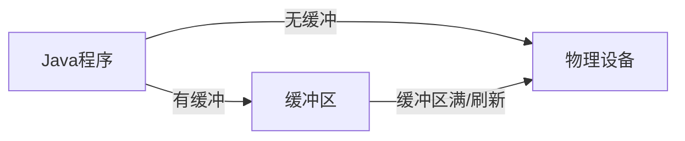

# Java 缓冲流

在Java的IO操作中，缓冲流是一种非常重要且常用的流类型。它能够显著提高IO操作的效率，是Java程序员必须掌握的基础知识之一。本文将详细介绍Java缓冲流的概念、用法和实际应用场景。

## 什么是缓冲流？

缓冲流(Buffered Stream)是处理流的一种，它可以为其他流提供缓冲功能，以提高IO操作的效率。

:::tip 缓冲的含义
缓冲就是在内存中开辟一块区域，用于临时存储数据。当数据达到一定量时，再一次性写入或读取，减少访问磁盘的次数，从而提高效率。
:::

没有缓冲的流每次读写操作都会直接访问物理设备，而缓冲流则会先将数据写入缓冲区，当缓冲区满了或手动刷新时才会真正写入物理设备，这样可以减少IO操作的次数，提高效率。



## Java 缓冲流的分类

在Java中，缓冲流主要分为以下几种：

1. **字节缓冲流**
   - `BufferedInputStream`：字节输入缓冲流
   - `BufferedOutputStream`：字节输出缓冲流

2. **字符缓冲流**
   - `BufferedReader`：字符输入缓冲流
   - `BufferedWriter`：字符输出缓冲流

## 字节缓冲流

### BufferedInputStream

`BufferedInputStream`类为字节输入流提供缓冲功能，可以提高读取效率。

#### 基本用法

```java
try (FileInputStream fis = new FileInputStream("input.txt");
     BufferedInputStream bis = new BufferedInputStream(fis)) {
    
    int data;
    while ((data = bis.read()) != -1) {
        System.out.print((char) data);
    }
} catch (IOException e) {
    e.printStackTrace();
}
```

#### 构造方法

`BufferedInputStream`提供了两个构造方法：

```java
// 创建一个具有默认缓冲区大小的BufferedInputStream
BufferedInputStream(InputStream in)

// 创建一个具有指定缓冲区大小的BufferedInputStream
BufferedInputStream(InputStream in, int size)
```

### BufferedOutputStream

`BufferedOutputStream`类为字节输出流提供缓冲功能，可以提高写入效率。

#### 基本用法

```java
try (FileOutputStream fos = new FileOutputStream("output.txt");
     BufferedOutputStream bos = new BufferedOutputStream(fos)) {
    
    String str = "Hello, BufferedOutputStream!";
    byte[] bytes = str.getBytes();
    
    bos.write(bytes);
    // 注意：BufferedOutputStream会在缓冲区满或流关闭时自动刷新
    // 但也可以手动调用flush()方法强制刷新
    bos.flush();
    
} catch (IOException e) {
    e.printStackTrace();
}
```

#### 构造方法

`BufferedOutputStream`也提供了两个构造方法：

```java
// 创建一个具有默认缓冲区大小的BufferedOutputStream
BufferedOutputStream(OutputStream out)

// 创建一个具有指定缓冲区大小的BufferedOutputStream
BufferedOutputStream(OutputStream out, int size)
```

## 字符缓冲流

### BufferedReader

`BufferedReader`类为字符输入流提供缓冲功能，它不仅提高了读取效率，还提供了方便的`readLine()`方法来一次读取一行文本。

#### 基本用法

```java
try (FileReader fr = new FileReader("input.txt");
     BufferedReader br = new BufferedReader(fr)) {
    
    String line;
    while ((line = br.readLine()) != null) {
        System.out.println(line);
    }
} catch (IOException e) {
    e.printStackTrace();
}
```

#### 构造方法

`BufferedReader`提供了两个构造方法：

```java
// 创建一个具有默认缓冲区大小的BufferedReader
BufferedReader(Reader in)

// 创建一个具有指定缓冲区大小的BufferedReader
BufferedReader(Reader in, int size)
```

### BufferedWriter

`BufferedWriter`类为字符输出流提供缓冲功能，它不仅提高了写入效率，还提供了`newLine()`方法来写入一个平台相关的行分隔符。

#### 基本用法

```java
try (FileWriter fw = new FileWriter("output.txt");
     BufferedWriter bw = new BufferedWriter(fw)) {
    
    bw.write("Hello, BufferedWriter!");
    bw.newLine(); // 写入一个行分隔符
    bw.write("This is a new line.");
    
    // 手动刷新
    bw.flush();
    
} catch (IOException e) {
    e.printStackTrace();
}
```

#### 构造方法

`BufferedWriter`也提供了两个构造方法：

```java
// 创建一个具有默认缓冲区大小的BufferedWriter
BufferedWriter(Writer out)

// 创建一个具有指定缓冲区大小的BufferedWriter
BufferedWriter(Writer out, int size)
```

## 缓冲流的效率对比

为了直观地展示缓冲流的效率优势，我们通过一个简单的例子来对比使用缓冲流和不使用缓冲流的性能差异。

```java
import java.io.*;

public class BufferedStreamDemo {
    public static void main(String[] args) {
        // 文件大小：约10MB
        File sourceFile = new File("bigfile.txt");
        File targetFile1 = new File("copy1.txt");
        File targetFile2 = new File("copy2.txt");
        
        try {
            // 创建测试文件
            if (!sourceFile.exists()) {
                createTestFile(sourceFile);
            }
            
            // 测试不使用缓冲流
            long start1 = System.currentTimeMillis();
            copyWithoutBuffer(sourceFile, targetFile1);
            long end1 = System.currentTimeMillis();
            System.out.println("不使用缓冲流耗时：" + (end1 - start1) + "ms");
            
            // 测试使用缓冲流
            long start2 = System.currentTimeMillis();
            copyWithBuffer(sourceFile, targetFile2);
            long end2 = System.currentTimeMillis();
            System.out.println("使用缓冲流耗时：" + (end2 - start2) + "ms");
            
        } catch (IOException e) {
            e.printStackTrace();
        }
    }
    
    // 创建测试文件
    private static void createTestFile(File file) throws IOException {
        try (FileWriter fw = new FileWriter(file);
             BufferedWriter bw = new BufferedWriter(fw)) {
            for (int i = 0; i < 1000000; i++) {
                bw.write("This is test line " + i + "\n");
            }
        }
    }
    
    // 不使用缓冲流复制文件
    private static void copyWithoutBuffer(File source, File target) throws IOException {
        try (FileInputStream fis = new FileInputStream(source);
             FileOutputStream fos = new FileOutputStream(target)) {
            
            int data;
            while ((data = fis.read()) != -1) {
                fos.write(data);
            }
        }
    }
    
    // 使用缓冲流复制文件
    private static void copyWithBuffer(File source, File target) throws IOException {
        try (FileInputStream fis = new FileInputStream(source);
             BufferedInputStream bis = new BufferedInputStream(fis);
             FileOutputStream fos = new FileOutputStream(target);
             BufferedOutputStream bos = new BufferedOutputStream(fos)) {
            
            int data;
            while ((data = bis.read()) != -1) {
                bos.write(data);
            }
        }
    }
}
```

**输出示例**：
```
不使用缓冲流耗时：15623ms
使用缓冲流耗时：187ms
```

从结果可以看出，使用缓冲流可以显著提高IO操作的效率。

:::note 为什么缓冲流更快？
缓冲流的高效主要来源于减少了与磁盘的交互次数。每次磁盘访问都涉及到寻道时间、旋转延迟等物理操作，这些都是非常耗时的。缓冲流通过在内存中缓存数据，减少了这些物理操作的次数，从而提高了效率。
:::

## 缓冲流的实际应用场景

### 场景1：文件拷贝工具

在开发文件拷贝工具时，使用缓冲流可以显著提高拷贝速度，尤其是对于大文件的拷贝。

```java
public static void copyFile(String sourcePath, String targetPath) throws IOException {
    try (BufferedInputStream bis = new BufferedInputStream(new FileInputStream(sourcePath));
         BufferedOutputStream bos = new BufferedOutputStream(new FileOutputStream(targetPath))) {
        
        byte[] buffer = new byte[8192]; // 使用8KB的缓冲区
        int bytesRead;
        while ((bytesRead = bis.read(buffer)) != -1) {
            bos.write(buffer, 0, bytesRead);
        }
    }
}
```

### 场景2：日志记录系统

在开发日志记录系统时，使用缓冲流可以减少磁盘IO操作，提高日志写入的效率。

```java
public class SimpleLogger {
    private BufferedWriter writer;
    
    public SimpleLogger(String logFilePath) throws IOException {
        writer = new BufferedWriter(new FileWriter(logFilePath, true));
    }
    
    public void log(String message) throws IOException {
        writer.write(System.currentTimeMillis() + ": " + message);
        writer.newLine();
        // 注意：在日志系统中，通常不会每次都刷新缓冲区，
        // 而是在缓冲区满或者特定条件下才刷新，以提高效率
    }
    
    public void flush() throws IOException {
        writer.flush();
    }
    
    public void close() throws IOException {
        writer.close();
    }
}
```

### 场景3：配置文件解析

在读取和解析配置文件时，使用`BufferedReader`可以方便地一次读取一行文本。

```java
public Map<String, String> loadConfig(String configFilePath) throws IOException {
    Map<String, String> config = new HashMap<>();
    
    try (BufferedReader br = new BufferedReader(new FileReader(configFilePath))) {
        String line;
        while ((line = br.readLine()) != null) {
            line = line.trim();
            if (line.isEmpty() || line.startsWith("#")) {
                continue; // 跳过空行和注释行
            }
            
            int separatorIndex = line.indexOf('=');
            if (separatorIndex > 0) {
                String key = line.substring(0, separatorIndex).trim();
                String value = line.substring(separatorIndex + 1).trim();
                config.put(key, value);
            }
        }
    }
    
    return config;
}
```

## 缓冲流的注意事项

1. **关闭流的顺序**：
   - 只需要关闭最外层的缓冲流即可，内层的流会自动关闭。
   - 推荐使用try-with-resources语句自动管理资源的关闭。

2. **flush方法**：
   - 对于输出缓冲流，如果需要立即写出数据而不是等待缓冲区满，应调用`flush()`方法。

3. **缓冲区大小**：
   - 默认缓冲区大小通常已经足够，但对于特殊场景，可以考虑指定更合适的缓冲区大小。
   - 缓冲区太小：频繁读写，失去缓冲意义。
   - 缓冲区太大：占用过多内存，可能造成内存浪费。

4. **字符流与字节流的选择**：
   - 处理文本文件时，优先使用字符缓冲流。
   - 处理二进制文件时，使用字节缓冲流。

## 总结

缓冲流是Java IO体系中非常重要的一部分，它通过在内存中设置缓冲区，减少了与磁盘等物理设备的直接交互次数，显著提高了IO操作的效率。在实际开发中，我们应该尽可能地使用缓冲流来代替普通流，以获得更好的性能。

Java提供了四种主要的缓冲流：`BufferedInputStream`、`BufferedOutputStream`、`BufferedReader`和`BufferedWriter`，它们分别对应于字节输入流、字节输出流、字符输入流和字符输出流的缓冲包装。这些类不仅提高了IO效率，还提供了一些额外的便利方法，如`BufferedReader.readLine()`和`BufferedWriter.newLine()`。

在使用缓冲流时，需要注意及时关闭资源、适当调用`flush()`方法以及根据需求选择合适的缓冲区大小，这样才能充分发挥缓冲流的优势。

## 练习

1. 编写一个程序，使用缓冲流复制一个文本文件，并统计复制所需时间。
2. 实现一个简单的文本文件行计数器，使用`BufferedReader`读取文件并计数。
3. 使用`BufferedReader`和`BufferedWriter`实现一个简单的文本文件内容转换工具，将文件中的所有小写字母转换为大写字母。
4. 比较使用不同大小的缓冲区对文件复制效率的影响，找出最适合你系统的缓冲区大小。
5. 实现一个配置文件读写工具，支持读取和修改键值对格式的配置文件。

## 扩展阅读

- Java IO教程：深入了解Java IO体系的其他组件。
- NIO教程：了解Java NIO中的缓冲区概念和新的IO模型。
- 设计模式：装饰器模式，理解Java IO流设计中的装饰器模式应用。

掌握Java缓冲流是提高Java IO操作效率的关键一步，希望本文能帮助你更好地理解和使用Java缓冲流！