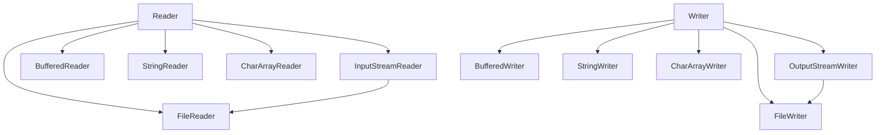

# Java 字符流

## 什么是字符流

在Java IO体系中，字符流是专门用来处理字符数据的IO流。与字节流不同，字符流以字符为单位进行输入输出操作，这使得它非常适合处理文本文件和其他基于字符的数据。

字符流的设计是为了解决字节流在处理多字节字符时可能出现的问题，尤其是在处理国际化字符集时。字符流内部会进行字节到字符的转换，自动处理编码问题。

:::note
Java中的字符是使用Unicode编码表示的，每个字符占用两个字节。
:::

## 字符流体系结构

Java字符流的类层次结构主要基于两个抽象类：`Reader`和`Writer`。



## Reader类介绍

`Reader`是所有字符输入流的抽象基类，它定义了以字符为单位读取数据的方法。

主要方法包括：

- `read()`: 读取单个字符
- `read(char[] cbuf)`: 将字符读入数组
- `read(char[] cbuf, int off, int len)`: 将字符读入数组的一部分
- `close()`: 关闭流并释放资源

### 常用的Reader子类

#### FileReader

`FileReader`用于从文件中读取字符数据。它是`InputStreamReader`的子类，默认使用系统的字符编码。

```java
try (FileReader reader = new FileReader("example.txt")) {
    int character;
    while ((character = reader.read()) != -1) {
        System.out.print((char) character);
    }
} catch (IOException e) {
    e.printStackTrace();
}
```

#### BufferedReader

`BufferedReader`为其他Reader对象添加缓冲功能，提高读取效率，并提供了方便的`readLine()`方法来读取一行文本。

```java
try (BufferedReader reader = new BufferedReader(new FileReader("example.txt"))) {
    String line;
    while ((line = reader.readLine()) != null) {
        System.out.println(line);
    }
} catch (IOException e) {
    e.printStackTrace();
}
```

#### InputStreamReader

`InputStreamReader`是字节流到字符流的桥梁，它可以指定字符编码，将字节转换为字符。

```java
try (InputStreamReader reader = new InputStreamReader(new FileInputStream("example.txt"), "UTF-8")) {
    int character;
    while ((character = reader.read()) != -1) {
        System.out.print((char) character);
    }
} catch (IOException e) {
    e.printStackTrace();
}
```

## Writer类介绍

`Writer`是所有字符输出流的抽象基类，它定义了以字符为单位写入数据的方法。

主要方法包括：

- `write(int c)`: 写入单个字符
- `write(char[] cbuf)`: 写入字符数组
- `write(String str)`: 写入字符串
- `write(String str, int off, int len)`: 写入字符串的一部分
- `flush()`: 刷新流
- `close()`: 关闭流并释放资源

### 常用的Writer子类

#### FileWriter

`FileWriter`用于向文件写入字符数据，是`OutputStreamWriter`的子类，默认使用系统的字符编码。

```java
try (FileWriter writer = new FileWriter("output.txt")) {
    writer.write("Hello, Java IO!");
} catch (IOException e) {
    e.printStackTrace();
}
```

#### BufferedWriter

`BufferedWriter`为其他Writer对象添加缓冲功能，提高写入效率，并提供了方便的`newLine()`方法来写入一行分隔符。

```java
try (BufferedWriter writer = new BufferedWriter(new FileWriter("output.txt"))) {
    writer.write("第一行");
    writer.newLine();
    writer.write("第二行");
} catch (IOException e) {
    e.printStackTrace();
}
```

#### OutputStreamWriter

`OutputStreamWriter`是字符流到字节流的桥梁，它可以指定字符编码，将字符转换为字节。

```java
try (OutputStreamWriter writer = new OutputStreamWriter(new FileOutputStream("output.txt"), "UTF-8")) {
    writer.write("使用UTF-8编码写入中文");
} catch (IOException e) {
    e.printStackTrace();
}
```

## 字符流与字节流的区别

1. **处理单位不同**：字节流以字节为单位，字符流以字符为单位
2. **编码处理**：字符流自动处理字符编码转换，字节流不处理
3. **适用场景**：字符流适合处理文本，字节流适合处理二进制数据
4. **缓冲区**：字符流内部有缓冲区，字节流没有

:::caution
不要使用字符流处理二进制文件（如图片、音频、视频等），这可能导致数据损坏！
:::

## 实际应用案例

### 案例1：文本文件复制

以下代码展示如何使用字符流复制文本文件：

```java
public static void copyTextFile(String source, String target) {
    try (BufferedReader reader = new BufferedReader(new FileReader(source));
         BufferedWriter writer = new BufferedWriter(new FileWriter(target))) {
        
        String line;
        while ((line = reader.readLine()) != null) {
            writer.write(line);
            writer.newLine();
        }
        System.out.println("文件复制完成!");
        
    } catch (IOException e) {
        e.printStackTrace();
    }
}
```

### 案例2：字符编码转换

以下代码展示如何将一个使用GBK编码的文本文件转换为UTF-8编码：

```java
public static void convertEncoding(String source, String target) {
    try (BufferedReader reader = new BufferedReader(
             new InputStreamReader(new FileInputStream(source), "GBK"));
         BufferedWriter writer = new BufferedWriter(
             new OutputStreamWriter(new FileOutputStream(target), "UTF-8"))) {
        
        String line;
        while ((line = reader.readLine()) != null) {
            writer.write(line);
            writer.newLine();
        }
        System.out.println("编码转换完成!");
        
    } catch (IOException e) {
        e.printStackTrace();
    }
}
```

### 案例3：控制台交互

以下代码展示如何使用字符流实现简单的控制台交互：

```java
public static void consoleInteraction() {
    try (BufferedReader reader = new BufferedReader(new InputStreamReader(System.in));
         BufferedWriter writer = new BufferedWriter(new OutputStreamWriter(System.out))) {
        
        writer.write("请输入您的姓名: ");
        writer.flush(); // 记得刷新缓冲区，确保提示立即显示
        
        String name = reader.readLine();
        
        writer.write("你好, " + name + "! 欢迎学习Java IO!\n");
        writer.flush();
        
    } catch (IOException e) {
        e.printStackTrace();
    }
}
```

## 字符流的性能优化

使用字符流时，可以通过以下几种方式优化性能：

1. **使用缓冲流**：`BufferedReader`和`BufferedWriter`可以显著提高I/O性能
2. **适当的缓冲区大小**：对于大文件，可以自定义较大的缓冲区
3. **尽早关闭流**：使用try-with-resources语句自动关闭流
4. **批量读写**：使用数组或字符串批量读写，而不是一个字符一个字符地操作

```java
// 优化的读取示例
try (BufferedReader reader = new BufferedReader(new FileReader("input.txt"), 8192)) {
    char[] buffer = new char[1024];
    int charsRead;
    while ((charsRead = reader.read(buffer)) != -1) {
        // 处理buffer中的数据
        System.out.println(new String(buffer, 0, charsRead));
    }
} catch (IOException e) {
    e.printStackTrace();
}
```

## 总结

Java字符流是处理文本数据的理想选择，它提供了以下优势：

1. 自动处理字符编码，避免了手动处理Unicode的复杂性
2. 提供了丰富的API，便于文本处理
3. 通过缓冲机制提高了I/O效率
4. 适合处理国际化字符集

在选择使用字符流还是字节流时，记住这个简单的规则：处理文本数据用字符流，处理二进制数据用字节流。

## 练习题

1. 编写一个程序，使用字符流统计一个文本文件中的字符数、单词数和行数。
2. 实现一个简单的文本编辑器，可以打开、编辑和保存文本文件。
3. 编写一个程序，将多个文本文件合并为一个文件。
4. 创建一个日志记录器，使用BufferedWriter将日志信息追加到文件中。

## 扩展资源

- Java官方文档：[Java IO API](https://docs.oracle.com/javase/8/docs/api/java/io/package-summary.html)
- 《Java IO, NIO and NIO.2》 - Jeff Friesen
- 《Effective Java》- Joshua Bloch (第7章：库)

通过掌握字符流，你将能够有效地处理各种文本数据，这是开发Java应用程序的重要技能。继续练习并探索更多高级功能！