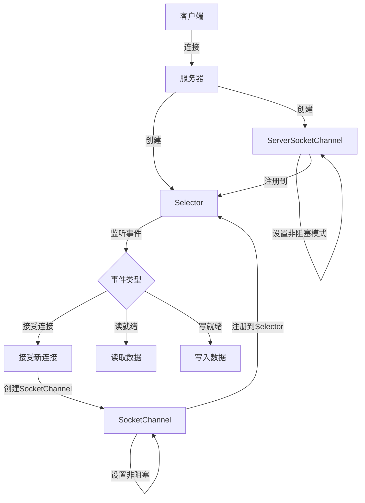

# Java NIO概述

## 什么是Java NIO？

Java NIO (New Input/Output) 是在Java 1.4版本中引入的一个用于替代标准Java IO API的IO API。NIO提供了一种不同的方式来处理I/O操作，它能够以更高效的方式处理大量的连接，特别是在需要同时处理多个连接的网络应用程序中表现尤为突出。

与传统的阻塞式I/O不同，NIO提供了非阻塞式I/O操作，这意味着当一个线程执行I/O操作时，如果数据没有准备好，该线程可以转而执行其他任务，而不是被阻塞。

## NIO与传统IO的区别

在深入了解NIO之前，让我们先了解它与传统IO的主要区别：

| 特性 | 传统IO | NIO |
|------|--------|-----|
| 数据处理方式 | 面向流(Stream Oriented) | 面向缓冲区(Buffer Oriented) |
| I/O类型 | 阻塞I/O | 非阻塞I/O |
| 选择器 | 无 | 有(Selector) |
| 处理大量连接 | 效率低 | 效率高 |

## Java NIO核心组件

Java NIO系统包含以下三个核心组件：

1. **Channels(通道)**
2. **Buffers(缓冲区)**
3. **Selectors(选择器)**

让我们分别介绍这些组件：

### 1. Channels(通道)

Channel是一个双向的数据通道，可以用于读取数据，也可以用于写入数据。这与传统的Java IO中的流不同，流通常是单向的（输入流或输出流）。

Java NIO中常见的Channel实现包括：

- FileChannel：用于文件读写
- DatagramChannel：用于UDP网络传输
- SocketChannel：用于TCP网络传输（客户端）
- ServerSocketChannel：用于TCP网络传输（服务器端）

下面是使用FileChannel读取文件内容的简单示例：

```java
import java.io.RandomAccessFile;
import java.nio.ByteBuffer;
import java.nio.channels.FileChannel;

public class FileChannelExample {
    public static void main(String[] args) throws Exception {
        RandomAccessFile file = new RandomAccessFile("data.txt", "r");
        FileChannel channel = file.getChannel();
        
        // 创建缓冲区
        ByteBuffer buffer = ByteBuffer.allocate(1024);
        
        // 将数据从通道读取到缓冲区
        int bytesRead = channel.read(buffer);
        while (bytesRead != -1) {
            // 切换缓冲区为读模式
            buffer.flip();
            
            // 读取缓冲区中的数据
            while (buffer.hasRemaining()) {
                System.out.print((char) buffer.get());
            }
            
            // 清空缓冲区，准备下一次读取
            buffer.clear();
            bytesRead = channel.read(buffer);
        }
        
        file.close();
    }
}
```

### 2. Buffers(缓冲区)

Buffer是NIO中的核心对象，用于在Channel读写数据时存储数据。所有数据都是通过Buffer进行传输的。

Java NIO提供了多种类型的Buffer，包括：
- ByteBuffer
- CharBuffer
- DoubleBuffer
- FloatBuffer
- IntBuffer
- LongBuffer
- ShortBuffer

Buffer有三个重要的属性：
- capacity：缓冲区的容量，创建后不能更改
- position：当前读/写的位置
- limit：能够读/写的位置限制

Buffer的操作主要有四个：
1. `clear()`：准备写入数据
2. `flip()`：从写模式切换到读模式
3. `rewind()`：重新读取数据
4. `compact()`：将未读数据压缩到缓冲区开始位置

下面是Buffer使用的基本流程：

```java
// 创建容量为48字节的缓冲区
ByteBuffer buffer = ByteBuffer.allocate(48);

// 从通道读取数据到缓冲区
int bytesRead = channel.read(buffer);

// 切换到读模式
buffer.flip();

// 读取缓冲区中的数据
while (buffer.hasRemaining()) {
    byte b = buffer.get();
    // 处理数据...
}

// 清空缓冲区，准备再次写入
buffer.clear();
```

### 3. Selectors(选择器)

Selector是Java NIO中的一个重要组件，允许单个线程处理多个Channel。这对于需要处理多个连接但连接数据传输量不大的应用程序非常有用。

使用Selector的主要步骤如下：
1. 创建Selector对象
2. 将Channel注册到Selector上
3. 调用Selector的select()方法获取就绪的Channel
4. 处理就绪的Channel

```java
import java.nio.channels.Selector;
import java.nio.channels.SocketChannel;
import java.nio.channels.SelectionKey;
import java.net.InetSocketAddress;
import java.util.Iterator;
import java.util.Set;

public class SelectorExample {
    public static void main(String[] args) throws Exception {
        // 创建Selector
        Selector selector = Selector.open();
        
        // 创建SocketChannel
        SocketChannel socketChannel = SocketChannel.open();
        socketChannel.connect(new InetSocketAddress("localhost", 8080));
        
        // 设置为非阻塞模式
        socketChannel.configureBlocking(false);
        
        // 注册到Selector，关注读事件
        SelectionKey key = socketChannel.register(selector, SelectionKey.OP_READ);
        
        // 等待事件发生
        while (true) {
            int readyChannels = selector.select();
            if (readyChannels == 0) continue;
            
            // 获取就绪的SelectionKey集合
            Set<SelectionKey> selectedKeys = selector.selectedKeys();
            Iterator<SelectionKey> keyIterator = selectedKeys.iterator();
            
            while (keyIterator.hasNext()) {
                SelectionKey selectedKey = keyIterator.next();
                
                if (selectedKey.isReadable()) {
                    // 处理读事件
                    SocketChannel channel = (SocketChannel) selectedKey.channel();
                    // 执行读操作...
                }
                
                // 处理完后，需要从集合中移除当前SelectionKey
                keyIterator.remove();
            }
        }
    }
}
```

## NIO的工作流程

下面这个流程图展示了NIO的基本工作原理：



## 实际应用案例

### 案例1：使用NIO实现高性能文件复制

下面是一个使用NIO进行文件复制的示例，它比传统IO方式更高效，特别是对于大文件：

```java
import java.io.File;
import java.io.FileInputStream;
import java.io.FileOutputStream;
import java.nio.ByteBuffer;
import java.nio.channels.FileChannel;

public class NIOFileCopy {
    public static void main(String[] args) throws Exception {
        String sourceFile = "source.txt";
        String targetFile = "target.txt";
        
        // 获取文件大小
        File file = new File(sourceFile);
        long fileSize = file.length();
        
        // 创建输入/输出流和通道
        FileInputStream fis = new FileInputStream(sourceFile);
        FileOutputStream fos = new FileOutputStream(targetFile);
        FileChannel inputChannel = fis.getChannel();
        FileChannel outputChannel = fos.getChannel();
        
        // 创建缓冲区
        int bufferSize = 1024 * 1024; // 1MB缓冲区
        ByteBuffer buffer = ByteBuffer.allocate(bufferSize);
        
        long startTime = System.currentTimeMillis();
        
        // 复制文件
        while (inputChannel.read(buffer) != -1) {
            buffer.flip();
            outputChannel.write(buffer);
            buffer.clear();
        }
        
        long endTime = System.currentTimeMillis();
        
        // 关闭资源
        inputChannel.close();
        outputChannel.close();
        fis.close();
        fos.close();
        
        System.out.println("文件复制完成，耗时：" + (endTime - startTime) + "ms");
        System.out.println("文件大小：" + fileSize + "字节");
    }
}
```

### 案例2：使用NIO实现非阻塞服务器

下面是一个使用NIO实现的简单非阻塞服务器，可以同时处理多个客户端连接：

```java
import java.io.IOException;
import java.net.InetSocketAddress;
import java.nio.ByteBuffer;
import java.nio.channels.SelectionKey;
import java.nio.channels.Selector;
import java.nio.channels.ServerSocketChannel;
import java.nio.channels.SocketChannel;
import java.util.Iterator;
import java.util.Set;

public class NIOServer {
    public static void main(String[] args) throws IOException {
        // 创建Selector
        Selector selector = Selector.open();
        
        // 创建ServerSocketChannel
        ServerSocketChannel serverChannel = ServerSocketChannel.open();
        serverChannel.bind(new InetSocketAddress("localhost", 8080));
        serverChannel.configureBlocking(false);
        
        // 将ServerSocketChannel注册到Selector
        serverChannel.register(selector, SelectionKey.OP_ACCEPT);
        
        System.out.println("服务器启动，监听端口：8080");
        
        while (true) {
            // 等待事件发生
            selector.select();
            
            // 获取所有就绪的SelectionKey
            Set<SelectionKey> selectedKeys = selector.selectedKeys();
            Iterator<SelectionKey> keyIterator = selectedKeys.iterator();
            
            while (keyIterator.hasNext()) {
                SelectionKey key = keyIterator.next();
                
                // 处理接受连接事件
                if (key.isAcceptable()) {
                    handleAccept(key, selector);
                }
                
                // 处理读事件
                if (key.isReadable()) {
                    handleRead(key);
                }
                
                // 处理完后，从集合中移除当前SelectionKey
                keyIterator.remove();
            }
        }
    }
    
    private static void handleAccept(SelectionKey key, Selector selector) throws IOException {
        ServerSocketChannel serverChannel = (ServerSocketChannel) key.channel();
        SocketChannel clientChannel = serverChannel.accept();
        clientChannel.configureBlocking(false);
        
        // 将新的客户端连接注册到Selector
        clientChannel.register(selector, SelectionKey.OP_READ);
        
        System.out.println("接受新连接：" + clientChannel.getRemoteAddress());
    }
    
    private static void handleRead(SelectionKey key) throws IOException {
        SocketChannel clientChannel = (SocketChannel) key.channel();
        ByteBuffer buffer = ByteBuffer.allocate(1024);
        
        int bytesRead;
        try {
            bytesRead = clientChannel.read(buffer);
        } catch (IOException e) {
            System.out.println("客户端断开连接");
            key.cancel();
            clientChannel.close();
            return;
        }
        
        if (bytesRead == -1) {
            System.out.println("客户端主动关闭连接");
            key.cancel();
            clientChannel.close();
            return;
        }
        
        // 处理接收到的数据
        buffer.flip();
        byte[] data = new byte[bytesRead];
        buffer.get(data);
        
        String message = new String(data);
        System.out.println("收到消息：" + message);
        
        // 回复客户端
        String response = "服务器已收到消息：" + message;
        ByteBuffer responseBuffer = ByteBuffer.wrap(response.getBytes());
        clientChannel.write(responseBuffer);
    }
}
```

## 使用NIO的优缺点

### 优点

1. **高效处理大量连接** - 使用Selector可以让一个线程处理多个通道，适合需要处理多连接的应用
2. **非阻塞IO** - 线程不会被IO操作阻塞，可以同时处理多个IO操作
3. **内存使用更高效** - 直接使用缓冲区，减少了数据复制的次数
4. **更好的扩展性** - 支持更复杂的网络应用程序

### 缺点

1. **复杂性** - 相比传统IO，NIO的API使用更复杂
2. **学习曲线陡峭** - 需要理解缓冲区、通道和选择器等概念
3. **调试困难** - 非阻塞代码的调试比阻塞代码更复杂
4. **可能出现空轮询** - 在某些JVM实现中可能会出现Selector空轮询的bug

:::caution
在使用NIO时，必须正确地处理缓冲区的翻转（flip）和清空（clear）操作，否则会导致数据丢失或者错误的读写操作。
:::

## NIO的适用场景

Java NIO在以下场景中特别有用：

1. **服务器应用程序** - 需要同时处理成千上万个客户端连接的服务器
2. **大文件处理** - 处理大文件时，使用NIO可以提高读写效率
3. **需要非阻塞操作的应用** - 不希望IO操作阻塞线程的应用程序
4. **高性能网络应用** - 需要高吞吐量的网络应用

## 总结

Java NIO是一种强大的IO API，提供了非阻塞IO操作和更高效的数据处理方式。通过使用Buffer、Channel和Selector，我们可以构建高性能的网络应用程序和文件处理系统。

NIO与传统IO的主要区别在于：
- NIO是面向缓冲区的，IO是面向流的
- NIO提供了非阻塞IO，而传统IO是阻塞的
- NIO通过选择器支持多路复用

虽然NIO的API使用起来比传统IO更复杂，但在需要处理大量连接或需要非阻塞IO的应用场景中，NIO的性能优势是显著的。

## 进一步学习资源

要深入学习Java NIO，可以参考以下资源：

1. 官方文档：[Java NIO Documentation](https://docs.oracle.com/javase/8/docs/api/java/nio/package-summary.html)
2. 《Java NIO》 - Ron Hitchens著
3. 《Netty实战》 - Norman Maurer著，学习基于NIO的高性能网络框架

## 练习

1. 使用NIO实现一个简单的文件读取程序，统计文件中的字符数量。
2. 实现一个基于NIO的简单聊天服务器，支持多客户端连接。
3. 比较使用传统IO和NIO复制大文件的性能差异。
4. 实现一个基于NIO的HTTP服务器，能够处理简单的HTTP请求。

通过这些练习，你将更好地理解NIO的工作原理和使用方法，为构建高性能的Java应用程序打下基础。