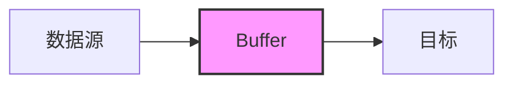
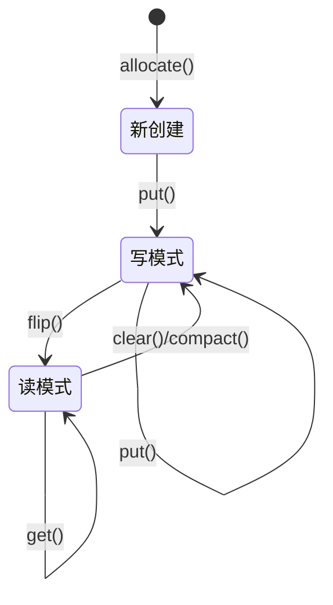

# Java Buffer

在Java NIO（New Input/Output）API中，Buffer是一个核心概念，它是数据的临时存储区域。与传统的Java I/O不同，NIO提供了基于缓冲区的数据处理方式，使得数据操作更加高效灵活。

## 什么是Buffer？

Buffer本质上是一个内存块，可以写入数据，之后再读取。在NIO中，所有数据的读写都是通过Buffer来完成的。



## Buffer的基本属性

Java Buffer有几个重要的属性需要理解：

- **容量(capacity)**: Buffer能够容纳的数据元素的最大数量
- **限制(limit)**: 第一个不能被读或写的元素的索引
- **位置(position)**: 下一个要被读或写的元素的索引
- **标记(mark)**: 一个备忘位置，可以调用mark()设置mark为当前position，之后调用reset()可将position设为mark

这些属性总是满足以下关系：
```
0 <= mark <= position <= limit <= capacity
```

## Buffer的类型

Java NIO提供了多种Buffer类型，每种对应一种基本数据类型：

- ByteBuffer
- CharBuffer
- ShortBuffer
- IntBuffer
- LongBuffer
- FloatBuffer
- DoubleBuffer

所有这些类都是抽象类Buffer的子类。

:::note
最常用的是ByteBuffer，特别是在文件I/O和网络操作中。
:::

## 创建Buffer

创建Buffer的方法有几种：

```java
// 方法1：分配一个容量为1024的ByteBuffer
ByteBuffer buffer = ByteBuffer.allocate(1024);

// 方法2：包装一个已有的数组
byte[] array = new byte[1024];
ByteBuffer buffer = ByteBuffer.wrap(array);

// 方法3：创建一个直接缓冲区（内存分配在JVM堆外）
ByteBuffer directBuffer = ByteBuffer.allocateDirect(1024);
```

## Buffer的基本操作

### 写入数据到Buffer

```java
// 从Channel读取数据到Buffer
int bytesRead = channel.read(buffer);

// 或者通过put方法写入数据
buffer.put((byte) 127);
buffer.put(byteArray);
```

### 从Buffer读取数据

在读取数据之前，需要调用`flip()`方法，将Buffer从写模式切换到读模式：

```java
buffer.flip();  // 准备读取数据

// 读取一个字节
byte b = buffer.get();

// 或者读取多个字节到数组
byte[] dst = new byte[10];
buffer.get(dst);

// 读取完毕后，可以调用clear()方法重置buffer
buffer.clear();

// 或者调用compact()方法，保留未读取的数据并压缩
buffer.compact();
```

## Buffer的关键方法详解

让我们更详细地了解Buffer类中的一些关键方法：

### flip()

当向buffer写入数据后，需要从buffer读取数据时，要调用这个方法。它会做以下事情：

- 将limit设置为当前position
- 将position设置为0
- 丢弃mark标记

```java
public final Buffer flip() {
    limit = position;
    position = 0;
    mark = -1;
    return this;
}
```

### clear()

调用这个方法会清空整个缓冲区，实际上并不会擦除数据，而是通过重置位置信息使得数据可以被覆盖。

- 将position设置为0
- 将limit设置为capacity
- 丢弃mark标记

```java
public final Buffer clear() {
    position = 0;
    limit = capacity;
    mark = -1;
    return this;
}
```

### rewind()

将position重置为0，这样可以重新读取buffer中的所有数据。

```java
public final Buffer rewind() {
    position = 0;
    mark = -1;
    return this;
}
```

### compact()

压缩缓冲区，将未读取的数据移到缓冲区的开始位置。

```java
public ByteBuffer compact() {
    // 实现会因具体Buffer类型而略有不同
    System.arraycopy(hb, ix(position()), hb, ix(0), remaining());
    position(remaining());
    limit(capacity());
    mark = -1;
    return this;
}
```

## Buffer的工作流程示例

下面通过一个完整的示例来演示Buffer的工作流程：

```java
import java.io.FileInputStream;
import java.io.FileOutputStream;
import java.nio.ByteBuffer;
import java.nio.channels.FileChannel;

public class BufferDemo {
    public static void main(String[] args) throws Exception {
        // 创建源文件和目标文件的通道
        FileInputStream fis = new FileInputStream("source.txt");
        FileChannel inChannel = fis.getChannel();
        
        FileOutputStream fos = new FileOutputStream("target.txt");
        FileChannel outChannel = fos.getChannel();
        
        // 创建缓冲区
        ByteBuffer buffer = ByteBuffer.allocate(1024);
        
        while (true) {
            // 清空buffer
            buffer.clear();
            
            // 从源通道读取数据到buffer
            int r = inChannel.read(buffer);
            
            // 读取完毕，退出循环
            if (r == -1) {
                break;
            }
            
            // 切换buffer到读模式
            buffer.flip();
            
            // 从buffer写入数据到目标通道
            outChannel.write(buffer);
        }
        
        // 关闭通道和流
        inChannel.close();
        outChannel.close();
        fis.close();
        fos.close();
        
        System.out.println("文件复制完成");
    }
}
```

输出：
```
文件复制完成
```

## Buffer状态变化图解

以下是Buffer在各种操作下状态的变化：



## 直接缓冲区与非直接缓冲区

在NIO中，有两种类型的ByteBuffer：直接缓冲区(Direct Buffer)和非直接缓冲区(Non-direct Buffer)。

### 直接缓冲区

直接缓冲区是在操作系统的内存中分配的，不在JVM堆上。

优点：
- 可以显著提高I/O性能，特别是读写频繁的场合
- 减少了一次从JVM堆到操作系统内存的复制过程

缺点：
- 分配和释放直接缓冲区的成本更高
- 使用不当可能导致内存泄漏

```java
// 创建直接缓冲区
ByteBuffer directBuffer = ByteBuffer.allocateDirect(1024);
```

### 非直接缓冲区

非直接缓冲区是在JVM堆内存中分配的。

优点：
- 创建和回收成本低
- 使用熟悉的Java对象方式管理

缺点：
- I/O操作需要额外的复制步骤

```java
// 创建非直接缓冲区
ByteBuffer heapBuffer = ByteBuffer.allocate(1024);
```

:::caution
对于临时缓冲区，推荐使用非直接缓冲区；对于长期使用的较大缓冲区，可以考虑使用直接缓冲区。
:::

## 实际应用案例：文件内容搜索

以下是一个使用Buffer搜索文件内容的实际应用案例：

```java
import java.io.FileInputStream;
import java.nio.ByteBuffer;
import java.nio.channels.FileChannel;
import java.nio.charset.StandardCharsets;

public class FileSearch {
    public static void main(String[] args) {
        try {
            // 要搜索的关键词
            String keyword = "Java";
            
            // 打开文件
            FileInputStream fis = new FileInputStream("sample.txt");
            FileChannel channel = fis.getChannel();
            
            // 创建缓冲区
            ByteBuffer buffer = ByteBuffer.allocate(1024);
            
            // 统计变量
            int count = 0;
            StringBuilder currentLine = new StringBuilder();
            
            // 读取文件内容
            while (channel.read(buffer) != -1) {
                buffer.flip();
                
                // 将缓冲区内容转换为字符串
                String content = StandardCharsets.UTF_8.decode(buffer).toString();
                
                // 处理内容，可能包含多行
                String[] lines = content.split("\\n", -1);
                
                for (int i = 0; i < lines.length; i++) {
                    // 处理当前行
                    currentLine.append(lines[i]);
                    
                    // 如果不是最后一个分段或是文件结尾，说明一行结束了
                    if (i < lines.length - 1 || content.endsWith("\n")) {
                        // 检查当前行是否包含关键词
                        String line = currentLine.toString();
                        if (line.contains(keyword)) {
                            count++;
                            System.out.println("找到关键词: " + line.trim());
                        }
                        // 重置当前行
                        currentLine = new StringBuilder();
                    }
                }
                
                buffer.clear();
            }
            
            System.out.println("关键词 '" + keyword + "' 在文件中出现了 " + count + " 次");
            
            // 关闭资源
            channel.close();
            fis.close();
            
        } catch (Exception e) {
            e.printStackTrace();
        }
    }
}
```

假设`sample.txt`文件内容如下：
```
这是一个测试文件
包含Java关键词
这行不包含关键词
这行又包含了Java关键词
```

输出结果：
```
找到关键词: 包含Java关键词
找到关键词: 这行又包含了Java关键词
关键词 'Java' 在文件中出现了 2 次
```

## 总结

Java NIO中的Buffer是一个强大的概念，它允许我们以缓冲区为中心进行I/O操作，相比传统的面向流的I/O方式更加灵活高效。

关键要点回顾：

- Buffer是一个内存区域，可以写入数据，之后再读取数据
- Buffer有几个重要的属性：capacity, limit, position和mark
- 常用的Buffer操作包括flip(), clear(), rewind()和compact()
- Java提供了多种类型的Buffer，最常用的是ByteBuffer
- 直接缓冲区和非直接缓冲区各有优缺点，应根据应用场景选择

## 练习题

1. 创建一个程序，使用ByteBuffer读取一个文件，并计算文件中各字符的出现频率。
2. 实现一个简单的文件复制程序，使用不同大小的Buffer，比较性能差异。
3. 编写一个程序，使用MappedByteBuffer读取一个大文件的指定部分内容。

## 进一步学习资源

- [Java NIO官方文档](https://docs.oracle.com/javase/8/docs/api/java/nio/package-summary.html)
- [Java NIO Buffer类API](https://docs.oracle.com/javase/8/docs/api/java/nio/Buffer.html)
- Ron Hitchens的《Java NIO》书籍

通过掌握Buffer的概念和用法，你将能够更有效地进行Java I/O操作，为开发高性能应用程序打下基础。