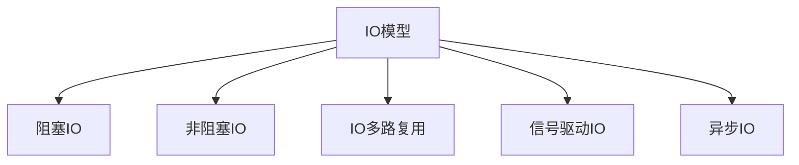

# Java 异步IO

## 异步IO的概念

在Java编程中，IO操作一直是性能的重要考量因素。传统的阻塞式IO会导致线程在等待数据时被挂起，无法执行其他任务。而异步IO(Asynchronous IO，简称AIO)则提供了一种非阻塞的IO处理方式，允许应用程序在IO操作进行的同时继续执行其他任务，从而提高系统的吞吐量和响应能力。

Java中的异步IO主要通过`java.nio.channels`包中的`AsynchronousChannel`相关类来实现，这是在Java 7中引入的NIO.2特性的一部分。

:::note
异步IO与NIO(New IO)的主要区别在于：NIO是非阻塞的但需要应用程序主动检查IO操作的状态，而AIO则由操作系统在IO操作完成后通知应用程序。
:::

## 异步IO模型

在理解Java异步IO之前，我们需要先了解几种IO模型：



异步IO是最高级的IO模型，它的特点是：

1. 应用程序发起IO请求后可以立即返回去做其他事情
2. 整个IO操作(包括数据准备和数据复制)都交由操作系统来完成
3. 操作系统完成IO操作后通过回调机制通知应用程序

## Java 异步IO的核心组件

Java异步IO API主要包括以下几个核心组件：

1. **AsynchronousChannel**：异步通道的基础接口
2. **AsynchronousSocketChannel**：用于异步TCP网络通信
3. **AsynchronousServerSocketChannel**：用于异步TCP服务器
4. **AsynchronousFileChannel**：用于异步文件操作
5. **CompletionHandler**：异步操作完成时的回调接口
6. **Future**：用于检查异步操作的状态和结果

## 异步IO的两种编程模式

Java异步IO提供了两种编程方式：

1. **Future模式**：调用异步方法后返回一个`Future`对象，通过这个对象可以查询操作状态或获取结果。
2. **回调模式**：提供一个`CompletionHandler`实现，当操作完成时会自动调用相应的处理方法。

### Future模式示例

以下是使用`Future`模式读取文件的示例：

```java
import java.nio.ByteBuffer;
import java.nio.channels.AsynchronousFileChannel;
import java.nio.file.Path;
import java.nio.file.Paths;
import java.nio.file.StandardOpenOption;
import java.util.concurrent.Future;

public class AsyncFileReadExample {
    public static void main(String[] args) {
        try {
            Path path = Paths.get("example.txt");
            
            AsynchronousFileChannel fileChannel = AsynchronousFileChannel.open(
                path, StandardOpenOption.READ);
            
            ByteBuffer buffer = ByteBuffer.allocate(1024);
            
            // 异步读取文件，立即返回Future对象
            Future<Integer> operation = fileChannel.read(buffer, 0);
            
            // 可以在此处执行其他任务...
            System.out.println("正在读取文件...");
            
            // 检查异步操作是否完成
            while (!operation.isDone()) {
                System.out.println("仍在等待文件读取完成...");
                Thread.sleep(500);
            }
            
            // 操作完成，获取结果（读取的字节数）
            int bytesRead = operation.get();
            System.out.println("读取完成，共读取 " + bytesRead + " 字节");
            
            // 处理读取到的数据
            buffer.flip();
            byte[] data = new byte[buffer.limit()];
            buffer.get(data);
            System.out.println("文件内容: " + new String(data));
            
            fileChannel.close();
            
        } catch (Exception e) {
            e.printStackTrace();
        }
    }
}
```

**输出示例**：
```
正在读取文件...
仍在等待文件读取完成...
读取完成，共读取 42 字节
文件内容: 这是一个用于Java异步IO示例的测试文件
```

### 回调模式示例

使用`CompletionHandler`接口实现异步文件读取：

```java
import java.nio.ByteBuffer;
import java.nio.channels.AsynchronousFileChannel;
import java.nio.channels.CompletionHandler;
import java.nio.file.Path;
import java.nio.file.Paths;
import java.nio.file.StandardOpenOption;

public class AsyncFileReadCallbackExample {
    public static void main(String[] args) {
        try {
            Path path = Paths.get("example.txt");
            
            AsynchronousFileChannel fileChannel = AsynchronousFileChannel.open(
                path, StandardOpenOption.READ);
            
            ByteBuffer buffer = ByteBuffer.allocate(1024);
            
            // 使用CompletionHandler进行异步读取
            fileChannel.read(buffer, 0, buffer, new CompletionHandler<Integer, ByteBuffer>() {
                @Override
                public void completed(Integer result, ByteBuffer attachment) {
                    System.out.println("读取操作完成，共读取 " + result + " 字节");
                    
                    // 处理读取到的数据
                    attachment.flip();
                    byte[] data = new byte[attachment.limit()];
                    attachment.get(data);
                    System.out.println("文件内容: " + new String(data));
                    
                    try {
                        fileChannel.close();
                    } catch (Exception e) {
                        e.printStackTrace();
                    }
                }
                
                @Override
                public void failed(Throwable exc, ByteBuffer attachment) {
                    System.out.println("读取操作失败");
                    exc.printStackTrace();
                }
            });
            
            // 主线程可以继续执行其他任务
            System.out.println("已发起异步读取请求，主线程继续执行...");
            
            // 为了让示例不立即结束，让主线程休眠一段时间
            Thread.sleep(2000);
            
        } catch (Exception e) {
            e.printStackTrace();
        }
    }
}
```

**输出示例**：
```
已发起异步读取请求，主线程继续执行...
读取操作完成，共读取 42 字节
文件内容: 这是一个用于Java异步IO示例的测试文件
```

## AsynchronousChannelGroup

`AsynchronousChannelGroup`是一个重要的组件，它为异步通道提供线程池支持，允许多个通道共享线程资源。在高并发场景下，合理配置通道组可以优化性能。

```java
import java.nio.channels.AsynchronousChannelGroup;
import java.nio.channels.AsynchronousSocketChannel;
import java.util.concurrent.ExecutorService;
import java.util.concurrent.Executors;

public class ChannelGroupExample {
    public static void main(String[] args) {
        try {
            // 创建一个固定大小的线程池
            ExecutorService executorService = Executors.newFixedThreadPool(10);
            
            // 创建异步通道组，使用提供的线程池
            AsynchronousChannelGroup channelGroup = 
                AsynchronousChannelGroup.withThreadPool(executorService);
            
            // 使用该通道组创建异步Socket通道
            AsynchronousSocketChannel socketChannel = 
                AsynchronousSocketChannel.open(channelGroup);
            
            // ... 使用socketChannel进行网络操作 ...
            
            // 使用完毕后关闭通道组（会关闭所有相关联的通道）
            // channelGroup.shutdown();
            
        } catch (Exception e) {
            e.printStackTrace();
        }
    }
}
```

## 实际应用案例：异步HTTP服务器

下面是一个简单的异步HTTP服务器示例，演示了如何使用异步IO处理多个客户端连接：

```java
import java.io.IOException;
import java.net.InetSocketAddress;
import java.nio.ByteBuffer;
import java.nio.channels.AsynchronousServerSocketChannel;
import java.nio.channels.AsynchronousSocketChannel;
import java.nio.channels.CompletionHandler;
import java.nio.charset.StandardCharsets;
import java.util.concurrent.CountDownLatch;

public class SimpleAsyncHttpServer {
    private AsynchronousServerSocketChannel server;
    
    public void start(int port) throws IOException {
        // 创建服务器通道
        server = AsynchronousServerSocketChannel.open();
        server.bind(new InetSocketAddress("localhost", port));
        System.out.println("服务器已启动，监听端口：" + port);
        
        // 防止程序退出的锁
        CountDownLatch latch = new CountDownLatch(1);
        
        // 开始接受连接
        server.accept(null, new CompletionHandler<AsynchronousSocketChannel, Void>() {
            @Override
            public void completed(AsynchronousSocketChannel client, Void attachment) {
                // 继续接受下一个连接
                server.accept(null, this);
                
                // 处理当前连接
                handleClient(client);
            }
            
            @Override
            public void failed(Throwable exc, Void attachment) {
                exc.printStackTrace();
            }
        });
        
        try {
            latch.await(); // 等待，防止程序退出
        } catch (InterruptedException e) {
            e.printStackTrace();
        }
    }
    
    private void handleClient(AsynchronousSocketChannel client) {
        ByteBuffer buffer = ByteBuffer.allocate(1024);
        
        // 异步读取客户端请求
        client.read(buffer, buffer, new CompletionHandler<Integer, ByteBuffer>() {
            @Override
            public void completed(Integer bytesRead, ByteBuffer buffer) {
                if (bytesRead > 0) {
                    buffer.flip();
                    String request = StandardCharsets.UTF_8.decode(buffer).toString();
                    System.out.println("收到请求：\n" + request);
                    
                    // 构造HTTP响应
                    String response = 
                        "HTTP/1.1 200 OK\r\n" +
                        "Content-Type: text/html\r\n" +
                        "Connection: close\r\n" +
                        "\r\n" +
                        "<html><body><h1>Hello, Async World!</h1></body></html>";
                    
                    // 发送响应
                    ByteBuffer responseBuffer = ByteBuffer.wrap(response.getBytes());
                    client.write(responseBuffer, responseBuffer, new CompletionHandler<Integer, ByteBuffer>() {
                        @Override
                        public void completed(Integer bytesWritten, ByteBuffer buffer) {
                            try {
                                // 响应发送完毕，关闭连接
                                client.close();
                            } catch (IOException e) {
                                e.printStackTrace();
                            }
                        }
                        
                        @Override
                        public void failed(Throwable exc, ByteBuffer buffer) {
                            exc.printStackTrace();
                            try {
                                client.close();
                            } catch (IOException e) {
                                e.printStackTrace();
                            }
                        }
                    });
                }
            }
            
            @Override
            public void failed(Throwable exc, ByteBuffer buffer) {
                exc.printStackTrace();
                try {
                    client.close();
                } catch (IOException e) {
                    e.printStackTrace();
                }
            }
        });
    }
    
    public static void main(String[] args) {
        try {
            new SimpleAsyncHttpServer().start(8080);
        } catch (IOException e) {
            e.printStackTrace();
        }
    }
}
```

要测试此服务器，只需在浏览器中访问`http://localhost:8080`，服务器将返回一个简单的HTML页面。

## 异步IO的适用场景

异步IO特别适用于以下场景：

1. **高并发网络应用**：如聊天服务器、游戏服务器等需要同时处理大量连接的应用
2. **需要长时间IO操作但不希望阻塞线程的场景**：如文件上传/下载服务
3. **事件驱动型应用**：如响应性要求高的用户界面应用
4. **微服务架构**：服务间通信可以使用异步IO提高整体响应性

## 异步IO的优缺点

### 优点
- 提高系统吞吐量，单个线程可以处理多个IO操作
- 减少线程资源消耗，适合高并发场景
- 编程模型灵活，支持回调和Future两种方式
- 代码结构清晰，IO操作与业务逻辑分离

### 缺点
- 学习曲线较陡，概念较复杂
- 调试困难，异步回调使得程序流程不线性
- 潜在的回调地狱问题（可通过CompletableFuture缓解）
- 对操作系统支持的依赖较高

## 异步IO与CompletableFuture结合

Java 8引入的`CompletableFuture`可以很好地与异步IO配合使用，使异步编程更加流畅：

```java
import java.nio.ByteBuffer;
import java.nio.channels.AsynchronousFileChannel;
import java.nio.file.Path;
import java.nio.file.Paths;
import java.nio.file.StandardOpenOption;
import java.util.concurrent.CompletableFuture;

public class AsyncIOWithCompletableFuture {
    public static void main(String[] args) {
        try {
            Path path = Paths.get("example.txt");
            AsynchronousFileChannel fileChannel = AsynchronousFileChannel.open(
                path, StandardOpenOption.READ);
            
            ByteBuffer buffer = ByteBuffer.allocate(1024);
            
            // 创建CompletableFuture
            CompletableFuture<Integer> future = new CompletableFuture<>();
            
            // 发起异步读取并将结果放入CompletableFuture
            fileChannel.read(buffer, 0, null, new java.nio.channels.CompletionHandler<Integer, Void>() {
                @Override
                public void completed(Integer result, Void attachment) {
                    future.complete(result);
                }
                
                @Override
                public void failed(Throwable exc, Void attachment) {
                    future.completeExceptionally(exc);
                }
            });
            
            // 使用CompletableFuture提供的函数式接口处理结果
            future.thenApply(bytesRead -> {
                System.out.println("读取了 " + bytesRead + " 字节");
                buffer.flip();
                byte[] data = new byte[buffer.limit()];
                buffer.get(data);
                return new String(data);
            }).thenAccept(content -> {
                System.out.println("文件内容是:");
                System.out.println(content);
            }).exceptionally(exc -> {
                System.err.println("发生错误: " + exc.getMessage());
                return null;
            });
            
            // 让主线程等待足够的时间以观察结果
            Thread.sleep(2000);
            
            fileChannel.close();
            
        } catch (Exception e) {
            e.printStackTrace();
        }
    }
}
```

## 总结

Java异步IO提供了一种高效处理IO操作的方式，特别适合高并发、高吞吐量的应用场景。通过非阻塞的方式和回调机制，可以显著提高系统的资源利用率和响应能力。虽然学习和使用异步IO需要一定的时间投入，但在适合的场景下，它能带来显著的性能提升。

要有效地使用Java异步IO，需要掌握以下几点：

1. 理解异步编程模型和回调机制
2. 熟悉Future和CompletionHandler的使用
3. 正确管理和配置AsynchronousChannelGroup
4. 在复杂场景中，考虑结合CompletableFuture使用

通过实践和项目应用，你将能够更深入地理解异步IO的工作原理和最佳实践。

## 练习题

1. 编写一个异步文件复制程序，使用AsynchronousFileChannel同时读取源文件和写入目标文件。
2. 实现一个简单的异步聊天服务器，支持多客户端同时连接和消息广播。
3. 将上述HTTP服务器示例扩展，增加对静态文件的支持和简单的路由功能。

## 延伸阅读

- [Java NIO.2 官方文档](https://docs.oracle.com/javase/8/docs/api/java/nio/channels/AsynchronousChannel.html)
- [Java CompletableFuture 指南](https://docs.oracle.com/javase/8/docs/api/java/util/concurrent/CompletableFuture.html)
- [《Java Concurrency in Practice》](http://jcip.net/) - Brian Goetz 等著
- [《Netty实战》](https://www.manning.com/books/netty-in-action) - 了解基于异步IO设计的高性能网络框架

:::tip
异步编程是一项重要技能，不仅适用于IO，也适用于现代应用开发的多个方面。掌握Java异步IO将帮助你更好地理解其他异步框架，如Netty、Vert.x和Spring WebFlux。
:::