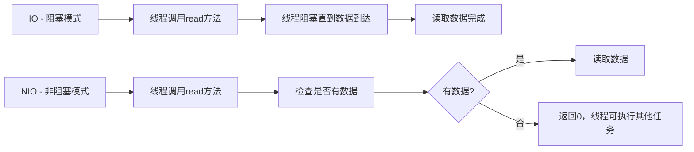
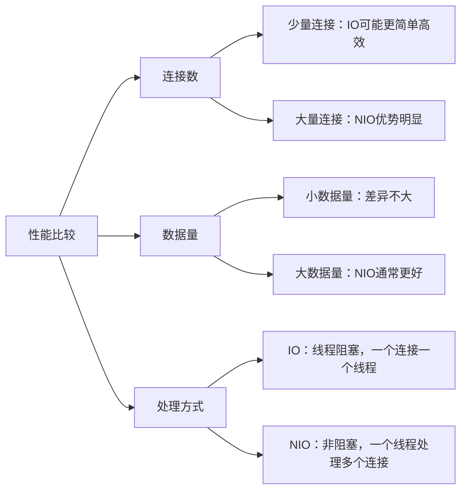

# Java NIO与IO比较

## 引言

Java的输入输出(I/O)系统是任何Java应用程序的基础组件，它让我们能够与外部资源如文件、网络连接等进行交互。在Java中，有两种主要的I/O模型：传统的阻塞式I/O（简称IO）和更现代的非阻塞式I/O（简称NIO）。本文将详细比较这两种模型，帮助初学者理解它们的异同点及适用场景。

## IO与NIO的基本概念

### 传统IO

Java的传统IO基于流(Stream)的概念，是一种阻塞式的I/O模型。当我们使用传统IO时，线程会一直等待直到有数据可读或者数据被完全写入。

### NIO (New I/O或Non-blocking I/O)

Java NIO是在Java 1.4引入的，它提供了一种不同的I/O处理方式，基于通道(Channel)和缓冲区(Buffer)。NIO提供了非阻塞模式，允许线程在等待I/O操作完成的同时执行其他任务。

## 两者的主要区别

### 1. 阻塞vs非阻塞



- **IO模式**：当一个线程调用read()或write()方法时，该线程会被阻塞，直到有数据可读或数据被完全写入。
- **NIO模式**：一个线程可以管理多个输入和输出通道，无需阻塞在任何一个上，实现更高效的资源利用。

### 2. 面向流vs面向缓冲

- **IO**：面向流的处理，数据直接从流中读取或写入到流中。
- **NIO**：面向缓冲的处理，数据必须先被读入缓冲区，然后才能从缓冲区获取处理结果。

### 3. 通道vs流

- **IO**：使用字节流和字符流，是单向的。
- **NIO**：使用通道，通道是双向的，可以同时用于读写操作。

### 4. 选择器(Selector)

NIO引入了选择器的概念，允许一个单独的线程监视多个通道的I/O事件，如连接就绪、数据就绪等，大大提高了多路复用的能力。

## 代码示例比较

### 传统IO读取文件示例

```java
public static void readFileWithIO(String filePath) {
    try (FileInputStream fis = new FileInputStream(filePath);
         BufferedReader reader = new BufferedReader(new InputStreamReader(fis))) {
        
        String line;
        while ((line = reader.readLine()) != null) {
            System.out.println(line);
        }
    } catch (IOException e) {
        e.printStackTrace();
    }
}
```

### NIO读取文件示例

```java
public static void readFileWithNIO(String filePath) {
    try (RandomAccessFile aFile = new RandomAccessFile(filePath, "r");
         FileChannel inChannel = aFile.getChannel()) {
        
        ByteBuffer buffer = ByteBuffer.allocate(1024);
        while (inChannel.read(buffer) != -1) {
            buffer.flip();
            while (buffer.hasRemaining()) {
                System.out.print((char) buffer.get());
            }
            buffer.clear();
        }
    } catch (IOException e) {
        e.printStackTrace();
    }
}
```

## NIO的核心组件

### 1. 缓冲区(Buffer)

缓冲区是NIO的核心概念之一，它是一块可以写入数据，然后可以从中读取数据的内存区域。

```java
// 创建一个ByteBuffer
ByteBuffer buffer = ByteBuffer.allocate(1024);

// 向buffer写入数据
buffer.put((byte) 'A');
buffer.put((byte) 'B');
buffer.put((byte) 'C');

// 切换模式：从写模式切换到读模式
buffer.flip();

// 从buffer读取数据
while (buffer.hasRemaining()) {
    System.out.println((char) buffer.get());
}

// 清空缓冲区，准备下一次写入
buffer.clear();
```

:::note
Buffer有几个重要的属性：capacity（容量）、position（位置）、limit（限制）和mark（标记），这些属性控制着缓冲区的行为。
:::

### 2. 通道(Channel)

通道是NIO中数据传输的载体，它类似于传统IO中的流，但与流不同的是，通道是双向的，可以同时用于读写。

```java
// 打开文件通道
RandomAccessFile aFile = new RandomAccessFile("data.txt", "rw");
FileChannel inChannel = aFile.getChannel();

// 创建缓冲区
ByteBuffer buf = ByteBuffer.allocate(48);

// 从通道读取数据到缓冲区
int bytesRead = inChannel.read(buf);

while (bytesRead != -1) {
    buf.flip();  // 准备读取缓冲区数据
    
    while(buf.hasRemaining()){
        System.out.print((char) buf.get());
    }
    
    buf.clear();  // 准备再次写入
    bytesRead = inChannel.read(buf);
}

aFile.close();
```

### 3. 选择器(Selector)

选择器允许单线程处理多个通道，是Java NIO实现非阻塞I/O的关键。

```java
// 创建选择器
Selector selector = Selector.open();

// 配置通道为非阻塞模式并注册到选择器
channel.configureBlocking(false);
channel.register(selector, SelectionKey.OP_READ);

// 等待事件发生
while(true) {
    int readyChannels = selector.select();
    if(readyChannels == 0) continue;
    
    // 处理所有已选择键的通道
    Set<SelectionKey> selectedKeys = selector.selectedKeys();
    Iterator<SelectionKey> keyIterator = selectedKeys.iterator();
    
    while(keyIterator.hasNext()) {
        SelectionKey key = keyIterator.next();
        
        if(key.isReadable()) {
            // 处理读事件
        }
        
        keyIterator.remove();
    }
}
```

## 应用场景比较

### IO适用场景

1. **简单的文件读写操作**：对于简单的文件读写，传统IO结构更直观，代码更简洁。
2. **字节流或字符流处理**：当需要逐字节或逐字符处理数据时，IO更为方便。
3. **低并发请求**：在并发量小的场景下，IO模型足够应对。

### NIO适用场景

1. **高并发网络应用**：NIO的非阻塞特性使其在处理大量连接时效率更高。
2. **大文件处理**：使用通道和直接缓冲区可以提高大文件的处理速度。
3. **需要实现事件驱动模型**：使用选择器可以实现高效的事件驱动模型。
4. **需要高性能的服务器应用**：如聊天服务器、游戏服务器等。

## 实际案例：简易聊天服务器

下面是一个使用NIO实现的简单聊天服务器示例，展示了NIO在网络编程中的强大功能：

```java
public class NIOChatServer {
    private Selector selector;
    private ServerSocketChannel serverSocketChannel;
    private static final int PORT = 9999;

    public void start() throws IOException {
        // 打开选择器
        selector = Selector.open();
        
        // 打开服务器套接字通道
        serverSocketChannel = ServerSocketChannel.open();
        // 绑定端口
        serverSocketChannel.socket().bind(new InetSocketAddress(PORT));
        // 配置为非阻塞模式
        serverSocketChannel.configureBlocking(false);
        
        // 注册到选择器，关注接受事件
        serverSocketChannel.register(selector, SelectionKey.OP_ACCEPT);
        
        System.out.println("聊天服务器已启动，监听端口：" + PORT);
        
        // 处理客户端连接和消息
        handleClients();
    }
    
    private void handleClients() throws IOException {
        while (true) {
            // 选择准备就绪的通道
            if (selector.select() <= 0) {
                continue;
            }
            
            // 获取选择器中的已选择键集
            Iterator<SelectionKey> keyIterator = selector.selectedKeys().iterator();
            
            while (keyIterator.hasNext()) {
                SelectionKey key = keyIterator.next();
                
                // 处理连接请求
                if (key.isAcceptable()) {
                    SocketChannel clientChannel = serverSocketChannel.accept();
                    clientChannel.configureBlocking(false);
                    clientChannel.register(selector, SelectionKey.OP_READ);
                    
                    System.out.println("客户端已连接：" + clientChannel.getRemoteAddress());
                }
                
                // 处理读取请求
                if (key.isReadable()) {
                    readClientMessage(key);
                }
                
                // 移除已处理的键
                keyIterator.remove();
            }
        }
    }
    
    private void readClientMessage(SelectionKey key) throws IOException {
        SocketChannel channel = (SocketChannel) key.channel();
        ByteBuffer buffer = ByteBuffer.allocate(1024);
        
        try {
            int count = channel.read(buffer);
            
            // 如果读取到-1，说明客户端已断开连接
            if (count == -1) {
                channel.close();
                key.cancel();
                System.out.println("客户端已断开连接");
                return;
            }
            
            // 准备读取数据
            buffer.flip();
            byte[] bytes = new byte[buffer.remaining()];
            buffer.get(bytes);
            
            String message = new String(bytes, "UTF-8").trim();
            System.out.println("收到消息：" + message);
            
            // 广播消息给其他客户端
            broadcastMessage(message, channel);
            
        } catch (IOException e) {
            key.cancel();
            channel.close();
            e.printStackTrace();
        }
    }
    
    private void broadcastMessage(String message, SocketChannel sourceChannel) throws IOException {
        // 遍历所有已注册的通道
        for (SelectionKey key : selector.keys()) {
            Channel targetChannel = key.channel();
            
            // 排除服务器通道和消息源通道
            if (targetChannel instanceof SocketChannel && targetChannel != sourceChannel) {
                ByteBuffer buffer = ByteBuffer.wrap(message.getBytes());
                ((SocketChannel) targetChannel).write(buffer);
            }
        }
    }
    
    public static void main(String[] args) {
        try {
            new NIOChatServer().start();
        } catch (IOException e) {
            e.printStackTrace();
        }
    }
}
```

:::caution
上面的聊天服务器示例是简化版的，实际生产环境中需要更多的错误处理和优化。
:::

## IO与NIO的性能比较

在不同场景下，IO和NIO的性能表现也不同：



## 总结

Java IO和NIO各有优缺点，选择哪一个取决于具体的应用场景和需求：

- **Java IO**：
  - 优点：API简单直观，容易理解和使用。
  - 缺点：阻塞式I/O，在处理大量连接时效率低下。
  - 适用场景：简单I/O操作，低并发场景。

- **Java NIO**：
  - 优点：非阻塞I/O，可处理大量连接，资源利用效率高。
  - 缺点：API相对复杂，学习曲线陡峭。
  - 适用场景：高并发网络应用，需要高性能I/O处理的场合。

在实际开发中，可以根据需求灵活选择使用传统IO或NIO，甚至在同一个应用中混合使用两者，以达到最佳性能和开发效率的平衡。

## 练习与思考

1. 尝试使用IO和NIO分别读取一个大文件，比较它们的性能差异。
2. 实现一个简单的文件复制程序，分别使用IO和NIO实现，并比较代码复杂度和运行效率。
3. 扩展上面的聊天服务器示例，增加更多功能，如私聊、用户名注册等。
4. 思考：在什么情况下，使用阻塞式IO可能比非阻塞式NIO更合适？

## 进一步学习资源

- 《Java NIO》by Ron Hitchens
- Oracle Java文档：[Java NIO](https://docs.oracle.com/javase/8/docs/api/java/nio/package-summary.html)
- 《Netty in Action》：学习基于NIO的高性能网络框架
- 开源项目：Apache MINA、Netty等，这些都是基于NIO构建的高性能网络应用框架