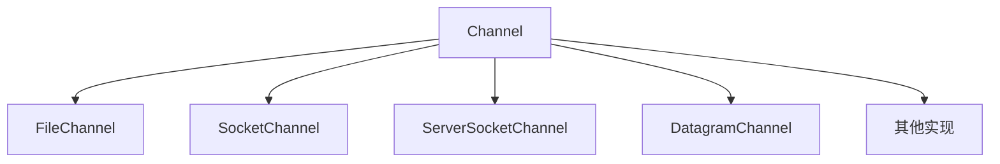

# Java Channel

在Java NIO（New I/O）框架中，Channel（通道）是一个核心组件，它提供了一种新的I/O操作方式，与传统的Java I/O流不同。通道代表了与硬件设备、文件、网络套接字或能够执行I/O操作的程序组件之间的连接。

## Channel与传统I/O流的区别

在深入了解Channel之前，让我们先比较一下Channel与传统I/O流的区别：

| 特性 | 传统I/O流 | NIO Channel |
| --- | --- | --- |
| 方向性 | 单向（输入流或输出流） | 双向（可读可写） |
| 缓冲区 | 不使用缓冲区 | 使用Buffer进行读写 |
| 阻塞性 | 阻塞I/O | 支持非阻塞模式 |
| 数据传输 | 面向字节流 | 面向块（缓冲区） |
| 选择器 | 不支持 | 支持Selector多路复用 |

## Channel的基本概念

Channel是一个双向的数据通道，既可以从Channel读取数据到Buffer，也可以从Buffer写数据到Channel。Java NIO中的Channel主要有以下几种类型：



## 常用的Channel实现

### FileChannel

FileChannel用于文件的读写操作，它是线程安全的。

```java
import java.io.RandomAccessFile;
import java.nio.ByteBuffer;
import java.nio.channels.FileChannel;
import java.io.IOException;

public class FileChannelExample {
    public static void main(String[] args) {
        try {
            // 创建FileChannel
            RandomAccessFile file = new RandomAccessFile("example.txt", "rw");
            FileChannel channel = file.getChannel();
            
            // 写入数据
            ByteBuffer writeBuffer = ByteBuffer.allocate(48);
            writeBuffer.put("Hello, Java NIO Channel!".getBytes());
            writeBuffer.flip();
            
            channel.write(writeBuffer);
            
            // 读取数据
            channel.position(0); // 将位置重置到文件开头
            ByteBuffer readBuffer = ByteBuffer.allocate(48);
            int bytesRead = channel.read(readBuffer);
            
            readBuffer.flip();
            while(readBuffer.hasRemaining()) {
                System.out.print((char) readBuffer.get());
            }
            
            channel.close();
            file.close();
        } catch (IOException e) {
            e.printStackTrace();
        }
    }
}
```

输出：
```
Hello, Java NIO Channel!
```

### SocketChannel与ServerSocketChannel

SocketChannel和ServerSocketChannel用于TCP网络通信，分别对应客户端和服务器端。

:::note
SocketChannel是客户端用来连接到远程服务器的通道，而ServerSocketChannel用于服务器端接受客户端连接。
:::

服务器端示例：

```java
import java.io.IOException;
import java.net.InetSocketAddress;
import java.nio.ByteBuffer;
import java.nio.channels.ServerSocketChannel;
import java.nio.channels.SocketChannel;

public class ServerExample {
    public static void main(String[] args) {
        try {
            // 创建ServerSocketChannel
            ServerSocketChannel serverSocketChannel = ServerSocketChannel.open();
            serverSocketChannel.socket().bind(new InetSocketAddress(9999));
            
            // 设置为非阻塞模式
            serverSocketChannel.configureBlocking(false);
            
            System.out.println("服务器启动，等待连接...");
            
            while (true) {
                // 接受连接
                SocketChannel socketChannel = serverSocketChannel.accept();
                
                if (socketChannel != null) {
                    System.out.println("接收到新连接");
                    
                    // 读取数据
                    ByteBuffer buffer = ByteBuffer.allocate(48);
                    int bytesRead = socketChannel.read(buffer);
                    
                    if (bytesRead > 0) {
                        buffer.flip();
                        while (buffer.hasRemaining()) {
                            System.out.print((char) buffer.get());
                        }
                        System.out.println();
                        
                        // 回复客户端
                        buffer.clear();
                        buffer.put("Hello from server".getBytes());
                        buffer.flip();
                        socketChannel.write(buffer);
                    }
                    
                    socketChannel.close();
                }
                
                // 防止CPU占用过高
                Thread.sleep(100);
            }
        } catch (IOException | InterruptedException e) {
            e.printStackTrace();
        }
    }
}
```

客户端示例：

```java
import java.io.IOException;
import java.net.InetSocketAddress;
import java.nio.ByteBuffer;
import java.nio.channels.SocketChannel;

public class ClientExample {
    public static void main(String[] args) {
        try {
            // 创建SocketChannel
            SocketChannel socketChannel = SocketChannel.open();
            socketChannel.connect(new InetSocketAddress("localhost", 9999));
            
            // 发送数据
            String message = "Hello from client";
            ByteBuffer buffer = ByteBuffer.allocate(48);
            buffer.put(message.getBytes());
            buffer.flip();
            socketChannel.write(buffer);
            
            // 接收服务器响应
            buffer.clear();
            int bytesRead = socketChannel.read(buffer);
            buffer.flip();
            
            if (bytesRead > 0) {
                while (buffer.hasRemaining()) {
                    System.out.print((char) buffer.get());
                }
                System.out.println();
            }
            
            socketChannel.close();
        } catch (IOException e) {
            e.printStackTrace();
        }
    }
}
```

### DatagramChannel

DatagramChannel用于UDP网络通信，可以发送和接收数据报。

```java
import java.io.IOException;
import java.net.InetSocketAddress;
import java.nio.ByteBuffer;
import java.nio.channels.DatagramChannel;

public class DatagramChannelExample {
    public static void main(String[] args) {
        try {
            // 创建DatagramChannel
            DatagramChannel channel = DatagramChannel.open();
            channel.socket().bind(new InetSocketAddress(9999));
            
            // 接收数据
            ByteBuffer buffer = ByteBuffer.allocate(48);
            buffer.clear();
            
            // 阻塞等待接收数据
            channel.receive(buffer);
            
            // 处理接收到的数据
            buffer.flip();
            while (buffer.hasRemaining()) {
                System.out.print((char) buffer.get());
            }
            System.out.println();
            
            // 发送数据
            buffer.clear();
            buffer.put("Response from DatagramChannel".getBytes());
            buffer.flip();
            
            // 发送到指定地址
            channel.send(buffer, new InetSocketAddress("localhost", 8888));
            
            channel.close();
        } catch (IOException e) {
            e.printStackTrace();
        }
    }
}
```

## Channel的基本操作

### 1. 打开Channel

每种Channel实现都有自己的打开方法：

```java
// 打开FileChannel
RandomAccessFile file = new RandomAccessFile("file.txt", "rw");
FileChannel fileChannel = file.getChannel();

// 打开SocketChannel
SocketChannel socketChannel = SocketChannel.open();
socketChannel.connect(new InetSocketAddress("example.com", 80));

// 打开ServerSocketChannel
ServerSocketChannel serverChannel = ServerSocketChannel.open();
serverChannel.socket().bind(new InetSocketAddress(8080));

// 打开DatagramChannel
DatagramChannel datagramChannel = DatagramChannel.open();
```

### 2. 从Channel读取数据

从Channel读取数据通常需要一个Buffer：

```java
ByteBuffer buffer = ByteBuffer.allocate(1024);
int bytesRead = channel.read(buffer);
```

### 3. 向Channel写入数据

向Channel写入数据也需要通过Buffer：

```java
String data = "Some data to write";
ByteBuffer buffer = ByteBuffer.allocate(48);
buffer.put(data.getBytes());
buffer.flip();
channel.write(buffer);
```

### 4. 关闭Channel

当我们完成Channel操作后，应该关闭它：

```java
channel.close();
```

## 实际应用案例

### 文件复制

使用FileChannel高效复制文件：

```java
import java.io.IOException;
import java.io.RandomAccessFile;
import java.nio.channels.FileChannel;

public class FileCopyExample {
    public static void main(String[] args) {
        try {
            // 打开源文件和目标文件
            RandomAccessFile sourceFile = new RandomAccessFile("source.txt", "r");
            RandomAccessFile destFile = new RandomAccessFile("destination.txt", "rw");
            
            // 获取通道
            FileChannel sourceChannel = sourceFile.getChannel();
            FileChannel destChannel = destFile.getChannel();
            
            // 获取源文件大小
            long size = sourceChannel.size();
            
            // 复制文件内容（使用transferTo或transferFrom）
            // 方法1：使用transferTo
            sourceChannel.transferTo(0, size, destChannel);
            
            // 方法2：使用transferFrom
            // destChannel.transferFrom(sourceChannel, 0, size);
            
            // 关闭通道和文件
            sourceChannel.close();
            destChannel.close();
            sourceFile.close();
            destFile.close();
            
            System.out.println("文件复制完成，共复制 " + size + " 字节");
        } catch (IOException e) {
            e.printStackTrace();
        }
    }
}
```

### 简单的HTTP客户端

使用SocketChannel实现一个简单的HTTP客户端：

```java
import java.io.IOException;
import java.net.InetSocketAddress;
import java.nio.ByteBuffer;
import java.nio.channels.SocketChannel;
import java.nio.charset.StandardCharsets;

public class SimpleHttpClient {
    public static void main(String[] args) {
        try {
            // 创建SocketChannel
            SocketChannel socketChannel = SocketChannel.open();
            socketChannel.connect(new InetSocketAddress("example.com", 80));
            
            // 准备HTTP请求
            String request = "GET / HTTP/1.1\r\n" +
                             "Host: example.com\r\n" +
                             "Connection: close\r\n\r\n";
            
            // 发送HTTP请求
            ByteBuffer buffer = ByteBuffer.wrap(request.getBytes(StandardCharsets.UTF_8));
            socketChannel.write(buffer);
            
            // 读取HTTP响应
            ByteBuffer responseBuffer = ByteBuffer.allocate(8192);
            StringBuilder response = new StringBuilder();
            
            while (socketChannel.read(responseBuffer) > 0) {
                responseBuffer.flip();
                response.append(StandardCharsets.UTF_8.decode(responseBuffer));
                responseBuffer.clear();
            }
            
            // 输出响应
            System.out.println(response);
            
            // 关闭连接
            socketChannel.close();
        } catch (IOException e) {
            e.printStackTrace();
        }
    }
}
```

## 总结

Java NIO中的Channel提供了一种比传统I/O更高效的数据传输方式。Channel的主要特点包括：

1. 双向传输：可以同时进行读写操作
2. 基于Buffer：所有数据都通过Buffer进行传输
3. 支持非阻塞模式：可以在不阻塞线程的情况下执行I/O操作
4. 多种实现：针对不同I/O类型提供专门的Channel实现

通过本文的学习，你应该已经了解了Java Channel的基本概念、主要实现类型以及如何使用它们进行文件和网络操作。在实际开发中，Channel结合Buffer和Selector可以构建高效的I/O应用。

## 练习

1. 使用FileChannel读取一个文本文件，统计其中的字符数量。
2. 实现一个简单的聊天服务器，使用ServerSocketChannel接受连接，并使用SocketChannel与客户端通信。
3. 使用DatagramChannel实现一个简单的UDP服务器和客户端。
4. 尝试使用SocketChannel实现一个简单的网页爬虫，获取指定URL的内容。

## 进一步学习资源

- 了解更多关于Buffer的知识，学习如何有效地使用Buffer与Channel配合。
- 学习Selector的使用，实现高效的多通道非阻塞I/O。
- 研究Java NIO的内存映射文件，了解如何处理大文件。
- 探索Java NIO.2（Java 7引入）的新特性，如Path和Files API。

:::tip
在处理Channel时，务必正确管理资源，确保在完成操作后关闭Channel，以避免资源泄漏。
:::