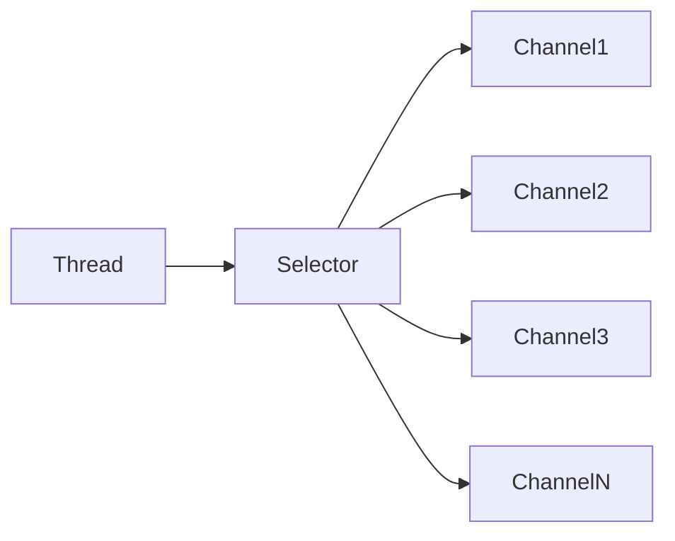

# Java Selector

## 介绍

在Java NIO（New I/O）编程中，Selector是一个关键组件，它使得单个线程可以监视多个输入通道。这种能力对于需要处理多个连接但希望减少线程数量的服务器端应用程序尤为重要。

Selector的核心优势在于能够检查一个或多个NIO通道，并确定哪些通道已准备好进行读取或写入。通过这种方式，单线程可以高效管理多个通道，而不需要为每个连接创建单独的线程。

:::note
Selector是Java NIO中实现非阻塞I/O操作的核心组件，它极大地提高了处理大量连接的能力。
:::

## Selector基础

### 什么是Selector？

Selector是Java NIO中的一个组件，它可以检测一个或多个NIO通道，并确定哪些通道已经准备好进行通信（如读或写）。这种机制使得一个单独的线程可以有效地管理多个通道。



### Selector的工作原理

Selector的工作基于事件模型。当通道准备好进行某种操作（如读、写）时，会生成一个事件。Selector会不断地轮询已注册的通道，检查它们是否有已就绪的事件。

主要的事件类型包括：

- `SelectionKey.OP_CONNECT` - 连接就绪事件
- `SelectionKey.OP_ACCEPT` - 接受连接事件
- `SelectionKey.OP_READ` - 读就绪事件
- `SelectionKey.OP_WRITE` - 写就绪事件

## 使用Selector

### 创建Selector

创建Selector非常简单，只需调用`Selector.open()`方法：

```java
Selector selector = Selector.open();
```

### 向Selector注册通道

要使用Selector，首先需要将通道注册到Selector上。只有SelectableChannel的子类才能与Selector一起使用。

注册步骤如下：

1. 将通道设置为非阻塞模式
2. 调用通道的register方法注册到Selector上

```java
// 创建Channel并打开
ServerSocketChannel serverChannel = ServerSocketChannel.open();
serverChannel.socket().bind(new InetSocketAddress(9999));

// 设置为非阻塞模式
serverChannel.configureBlocking(false);

// 注册到Selector，并关注Accept事件
SelectionKey key = serverChannel.register(selector, SelectionKey.OP_ACCEPT);
```

### SelectionKey

当通道注册到Selector后，register方法会返回一个SelectionKey对象。这个对象包含了一些属性：

- interest集合：你所关心的事件集合
- ready集合：通道已经准备好的操作集合
- Channel：注册的通道
- Selector：这个SelectionKey关联的Selector
- 附加对象：可以将一个对象附加到SelectionKey上

```java
// 检查事件类型
if (key.isAcceptable()) {
    // 处理连接请求
} else if (key.isReadable()) {
    // 处理读事件
} else if (key.isWritable()) {
    // 处理写事件
}

// 附加对象的使用
key.attach(new Object());
Object attachedObj = key.attachment();
```

### 选择通道

一旦向Selector注册了一个或多个通道，就可以调用select方法来获取已准备好进行I/O操作的通道：

```java
// 阻塞直到至少有一个通道准备好了所关注的事件
int readyChannels = selector.select();

// 阻塞，但最长阻塞时间为1000毫秒
int readyChannels = selector.select(1000);

// 非阻塞，立即返回
int readyChannels = selector.selectNow();
```

如果select方法返回的int值大于0，则表示有一个或多个通道准备好了。可以通过selectedKeys()方法获取这些已准备好的通道的SelectionKey：

```java
Set<SelectionKey> selectedKeys = selector.selectedKeys();
```

### 处理就绪通道

一旦获取了已准备好的SelectionKey集合，就需要遍历这个集合并处理每个SelectionKey：

```java
Iterator<SelectionKey> keyIterator = selectedKeys.iterator();
while (keyIterator.hasNext()) {
    SelectionKey key = keyIterator.next();
    
    if (key.isAcceptable()) {
        // 处理连接请求
        handleAccept(key);
    } else if (key.isReadable()) {
        // 处理读事件
        handleRead(key);
    } else if (key.isWritable()) {
        // 处理写事件
        handleWrite(key);
    }
    
    // 重要：处理完SelectionKey后，必须将其从集合中移除
    keyIterator.remove();
}
```

:::caution
如果不从SelectionKey集合中移除已处理的SelectionKey，下次调用select()方法时，这些键仍然会出现在已选择的键集合中，可能导致重复处理。
:::

## 完整的Selector示例

下面是一个使用Selector实现非阻塞服务器的完整示例：

```java
import java.io.IOException;
import java.net.InetSocketAddress;
import java.nio.ByteBuffer;
import java.nio.channels.SelectionKey;
import java.nio.channels.Selector;
import java.nio.channels.ServerSocketChannel;
import java.nio.channels.SocketChannel;
import java.util.Iterator;
import java.util.Set;

public class NIOSelectorServer {

    public static void main(String[] args) {
        try {
            // 创建Selector
            Selector selector = Selector.open();
            
            // 创建ServerSocketChannel
            ServerSocketChannel serverSocket = ServerSocketChannel.open();
            serverSocket.bind(new InetSocketAddress("localhost", 8080));
            serverSocket.configureBlocking(false);
            
            // 注册ServerSocketChannel到Selector
            serverSocket.register(selector, SelectionKey.OP_ACCEPT);
            
            System.out.println("服务器启动，等待连接...");
            
            while (true) {
                // 等待事件
                int readyChannels = selector.select();
                
                if (readyChannels == 0) continue;
                
                // 获取准备好的SelectionKey集合
                Set<SelectionKey> selectedKeys = selector.selectedKeys();
                Iterator<SelectionKey> keyIterator = selectedKeys.iterator();
                
                while (keyIterator.hasNext()) {
                    SelectionKey key = keyIterator.next();
                    
                    if (key.isAcceptable()) {
                        // 处理接受连接事件
                        ServerSocketChannel server = (ServerSocketChannel) key.channel();
                        SocketChannel client = server.accept();
                        client.configureBlocking(false);
                        
                        // 注册客户端连接到Selector，关注读事件
                        client.register(selector, SelectionKey.OP_READ);
                        System.out.println("接受了新的连接: " + client.getRemoteAddress());
                    } else if (key.isReadable()) {
                        // 处理读事件
                        SocketChannel client = (SocketChannel) key.channel();
                        ByteBuffer buffer = ByteBuffer.allocate(1024);
                        int bytesRead = 0;
                        
                        try {
                            bytesRead = client.read(buffer);
                        } catch (IOException e) {
                            // 连接关闭
                            key.cancel();
                            client.close();
                            System.out.println("连接已关闭");
                            keyIterator.remove();
                            continue;
                        }
                        
                        if (bytesRead > 0) {
                            buffer.flip();
                            byte[] data = new byte[buffer.limit()];
                            buffer.get(data);
                            String message = new String(data);
                            System.out.println("收到: " + message);
                            
                            // 回复客户端
                            buffer.clear();
                            buffer.put(("回复: " + message).getBytes());
                            buffer.flip();
                            client.write(buffer);
                            
                            // 继续关注读事件
                            key.interestOps(SelectionKey.OP_READ);
                        }
                    }
                    
                    // 移除已处理的SelectionKey
                    keyIterator.remove();
                }
            }
        } catch (IOException e) {
            e.printStackTrace();
        }
    }
}
```

客户端示例：

```java
import java.io.IOException;
import java.net.InetSocketAddress;
import java.nio.ByteBuffer;
import java.nio.channels.SocketChannel;
import java.util.Scanner;

public class NIOClient {

    public static void main(String[] args) {
        try {
            // 创建SocketChannel
            SocketChannel socketChannel = SocketChannel.open();
            socketChannel.connect(new InetSocketAddress("localhost", 8080));
            
            System.out.println("已连接到服务器");
            
            // 创建缓冲区
            ByteBuffer writeBuffer = ByteBuffer.allocate(1024);
            ByteBuffer readBuffer = ByteBuffer.allocate(1024);
            
            // 从控制台读取数据并发送到服务器
            Scanner scanner = new Scanner(System.in);
            
            while (true) {
                System.out.print("请输入消息: ");
                String message = scanner.nextLine();
                
                if ("quit".equals(message)) {
                    break;
                }
                
                // 写入数据
                writeBuffer.clear();
                writeBuffer.put(message.getBytes());
                writeBuffer.flip();
                socketChannel.write(writeBuffer);
                
                // 读取服务器响应
                readBuffer.clear();
                int bytesRead = socketChannel.read(readBuffer);
                
                if (bytesRead > 0) {
                    readBuffer.flip();
                    byte[] data = new byte[readBuffer.limit()];
                    readBuffer.get(data);
                    System.out.println("服务器响应: " + new String(data));
                }
            }
            
            socketChannel.close();
            scanner.close();
            
        } catch (IOException e) {
            e.printStackTrace();
        }
    }
}
```

## 多路复用的实际应用场景

### 1. 高性能Web服务器

Selector可用于构建高性能的Web服务器，如Netty框架，它能够处理成千上万的并发连接。使用Selector可以避免为每个连接创建一个线程，从而减少资源消耗。

### 2. 聊天服务器

聊天服务器需要同时处理多个客户端的连接和消息传递，Selector非常适合这种场景。

### 3. 游戏服务器

在线游戏服务器需要处理大量并发连接和实时数据交换，使用Selector可以提高服务器性能。

### 4. 文件传输服务

大文件传输服务可以利用Selector来同时处理多个文件传输任务，提高整体吞吐量。

## Selector性能优化技巧

### 1. 适当的缓冲区大小

选择合适的ByteBuffer大小对于性能至关重要。太小的缓冲区会导致频繁的系统调用，而太大的缓冲区会浪费内存。

### 2. 避免频繁创建缓冲区

尽量重用ByteBuffer，而不是每次读写操作都创建新的缓冲区。

```java
// 每个通道使用一个专用缓冲区
ByteBuffer buffer = ByteBuffer.allocate(1024);
key.attach(buffer);

// 在处理事件时获取并使用这个缓冲区
ByteBuffer attachedBuffer = (ByteBuffer) key.attachment();
```

### 3. 使用直接缓冲区

对于高性能要求的应用，可以考虑使用直接缓冲区（DirectByteBuffer）：

```java
ByteBuffer buffer = ByteBuffer.allocateDirect(1024);
```

### 4. 处理SelectionKey时的线程安全

当在多线程环境中使用Selector时，确保对SelectionKey集合的操作是线程安全的。

## 常见问题与解决方案

### 问题1：select()方法返回0

有时候select()方法可能会返回0，即使通道上有数据可读。这可能是由于以下原因：

- 在调用select()之前，事件已经发生并被处理
- 其他线程调用了selector的wakeup()方法
- select()方法超时

解决方案：检查调用时机，确保异常处理正确。

### 问题2：通道未正确设置为非阻塞模式

如果尝试将阻塞模式的通道注册到Selector，会抛出IllegalBlockingModeException异常。

解决方案：在注册通道前，确保设置：

```java
channel.configureBlocking(false);
```

### 问题3：未处理连接关闭

如果远程连接关闭但未正确处理，可能导致无限循环或资源浪费。

解决方案：在读取操作返回-1或抛出IOException时，正确关闭通道并取消SelectionKey：

```java
if (bytesRead <= 0) {
    key.cancel();
    channel.close();
    continue;
}
```

## 总结

Java NIO中的Selector是实现高性能I/O的关键组件。通过使用Selector：

1. 单个线程可以管理多个通道，减少线程创建和管理的开销
2. 程序可以更高效地使用系统资源，特别是在处理大量连接时
3. 实现了真正的非阻塞I/O，提高了应用程序的响应性和吞吐量

掌握Selector的使用，是构建高性能Java网络应用的重要一步。从基础的创建和注册，到高级的事件处理和性能优化，Selector为开发人员提供了构建可扩展网络应用的强大工具。

## 练习与进阶学习

1. **练习任务**：创建一个简单的聊天服务器，支持多客户端之间的消息传递
2. **进阶学习**：尝试使用多个Selector和多线程来处理不同类型的I/O事件
3. **性能测试**：比较使用传统阻塞I/O和NIO实现的服务器在高并发情况下的性能差异

## 附加资源

- Java官方文档：[java.nio.channels.Selector](https://docs.oracle.com/en/java/javase/11/docs/api/java.base/java/nio/channels/Selector.html)
- Java NIO相关书籍：《Java NIO》by Ron Hitchens
- 开源项目学习：Netty框架（基于Java NIO构建的高性能网络应用框架）

通过深入学习和实践Selector的使用，你将能够构建出更高效、可扩展的Java网络应用程序。