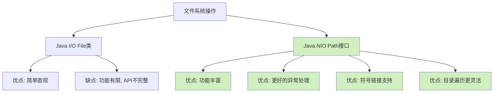

# Java Path 接口

在 Java 的 NIO (New I/O) 包中，`Path` 接口是处理文件系统路径的核心组件。它代表了文件系统中的一个路径，使我们能够以更现代、更灵活的方式操作文件和目录。无论你是需要创建、读取、更新还是删除文件，理解 `Path` 接口都是必不可少的。

## 什么是 Path 接口？

`Path` 接口是 Java 7 引入的，位于 `java.nio.file` 包中，它取代了旧的 `java.io.File` 类作为文件操作的主要 API。`Path` 表示文件系统中的路径，可以指向文件或目录，甚至可以是不存在的路径。

:::note
`Path` 只是一个路径的抽象表示，创建 `Path` 对象并不会在文件系统中创建实际的文件或目录。
:::

## 创建 Path 对象

创建 `Path` 对象最常用的方法是通过 `Paths` 类的静态方法：

```java
import java.nio.file.Path;
import java.nio.file.Paths;

public class PathExample {
    public static void main(String[] args) {
        // 创建Path对象 - 绝对路径
        Path absolutePath = Paths.get("C:\\Users\\username\\Documents\\file.txt");  // Windows系统
        // 或者
        Path absolutePathLinux = Paths.get("/home/username/Documents/file.txt");    // Unix/Linux系统
        
        // 创建Path对象 - 相对路径
        Path relativePath = Paths.get("documents", "file.txt");
        
        // 从URI创建Path
        Path uriPath = Paths.get(URI.create("file:///C:/Users/username/Documents/file.txt"));
        
        System.out.println("绝对路径: " + absolutePath);
        System.out.println("相对路径: " + relativePath);
        System.out.println("URI路径: " + uriPath);
    }
}
```

输出结果(Windows系统上)：
```
绝对路径: C:\Users\username\Documents\file.txt
相对路径: documents\file.txt
URI路径: C:\Users\username\Documents\file.txt
```

## Path 接口的常用方法

### 基本信息获取

```java
import java.nio.file.Path;
import java.nio.file.Paths;

public class PathInfoExample {
    public static void main(String[] args) {
        Path path = Paths.get("C:\\Users\\username\\Documents\\projects\\sample\\file.txt");
        
        System.out.println("文件名: " + path.getFileName());
        System.out.println("父路径: " + path.getParent());
        System.out.println("根目录: " + path.getRoot());
        System.out.println("是否为绝对路径: " + path.isAbsolute());
        
        // 获取路径元素数量
        System.out.println("路径元素数量: " + path.getNameCount());
        
        // 获取特定位置的路径元素
        System.out.println("路径中的第一个元素: " + path.getName(0));
        System.out.println("路径中的第三个元素: " + path.getName(2));
        
        // 获取子路径
        System.out.println("子路径(1-3): " + path.subpath(1, 3));
    }
}
```

输出结果：
```
文件名: file.txt
父路径: C:\Users\username\Documents\projects\sample
根目录: C:\
是否为绝对路径: true
路径元素数量: 5
路径中的第一个元素: Users
路径中的第三个元素: Documents
子路径(1-3): username\Documents
```

### 路径操作

```java
import java.nio.file.Path;
import java.nio.file.Paths;

public class PathOperationsExample {
    public static void main(String[] args) {
        Path path1 = Paths.get("C:\\Users\\username");
        Path path2 = Paths.get("documents\\file.txt");
        
        // 路径解析 - 将相对路径解析为绝对路径
        Path resolvedPath = path1.resolve(path2);
        System.out.println("解析后的路径: " + resolvedPath);
        
        // 路径标准化 - 消除冗余元素如 "." 和 ".."
        Path nonNormalizedPath = Paths.get("C:\\Users\\username\\..\\documents\\.\\file.txt");
        Path normalizedPath = nonNormalizedPath.normalize();
        System.out.println("标准化前: " + nonNormalizedPath);
        System.out.println("标准化后: " + normalizedPath);
        
        // 相对化 - 创建相对路径
        Path basePath = Paths.get("C:\\Users\\username");
        Path targetPath = Paths.get("C:\\Users\\username\\documents\\file.txt");
        Path relativizedPath = basePath.relativize(targetPath);
        System.out.println("相对路径: " + relativizedPath);
        
        // 合并路径
        Path path3 = Paths.get("C:\\Users");
        Path path4 = Paths.get("username");
        Path joinedPath = path3.resolve(path4);
        System.out.println("合并后的路径: " + joinedPath);
    }
}
```

输出结果：
```
解析后的路径: C:\Users\username\documents\file.txt
标准化前: C:\Users\username\..\documents\.\file.txt
标准化后: C:\Users\documents\file.txt
相对路径: documents\file.txt
合并后的路径: C:\Users\username
```

## Path 与 Files 类的结合使用

`Path` 接口通常与 `Files` 类一起使用，后者提供了许多静态方法来执行文件操作：

```java
import java.nio.file.Files;
import java.nio.file.Path;
import java.nio.file.Paths;
import java.io.IOException;

public class PathWithFilesExample {
    public static void main(String[] args) {
        Path filePath = Paths.get("example.txt");
        
        try {
            // 检查文件是否存在
            boolean exists = Files.exists(filePath);
            System.out.println("文件存在: " + exists);
            
            if (!exists) {
                // 创建新文件
                Files.createFile(filePath);
                System.out.println("文件已创建");
                
                // 写入内容
                String content = "Hello, Path Interface!";
                Files.writeString(filePath, content);
                System.out.println("内容已写入");
                
                // 读取内容
                String readContent = Files.readString(filePath);
                System.out.println("读取的内容: " + readContent);
                
                // 获取文件属性
                System.out.println("文件大小: " + Files.size(filePath) + " bytes");
                System.out.println("最后修改时间: " + Files.getLastModifiedTime(filePath));
            }
        } catch (IOException e) {
            e.printStackTrace();
        }
    }
}
```

输出结果：
```
文件存在: false
文件已创建
内容已写入
读取的内容: Hello, Path Interface!
文件大小: 22 bytes
最后修改时间: 2023-06-01T14:30:45.123456Z
```

## 实际应用案例

### 案例1: 递归列出目录结构

```java
import java.io.IOException;
import java.nio.file.*;
import java.nio.file.attribute.BasicFileAttributes;

public class DirectoryTreeExample {
    public static void main(String[] args) throws IOException {
        Path startPath = Paths.get("C:\\Projects");  // 替换为你想遍历的目录
        
        System.out.println("目录结构:");
        Files.walkFileTree(startPath, new SimpleFileVisitor<Path>() {
            private int level = 0;
            
            @Override
            public FileVisitResult preVisitDirectory(Path dir, BasicFileAttributes attrs) {
                printIndented(dir.getFileName().toString() + "/", level);
                level++;
                return FileVisitResult.CONTINUE;
            }
            
            @Override
            public FileVisitResult visitFile(Path file, BasicFileAttributes attrs) {
                printIndented(file.getFileName().toString(), level);
                return FileVisitResult.CONTINUE;
            }
            
            @Override
            public FileVisitResult postVisitDirectory(Path dir, IOException exc) {
                level--;
                return FileVisitResult.CONTINUE;
            }
            
            private void printIndented(String s, int level) {
                StringBuilder sb = new StringBuilder();
                for (int i = 0; i < level; i++) {
                    sb.append("  ");
                }
                sb.append(s);
                System.out.println(sb.toString());
            }
        });
    }
}
```

### 案例2: 实现文件监控

```java
import java.nio.file.*;
import static java.nio.file.StandardWatchEventKinds.*;

public class FileWatcherExample {
    public static void main(String[] args) {
        try {
            // 获取文件系统的WatchService
            WatchService watchService = FileSystems.getDefault().newWatchService();
            
            // 要监控的目录
            Path directory = Paths.get("C:\\监控目录");
            
            // 注册目录到WatchService，指定要监控的事件类型
            directory.register(watchService, ENTRY_CREATE, ENTRY_MODIFY, ENTRY_DELETE);
            
            System.out.println("监控已启动，监控目录: " + directory);
            
            // 无限循环，等待事件发生
            while (true) {
                WatchKey key;
                try {
                    // 阻塞，等待事件
                    key = watchService.take();
                } catch (InterruptedException ex) {
                    return;
                }
                
                // 处理发生的事件
                for (WatchEvent<?> event : key.pollEvents()) {
                    WatchEvent.Kind<?> kind = event.kind();
                    
                    // 获取事件的上下文信息（即发生变化的文件名）
                    @SuppressWarnings("unchecked")
                    WatchEvent<Path> ev = (WatchEvent<Path>)event;
                    Path fileName = ev.context();
                    
                    System.out.println(kind.name() + ": " + fileName);
                }
                
                // 重置key，准备接收下一组事件
                boolean valid = key.reset();
                if (!valid) {
                    // 如果目录不再可访问，退出循环
                    break;
                }
            }
        } catch (Exception e) {
            e.printStackTrace();
        }
    }
}
```

## Path 与传统 File 类的比较



使用 `Path` 接口相比传统的 `File` 类有许多优势：

1. 提供更丰富的路径操作方法
2. 与 `Files` 类协同使用，提供全面的文件操作
3. 更好的异常处理
4. 支持符号链接
5. 提供更灵活的目录遍历方式

## 总结

Java NIO 的 `Path` 接口为文件系统操作提供了强大而灵活的 API。它不仅允许我们表示文件系统路径，还提供了丰富的方法来操作这些路径。当与 `Files` 类结合使用时，`Path` 接口使文件操作变得简单高效。

关键点回顾：
- `Path` 是 Java NIO 包中表示文件系统路径的接口
- 使用 `Paths.get()` 方法创建 `Path` 对象
- `Path` 提供获取路径信息和执行路径操作的方法
- `Path` 需要与 `Files` 类一起使用才能进行实际的文件操作
- `Path` 接口比传统的 `File` 类提供了更丰富的功能

## 练习

1. 创建一个程序，使用 `Path` 接口列出指定目录中的所有文件和子目录
2. 实现一个文件复制功能，从一个 `Path` 复制到另一个 `Path`
3. 编写代码，将一个目录中的所有文本文件内容合并到一个文件中
4. 创建一个程序，监控一个目录，当有新文件创建时，自动将其移动到另一个目录

## 附加资源

- [Java官方文档 - Path接口](https://docs.oracle.com/en/java/javase/11/docs/api/java.base/java/nio/file/Path.html)
- [Java官方文档 - Files类](https://docs.oracle.com/en/java/javase/11/docs/api/java.base/java/nio/file/Files.html)
- [Java NIO教程 - Jenkov](http://tutorials.jenkov.com/java-nio/index.html)

:::tip
学习 `Path` 接口时，建议同时了解 `Files` 类，两者搭配使用才能发挥最大价值。
:::