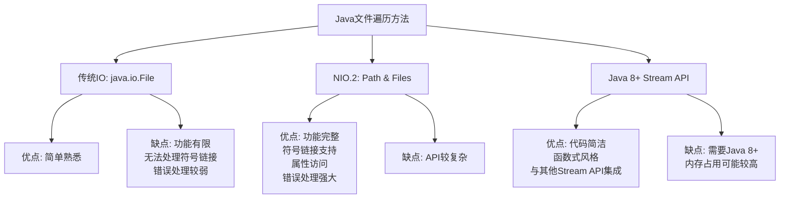

# Java 文件遍历

在Java应用开发中，文件操作是一项常见任务。无论是搜索特定文件、统计文件夹大小还是处理批量文件，我们都需要遍历文件系统。本文将介绍Java中进行文件遍历的多种方式，从传统到现代，帮助你选择适合自己需求的方法。

## 文件遍历概述

文件遍历是指程序通过一定的算法，访问文件系统中的文件和目录的过程。在Java中，我们有多种方式可以实现文件遍历：

1. 传统IO方式 (`java.io.File`)
2. NIO.2的Path和Files API (`java.nio.file`)
3. Java 8引入的流式API结合文件操作

每种方式都有自己的优缺点和适用场景。接下来我们将逐一介绍。

## 使用传统IO进行文件遍历

Java最早提供的文件操作API是`java.io.File`类。虽然它现在已经不是最优的选择，但由于历史代码的存在，你仍然可能会遇到它。

### 基本遍历示例

```java
import java.io.File;

public class FileTraversalExample {
    public static void main(String[] args) {
        File directory = new File("C:/temp");
        
        if (directory.exists() && directory.isDirectory()) {
            File[] files = directory.listFiles();
            if (files != null) {
                for (File file : files) {
                    System.out.println(file.getName());
                }
            }
        }
    }
}
```

以上代码将列出C:/temp目录下的所有文件和文件夹。

### 递归遍历所有子目录

如果你需要遍历一个目录及其所有子目录，可以使用递归：

```java
public static void traverseDirectory(File directory) {
    if (directory.exists() && directory.isDirectory()) {
        System.out.println("目录: " + directory.getAbsolutePath());
        
        File[] files = directory.listFiles();
        if (files != null) {
            for (File file : files) {
                if (file.isDirectory()) {
                    traverseDirectory(file); // 递归遍历子目录
                } else {
                    System.out.println("文件: " + file.getAbsolutePath());
                }
            }
        }
    }
}
```

:::caution 性能注意
在处理大型文件系统时，递归可能会导致栈溢出异常。对于深层次的目录结构，应考虑使用迭代方法或限制递归深度。
:::

### 文件过滤

`File`类提供了`FileFilter`和`FilenameFilter`接口来筛选文件：

```java
File directory = new File("C:/temp");

// 仅列出.txt文件
File[] txtFiles = directory.listFiles(new FilenameFilter() {
    @Override
    public boolean accept(File dir, String name) {
        return name.endsWith(".txt");
    }
});

// 使用Java 8 Lambda表达式简化
File[] txtFilesLambda = directory.listFiles((dir, name) -> name.endsWith(".txt"));
```

## 使用NIO.2进行文件遍历

Java 7引入了NIO.2，提供了更强大、灵活的文件操作API。对于文件遍历，我们主要使用`Path`、`Files`和`DirectoryStream`。

### 基本目录列表

```java
import java.nio.file.Files;
import java.nio.file.Path;
import java.nio.file.Paths;
import java.io.IOException;

public class NioFileTraversalExample {
    public static void main(String[] args) {
        Path directory = Paths.get("C:/temp");
        
        try {
            Files.list(directory)
                 .forEach(path -> System.out.println(path.getFileName()));
        } catch (IOException e) {
            e.printStackTrace();
        }
    }
}
```

`Files.list()`返回一个Stream，这让我们可以利用Java 8的强大流操作。

### 使用DirectoryStream

如果你需要更精细的控制或者处理大目录：

```java
try (DirectoryStream<Path> stream = Files.newDirectoryStream(directory)) {
    for (Path path : stream) {
        System.out.println(path.getFileName());
    }
} catch (IOException e) {
    e.printStackTrace();
}
```

### 文件过滤

NIO.2提供了灵活的文件过滤方式：

```java
// 使用glob模式过滤
try (DirectoryStream<Path> stream = 
         Files.newDirectoryStream(directory, "*.{txt,doc,docx}")) {
    for (Path path : stream) {
        System.out.println("文档文件: " + path.getFileName());
    }
} catch (IOException e) {
    e.printStackTrace();
}
```

## 使用walkFileTree进行高级遍历

对于更复杂的文件遍历需求，NIO.2提供了`walkFileTree`方法，结合`FileVisitor`接口使用：

```java
import java.nio.file.*;
import java.nio.file.attribute.BasicFileAttributes;
import java.io.IOException;

public class WalkFileTreeExample {
    public static void main(String[] args) throws IOException {
        Path startDir = Paths.get("C:/temp");
        Files.walkFileTree(startDir, new FileVisitor<Path>() {
            @Override
            public FileVisitResult preVisitDirectory(Path dir, BasicFileAttributes attrs) {
                System.out.println("准备访问目录: " + dir);
                return FileVisitResult.CONTINUE;
            }

            @Override
            public FileVisitResult visitFile(Path file, BasicFileAttributes attrs) {
                System.out.println("访问文件: " + file);
                return FileVisitResult.CONTINUE;
            }

            @Override
            public FileVisitResult visitFileFailed(Path file, IOException exc) {
                System.err.println("访问失败: " + file);
                return FileVisitResult.CONTINUE;
            }

            @Override
            public FileVisitResult postVisitDirectory(Path dir, IOException exc) {
                System.out.println("结束访问目录: " + dir);
                return FileVisitResult.CONTINUE;
            }
        });
    }
}
```

`walkFileTree`方法提供了完全控制遍历过程的能力，你可以在不同的遍历阶段执行特定操作。

:::tip 简化代码
你可以使用`SimpleFileVisitor`类作为基类，只重写需要的方法，而不是实现全部的`FileVisitor`接口方法。
:::

## Java 8+ 的现代文件遍历

Java 8引入的Stream API与NIO.2结合，提供了更简洁优雅的文件遍历方式。

### 使用Files.walk()

这是一个强大的方法，它可以递归遍历目录树：

```java
try {
    Files.walk(Paths.get("C:/temp"))
         .filter(Files::isRegularFile)
         .forEach(System.out::println);
} catch (IOException e) {
    e.printStackTrace();
}
```

你可以设置遍历深度：

```java
// 最多遍历2层目录（当前目录及其直接子目录）
Files.walk(Paths.get("C:/temp"), 2)
     .forEach(System.out::println);
```

### 使用Files.find()

如果你需要更强大的搜索能力：

```java
// 查找最近24小时内修改的.java文件
long twentyFourHoursInMillis = 24 * 60 * 60 * 1000;
long cutOff = System.currentTimeMillis() - twentyFourHoursInMillis;

try {
    Files.find(
        Paths.get("C:/projects"), 
        Integer.MAX_VALUE,
        (path, attrs) -> {
            return attrs.isRegularFile() && 
                   path.toString().endsWith(".java") && 
                   attrs.lastModifiedTime().toMillis() > cutOff;
        }
    ).forEach(System.out::println);
} catch (IOException e) {
    e.printStackTrace();
}
```

## 实际应用案例

### 案例1：计算目录大小

以下代码用于递归计算目录总大小：

```java
public static long calculateDirectorySize(Path directory) throws IOException {
    try (Stream<Path> walk = Files.walk(directory)) {
        return walk
            .filter(Files::isRegularFile)
            .mapToLong(path -> {
                try {
                    return Files.size(path);
                } catch (IOException e) {
                    System.err.println("无法获取文件大小: " + path);
                    return 0L;
                }
            })
            .sum();
    }
}
```

使用示例：

```java
try {
    Path directory = Paths.get("C:/projects");
    long size = calculateDirectorySize(directory);
    System.out.println("目录大小: " + size + " 字节");
    System.out.println("目录大小: " + (size / (1024.0 * 1024.0)) + " MB");
} catch (IOException e) {
    e.printStackTrace();
}
```

### 案例2：搜索并复制特定文件

此示例搜索所有.log文件并复制到备份目录：

```java
public static void backupLogFiles(Path sourceDir, Path targetDir) throws IOException {
    // 确保目标目录存在
    if (!Files.exists(targetDir)) {
        Files.createDirectories(targetDir);
    }
    
    Files.walk(sourceDir)
         .filter(path -> path.toString().endsWith(".log"))
         .forEach(source -> {
             try {
                 // 创建相对路径以保持目录结构
                 Path relativePath = sourceDir.relativize(source);
                 Path destination = targetDir.resolve(relativePath);
                 
                 // 确保目标父目录存在
                 Files.createDirectories(destination.getParent());
                 
                 // 复制文件，替换已存在的文件
                 Files.copy(source, destination, StandardCopyOption.REPLACE_EXISTING);
                 System.out.println("已复制: " + source + " -> " + destination);
             } catch (IOException e) {
                 System.err.println("复制失败: " + source + " - " + e.getMessage());
             }
         });
}
```

## 性能比较与选择指南

下面是各种方法的简要比较：



选择建议：
- 对于简单的文件列举，任何方法都可以
- 处理大型文件系统时，考虑使用`DirectoryStream`或限制递归深度
- 需要完全控制遍历过程时，使用`walkFileTree`
- 如果使用Java 8+并追求简洁代码，优先考虑Stream API方法
- 对于老旧系统或库的兼容性需求，可能需要使用传统IO

## 总结

Java提供了多种文件遍历方式，从传统的File类到现代的Stream API。本文详细介绍了：

1. 传统IO (`File`)的基本遍历和递归遍历
2. NIO.2提供的更灵活的`Path`和`Files` API
3. 高级的`walkFileTree`方法和`FileVisitor`接口
4. Java 8+ 的流式API如`Files.walk()`和`Files.find()`
5. 实际应用案例展示了如何在真实项目中应用这些技术

选择合适的文件遍历方法，可以让你的代码更简洁、更高效、更可靠地处理文件系统操作。

## 练习题

1. 编写一个程序，统计指定目录中各种文件类型的数量（如.java、.txt、.png等）。
2. 实现一个文件查找功能，根据文件名、大小、修改时间等条件搜索文件。
3. 创建一个工具，可以递归删除指定目录中所有的空目录。
4. 编写一个程序，找出指定目录中最大的10个文件并显示它们的路径和大小。
5. 实现一个简单的文件同步工具，比较两个目录的差异，并将新文件或更新的文件从源目录复制到目标目录。

:::tip 进一步学习
要深入学习Java的文件操作，建议了解：
1. Java NIO的Buffer和Channel
2. 文件锁定机制
3. 文件监视服务（WatchService）
4. 内存映射文件
5. 异步文件操作
:::

Happy coding!