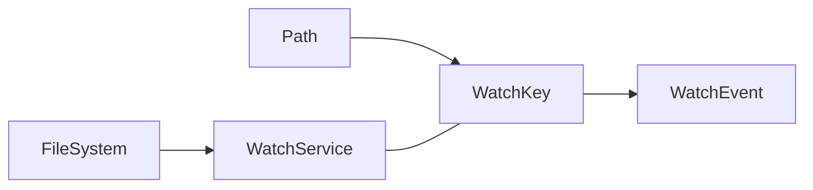

# Java 文件监视

在开发应用程序时，我们经常需要监控文件系统中的变化。例如，配置文件更新时自动重新加载配置，或者在文件上传目录中检测新文件的到达。Java NIO 提供的 WatchService API 使得这样的文件监视变得简单高效。

## 什么是文件监视？

文件监视是指持续监控文件系统中特定目录或文件的变化。这些变化可能包括：

- 文件创建
- 文件删除
- 文件修改
- 文件重命名等

在Java 7及更高版本中，我们可以使用 `java.nio.file` 包中的 WatchService API 来实现这一功能。

## WatchService API 核心概念

WatchService API 由以下核心组件构成：



- **WatchService**：监视服务，负责监控已注册的对象变化
- **Path**：要监视的路径（目录）
- **WatchKey**：注册监视时返回的键，用于获取和处理事件
- **WatchEvent**：表示被检测到的事件（文件创建、删除、修改等）

## 基本使用步骤

使用 WatchService 监视文件变化通常包括以下步骤：

1. 创建 WatchService 实例
2. 将目录路径注册到 WatchService，并指定要监视的事件类型
3. 循环等待事件发生
4. 处理事件
5. 重置 WatchKey 以继续监视

让我们通过一个基本示例来了解 WatchService 的使用：

```java
import java.nio.file.*;
import java.io.IOException;

public class FileWatchExample {
    public static void main(String[] args) {
        try {
            // 1. 创建 WatchService
            WatchService watchService = FileSystems.getDefault().newWatchService();
            
            // 2. 获取要监视的目录路径
            Path dir = Paths.get("C:/temp");
            
            // 3. 注册路径，指定要监控的事件类型
            dir.register(watchService, 
                StandardWatchEventKinds.ENTRY_CREATE, 
                StandardWatchEventKinds.ENTRY_DELETE, 
                StandardWatchEventKinds.ENTRY_MODIFY);
            
            System.out.println("监控目录: " + dir);
            
            // 4. 开始监控循环
            while (true) {
                // 等待事件发生
                WatchKey key = watchService.take(); // 这是一个阻塞调用
                
                // 处理所有事件
                for (WatchEvent<?> event : key.pollEvents()) {
                    WatchEvent.Kind<?> kind = event.kind();
                    
                    // 获取事件对应的文件名
                    @SuppressWarnings("unchecked")
                    WatchEvent<Path> pathEvent = (WatchEvent<Path>)event;
                    Path fileName = pathEvent.context();
                    
                    System.out.println(kind.name() + ": " + fileName);
                }
                
                // 重置key，为下一轮监控做准备
                boolean valid = key.reset();
                if (!valid) {
                    // 如果key不再有效(例如监控的目录被删除)，退出监控
                    break;
                }
            }
            
        } catch (IOException | InterruptedException e) {
            e.printStackTrace();
        }
    }
}
```

### 输出示例

当你在监控的目录中执行各种操作时，可能会看到类似下面的输出：

```
监控目录: C:\temp
ENTRY_CREATE: test.txt
ENTRY_MODIFY: test.txt
ENTRY_MODIFY: test.txt
ENTRY_DELETE: test.txt
```

## 监视事件类型

`StandardWatchEventKinds` 类定义了三种标准事件类型：

- **ENTRY_CREATE**: 创建新文件或目录
- **ENTRY_DELETE**: 删除文件或目录
- **ENTRY_MODIFY**: 修改文件或目录
- **OVERFLOW**: 表示事件丢失或丢弃（这通常不需要显式注册）

:::note
WatchService 只能监控目录而不是单个文件。如果你需要监控文件，应该监控包含该文件的目录，然后过滤事件。
:::

## 递归目录监控

WatchService 默认不会递归监控子目录。如果需要监控目录树中的所有变化，需要手动实现递归：

```java
import java.nio.file.*;
import java.io.IOException;
import java.util.HashMap;
import java.util.Map;

public class RecursiveWatcherExample {
    private final WatchService watcher;
    private final Map<WatchKey, Path> keys;
    
    public RecursiveWatcherExample(Path startPath) throws IOException {
        this.watcher = FileSystems.getDefault().newWatchService();
        this.keys = new HashMap<>();
        
        // 注册所有子目录
        registerAll(startPath);
    }
    
    private void registerAll(final Path start) throws IOException {
        // 使用Files.walkFileTree遍历目录树
        Files.walkFileTree(start, new SimpleFileVisitor<Path>() {
            @Override
            public FileVisitResult preVisitDirectory(Path dir, BasicFileAttributes attrs) throws IOException {
                // 注册目录
                register(dir);
                return FileVisitResult.CONTINUE;
            }
        });
    }
    
    private void register(Path dir) throws IOException {
        WatchKey key = dir.register(watcher, 
            StandardWatchEventKinds.ENTRY_CREATE,
            StandardWatchEventKinds.ENTRY_DELETE,
            StandardWatchEventKinds.ENTRY_MODIFY);
        keys.put(key, dir);
    }
    
    public void processEvents() {
        while (true) {
            WatchKey key;
            try {
                key = watcher.take(); // 等待事件发生
            } catch (InterruptedException x) {
                return;
            }
            
            Path dir = keys.get(key);
            if (dir == null) {
                continue;
            }
            
            for (WatchEvent<?> event : key.pollEvents()) {
                WatchEvent.Kind<?> kind = event.kind();
                
                if (kind == StandardWatchEventKinds.OVERFLOW) {
                    continue;
                }
                
                @SuppressWarnings("unchecked")
                WatchEvent<Path> ev = (WatchEvent<Path>) event;
                Path name = ev.context();
                Path child = dir.resolve(name);
                
                System.out.println(kind.name() + ": " + child);
                
                // 如果创建了新目录，需要将它们注册到监控服务
                if (kind == StandardWatchEventKinds.ENTRY_CREATE) {
                    try {
                        if (Files.isDirectory(child)) {
                            registerAll(child);
                        }
                    } catch (IOException e) {
                        e.printStackTrace();
                    }
                }
            }
            
            // 重置key，为下一轮监控做准备
            boolean valid = key.reset();
            if (!valid) {
                keys.remove(key);
                if (keys.isEmpty()) {
                    break;  // 没有可监视的目录了
                }
            }
        }
    }
    
    public static void main(String[] args) throws IOException {
        Path dir = Paths.get("C:/temp");
        RecursiveWatcherExample watcher = new RecursiveWatcherExample(dir);
        System.out.println("开始监控目录: " + dir);
        watcher.processEvents();
    }
}
```

## 性能与限制考虑

在使用 WatchService API 时，需要了解以下性能和限制问题：

1. **平台差异**: WatchService 的实现在不同操作系统上有所不同。Windows 使用轮询机制，而 Linux 使用 inotify，macOS 使用 FSEvents。这意味着在不同平台上性能特征会有所不同。

2. **监控深度**: 默认只监控直接注册的目录，不会递归监控子目录中的变化。

3. **事件合并**: 文件系统可能会合并多个快速连续发生的事件。例如，如果一个文件被快速修改多次，可能只会收到一个修改事件。

4. **文件名而非完整路径**: `WatchEvent.context()` 返回的是相对于被监控目录的文件名，而不是完整路径。

:::caution
在处理大量文件变化时，WatchService可能会消耗较多系统资源。对于高性能需求或复杂的文件监控场景，可能需要考虑第三方库如Apache Commons IO的FileAlterationMonitor。
:::

## 实际应用场景

### 应用场景1：配置文件热加载

```java
public class ConfigWatcher {
    private Path configFile;
    private Configuration config;
    
    public ConfigWatcher(String configPath) {
        this.configFile = Paths.get(configPath);
        this.config = loadConfig(configFile);
        
        // 在单独的线程中启动文件监控
        new Thread(() -> watchConfigChanges()).start();
    }
    
    private Configuration loadConfig(Path path) {
        // 从文件加载配置的逻辑
        System.out.println("加载配置: " + path);
        return new Configuration();  // 返回配置对象
    }
    
    private void watchConfigChanges() {
        try {
            WatchService watchService = FileSystems.getDefault().newWatchService();
            Path dir = configFile.getParent();
            dir.register(watchService, StandardWatchEventKinds.ENTRY_MODIFY);
            
            while (true) {
                WatchKey key = watchService.take();
                
                for (WatchEvent<?> event : key.pollEvents()) {
                    @SuppressWarnings("unchecked")
                    WatchEvent<Path> pathEvent = (WatchEvent<Path>)event;
                    Path filename = pathEvent.context();
                    
                    // 检查是否是我们关心的配置文件被修改了
                    if (filename.toString().equals(configFile.getFileName().toString())) {
                        config = loadConfig(configFile);
                        System.out.println("配置已重新加载");
                    }
                }
                
                if (!key.reset()) {
                    break;
                }
            }
        } catch (IOException | InterruptedException e) {
            e.printStackTrace();
        }
    }
    
    // 获取当前配置的方法
    public Configuration getConfig() {
        return config;
    }
    
    // 简单的配置类
    class Configuration {
        // 配置属性和方法
    }
}
```

### 应用场景2：文件上传目录监视

```java
public class UploadDirectoryWatcher {
    private Path uploadDir;
    
    public UploadDirectoryWatcher(String uploadPath) {
        this.uploadDir = Paths.get(uploadPath);
        startWatching();
    }
    
    private void startWatching() {
        new Thread(() -> {
            try {
                WatchService watchService = FileSystems.getDefault().newWatchService();
                uploadDir.register(watchService, StandardWatchEventKinds.ENTRY_CREATE);
                
                System.out.println("开始监控上传目录: " + uploadDir);
                
                while (true) {
                    WatchKey key = watchService.take();
                    
                    for (WatchEvent<?> event : key.pollEvents()) {
                        @SuppressWarnings("unchecked")
                        WatchEvent<Path> pathEvent = (WatchEvent<Path>)event;
                        Path filename = pathEvent.context();
                        
                        // 处理新上传的文件
                        Path uploadedFile = uploadDir.resolve(filename);
                        processUploadedFile(uploadedFile);
                    }
                    
                    if (!key.reset()) {
                        break;
                    }
                }
            } catch (IOException | InterruptedException e) {
                e.printStackTrace();
            }
        }).start();
    }
    
    private void processUploadedFile(Path file) {
        System.out.println("处理新上传的文件: " + file);
        // 处理文件的逻辑，如图像转换、病毒扫描等
    }
}
```

## 总结

Java NIO 的 WatchService API 提供了一个强大而灵活的机制来监控文件系统的变化。通过它，我们可以：

- 监控目录中的文件创建、修改和删除事件
- 实现配置文件的热加载
- 监控上传目录中的新文件
- 构建需要响应文件系统变化的各种应用

尽管 WatchService 有一些平台相关的限制和性能考虑，但对于大多数应用场景来说，它提供了一个简单且有效的解决方案。

## 练习

1. 创建一个简单的日志文件监视器，每当日志文件被修改时，读取并显示新添加的内容。

2. 实现一个目录同步工具，监控源目录的变化，并将变化同步到目标目录。

3. 开发一个简单的热部署系统，监控类文件的变化并自动重新加载类。

## 进一步阅读

- Java 官方文档中关于 [WatchService](https://docs.oracle.com/en/java/javase/11/docs/api/java.base/java/nio/file/WatchService.html) 的说明
- 探索 Apache Commons IO 的 [FileAlterationMonitor](https://commons.apache.org/proper/commons-io/javadocs/api-release/org/apache/commons/io/monitor/FileAlterationMonitor.html)，这是另一种实现文件监控的方式
- 研究不同操作系统下 WatchService 的实现差异和最佳实践

:::tip
在开发使用文件监视的应用时，务必进行充分的测试，尤其是在跨平台环境中，以确保监控机制在所有目标平台上都能正确工作。
:::