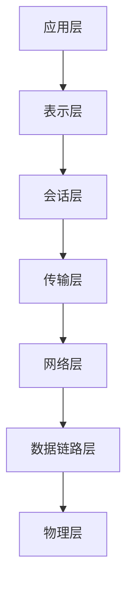
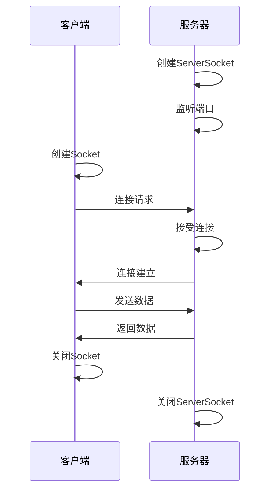

# Java 网络基础

在当今互联互通的世界中，网络编程已经成为每个软件开发者必须掌握的技能。Java作为一种跨平台的编程语言，提供了丰富的网络编程API，使开发者能够轻松构建各种网络应用。本文将介绍Java网络编程的基础知识，帮助初学者了解网络通信的原理以及如何使用Java进行网络编程。

## 1. 网络通信基础

在深入Java网络编程之前，我们需要了解一些基本的网络通信概念。

### 1.1 什么是网络通信？

网络通信是指计算机设备之间通过网络介质传输数据的过程。计算机通过网络协议相互通信，实现数据的共享和交换。

### 1.2 网络通信模型

网络通信遵循OSI七层模型和TCP/IP四层模型。



**TCP/IP四层模型**：
1. 应用层（HTTP、FTP、SMTP等）
2. 传输层（TCP、UDP）
3. 网络层（IP）
4. 链路层（以太网）

### 1.3 网络通信的基本概念

- **IP地址**：每台计算机在网络中的唯一标识
- **端口**：一台计算机上的应用程序的标识
- **协议**：通信双方约定的规则，如HTTP、FTP、SMTP等
- **Socket**：网络通信的端点，是IP地址和端口的组合

## 2. Java网络编程API概述

Java提供了`java.net`包，包含了用于网络编程的类和接口。主要类包括：

- **InetAddress**：表示IP地址
- **URL/URLConnection**：用于处理URL资源
- **Socket/ServerSocket**：基于TCP协议的通信
- **DatagramSocket/DatagramPacket**：基于UDP协议的通信

## 3. 使用InetAddress类

`InetAddress`类用于表示IP地址，提供了获取主机名和IP地址的方法。

```java
import java.net.InetAddress;
import java.net.UnknownHostException;

public class InetAddressDemo {
    public static void main(String[] args) {
        try {
            // 获取本地主机的InetAddress对象
            InetAddress localHost = InetAddress.getLocalHost();
            System.out.println("本地主机名：" + localHost.getHostName());
            System.out.println("本地IP地址：" + localHost.getHostAddress());
            
            // 根据主机名获取InetAddress对象
            InetAddress baidu = InetAddress.getByName("www.baidu.com");
            System.out.println("百度的IP地址：" + baidu.getHostAddress());
            
            // 检查主机是否可达
            boolean reachable = baidu.isReachable(5000);
            System.out.println("百度是否可达：" + reachable);
            
        } catch (Exception e) {
            e.printStackTrace();
        }
    }
}
```

输出示例：
```
本地主机名：DESKTOP-ABC123
本地IP地址：192.168.1.100
百度的IP地址：39.156.66.10
百度是否可达：true
```

## 4. URL和URLConnection类

Java提供了`URL`和`URLConnection`类来访问网络上的资源。

### 4.1 URL类

`URL`类表示统一资源定位符，用于定位Internet上的资源。

```java
import java.net.URL;

public class URLDemo {
    public static void main(String[] args) {
        try {
            URL url = new URL("https://www.example.com:443/index.html?name=java#section1");
            
            System.out.println("协议：" + url.getProtocol());
            System.out.println("主机名：" + url.getHost());
            System.out.println("端口：" + url.getPort());
            System.out.println("文件路径：" + url.getPath());
            System.out.println("查询字符串：" + url.getQuery());
            System.out.println("片段标识符：" + url.getRef());
            
        } catch (Exception e) {
            e.printStackTrace();
        }
    }
}
```

输出：
```
协议：https
主机名：www.example.com
端口：443
文件路径：/index.html
查询字符串：name=java
片段标识符：section1
```

### 4.2 URLConnection类

`URLConnection`类提供了与URL所引用的远程对象的连接功能。

```java
import java.net.URL;
import java.net.URLConnection;
import java.io.BufferedReader;
import java.io.InputStreamReader;

public class URLConnectionDemo {
    public static void main(String[] args) {
        try {
            URL url = new URL("https://www.example.com");
            
            // 打开连接
            URLConnection connection = url.openConnection();
            
            // 设置请求属性
            connection.setRequestProperty("User-Agent", "Mozilla/5.0");
            
            // 获取内容
            BufferedReader reader = new BufferedReader(
                new InputStreamReader(connection.getInputStream())
            );
            
            String line;
            StringBuilder content = new StringBuilder();
            while ((line = reader.readLine()) != null) {
                content.append(line).append("\n");
            }
            reader.close();
            
            System.out.println("内容类型：" + connection.getContentType());
            System.out.println("内容长度：" + connection.getContentLength());
            System.out.println("页面内容预览（前100字符）：");
            System.out.println(content.substring(0, Math.min(100, content.length())));
            
        } catch (Exception e) {
            e.printStackTrace();
        }
    }
}
```

## 5. Socket编程

Socket是网络通信的端点，Java提供了Socket和ServerSocket类来实现基于TCP协议的通信。

### 5.1 Socket通信的基本流程



### 5.2 基于TCP的Socket通信实现

下面是一个简单的服务器和客户端通信的例子：

**服务器端代码**：
```java
import java.io.*;
import java.net.*;

public class SimpleServer {
    public static void main(String[] args) {
        try {
            // 创建服务器Socket，监听9999端口
            ServerSocket serverSocket = new ServerSocket(9999);
            System.out.println("服务器启动，等待客户端连接...");
            
            // 接受客户端连接
            Socket clientSocket = serverSocket.accept();
            System.out.println("客户端已连接：" + clientSocket.getInetAddress());
            
            // 获取输入流和输出流
            BufferedReader in = new BufferedReader(
                new InputStreamReader(clientSocket.getInputStream())
            );
            PrintWriter out = new PrintWriter(clientSocket.getOutputStream(), true);
            
            // 读取客户端发送的消息
            String message = in.readLine();
            System.out.println("收到客户端消息：" + message);
            
            // 向客户端发送响应
            out.println("服务器已收到消息：" + message);
            
            // 关闭连接
            in.close();
            out.close();
            clientSocket.close();
            serverSocket.close();
            
        } catch (IOException e) {
            e.printStackTrace();
        }
    }
}
```

**客户端代码**：
```java
import java.io.*;
import java.net.*;

public class SimpleClient {
    public static void main(String[] args) {
        try {
            // 连接到服务器
            Socket socket = new Socket("localhost", 9999);
            
            // 获取输入流和输出流
            BufferedReader in = new BufferedReader(
                new InputStreamReader(socket.getInputStream())
            );
            PrintWriter out = new PrintWriter(socket.getOutputStream(), true);
            
            // 发送消息
            out.println("你好，服务器！");
            
            // 读取服务器响应
            String response = in.readLine();
            System.out.println("服务器响应：" + response);
            
            // 关闭连接
            in.close();
            out.close();
            socket.close();
            
        } catch (IOException e) {
            e.printStackTrace();
        }
    }
}
```

执行这两个程序时，先运行服务器端，再运行客户端。服务器端输出：
```
服务器启动，等待客户端连接...
客户端已连接：/127.0.0.1
收到客户端消息：你好，服务器！
```

客户端输出：
```
服务器响应：服务器已收到消息：你好，服务器！
```

### 5.3 基于UDP的Socket通信

UDP（用户数据报协议）是一种无连接的协议，Java使用`DatagramSocket`和`DatagramPacket`类实现UDP通信。

**UDP服务器端**：
```java
import java.net.*;

public class UDPServer {
    public static void main(String[] args) {
        try {
            // 创建UDP Socket，监听9998端口
            DatagramSocket socket = new DatagramSocket(9998);
            byte[] receiveData = new byte[1024];
            
            System.out.println("UDP服务器已启动，等待数据...");
            
            // 创建接收数据包
            DatagramPacket receivePacket = new DatagramPacket(receiveData, receiveData.length);
            
            // 接收数据
            socket.receive(receivePacket);
            
            // 处理接收到的数据
            String message = new String(receivePacket.getData(), 0, receivePacket.getLength());
            System.out.println("接收到数据：" + message);
            
            // 获取客户端地址和端口
            InetAddress clientAddress = receivePacket.getAddress();
            int clientPort = receivePacket.getPort();
            
            // 准备回复数据
            String replyMessage = "已收到消息：" + message;
            byte[] sendData = replyMessage.getBytes();
            
            // 创建发送数据包
            DatagramPacket sendPacket = new DatagramPacket(
                sendData, sendData.length, clientAddress, clientPort
            );
            
            // 发送数据
            socket.send(sendPacket);
            
            // 关闭socket
            socket.close();
            
        } catch (IOException e) {
            e.printStackTrace();
        }
    }
}
```

**UDP客户端**：
```java
import java.net.*;

public class UDPClient {
    public static void main(String[] args) {
        try {
            // 创建UDP Socket
            DatagramSocket socket = new DatagramSocket();
            
            // 设置服务器地址
            InetAddress serverAddress = InetAddress.getByName("localhost");
            int serverPort = 9998;
            
            // 准备发送数据
            String message = "Hello UDP Server!";
            byte[] sendData = message.getBytes();
            
            // 创建发送数据包
            DatagramPacket sendPacket = new DatagramPacket(
                sendData, sendData.length, serverAddress, serverPort
            );
            
            // 发送数据
            socket.send(sendPacket);
            
            // 准备接收数据
            byte[] receiveData = new byte[1024];
            DatagramPacket receivePacket = new DatagramPacket(receiveData, receiveData.length);
            
            // 接收数据
            socket.receive(receivePacket);
            
            // 处理接收到的数据
            String response = new String(receivePacket.getData(), 0, receivePacket.getLength());
            System.out.println("服务器响应：" + response);
            
            // 关闭socket
            socket.close();
            
        } catch (IOException e) {
            e.printStackTrace();
        }
    }
}
```

UDP服务器端输出：
```
UDP服务器已启动，等待数据...
接收到数据：Hello UDP Server!
```

UDP客户端输出：
```
服务器响应：已收到消息：Hello UDP Server!
```

## 6. 实际应用场景

Java网络编程在实际应用中有着广泛的用途，以下是一些常见场景：

### 6.1 聊天应用

使用Socket实现即时通讯功能，允许多个客户端连接到服务器并相互发送消息。

### 6.2 Web服务器

实现一个简单的HTTP服务器，处理客户端的HTTP请求并返回响应。

### 6.3 文件传输

使用Socket实现文件上传和下载功能，在客户端和服务器之间传输文件。

### 6.4 邮件客户端

使用Java的网络编程实现SMTP、POP3或IMAP协议，实现邮件的发送和接收功能。

:::tip 扩展实践
一个简单的聊天服务器可以通过多线程Socket编程实现，每个连接的客户端由一个独立的线程处理，服务器负责转发消息给所有连接的客户端。这是一个很好的实践项目！
:::

## 7. 总结

本文介绍了Java网络编程的基础知识，包括：

- 网络通信的基本概念和模型
- Java网络编程API概述
- InetAddress类的使用
- URL和URLConnection类的应用
- 基于TCP的Socket通信
- 基于UDP的Socket通信
- 实际应用场景

Java网络编程为开发者提供了强大的工具来构建各种网络应用。掌握这些基础知识后，你可以进一步学习更高级的网络编程技术，如NIO（非阻塞IO）、Netty框架等。

## 8. 练习和附加资源

### 练习

1. 实现一个简单的HTTP客户端，能够发送GET请求并解析响应。
2. 实现一个多线程的聊天服务器，允许多个客户端连接并相互发送消息。
3. 使用UDP实现一个简单的文件传输程序。

### 附加资源

- [Java官方文档 - java.net包](https://docs.oracle.com/javase/8/docs/api/java/net/package-summary.html)
- [Oracle Java网络编程教程](https://docs.oracle.com/javase/tutorial/networking/index.html)
- 《Java网络编程》（第4版）- Elliotte Rusty Harold
- 《Netty实战》- Norman Maurer

:::caution 注意事项
在进行网络编程时，一定要注意处理异常和资源的关闭。不正确地关闭Socket或流可能会导致资源泄露。同时，网络环境可能不稳定，程序应当能够处理连接超时、断开等情况。
:::

通过本文的学习，你已经掌握了Java网络编程的基础知识，可以开始构建自己的网络应用了。记住，实践是学习编程最好的方式，多动手实现一些小项目，将会加深你对这些概念的理解。