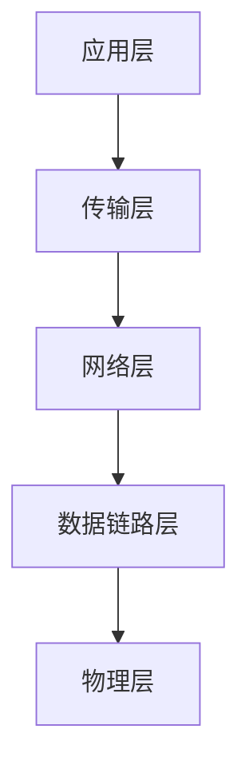
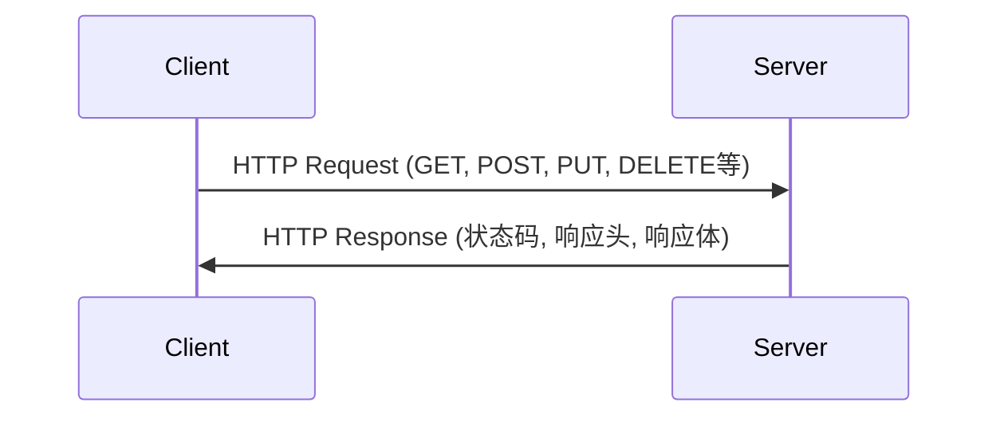
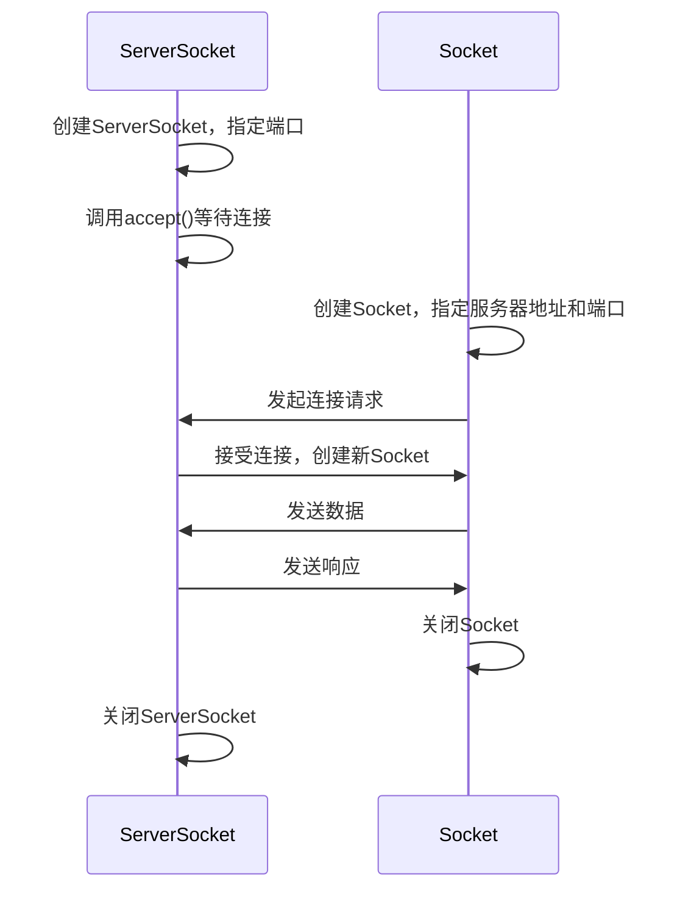

# Java 网络协议

## 网络协议基础

网络协议是计算机通信过程中遵循的规则集合，它定义了数据如何在网络上传输、如何格式化以及如何处理错误。对于Java开发者来说，理解网络协议是进行网络编程的基础。

### 什么是网络协议？

网络协议就像是计算机之间交流的"语言"，定义了信息交换的格式和规则，确保不同设备能够相互理解和通信。



## TCP/IP协议族

TCP/IP（传输控制协议/互联网协议）是最广泛使用的网络协议族，构成了互联网的基础。

### TCP（传输控制协议）

TCP是一种**面向连接**的、**可靠**的、**基于字节流**的传输层通信协议。

:::note
TCP的特点:
- 面向连接：通信前需要先建立连接
- 可靠传输：保证数据的完整性和顺序
- 流量控制：避免发送方发送速度过快
- 拥塞控制：避免网络拥塞
:::

#### Java 中的TCP编程示例

```java
// 服务器端代码
import java.io.*;
import java.net.*;

public class TCPServer {
    public static void main(String[] args) {
        try {
            // 创建服务器socket，监听8888端口
            ServerSocket serverSocket = new ServerSocket(8888);
            System.out.println("服务器启动，等待连接...");
            
            // 等待客户端连接
            Socket socket = serverSocket.accept();
            System.out.println("客户端已连接：" + socket.getInetAddress());
            
            // 获取输入流，读取客户端发送的数据
            BufferedReader in = new BufferedReader(new InputStreamReader(socket.getInputStream()));
            String message = in.readLine();
            System.out.println("收到客户端消息：" + message);
            
            // 获取输出流，向客户端发送响应
            PrintWriter out = new PrintWriter(socket.getOutputStream(), true);
            out.println("服务器已收到消息：" + message);
            
            // 关闭资源
            in.close();
            out.close();
            socket.close();
            serverSocket.close();
        } catch (IOException e) {
            e.printStackTrace();
        }
    }
}
```

```java
// 客户端代码
import java.io.*;
import java.net.*;

public class TCPClient {
    public static void main(String[] args) {
        try {
            // 创建客户端socket，连接服务器
            Socket socket = new Socket("localhost", 8888);
            
            // 获取输出流，向服务器发送消息
            PrintWriter out = new PrintWriter(socket.getOutputStream(), true);
            out.println("你好，服务器！");
            
            // 获取输入流，读取服务器响应
            BufferedReader in = new BufferedReader(new InputStreamReader(socket.getInputStream()));
            String response = in.readLine();
            System.out.println("服务器响应：" + response);
            
            // 关闭资源
            in.close();
            out.close();
            socket.close();
        } catch (IOException e) {
            e.printStackTrace();
        }
    }
}
```

输出结果：

服务器端：
```
服务器启动，等待连接...
客户端已连接：/127.0.0.1
收到客户端消息：你好，服务器！
```

客户端：
```
服务器响应：服务器已收到消息：你好，服务器！
```

### UDP（用户数据报协议）

UDP是一种**无连接**的传输层协议，提供简单但不可靠的传输服务。

:::note
UDP的特点:
- 无连接：发送数据前不需要建立连接
- 不可靠：不保证数据的可靠传输
- 效率高：头部开销小，处理速度快
- 适合实时应用：如视频流、游戏等
:::

#### Java 中的UDP编程示例

```java
// UDP服务器
import java.net.*;

public class UDPServer {
    public static void main(String[] args) throws Exception {
        // 创建DatagramSocket，监听9999端口
        DatagramSocket socket = new DatagramSocket(9999);
        System.out.println("UDP服务器启动，等待数据...");
        
        byte[] receiveBuffer = new byte[1024];
        DatagramPacket receivePacket = new DatagramPacket(receiveBuffer, receiveBuffer.length);
        
        // 接收数据
        socket.receive(receivePacket);
        
        // 处理接收到的数据
        String message = new String(receivePacket.getData(), 0, receivePacket.getLength());
        System.out.println("收到消息：" + message);
        
        // 准备响应数据
        String response = "已收到您的消息：" + message;
        byte[] sendBuffer = response.getBytes();
        
        // 创建发送用的数据包
        DatagramPacket sendPacket = new DatagramPacket(
                sendBuffer,
                sendBuffer.length,
                receivePacket.getAddress(),
                receivePacket.getPort()
        );
        
        // 发送响应
        socket.send(sendPacket);
        System.out.println("响应已发送");
        
        // 关闭socket
        socket.close();
    }
}
```

```java
// UDP客户端
import java.net.*;

public class UDPClient {
    public static void main(String[] args) throws Exception {
        // 创建DatagramSocket
        DatagramSocket socket = new DatagramSocket();
        
        // 准备发送数据
        String message = "Hello, UDP!";
        byte[] sendBuffer = message.getBytes();
        
        // 创建发送包，目标是本机9999端口
        InetAddress address = InetAddress.getByName("localhost");
        DatagramPacket sendPacket = new DatagramPacket(
                sendBuffer,
                sendBuffer.length,
                address,
                9999
        );
        
        // 发送数据
        socket.send(sendPacket);
        
        // 准备接收响应
        byte[] receiveBuffer = new byte[1024];
        DatagramPacket receivePacket = new DatagramPacket(receiveBuffer, receiveBuffer.length);
        
        // 接收响应
        socket.receive(receivePacket);
        
        // 处理响应
        String response = new String(receivePacket.getData(), 0, receivePacket.getLength());
        System.out.println("服务器响应：" + response);
        
        // 关闭socket
        socket.close();
    }
}
```

输出结果：

服务器端：
```
UDP服务器启动，等待数据...
收到消息：Hello, UDP!
响应已发送
```

客户端：
```
服务器响应：已收到您的消息：Hello, UDP!
```

## HTTP协议

HTTP（超文本传输协议）是Web应用程序的基础，用于客户端和服务器之间的通信。

:::tip
HTTP是一个无状态协议，每个请求都是独立的，服务器不会保存客户端的状态信息。
:::

### HTTP请求与响应

HTTP通信包括请求和响应两个部分：



### Java 中的HTTP编程示例

#### 使用HttpURLConnection

```java
import java.net.*;
import java.io.*;

public class HttpClient {
    public static void main(String[] args) {
        try {
            // 创建URL对象
            URL url = new URL("https://api.example.com/data");
            
            // 打开连接
            HttpURLConnection connection = (HttpURLConnection) url.openConnection();
            
            // 设置请求方法
            connection.setRequestMethod("GET");
            
            // 获取响应代码
            int responseCode = connection.getResponseCode();
            System.out.println("Response Code: " + responseCode);
            
            // 读取响应内容
            BufferedReader in = new BufferedReader(new InputStreamReader(connection.getInputStream()));
            String inputLine;
            StringBuilder response = new StringBuilder();
            
            while ((inputLine = in.readLine()) != null) {
                response.append(inputLine);
            }
            in.close();
            
            // 打印响应内容
            System.out.println("Response: " + response.toString());
            
            // 断开连接
            connection.disconnect();
        } catch (Exception e) {
            e.printStackTrace();
        }
    }
}
```

#### 使用java.net.http.HttpClient（Java 11+）

```java
import java.net.http.*;
import java.net.URI;
import java.io.IOException;

public class ModernHttpClient {
    public static void main(String[] args) {
        try {
            // 创建HttpClient
            HttpClient client = HttpClient.newHttpClient();
            
            // 创建请求
            HttpRequest request = HttpRequest.newBuilder()
                    .uri(URI.create("https://api.example.com/data"))
                    .header("Content-Type", "application/json")
                    .GET()
                    .build();
            
            // 发送请求并接收响应
            HttpResponse<String> response = client.send(
                    request, 
                    HttpResponse.BodyHandlers.ofString()
            );
            
            // 打印状态码
            System.out.println("Status code: " + response.statusCode());
            
            // 打印响应体
            System.out.println("Response body: " + response.body());
        } catch (IOException | InterruptedException e) {
            e.printStackTrace();
        }
    }
}
```

## Socket与ServerSocket

Socket是Java网络编程的核心类，用于实现网络通信。

### Socket类

Socket类表示客户端套接字，用于连接到服务器并发送/接收数据。

### ServerSocket类

ServerSocket类表示服务器端套接字，用于监听来自客户端的连接请求。

### Socket通信工作流程



## 实际应用案例：多线程聊天服务器

下面是一个简单的多线程聊天服务器实现，展示了TCP通信的实际应用：

```java
// 聊天服务器
import java.io.*;
import java.net.*;
import java.util.*;

public class ChatServer {
    private static final int PORT = 8888;
    private static Set<PrintWriter> clientWriters = new HashSet<>();
    
    public static void main(String[] args) {
        System.out.println("聊天服务器启动在端口 " + PORT);
        
        try (ServerSocket serverSocket = new ServerSocket(PORT)) {
            while (true) {
                // 接受新的客户端连接
                Socket clientSocket = serverSocket.accept();
                System.out.println("新客户端已连接: " + clientSocket.getInetAddress());
                
                // 为每个客户端创建一个处理线程
                Thread handler = new Thread(new ClientHandler(clientSocket));
                handler.start();
            }
        } catch (IOException e) {
            System.out.println("服务器异常: " + e.getMessage());
            e.printStackTrace();
        }
    }
    
    // 处理单个客户端连接的内部类
    private static class ClientHandler implements Runnable {
        private Socket socket;
        private BufferedReader reader;
        private PrintWriter writer;
        private String name;
        
        public ClientHandler(Socket socket) {
            this.socket = socket;
        }
        
        public void run() {
            try {
                // 设置输入输出流
                reader = new BufferedReader(new InputStreamReader(socket.getInputStream()));
                writer = new PrintWriter(socket.getOutputStream(), true);
                
                // 获取客户名
                name = reader.readLine();
                System.out.println(name + " 已加入聊天室");
                
                // 广播新用户加入的消息
                synchronized (clientWriters) {
                    clientWriters.add(writer);
                }
                broadcastMessage(name + " 加入了聊天室");
                
                // 处理消息
                String message;
                while ((message = reader.readLine()) != null) {
                    if (message.equals("!exit")) {
                        break;
                    }
                    broadcastMessage(name + ": " + message);
                }
            } catch (IOException e) {
                System.out.println("客户端连接异常: " + e.getMessage());
            } finally {
                // 用户退出，关闭连接
                if (name != null) {
                    System.out.println(name + " 已退出聊天室");
                    broadcastMessage(name + " 离开了聊天室");
                }
                
                try {
                    // 从活动客户集合中移除
                    synchronized (clientWriters) {
                        if (writer != null) {
                            clientWriters.remove(writer);
                        }
                    }
                    // 关闭socket
                    if (socket != null) socket.close();
                } catch (IOException e) {
                    e.printStackTrace();
                }
            }
        }
        
        // 向所有客户端广播消息
        private void broadcastMessage(String message) {
            synchronized (clientWriters) {
                for (PrintWriter writer : clientWriters) {
                    writer.println(message);
                }
            }
        }
    }
}
```

```java
// 聊天客户端
import java.io.*;
import java.net.*;
import java.util.Scanner;

public class ChatClient {
    private static final String SERVER_ADDRESS = "localhost";
    private static final int SERVER_PORT = 8888;
    
    public static void main(String[] args) {
        try {
            // 连接服务器
            Socket socket = new Socket(SERVER_ADDRESS, SERVER_PORT);
            System.out.println("已连接到聊天服务器");
            
            // 设置输入输出流
            BufferedReader serverIn = new BufferedReader(new InputStreamReader(socket.getInputStream()));
            PrintWriter out = new PrintWriter(socket.getOutputStream(), true);
            Scanner scanner = new Scanner(System.in);
            
            // 输入用户名
            System.out.print("请输入您的用户名: ");
            String userName = scanner.nextLine();
            out.println(userName);
            
            // 创建一个线程来读取服务器消息
            Thread serverListener = new Thread(() -> {
                try {
                    String message;
                    while ((message = serverIn.readLine()) != null) {
                        System.out.println(message);
                    }
                } catch (IOException e) {
                    System.out.println("与服务器的连接中断");
                }
            });
            serverListener.start();
            
            // 主线程负责读取用户输入并发送
            System.out.println("开始聊天 (输入 !exit 退出)");
            String userInput;
            while (!(userInput = scanner.nextLine()).equals("!exit")) {
                out.println(userInput);
            }
            
            // 退出聊天
            out.println("!exit");
            socket.close();
            System.exit(0);
        } catch (IOException e) {
            System.out.println("客户端异常: " + e.getMessage());
            e.printStackTrace();
        }
    }
}
```

## 总结

Java提供了丰富的网络编程API，使开发者能够轻松实现各种网络协议的通信功能：

1. **TCP协议**：通过Socket和ServerSocket类实现，适合需要可靠传输的场景
2. **UDP协议**：通过DatagramSocket和DatagramPacket类实现，适合追求效率的场景
3. **HTTP协议**：可以使用HttpURLConnection或Java 11的HttpClient，用于Web通信

掌握这些网络协议及其Java实现，是成为一名优秀的Java网络程序开发者的基础。理解它们的工作原理和适用场景，可以帮助你选择合适的协议来满足不同应用的需求。

## 练习与进一步学习

1. **基础练习**：修改TCP服务器示例，使其能够同时服务多个客户端。
2. **中级练习**：实现一个基于UDP的文件传输程序。
3. **高级练习**：扩展聊天程序，添加私聊功能和消息存储功能。

### 进一步学习资源

- Oracle官方Java网络编程教程
- 《Java Network Programming》by Elliotte Rusty Harold
- 《Effective Java》by Joshua Bloch（包含网络编程最佳实践）

:::caution
网络编程时需要注意安全性，例如避免缓冲区溢出、实现适当的身份验证和加密，以及处理恶意输入的防御策略。
:::