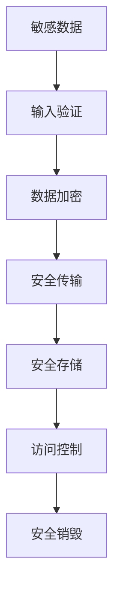

# Java 网络安全

## 引言

随着互联网的发展，网络安全已成为每个程序员必须面对的重要课题。在Java网络编程中，安全性不再是可选项，而是必须优先考虑的核心要素。本文将带您全面了解Java网络安全的基础知识、常见威胁及其防御措施，以及如何编写安全的Java网络应用程序。

## Java 安全架构基础

Java平台从设计之初就将安全性视为核心特性之一。Java的安全架构主要由以下几个部分组成：

### 1. JVM安全沙箱

Java虚拟机(JVM)提供了一个安全的执行环境，限制了Java程序可以执行的操作，防止恶意代码破坏系统。

### 2. 安全管理器

`SecurityManager`类控制应用程序对资源的访问权限，如文件系统、网络连接等。

```java
// 设置安全管理器
System.setSecurityManager(new SecurityManager());

// 检查是否有权限执行某操作
SecurityManager securityManager = System.getSecurityManager();
if (securityManager != null) {
    securityManager.checkPermission(new SocketPermission("example.com:80", "connect"));
}
```

### 3. Java加密架构(JCA)与Java加密扩展(JCE)

JCA和JCE提供了加密、解密、数字签名等功能的API框架。

## 常见网络安全威胁及防护

### 1. 数据窃听与加密通信

在网络传输中，数据可能被窃听。使用加密通信是防止这种威胁的重要手段。

#### SSL/TLS实现示例

```java
import javax.net.ssl.*;
import java.io.*;

public class SSLClient {
    public static void main(String[] args) {
        try {
            // 创建SSLSocketFactory
            SSLSocketFactory factory = 
                (SSLSocketFactory) SSLSocketFactory.getDefault();
            
            // 创建SSL Socket
            SSLSocket socket = 
                (SSLSocket) factory.createSocket("secure-server.com", 443);
            
            // 启用所有支持的加密套件
            String[] supported = socket.getSupportedCipherSuites();
            socket.setEnabledCipherSuites(supported);
            
            // 进行IO操作
            PrintWriter out = new PrintWriter(
                new BufferedWriter(
                    new OutputStreamWriter(
                        socket.getOutputStream())));
            out.println("GET / HTTP/1.0");
            out.println();
            out.flush();
            
            // 读取响应
            BufferedReader in = new BufferedReader(
                new InputStreamReader(
                    socket.getInputStream()));
            String inputLine;
            while ((inputLine = in.readLine()) != null) {
                System.out.println(inputLine);
            }
            
            // 关闭连接
            in.close();
            out.close();
            socket.close();
        } catch (Exception e) {
            e.printStackTrace();
        }
    }
}
```

### 2. HTTPS服务器实现

```java
import com.sun.net.httpserver.*;
import javax.net.ssl.*;
import java.io.*;
import java.net.InetSocketAddress;
import java.security.*;

public class SimpleHTTPSServer {
    public static void main(String[] args) throws Exception {
        // 加载密钥库
        char[] passphrase = "password".toCharArray();
        KeyStore ks = KeyStore.getInstance("JKS");
        ks.load(new FileInputStream("keystore.jks"), passphrase);
        
        // 设置密钥管理器
        KeyManagerFactory kmf = KeyManagerFactory.getInstance("SunX509");
        kmf.init(ks, passphrase);
        
        // 设置信任管理器
        TrustManagerFactory tmf = TrustManagerFactory.getInstance("SunX509");
        tmf.init(ks);
        
        // 创建并配置SSL上下文
        SSLContext sslContext = SSLContext.getInstance("TLS");
        sslContext.init(kmf.getKeyManagers(), tmf.getTrustManagers(), null);
        
        // 创建HTTPS服务器
        HttpsServer server = HttpsServer.create(new InetSocketAddress(8443), 0);
        server.setHttpsConfigurator(new HttpsConfigurator(sslContext));
        
        // 创建上下文处理器
        HttpContext context = server.createContext("/", new SimpleHandler());
        
        // 启动服务器
        server.setExecutor(null);
        server.start();
        System.out.println("Server started on port 8443");
    }
    
    static class SimpleHandler implements HttpHandler {
        @Override
        public void handle(HttpExchange exchange) throws IOException {
            String response = "This is a secure HTTPS server!";
            exchange.sendResponseHeaders(200, response.getBytes().length);
            OutputStream os = exchange.getResponseBody();
            os.write(response.getBytes());
            os.close();
        }
    }
}
```

:::caution
上述代码中使用的`keystore.jks`需要通过Java的keytool工具生成，并且在生产环境中应该使用强密码和有效的证书。
:::

### 3. 跨站脚本攻击(XSS)防护

在Web应用中，输入数据需要经过适当的验证和转义，以防止XSS攻击。

```java
import org.apache.commons.text.StringEscapeUtils;

public class XSSProtection {
    
    public static String sanitizeHTML(String input) {
        if (input == null) {
            return null;
        }
        // 使用Apache Commons Text库转义HTML
        return StringEscapeUtils.escapeHtml4(input);
    }
    
    public static void main(String[] args) {
        String userInput = "<script>alert('XSS Attack')</script>";
        String safeOutput = sanitizeHTML(userInput);
        System.out.println("Original input: " + userInput);
        System.out.println("Sanitized output: " + safeOutput);
    }
}
```

输出：
```
Original input: <script>alert('XSS Attack')</script>
Sanitized output: &lt;script&gt;alert(&#39;XSS Attack&#39;)&lt;/script&gt;
```

### 4. SQL注入防护

使用参数化查询可以有效防止SQL注入攻击。

```java
import java.sql.*;

public class SafeSQLQuery {
    public static void main(String[] args) {
        String userInput = "admin'; DROP TABLE users; --";
        
        // 不安全的方式 - 容易受到SQL注入攻击
        String unsafeQuery = "SELECT * FROM users WHERE username = '" + userInput + "'";
        System.out.println("Unsafe query: " + unsafeQuery);
        
        // 安全的方式 - 使用参数化查询
        try (Connection conn = DriverManager.getConnection("jdbc:mysql://localhost:3306/mydb", "user", "pass");
             PreparedStatement pstmt = conn.prepareStatement("SELECT * FROM users WHERE username = ?")) {
            
            pstmt.setString(1, userInput);
            ResultSet rs = pstmt.executeQuery();
            
            while (rs.next()) {
                System.out.println("Found user: " + rs.getString("username"));
            }
            
        } catch (SQLException e) {
            e.printStackTrace();
        }
    }
}
```

:::tip
总是使用`PreparedStatement`而非直接拼接SQL语句，这是防止SQL注入的最佳实践。
:::

## 实际案例：安全的客户端-服务器通信系统

下面是一个结合多种安全技术的完整案例，展示如何实现安全的客户端-服务器通信：

### 服务器端

```java
import javax.crypto.Cipher;
import javax.net.ssl.*;
import java.io.*;
import java.security.*;
import java.util.Base64;

public class SecureServer {
    public static void main(String[] args) {
        try {
            // 设置密钥库
            System.setProperty("javax.net.ssl.keyStore", "keystore.jks");
            System.setProperty("javax.net.ssl.keyStorePassword", "password");
            
            // 创建SSL服务器socket
            SSLServerSocketFactory factory = (SSLServerSocketFactory) SSLServerSocketFactory.getDefault();
            SSLServerSocket serverSocket = (SSLServerSocket) factory.createServerSocket(8443);
            
            System.out.println("服务器启动，等待连接...");
            while (true) {
                // 接受客户端连接
                SSLSocket clientSocket = (SSLSocket) serverSocket.accept();
                System.out.println("客户端已连接: " + clientSocket.getInetAddress());
                
                // 创建输入输出流
                BufferedReader in = new BufferedReader(new InputStreamReader(clientSocket.getInputStream()));
                PrintWriter out = new PrintWriter(clientSocket.getOutputStream(), true);
                
                // 读取加密数据
                String encryptedData = in.readLine();
                System.out.println("接收到加密数据: " + encryptedData);
                
                // 响应客户端
                out.println("数据已安全接收");
                
                // 关闭连接
                clientSocket.close();
            }
        } catch (Exception e) {
            e.printStackTrace();
        }
    }
    
    // RSA解密方法
    private static String decrypt(String encrypted, PrivateKey privateKey) throws Exception {
        Cipher cipher = Cipher.getInstance("RSA");
        cipher.init(Cipher.DECRYPT_MODE, privateKey);
        return new String(cipher.doFinal(Base64.getDecoder().decode(encrypted)));
    }
}
```

### 客户端

```java
import javax.crypto.Cipher;
import javax.net.ssl.*;
import java.io.*;
import java.security.*;
import java.util.Base64;

public class SecureClient {
    public static void main(String[] args) {
        try {
            // 设置信任库
            System.setProperty("javax.net.ssl.trustStore", "truststore.jks");
            System.setProperty("javax.net.ssl.trustStorePassword", "password");
            
            // 创建SSL socket
            SSLSocketFactory factory = (SSLSocketFactory) SSLSocketFactory.getDefault();
            SSLSocket socket = (SSLSocket) factory.createSocket("localhost", 8443);
            
            // 创建输入输出流
            BufferedReader in = new BufferedReader(new InputStreamReader(socket.getInputStream()));
            PrintWriter out = new PrintWriter(socket.getOutputStream(), true);
            
            // 敏感数据
            String sensitiveData = "账户密码：MySecretPassword123";
            
            // 加密数据
            KeyPair keyPair = generateKeyPair();
            String encrypted = encrypt(sensitiveData, keyPair.getPublic());
            
            // 发送加密数据
            System.out.println("发送加密数据: " + encrypted);
            out.println(encrypted);
            
            // 接收服务器响应
            String response = in.readLine();
            System.out.println("服务器响应: " + response);
            
            // 关闭连接
            socket.close();
            
        } catch (Exception e) {
            e.printStackTrace();
        }
    }
    
    // 生成RSA密钥对
    private static KeyPair generateKeyPair() throws Exception {
        KeyPairGenerator keyGen = KeyPairGenerator.getInstance("RSA");
        keyGen.initialize(2048);
        return keyGen.generateKeyPair();
    }
    
    // RSA加密方法
    private static String encrypt(String data, PublicKey publicKey) throws Exception {
        Cipher cipher = Cipher.getInstance("RSA");
        cipher.init(Cipher.ENCRYPT_MODE, publicKey);
        return Base64.getEncoder().encodeToString(cipher.doFinal(data.getBytes()));
    }
}
```

:::note
这个案例结合了SSL/TLS安全通信和RSA加密，提供了多层次的安全保障。在生产环境中，应考虑更完善的错误处理、认证机制和密钥管理。
:::

## 网络安全最佳实践

### 1. 敏感数据处理



- 永远不要在代码中硬编码密钥或密码
- 使用加密存储敏感数据
- 传输中的数据应该加密

### 2. 安全编码准则

- 始终进行输入验证
- 防止缓冲区溢出
- 实施适当的异常处理
- 定期更新依赖库
- 采用最小权限原则

### 3. 安全配置

- 禁用不必要的服务
- 维护最新的安全补丁
- 使用强密码策略
- 配置适当的SSL/TLS设置
- 启用安全日志记录

## 常见安全漏洞防护

### 1. OWASP十大安全风险

OWASP(开放Web应用安全项目)定期发布十大安全风险列表。Java开发者应特别注意：

- 注入攻击
- 失效的身份认证
- 敏感数据泄露
- XML外部实体(XXE)
- 失效的访问控制
- 安全配置错误
- 跨站脚本(XSS)

### 2. DoS防护

防止拒绝服务攻击的策略：

```java
public class DoSProtection {
    // 简单的速率限制器
    private static Map<String, Integer> requestCountMap = new HashMap<>();
    private static Map<String, Long> lastRequestTimeMap = new HashMap<>();
    private static final int MAX_REQUESTS = 10; // 最大请求数
    private static final long WINDOW_MS = 1000; // 时间窗口(毫秒)
    
    public static boolean isAllowed(String clientIP) {
        long currentTime = System.currentTimeMillis();
        
        // 初始化或重置计数器
        if (!lastRequestTimeMap.containsKey(clientIP) || 
            currentTime - lastRequestTimeMap.get(clientIP) > WINDOW_MS) {
            requestCountMap.put(clientIP, 1);
            lastRequestTimeMap.put(clientIP, currentTime);
            return true;
        }
        
        // 增加计数
        int count = requestCountMap.get(clientIP) + 1;
        requestCountMap.put(clientIP, count);
        
        // 检查是否超过限制
        if (count > MAX_REQUESTS) {
            return false; // 拒绝请求
        }
        
        return true;
    }
}
```

## 工具与资源

以下是一些帮助增强Java网络安全的工具和库：

- **OWASP依赖检查** - 扫描项目依赖中的已知漏洞
- **FindBugs/SpotBugs** - 静态代码分析工具，可发现潜在安全问题
- **Apache Shiro** - 安全框架，提供身份认证、授权、加密和会话管理
- **Spring Security** - 为Spring应用提供全面的安全解决方案
- **Bouncy Castle** - 轻量级密码学API
- **OWASP ZAP** - 渗透测试工具，可帮助发现应用程序中的安全漏洞

## 总结

Java网络安全是一个复杂而重要的主题，涵盖从底层加密到高级应用程序安全的多个方面。本文介绍了Java安全架构的基础，常见网络威胁及其防护措施，并提供了实际案例和代码示例。

安全不是一次性的工作，而是一个持续的过程。作为开发者，我们需要不断学习和提高安全意识，采用最佳实践，并保持警惕。记住：在安全方面，系统的强度取决于其最弱的环节。

## 练习

1. 创建一个简单的Java聊天应用，实现SSL/TLS加密通信。
2. 实现一个带密码验证的简单登录系统，确保密码安全存储。
3. 编写一个程序检测并防止简单的暴力破解攻击。
4. 使用Java加密API加密一个文件并安全传输。
5. 审查一个现有的Java网络应用，找出并修复其中的安全漏洞。

## 进一步阅读

- Java安全编程指南
- OWASP Java安全项目
- Java密码学架构(JCA)参考指南
- SSL/TLS协议详解
- Web应用安全测试方法论

:::warning
安全性是一个动态变化的领域，本文中的技术和建议可能会随着新的威胁和防御技术的出现而变化。请始终保持最新的安全知识。
:::