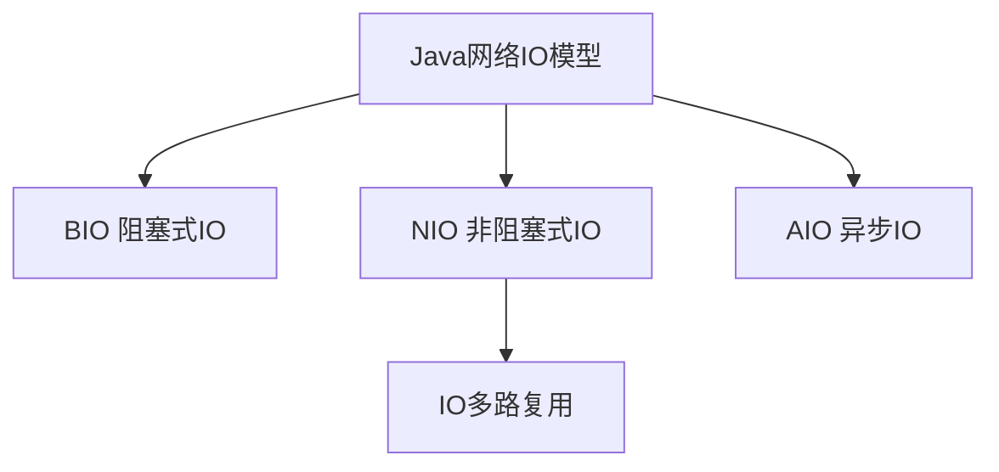
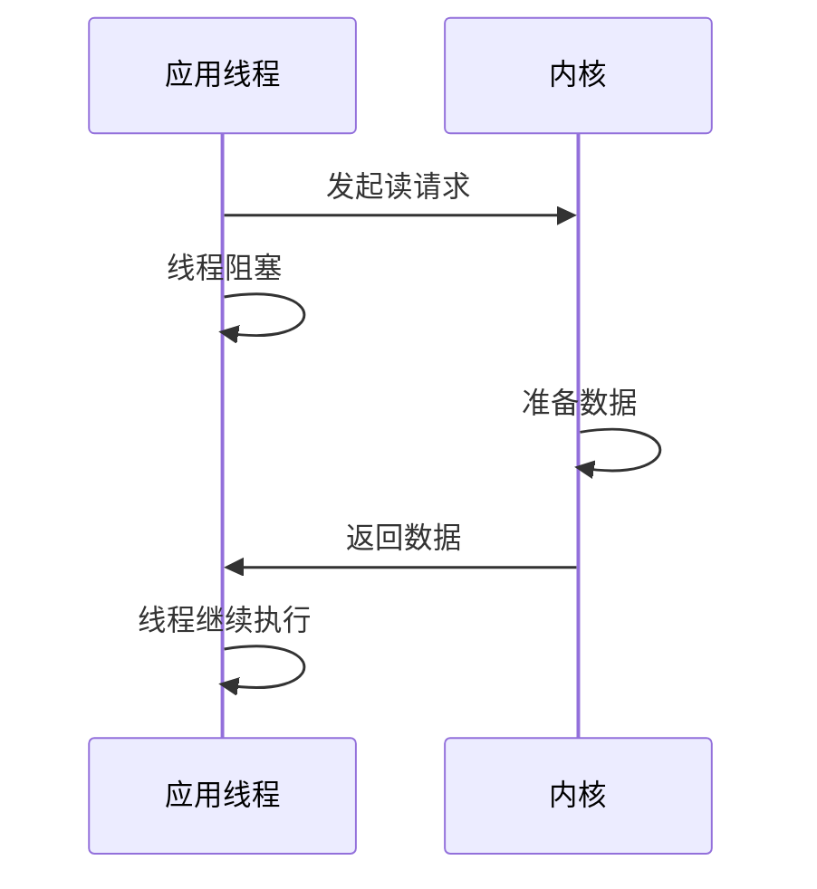
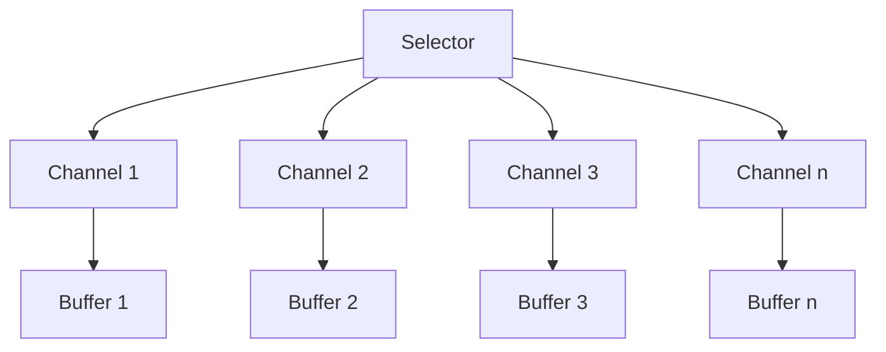
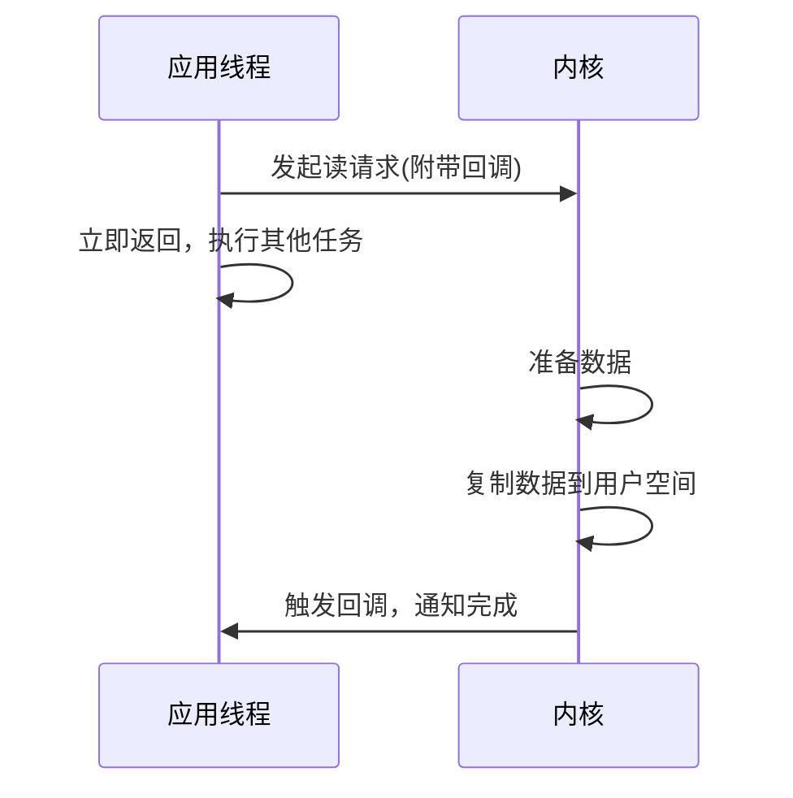

# Java 网络IO模型

在网络编程中，IO（输入/输出）模型是决定应用性能与扩展性的关键因素。Java提供了多种网络IO模型，从传统的阻塞式IO到现代的非阻塞和异步IO。本文将全面介绍Java中的网络IO模型，帮助初学者理解它们的原理、特点和应用场景。

## IO模型基础概念

在深入各种IO模型前，让我们先了解一些基础概念：

- **阻塞与非阻塞**：指的是程序在发起IO操作后，是否需要等待IO操作完成才能继续执行
- **同步与异步**：指的是应用程序与内核之间进行IO操作时的通信方式
- **IO多路复用**：一种同时监控多个IO事件的机制

## Java 中的三种IO模型

Java主要支持三种网络IO模型：



### 1. BIO (Blocking IO) - 阻塞式IO

BIO是Java最传统的IO模型，它的特点是简单直观但效率较低。

#### 工作原理

在BIO模型中，当应用程序执行IO操作（如读取数据）时，线程会被阻塞，直到操作完成或发生异常。



#### 代码示例：BIO实现的简单服务器

```java
import java.io.*;
import java.net.*;

public class BIOServer {
    public static void main(String[] args) throws IOException {
        ServerSocket serverSocket = new ServerSocket(8080);
        System.out.println("服务器启动，监听端口：8080...");
        
        while (true) {
            // 阻塞等待客户端连接
            Socket socket = serverSocket.accept();
            System.out.println("客户端已连接：" + socket.getInetAddress());
            
            // 为每个客户端创建一个新线程处理
            new Thread(() -> {
                try (
                    BufferedReader reader = new BufferedReader(
                        new InputStreamReader(socket.getInputStream()));
                    PrintWriter writer = new PrintWriter(
                        socket.getOutputStream(), true)
                ) {
                    String line;
                    while ((line = reader.readLine()) != null) {
                        System.out.println("收到消息：" + line);
                        writer.println("服务器回复：" + line);
                    }
                } catch (IOException e) {
                    e.printStackTrace();
                } finally {
                    try {
                        socket.close();
                    } catch (IOException e) {
                        e.printStackTrace();
                    }
                }
            }).start();
        }
    }
}
```

#### BIO的特点

- **优点**：设计简单，编程模型直观
- **缺点**：每个连接需要一个线程，在高并发场景下会导致线程资源耗尽
- **适用场景**：连接数较少、服务器资源充足的场景，或者学习网络编程的入门阶段

### 2. NIO (Non-blocking IO) - 非阻塞式IO

NIO是JDK 1.4引入的新IO库，它提供了非阻塞IO操作和IO多路复用的能力，能够用少量线程处理大量连接。

#### 工作原理

NIO基于Selector（选择器）和Channel（通道）工作。一个Selector可以监控多个Channel，当Channel有IO事件发生时，Selector会通知应用程序，应用程序再进行相应处理，避免了无谓的等待。



#### 核心组件

- **Buffer**：用于存储数据的缓冲区
- **Channel**：数据传输的通道，支持非阻塞操作
- **Selector**：用于监控多个Channel的IO事件

#### 代码示例：NIO实现的服务器

```java
import java.io.IOException;
import java.net.InetSocketAddress;
import java.nio.ByteBuffer;
import java.nio.channels.*;
import java.util.Iterator;
import java.util.Set;

public class NIOServer {
    public static void main(String[] args) throws IOException {
        // 创建服务器通道
        ServerSocketChannel serverChannel = ServerSocketChannel.open();
        serverChannel.socket().bind(new InetSocketAddress(8080));
        serverChannel.configureBlocking(false); // 设置为非阻塞模式
        
        // 创建Selector
        Selector selector = Selector.open();
        serverChannel.register(selector, SelectionKey.OP_ACCEPT);
        
        System.out.println("NIO服务器启动，监听端口：8080...");
        
        ByteBuffer buffer = ByteBuffer.allocate(1024);
        
        while (true) {
            // 阻塞等待IO事件，但可以同时监控多个连接
            selector.select();
            
            Set<SelectionKey> selectedKeys = selector.selectedKeys();
            Iterator<SelectionKey> it = selectedKeys.iterator();
            
            while (it.hasNext()) {
                SelectionKey key = it.next();
                it.remove(); // 移除当前处理的key，避免重复处理
                
                if (key.isAcceptable()) {
                    // 处理新的连接请求
                    ServerSocketChannel server = (ServerSocketChannel) key.channel();
                    SocketChannel client = server.accept();
                    client.configureBlocking(false);
                    client.register(selector, SelectionKey.OP_READ);
                    System.out.println("客户端已连接：" + client.getRemoteAddress());
                    
                } else if (key.isReadable()) {
                    // 处理读取事件
                    SocketChannel client = (SocketChannel) key.channel();
                    buffer.clear();
                    int bytesRead = client.read(buffer);
                    
                    if (bytesRead > 0) {
                        buffer.flip();
                        byte[] data = new byte[buffer.limit()];
                        buffer.get(data);
                        String message = new String(data);
                        System.out.println("收到消息：" + message.trim());
                        
                        // 发送响应
                        ByteBuffer writeBuffer = ByteBuffer.wrap(
                            ("服务器回复：" + message).getBytes());
                        client.write(writeBuffer);
                    } else if (bytesRead < 0) {
                        // 客户端断开连接
                        client.close();
                    }
                }
            }
        }
    }
}
```

#### NIO的特点

- **优点**：可以用少数线程处理大量连接，资源利用率高
- **缺点**：编程复杂度高，调试困难
- **适用场景**：高并发、高性能的网络应用，如聊天服务器、游戏服务器等

### 3. AIO (Asynchronous IO) - 异步IO

AIO是JDK 7引入的异步IO库，它进一步提升了IO的性能，特别适用于高负载、长连接的应用场景。

#### 工作原理

在AIO模型中，应用程序发起IO操作后立即返回，操作系统会在数据准备好并复制到用户空间后通知应用程序。整个过程中，应用程序无需阻塞或轮询检查IO状态。



#### 代码示例：AIO实现的服务器

```java
import java.io.IOException;
import java.net.InetSocketAddress;
import java.nio.ByteBuffer;
import java.nio.channels.*;
import java.util.concurrent.Future;

public class AIOServer {
    public static void main(String[] args) throws IOException {
        // 创建异步服务器通道
        AsynchronousServerSocketChannel serverChannel = 
            AsynchronousServerSocketChannel.open();
        serverChannel.bind(new InetSocketAddress(8080));
        
        System.out.println("AIO服务器启动，监听端口：8080...");
        
        // 接受连接请求
        serverChannel.accept(null, new CompletionHandler<AsynchronousSocketChannel, Void>() {
            @Override
            public void completed(AsynchronousSocketChannel clientChannel, Void attachment) {
                // 继续接受下一个连接
                serverChannel.accept(null, this);
                
                try {
                    System.out.println("客户端已连接：" + clientChannel.getRemoteAddress());
                    
                    ByteBuffer buffer = ByteBuffer.allocate(1024);
                    
                    // 异步读取数据
                    clientChannel.read(buffer, buffer, 
                        new CompletionHandler<Integer, ByteBuffer>() {
                            @Override
                            public void completed(Integer result, ByteBuffer attachment) {
                                if (result > 0) {
                                    attachment.flip();
                                    byte[] data = new byte[attachment.limit()];
                                    attachment.get(data);
                                    String message = new String(data);
                                    System.out.println("收到消息：" + message.trim());
                                    
                                    // 发送响应
                                    ByteBuffer writeBuffer = ByteBuffer.wrap(
                                        ("服务器回复：" + message).getBytes());
                                    clientChannel.write(writeBuffer);
                                    
                                    // 清空缓冲区，继续读取
                                    attachment.clear();
                                    clientChannel.read(attachment, attachment, this);
                                } else {
                                    try {
                                        clientChannel.close();
                                    } catch (IOException e) {
                                        e.printStackTrace();
                                    }
                                }
                            }
                            
                            @Override
                            public void failed(Throwable exc, ByteBuffer attachment) {
                                exc.printStackTrace();
                                try {
                                    clientChannel.close();
                                } catch (IOException e) {
                                    e.printStackTrace();
                                }
                            }
                        });
                } catch (IOException e) {
                    e.printStackTrace();
                }
            }
            
            @Override
            public void failed(Throwable exc, Void attachment) {
                exc.printStackTrace();
            }
        });
        
        // 保持主线程不退出
        try {
            Thread.currentThread().join();
        } catch (InterruptedException e) {
            e.printStackTrace();
        }
    }
}
```

#### AIO的特点

- **优点**：完全异步操作，资源利用率最高，性能最好
- **缺点**：编程模型复杂，依赖操作系统对AIO的支持
- **适用场景**：需要高性能IO的场景，特别是读写操作比较耗时的应用

## 三种IO模型的对比

| 特性 | BIO | NIO | AIO |
|------|-----|-----|-----|
| IO模式 | 阻塞 | 非阻塞 | 异步 |
| 编程复杂度 | 简单 | 复杂 | 较复杂 |
| API使用难度 | 简单 | 较复杂 | 复杂 |
| 可靠性 | 较好 | 好 | 好 |
| 吞吐量 | 低 | 高 | 高 |
| 适用场景 | 连接数少 | 高并发连接 | I/O密集型应用 |
| 引入版本 | JDK 1.0 | JDK 1.4 | JDK 1.7 |

## 实际案例：聊天服务器

让我们来看一个实际案例，如何使用NIO实现一个简单的多人聊天服务器：

```java
import java.io.IOException;
import java.net.InetSocketAddress;
import java.nio.ByteBuffer;
import java.nio.channels.*;
import java.util.*;

public class ChatServer {
    private static final int PORT = 8080;
    private Selector selector;
    private Map<SocketChannel, String> clients = new HashMap<>();
    
    public ChatServer() throws IOException {
        selector = Selector.open();
        ServerSocketChannel serverChannel = ServerSocketChannel.open();
        serverChannel.configureBlocking(false);
        serverChannel.socket().bind(new InetSocketAddress(PORT));
        serverChannel.register(selector, SelectionKey.OP_ACCEPT);
        System.out.println("聊天服务器已启动，监听端口：" + PORT);
    }
    
    public void start() throws IOException {
        while (true) {
            selector.select();
            Set<SelectionKey> selectedKeys = selector.selectedKeys();
            Iterator<SelectionKey> it = selectedKeys.iterator();
            
            while (it.hasNext()) {
                SelectionKey key = it.next();
                it.remove();
                
                if (!key.isValid()) {
                    continue;
                }
                
                if (key.isAcceptable()) {
                    handleAccept(key);
                } else if (key.isReadable()) {
                    handleRead(key);
                }
            }
        }
    }
    
    private void handleAccept(SelectionKey key) throws IOException {
        ServerSocketChannel serverChannel = (ServerSocketChannel) key.channel();
        SocketChannel clientChannel = serverChannel.accept();
        clientChannel.configureBlocking(false);
        clientChannel.register(selector, SelectionKey.OP_READ);
        
        String clientName = "用户-" + clientChannel.getRemoteAddress().toString();
        clients.put(clientChannel, clientName);
        
        System.out.println(clientName + " 加入聊天室");
        broadcast(clientName + " 加入了聊天室", null);
    }
    
    private void handleRead(SelectionKey key) throws IOException {
        SocketChannel clientChannel = (SocketChannel) key.channel();
        ByteBuffer buffer = ByteBuffer.allocate(1024);
        
        try {
            int bytesRead = clientChannel.read(buffer);
            
            if (bytesRead > 0) {
                buffer.flip();
                String message = new String(buffer.array(), 0, buffer.limit());
                String clientName = clients.get(clientChannel);
                
                System.out.println(clientName + ": " + message.trim());
                broadcast(clientName + ": " + message.trim(), clientChannel);
            } else {
                String clientName = clients.get(clientChannel);
                clients.remove(clientChannel);
                clientChannel.close();
                key.cancel();
                
                System.out.println(clientName + " 离开聊天室");
                broadcast(clientName + " 离开了聊天室", null);
            }
            
        } catch (IOException e) {
            String clientName = clients.get(clientChannel);
            clients.remove(clientChannel);
            clientChannel.close();
            key.cancel();
            
            System.out.println(clientName + " 异常断开");
            broadcast(clientName + " 异常断开连接", null);
        }
    }
    
    private void broadcast(String message, SocketChannel exclude) throws IOException {
        ByteBuffer buffer = ByteBuffer.wrap(message.getBytes());
        
        for (SocketChannel channel : clients.keySet()) {
            if (channel != exclude && channel.isOpen()) {
                channel.write(buffer);
                buffer.rewind(); // 准备给下一个客户端发送
            }
        }
    }
    
    public static void main(String[] args) {
        try {
            ChatServer server = new ChatServer();
            server.start();
        } catch (IOException e) {
            e.printStackTrace();
        }
    }
}
```

这个聊天服务器使用了NIO模型，能够同时处理多个客户端连接，并将每个客户的消息广播给其他所有客户端。

:::tip 提示
实际应用中，你可能需要处理更多细节，如消息格式化、错误处理、用户认证等。上述代码仅展示了NIO在实际应用中的基本用法。
:::

## 总结

1. **BIO (阻塞IO)**：简单直观，一个连接一个线程，适合连接数较少的场景。
2. **NIO (非阻塞IO)**：通过选择器和通道实现多路复用，一个线程可以处理多个连接，适合高并发场景。
3. **AIO (异步IO)**：完全的异步非阻塞模型，适合IO密集型应用。

选择合适的IO模型应考虑以下因素：
- 应用需要处理的连接数量
- 每个连接的存活时间
- 数据处理的复杂度
- 开发和维护的难度

## 练习与深入学习

1. 尝试实现一个简单的文件传输服务器，分别使用BIO和NIO实现，比较两者性能差异。

2. 深入研究Netty框架，它是一个基于NIO的网络应用框架，提供了更高层次的API抽象，使得网络编程更加简单和高效。

3. 学习Reactor模式和Proactor模式，这两种设计模式是NIO和AIO实现的理论基础。

## 参考资源

- Java官方文档: [java.nio](https://docs.oracle.com/javase/8/docs/api/java/nio/package-summary.html)
- Java官方文档: [java.nio.channels](https://docs.oracle.com/javase/8/docs/api/java/nio/channels/package-summary.html)
- 《Java NIO》 by Ron Hitchens
- 《Netty in Action》 by Norman Maurer