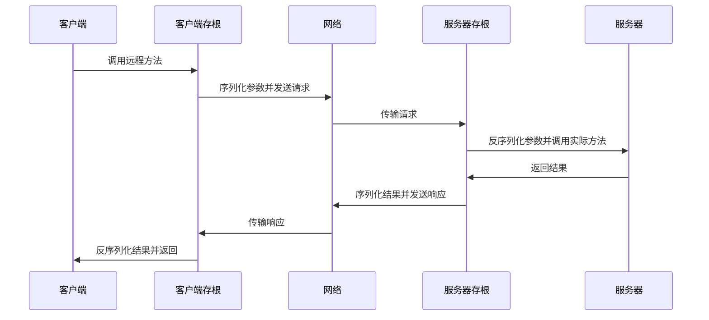
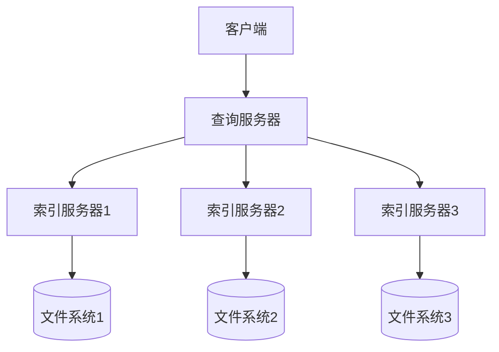

# Java RMI

## 什么是Java RMI？

Java RMI（Remote Method Invocation，远程方法调用）是Java语言提供的一种分布式对象技术，它允许运行在一个Java虚拟机中的程序调用另一个Java虚拟机中对象的方法，使得开发分布式应用变得相对简单。RMI作为Java原生的远程调用机制，相比其他技术如CORBA、Web Services等，具有更好的Java语言亲和性。

:::note
与本地方法调用不同，远程方法调用涉及不同地址空间（通常在不同计算机上）的对象之间的通信，这给编程带来了额外的复杂性。Java RMI旨在尽可能地隐藏这些复杂性，让远程对象调用看起来像本地调用一样简单。
:::

## RMI的工作原理

RMI基于客户端-服务器架构，其工作流程可以简化为以下几个步骤：



在这个过程中，有几个关键组件：

1. **远程接口（Remote Interface）**：定义了可以被远程调用的方法
2. **远程对象（Remote Object）**：实现远程接口的服务器端对象
3. **存根（Stub）**：客户端的代理对象，负责将方法调用转发给远程对象
4. **骨架（Skeleton）**：服务器端的代理，接收来自存根的请求并调用实际对象的方法
5. **RMI注册表（Registry）**：一个命名服务，用于存储远程对象的引用

## 实现一个简单的RMI应用

下面我们将通过一个简单的计算器服务例子来学习RMI的实现过程。

### 步骤1：定义远程接口

首先，我们需要定义一个远程接口，该接口必须继承`java.rmi.Remote`接口，并且其中的所有方法都必须声明抛出`java.rmi.RemoteException`异常。

```java
import java.rmi.Remote;
import java.rmi.RemoteException;

public interface Calculator extends Remote {
    public int add(int a, int b) throws RemoteException;
    public int subtract(int a, int b) throws RemoteException;
    public int multiply(int a, int b) throws RemoteException;
    public int divide(int a, int b) throws RemoteException;
}
```

### 步骤2：实现远程接口

然后，我们需要创建一个实现远程接口的类。这个类通常继承`java.rmi.server.UnicastRemoteObject`类。

```java
import java.rmi.RemoteException;
import java.rmi.server.UnicastRemoteObject;

public class CalculatorImpl extends UnicastRemoteObject implements Calculator {
    
    // 必须有一个显式的构造函数声明抛出RemoteException异常
    public CalculatorImpl() throws RemoteException {
        super();
    }
    
    @Override
    public int add(int a, int b) throws RemoteException {
        return a + b;
    }
    
    @Override
    public int subtract(int a, int b) throws RemoteException {
        return a - b;
    }
    
    @Override
    public int multiply(int a, int b) throws RemoteException {
        return a * b;
    }
    
    @Override
    public int divide(int a, int b) throws RemoteException {
        if (b == 0) {
            throw new ArithmeticException("除数不能为0");
        }
        return a / b;
    }
}
```

### 步骤3：创建RMI服务器

接下来，我们创建一个服务器程序，实例化远程对象并将其注册到RMI注册表中。

```java
import java.rmi.registry.LocateRegistry;
import java.rmi.registry.Registry;

public class CalculatorServer {
    public static void main(String[] args) {
        try {
            // 创建远程对象
            CalculatorImpl calculator = new CalculatorImpl();
            
            // 创建并启动RMI注册表，端口为1099
            Registry registry = LocateRegistry.createRegistry(1099);
            
            // 将远程对象绑定到注册表中
            registry.bind("Calculator", calculator);
            
            System.out.println("计算器服务器已启动...");
        } catch (Exception e) {
            System.err.println("服务器异常：" + e.toString());
            e.printStackTrace();
        }
    }
}
```

### 步骤4：创建RMI客户端

最后，我们创建一个客户端程序，从RMI注册表中查找远程对象，并调用其方法。

```java
import java.rmi.registry.LocateRegistry;
import java.rmi.registry.Registry;

public class CalculatorClient {
    public static void main(String[] args) {
        try {
            // 获取RMI注册表
            Registry registry = LocateRegistry.getRegistry("localhost", 1099);
            
            // 从注册表中查找远程对象
            Calculator calculator = (Calculator) registry.lookup("Calculator");
            
            // 调用远程方法
            System.out.println("10 + 5 = " + calculator.add(10, 5));
            System.out.println("10 - 5 = " + calculator.subtract(10, 5));
            System.out.println("10 * 5 = " + calculator.multiply(10, 5));
            System.out.println("10 / 5 = " + calculator.divide(10, 5));
            
            // 尝试触发异常
            try {
                System.out.println("10 / 0 = " + calculator.divide(10, 0));
            } catch (Exception e) {
                System.out.println("异常: " + e.getMessage());
            }
        } catch (Exception e) {
            System.err.println("客户端异常：" + e.toString());
            e.printStackTrace();
        }
    }
}
```

### 运行示例

运行这个示例需要按照以下步骤：

1. 编译所有Java文件
2. 启动服务器程序`CalculatorServer`
3. 启动客户端程序`CalculatorClient`

预期输出：

服务器端：
```
计算器服务器已启动...
```

客户端：
```
10 + 5 = 15
10 - 5 = 5
10 * 5 = 50
10 / 5 = 2
异常: 除数不能为0
```

## RMI的实际应用场景

Java RMI在实际开发中有很多应用场景，以下是一些常见例子：

1. **分布式系统**：在大型企业应用中，不同功能模块可能部署在不同服务器上，通过RMI进行通信。

2. **分布式计算**：将计算任务分配给多个计算节点，然后收集结果，如MapReduce框架的简化实现。

3. **分布式对象存储**：对象可以存储在不同的服务器上，客户端通过RMI访问这些对象。

4. **远程监控和管理**：通过RMI提供系统监控和管理接口，如Java Management Extensions (JMX)。

### 实际案例：分布式文件检索系统

假设我们要构建一个分布式文件检索系统，包含多个索引服务器和一个中央查询服务器：



在这个系统中：
- 索引服务器负责维护本地文件系统的索引
- 查询服务器接收客户端请求，并分发到各个索引服务器
- 各索引服务器返回匹配的结果，查询服务器合并后返回给客户端

使用RMI实现这个系统，我们可以：
1. 定义索引服务的远程接口
2. 每个索引服务器实现该接口并注册到RMI注册表
3. 查询服务器从注册表获取所有索引服务，并并行调用它们的搜索方法
4. 将结果合并返回给客户端

这种架构的优势在于可以轻松扩展索引服务器的数量，提高系统整体检索能力和存储容量。

## RMI的优缺点

### 优点

1. **简单易用**：与其他分布式技术相比，RMI的学习曲线相对平缓
2. **类型安全**：由于使用Java接口定义远程服务，编译时会进行类型检查
3. **分布式垃圾回收**：自动管理远程对象的生命周期
4. **参数传递灵活**：支持通过值和通过引用传递参数

### 缺点

1. **Java平台限制**：RMI主要设计用于Java到Java的通信
2. **网络依赖**：依赖于网络状态，可能受网络延迟、不稳定性影响
3. **防火墙问题**：RMI使用动态端口分配，可能被防火墙阻止
4. **序列化开销**：对象序列化和反序列化可能导致性能问题
5. **安全考虑**：默认情况下缺乏足够的安全机制

## RMI的安全性

在生产环境中使用RMI时，应该考虑以下安全措施：

1. **使用SSL/TLS**：配置RMI使用加密通信
2. **实现安全管理器**：限制远程代码的权限
3. **身份验证**：实现自定义的身份验证机制
4. **访问控制**：限制哪些客户端可以访问特定的远程方法

示例代码（启用SSL/TLS）：

```java
// 在服务器端
System.setProperty("java.rmi.server.useCodebaseOnly", "true");
System.setProperty("javax.net.ssl.keyStore", "keystore.jks");
System.setProperty("javax.net.ssl.keyStorePassword", "password");

// 在客户端
System.setProperty("javax.net.ssl.trustStore", "truststore.jks");
System.setProperty("javax.net.ssl.trustStorePassword", "password");
```

## 总结

Java RMI提供了一种相对简单的方式来开发分布式Java应用程序。它隐藏了网络通信的复杂性，使远程方法调用看起来像本地调用一样。虽然在跨语言集成方面存在局限性，但在纯Java环境中，RMI仍然是一个强大且易用的选择。

在本教程中，我们学习了：
- RMI的基本概念和工作原理
- 如何实现一个简单的RMI应用
- RMI的实际应用场景
- RMI的优缺点及安全性考虑

通过掌握Java RMI，您将能够更好地理解分布式系统的设计和实现，并为学习更复杂的分布式技术奠定基础。

## 练习

1. 扩展计算器示例，添加更多复杂的数学运算功能（如开方、三角函数等）。
2. 实现一个简单的分布式聊天系统，让多个客户端通过RMI服务器互相通信。
3. 修改示例代码以使用SSL/TLS进行安全通信。
4. 实现一个简单的负载均衡系统，将客户端请求分发到多个服务器实例。
5. 研究如何在RMI中实现回调机制，让服务器可以主动通知客户端。

## 附加资源

- Oracle官方文档：[Java RMI](https://docs.oracle.com/javase/tutorial/rmi/index.html)
- Java RMI规范：[Remote Method Invocation Specification](https://docs.oracle.com/javase/8/docs/platform/rmi/spec/rmiTOC.html)
- 书籍推荐：《Java Network Programming》by Elliotte Rusty Harold
- 深入学习：[Java RMI与Spring结合使用](https://spring.io/guides)