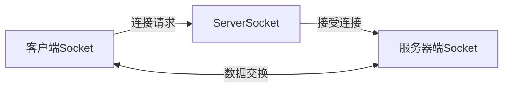

# Java 网络编程最佳实践

## 概述

Java网络编程是Java开发中的重要组成部分，它允许我们创建能够通过网络进行通信的应用程序。无论是简单的客户端-服务器应用，还是复杂的分布式系统，掌握Java网络编程的最佳实践都能帮助你开发出高效、稳定且安全的网络应用。

本文将介绍Java网络编程的基本概念，并分享一系列最佳实践，帮助初学者避免常见陷阱，构建更好的网络应用。

## Java 网络编程基础

在深入最佳实践之前，让我们先了解Java网络编程的核心组件：

1. **Socket**: 网络通信的基础
2. **ServerSocket**: 用于服务器端接受连接
3. **URL/URLConnection**: 用于高级HTTP操作
4. **HttpClient**: Java 11引入的现代HTTP客户端API

### Socket和ServerSocket

Socket是网络通信的基础，允许两个应用程序之间建立连接并交换数据。



## 最佳实践1: 正确处理网络资源

### 使用try-with-resources自动关闭资源

```java
try (
    ServerSocket serverSocket = new ServerSocket(8080);
    Socket clientSocket = serverSocket.accept();
    PrintWriter out = new PrintWriter(clientSocket.getOutputStream(), true);
    BufferedReader in = new BufferedReader(new InputStreamReader(clientSocket.getInputStream()))
) {
    String inputLine;
    while ((inputLine = in.readLine()) != null) {
        out.println("服务器响应: " + inputLine);
    }
} catch (IOException e) {
    System.out.println("发生I/O异常: " + e.getMessage());
}
```

:::tip
始终使用try-with-resources结构确保网络资源（如socket和流）被正确关闭，避免资源泄漏。
:::

## 最佳实践2: 实现超时机制

网络通信可能会因为多种原因变慢或中断。设置适当的超时可以防止程序无限期等待。

```java
Socket socket = new Socket();
// 连接超时设置为5秒
socket.connect(new InetSocketAddress("example.com", 80), 5000);
// 读取超时设置为3秒
socket.setSoTimeout(3000);
```

## 最佳实践3: 多线程处理客户端连接

对于服务器应用，使用多线程处理多个客户端连接是一种常见做法。

```java
public class SimpleThreadedServer {
    public static void main(String[] args) throws IOException {
        ServerSocket serverSocket = new ServerSocket(8080);
        System.out.println("服务器启动，监听端口8080...");
        
        try {
            while (true) {
                // 接受新的客户端连接
                Socket clientSocket = serverSocket.accept();
                System.out.println("新客户端已连接: " + clientSocket.getInetAddress());
                
                // 为每个客户端创建一个新线程
                new Thread(() -> handleClient(clientSocket)).start();
            }
        } finally {
            serverSocket.close();
        }
    }
    
    private static void handleClient(Socket clientSocket) {
        try (
            PrintWriter out = new PrintWriter(clientSocket.getOutputStream(), true);
            BufferedReader in = new BufferedReader(new InputStreamReader(clientSocket.getInputStream()))
        ) {
            String inputLine;
            while ((inputLine = in.readLine()) != null) {
                System.out.println("收到: " + inputLine);
                out.println("服务器回复: " + inputLine);
            }
        } catch (IOException e) {
            System.out.println("处理客户端时发生异常: " + e.getMessage());
        } finally {
            try {
                clientSocket.close();
            } catch (IOException e) {
                e.printStackTrace();
            }
        }
    }
}
```

:::caution
创建无限制的线程可能导致性能问题。在生产环境中，考虑使用线程池（如`ExecutorService`）来限制并发线程数量。
:::

## 最佳实践4: 使用非阻塞I/O (NIO)

对于需要处理大量并发连接的应用，Java NIO提供了更高效的解决方案。

```java
public class NIOServer {
    public static void main(String[] args) throws IOException {
        // 创建selector和server channel
        Selector selector = Selector.open();
        ServerSocketChannel serverChannel = ServerSocketChannel.open();
        serverChannel.bind(new InetSocketAddress("localhost", 8080));
        serverChannel.configureBlocking(false);
        serverChannel.register(selector, SelectionKey.OP_ACCEPT);
        
        System.out.println("NIO服务器启动，监听端口8080...");
        
        while (true) {
            // 等待事件
            selector.select();
            
            // 处理事件
            Set<SelectionKey> selectedKeys = selector.selectedKeys();
            Iterator<SelectionKey> iter = selectedKeys.iterator();
            
            while (iter.hasNext()) {
                SelectionKey key = iter.next();
                
                if (key.isAcceptable()) {
                    // 接受新连接
                    ServerSocketChannel server = (ServerSocketChannel) key.channel();
                    SocketChannel client = server.accept();
                    client.configureBlocking(false);
                    client.register(selector, SelectionKey.OP_READ);
                    System.out.println("接受新连接: " + client);
                }
                
                if (key.isReadable()) {
                    // 读取数据
                    SocketChannel client = (SocketChannel) key.channel();
                    ByteBuffer buffer = ByteBuffer.allocate(1024);
                    int bytesRead = client.read(buffer);
                    
                    if (bytesRead > 0) {
                        buffer.flip();
                        System.out.println("收到: " + Charset.forName("UTF-8").decode(buffer));
                        
                        // 回复客户端
                        ByteBuffer response = ByteBuffer.wrap("服务器已收到消息".getBytes());
                        client.write(response);
                    } else if (bytesRead < 0) {
                        // 连接已关闭
                        client.close();
                    }
                }
                
                iter.remove();
            }
        }
    }
}
```

## 最佳实践5: 使用更高级的HTTP客户端API

从Java 11开始，可以使用新的`HttpClient` API进行HTTP通信，它支持HTTP/2和WebSocket。

```java
import java.net.URI;
import java.net.http.HttpClient;
import java.net.http.HttpRequest;
import java.net.http.HttpResponse;
import java.time.Duration;

public class ModernHttpClientExample {
    public static void main(String[] args) throws Exception {
        HttpClient client = HttpClient.newBuilder()
                .connectTimeout(Duration.ofSeconds(5))
                .build();
                
        HttpRequest request = HttpRequest.newBuilder()
                .uri(URI.create("https://api.github.com/users/octocat"))
                .header("User-Agent", "Java HttpClient")
                .GET()
                .build();
                
        HttpResponse<String> response = client.send(request, HttpResponse.BodyHandlers.ofString());
        
        System.out.println("状态码: " + response.statusCode());
        System.out.println("响应体: " + response.body());
    }
}
```

:::note
`HttpClient`是Java 11引入的API。如果你使用的是较旧版本的Java，可以考虑使用第三方库如Apache HttpClient或OkHttp。
:::

## 最佳实践6: 正确处理异常

网络编程中的异常处理尤为重要，因为网络环境不稳定可能导致各种异常。

```java
public void connectToServer() {
    try {
        Socket socket = new Socket("example.com", 80);
        // 使用socket...
    } catch (UnknownHostException e) {
        // 处理找不到主机的情况
        System.err.println("无法解析主机名: " + e.getMessage());
        // 可能的恢复操作...
    } catch (ConnectException e) {
        // 处理连接被拒绝的情况
        System.err.println("连接被拒绝: " + e.getMessage());
        // 可能的重试逻辑...
    } catch (SocketTimeoutException e) {
        // 处理超时
        System.err.println("连接超时: " + e.getMessage());
        // 可能的超时处理...
    } catch (IOException e) {
        // 处理其他I/O异常
        System.err.println("I/O错误: " + e.getMessage());
        e.printStackTrace();
    }
}
```

## 最佳实践7: 序列化和反序列化数据

在网络通信中，通常需要传输复杂对象。虽然Java提供了内置的序列化机制，但更常用的是JSON或Protocol Buffers等格式。

使用Jackson库处理JSON:

```java
import com.fasterxml.jackson.databind.ObjectMapper;

// 序列化对象为JSON
User user = new User("Alice", 30);
ObjectMapper mapper = new ObjectMapper();
String json = mapper.writeValueAsString(user);
// 发送json...

// 反序列化JSON为对象
String receivedJson = "{\"name\":\"Bob\",\"age\":25}";
User receivedUser = mapper.readValue(receivedJson, User.class);
```

## 实际案例: 简单聊天应用

下面是一个简单聊天应用的服务器端实现，综合应用了以上最佳实践:

```java
import java.io.*;
import java.net.*;
import java.util.*;
import java.util.concurrent.*;

public class ChatServer {
    private static final int PORT = 8080;
    private static final Set<PrintWriter> clientWriters = 
            Collections.synchronizedSet(new HashSet<>());
    private static final ExecutorService pool = 
            Executors.newFixedThreadPool(20);

    public static void main(String[] args) throws Exception {
        System.out.println("聊天服务器已启动...");
        try (ServerSocket serverSocket = new ServerSocket(PORT)) {
            serverSocket.setSoTimeout(60000); // 设置接受连接的超时时间
            
            while (true) {
                try {
                    Socket clientSocket = serverSocket.accept();
                    clientSocket.setSoTimeout(30000); // 设置读取超时
                    System.out.println("新用户连接: " + clientSocket.getInetAddress());
                    
                    // 使用线程池处理客户端
                    pool.execute(new ClientHandler(clientSocket));
                } catch (SocketTimeoutException e) {
                    // 接受连接超时，可以执行一些维护任务
                    System.out.println("接受连接超时，继续监听...");
                }
            }
        } catch (IOException e) {
            System.err.println("服务器异常: " + e.getMessage());
            e.printStackTrace();
        } finally {
            pool.shutdown();
        }
    }

    private static class ClientHandler implements Runnable {
        private Socket socket;
        private PrintWriter out;
        private BufferedReader in;
        private String name;

        public ClientHandler(Socket socket) {
            this.socket = socket;
        }

        @Override
        public void run() {
            try {
                // 设置输入输出流
                out = new PrintWriter(socket.getOutputStream(), true);
                in = new BufferedReader(new InputStreamReader(socket.getInputStream()));

                // 获取用户名
                out.println("请输入您的昵称:");
                name = in.readLine();
                System.out.println(name + " 已加入聊天");
                
                // 向所有客户端广播新用户加入消息
                broadcast(name + " 加入了聊天");
                
                // 添加此客户端的writer到集合
                clientWriters.add(out);
                
                // 处理消息
                String message;
                while ((message = in.readLine()) != null) {
                    if (!message.isEmpty()) {
                        if (message.equals("/quit")) {
                            break;
                        }
                        broadcast(name + ": " + message);
                    }
                }
            } catch (SocketTimeoutException e) {
                System.out.println(name + " 连接超时");
            } catch (IOException e) {
                System.out.println("客户端处理异常: " + e.getMessage());
            } finally {
                // 清理资源
                if (name != null) {
                    System.out.println(name + " 离开了聊天");
                    broadcast(name + " 离开了聊天");
                }
                
                if (out != null) {
                    clientWriters.remove(out);
                }
                
                try {
                    socket.close();
                } catch (IOException e) {
                    e.printStackTrace();
                }
            }
        }
        
        // 广播消息给所有客户端
        private void broadcast(String message) {
            for (PrintWriter writer : clientWriters) {
                writer.println(message);
            }
        }
    }
}
```

客户端实现:

```java
import java.io.*;
import java.net.*;
import java.util.Scanner;

public class ChatClient {
    private static final String SERVER_HOST = "localhost";
    private static final int SERVER_PORT = 8080;

    public static void main(String[] args) {
        try (
            Socket socket = new Socket();
        ) {
            // 设置连接超时
            socket.connect(new InetSocketAddress(SERVER_HOST, SERVER_PORT), 5000);
            socket.setSoTimeout(30000); // 读取超时30秒
            
            System.out.println("已连接到聊天服务器");
            
            // 设置输入输出流
            PrintWriter out = new PrintWriter(socket.getOutputStream(), true);
            BufferedReader in = new BufferedReader(new InputStreamReader(socket.getInputStream()));
            
            // 启动一个线程来接收服务器消息
            new Thread(() -> {
                try {
                    String serverMessage;
                    while ((serverMessage = in.readLine()) != null) {
                        System.out.println(serverMessage);
                    }
                } catch (IOException e) {
                    System.err.println("从服务器接收消息时出错: " + e.getMessage());
                }
            }).start();
            
            // 从控制台读取输入并发送到服务器
            Scanner scanner = new Scanner(System.in);
            String userInput;
            while (!(userInput = scanner.nextLine()).equals("/quit")) {
                out.println(userInput);
            }
            
            // 发送退出命令
            out.println("/quit");
            
        } catch (UnknownHostException e) {
            System.err.println("找不到服务器: " + e.getMessage());
        } catch (ConnectException e) {
            System.err.println("无法连接到服务器: " + e.getMessage());
        } catch (SocketTimeoutException e) {
            System.err.println("连接超时: " + e.getMessage());
        } catch (IOException e) {
            System.err.println("I/O错误: " + e.getMessage());
            e.printStackTrace();
        }
    }
}
```

## 最佳实践8: 安全通信

在实际应用中，安全通信至关重要。使用SSL/TLS加密你的连接:

```java
import javax.net.ssl.*;
import java.io.*;

public class SecureSocketExample {
    public static void main(String[] args) throws Exception {
        // 创建SSLSocketFactory
        SSLSocketFactory factory = (SSLSocketFactory) SSLSocketFactory.getDefault();
        
        // 创建SSLSocket
        try (SSLSocket socket = (SSLSocket) factory.createSocket("example.com", 443)) {
            // 设置启用的协议
            socket.setEnabledProtocols(new String[] {"TLSv1.2", "TLSv1.3"});
            
            // 输入输出流
            PrintWriter out = new PrintWriter(new OutputStreamWriter(socket.getOutputStream()));
            BufferedReader in = new BufferedReader(new InputStreamReader(socket.getInputStream()));
            
            // 发送HTTPS请求
            out.println("GET / HTTP/1.1");
            out.println("Host: example.com");
            out.println("Connection: close");
            out.println();
            out.flush();
            
            // 读取响应
            String line;
            while ((line = in.readLine()) != null) {
                System.out.println(line);
            }
        }
    }
}
```

## 总结

Java网络编程是构建现代应用程序的重要技能。本文介绍了一系列最佳实践，包括:

1. 正确管理网络资源
2. 实现适当的超时机制
3. 使用多线程处理并发连接
4. 应用NIO提高性能
5. 使用现代HTTP客户端API
6. 详细异常处理
7. 正确的数据序列化
8. 安全通信

遵循这些最佳实践，你可以开发出更健壮、高效和安全的网络应用。随着经验的积累，你还会发现更多适合特定应用场景的优化技术。

## 练习

1. 实现一个简单的HTTP服务器，能够响应基本的GET请求并返回HTML内容。
2. 扩展聊天应用，添加私聊功能。
3. 使用Java NIO实现一个非阻塞的文件传输服务器。
4. 实现一个基于TLS的安全聊天应用。
5. 创建一个使用WebSocket的实时通知系统。

## 附加资源

- [Java网络编程官方文档](https://docs.oracle.com/javase/tutorial/networking/index.html)
- [Java NIO教程](https://jenkov.com/tutorials/java-nio/index.html)
- [Modern Java in Action](https://www.manning.com/books/modern-java-in-action) - 包含Java网络编程最新实践
- [Effective Java](https://www.oreilly.com/library/view/effective-java-3rd/9780134686097/) - 包含许多适用于网络编程的通用最佳实践

祝你在Java网络编程的学习之旅中取得成功！