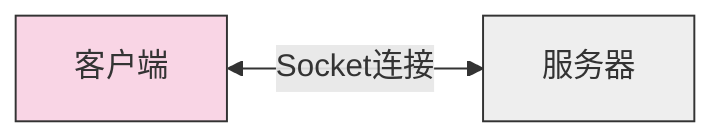
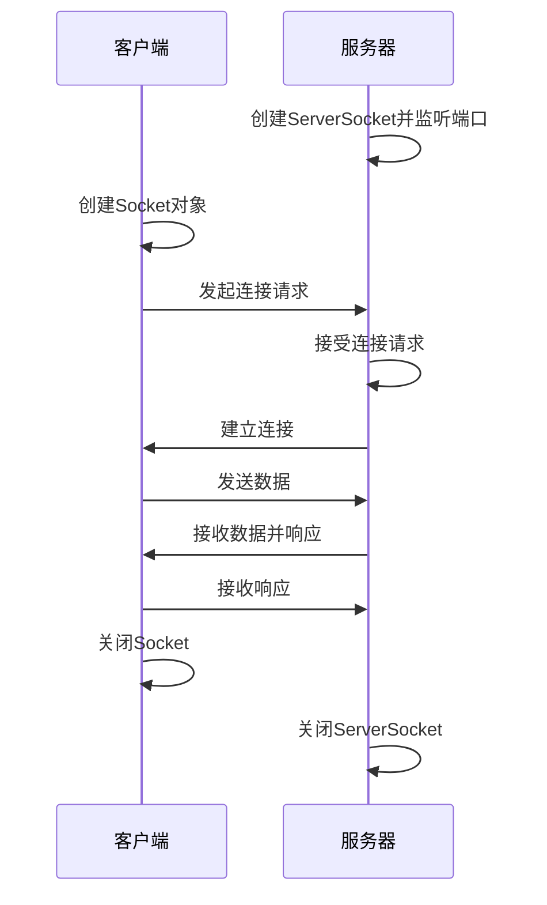

# Java Socket类

## Socket编程简介

Socket（套接字）是网络通信中两个应用程序之间进行数据交换的端点。Java Socket API 提供了在网络上实现客户端-服务器通信的机制，它是Java网络编程的基础。

使用Socket，开发者可以创建能够相互通信的网络应用程序，例如：网页浏览器、邮件客户端、聊天应用等。Socket通信基于TCP/IP协议栈，提供了可靠的、面向连接的通信服务。



## Socket类的核心概念

在Java中，`java.net.Socket`类是客户端套接字的实现，它代表TCP连接的一端。相应地，`java.net.ServerSocket`类用于服务器端，用来监听和接受客户端连接请求。

### Socket类主要特点

1. **双向通信**：Socket提供输入流和输出流，支持双向数据传输
2. **面向连接**：基于TCP协议，提供可靠的数据传输
3. **跨平台**：Java Socket API在不同操作系统上保持一致的行为

## Socket类的基本使用

### 创建Socket连接

客户端创建Socket连接的基本语法如下：

```java
try {
    // 创建一个Socket对象，指定服务器地址和端口号
    Socket socket = new Socket("localhost", 9999);
    
    // 使用Socket进行通信
    
    // 关闭连接
    socket.close();
} catch (IOException e) {
    e.printStackTrace();
}
```

### Socket常用方法

以下是Java Socket类中一些常用的方法：

| 方法 | 描述 |
|------|------|
| `getInputStream()` | 获取Socket的输入流，用于读取从服务器发送的数据 |
| `getOutputStream()` | 获取Socket的输出流，用于向服务器发送数据 |
| `close()` | 关闭Socket连接，释放相关资源 |
| `isClosed()` | 检查Socket是否已关闭 |
| `setSoTimeout(int timeout)` | 设置Socket读取操作的超时时间 |
| `getInetAddress()` | 获取Socket连接的远程地址 |
| `getPort()` | 获取Socket连接的远程端口号 |
| `getLocalPort()` | 获取Socket连接的本地端口号 |

## 客户端-服务器通信实例

下面我们通过一个简单的例子来演示如何使用Java Socket实现客户端和服务器之间的通信。

### 服务器端代码

```java
import java.io.*;
import java.net.*;

public class SimpleServer {
    public static void main(String[] args) {
        try {
            // 创建ServerSocket对象，监听9999端口
            ServerSocket serverSocket = new ServerSocket(9999);
            System.out.println("服务器启动，等待客户端连接...");
            
            // 接受客户端连接
            Socket clientSocket = serverSocket.accept();
            System.out.println("客户端已连接：" + clientSocket.getInetAddress());
            
            // 创建输入输出流
            BufferedReader in = new BufferedReader(
                new InputStreamReader(clientSocket.getInputStream()));
            PrintWriter out = new PrintWriter(clientSocket.getOutputStream(), true);
            
            // 读取客户端发送的消息
            String message = in.readLine();
            System.out.println("收到客户端消息: " + message);
            
            // 向客户端发送响应
            out.println("服务器收到消息: " + message);
            
            // 关闭资源
            in.close();
            out.close();
            clientSocket.close();
            serverSocket.close();
            
        } catch (IOException e) {
            e.printStackTrace();
        }
    }
}
```

### 客户端代码

```java
import java.io.*;
import java.net.*;

public class SimpleClient {
    public static void main(String[] args) {
        try {
            // 创建Socket对象，连接服务器
            Socket socket = new Socket("localhost", 9999);
            System.out.println("已连接到服务器");
            
            // 创建输入输出流
            BufferedReader in = new BufferedReader(
                new InputStreamReader(socket.getInputStream()));
            PrintWriter out = new PrintWriter(socket.getOutputStream(), true);
            
            // 向服务器发送消息
            out.println("你好，服务器!");
            
            // 接收服务器的响应
            String response = in.readLine();
            System.out.println("服务器响应: " + response);
            
            // 关闭资源
            in.close();
            out.close();
            socket.close();
            
        } catch (IOException e) {
            e.printStackTrace();
        }
    }
}
```

### 运行结果

服务器端输出：
```
服务器启动，等待客户端连接...
客户端已连接：/127.0.0.1
收到客户端消息: 你好，服务器!
```

客户端输出：
```
已连接到服务器
服务器响应: 服务器收到消息: 你好，服务器!
```

:::tip
确保先运行服务器端程序，再运行客户端程序，否则客户端将无法连接到服务器。
:::

## Socket通信的工作原理

Socket通信遵循以下工作流程：



1. 服务器创建一个`ServerSocket`对象，指定监听的端口号，然后调用`accept()`方法等待客户端连接。
2. 客户端创建一个`Socket`对象，指定服务器的IP地址和端口号，尝试与服务器建立连接。
3. 服务器接受客户端的连接请求，创建一个新的`Socket`对象与客户端进行通信。
4. 客户端和服务器通过各自的Socket对象获取输入/输出流，用于发送和接收数据。
5. 通信完成后，客户端和服务器关闭Socket连接和相关资源。

## 实际应用案例：多客户端聊天室

以下是一个简化版的聊天室应用，演示如何使用Socket处理多个客户端连接。

### 聊天室服务器

```java
import java.io.*;
import java.net.*;
import java.util.*;

public class ChatServer {
    private static Set<PrintWriter> clientWriters = new HashSet<>();
    
    public static void main(String[] args) {
        System.out.println("聊天室服务器启动...");
        
        try (ServerSocket serverSocket = new ServerSocket(9999)) {
            while (true) {
                // 接受新的客户端连接
                Socket clientSocket = serverSocket.accept();
                System.out.println("新客户端连接：" + clientSocket.getInetAddress());
                
                // 为每个客户端创建一个处理线程
                Thread thread = new Thread(new ClientHandler(clientSocket));
                thread.start();
            }
        } catch (IOException e) {
            e.printStackTrace();
        }
    }
    
    // 客户端处理线程
    private static class ClientHandler implements Runnable {
        private Socket socket;
        private BufferedReader in;
        private PrintWriter out;
        private String userName;
        
        public ClientHandler(Socket socket) {
            this.socket = socket;
        }
        
        @Override
        public void run() {
            try {
                // 设置输入输出流
                in = new BufferedReader(new InputStreamReader(socket.getInputStream()));
                out = new PrintWriter(socket.getOutputStream(), true);
                
                // 获取用户名
                userName = in.readLine();
                System.out.println(userName + " 加入了聊天室");
                
                // 向所有客户端广播新用户加入的消息
                broadcast(userName + " 加入了聊天室");
                
                // 添加此客户端的输出流到集合
                clientWriters.add(out);
                
                // 循环读取客户端消息并广播
                String message;
                while ((message = in.readLine()) != null) {
                    broadcast(userName + ": " + message);
                }
                
            } catch (IOException e) {
                System.out.println(userName + " 断开连接");
            } finally {
                // 移除该客户端
                if (out != null) {
                    clientWriters.remove(out);
                }
                // 广播用户离开消息
                broadcast(userName + " 离开了聊天室");
                
                try {
                    socket.close();
                } catch (IOException e) {
                    e.printStackTrace();
                }
            }
        }
        
        // 向所有客户端广播消息
        private void broadcast(String message) {
            for (PrintWriter writer : clientWriters) {
                writer.println(message);
            }
        }
    }
}
```

### 聊天室客户端

```java
import java.io.*;
import java.net.*;
import java.util.Scanner;

public class ChatClient {
    public static void main(String[] args) {
        try {
            // 连接到服务器
            Socket socket = new Socket("localhost", 9999);
            
            // 设置输入输出流
            BufferedReader in = new BufferedReader(
                new InputStreamReader(socket.getInputStream()));
            PrintWriter out = new PrintWriter(socket.getOutputStream(), true);
            
            // 获取用户名
            Scanner scanner = new Scanner(System.in);
            System.out.print("请输入您的名字: ");
            String userName = scanner.nextLine();
            
            // 发送用户名到服务器
            out.println(userName);
            
            // 创建一个线程来监听服务器消息
            Thread readerThread = new Thread(new ServerListener(in));
            readerThread.start();
            
            // 在主线程中读取用户输入并发送到服务器
            String message;
            while (true) {
                message = scanner.nextLine();
                out.println(message);
            }
            
        } catch (IOException e) {
            e.printStackTrace();
        }
    }
    
    // 服务器监听线程
    private static class ServerListener implements Runnable {
        private BufferedReader in;
        
        public ServerListener(BufferedReader in) {
            this.in = in;
        }
        
        @Override
        public void run() {
            String message;
            try {
                while ((message = in.readLine()) != null) {
                    System.out.println(message);
                }
            } catch (IOException e) {
                System.out.println("与服务器的连接已断开");
            }
        }
    }
}
```

:::caution
上述聊天室示例是简化版本，实际应用中需要考虑更多的错误处理、资源管理和安全性问题。
:::

## Socket编程的注意事项

使用Java Socket进行网络编程时，需要注意以下几点：

1. **资源释放**：确保在完成通信后关闭所有流和套接字，以避免资源泄漏。
2. **异常处理**：妥善处理网络通信过程中可能出现的各种异常，如连接中断、超时等。
3. **线程安全**：在多线程环境中使用Socket时，注意线程安全性问题。
4. **缓冲区管理**：合理设置缓冲区大小，以优化性能。
5. **超时设置**：为Socket操作设置合适的超时时间，避免程序长时间阻塞。

```java
// 设置Socket连接超时
socket.connect(new InetSocketAddress("hostname", port), 5000);

// 设置Socket读取超时
socket.setSoTimeout(3000);
```

## 总结

Socket是Java网络编程的核心组件，提供了应用程序之间进行网络通信的能力。通过Java Socket API，你可以：

- 创建基于TCP/IP的客户端-服务器应用程序
- 实现可靠的双向数据通信
- 处理多客户端连接的服务器应用

Socket编程虽然较低层，但掌握它的基础知识对于理解更高级的网络编程框架和API至关重要。本文介绍的基础知识和示例应用将帮助你开始Socket编程之旅。

## 练习与进一步学习

为了巩固你的Java Socket编程知识，可以尝试以下练习：

1. 修改上述聊天室示例，添加私聊功能
2. 实现一个基于Socket的文件传输程序
3. 创建一个简单的HTTP服务器，能够处理基本的GET请求
4. 设计一个在线游戏（如井字棋）的客户端和服务器

### 延伸阅读

- Java官方文档：[java.net.Socket](https://docs.oracle.com/javase/8/docs/api/java/net/Socket.html)
- Java官方文档：[java.net.ServerSocket](https://docs.oracle.com/javase/8/docs/api/java/net/ServerSocket.html)
- 《Java网络编程》(Java Network Programming) - Elliotte Rusty Harold
- 《Effective Java》- Joshua Bloch（有关资源管理的章节）

通过不断实践和学习，你将逐渐掌握Socket编程的精髓，并能够构建可靠、高效的网络应用程序。